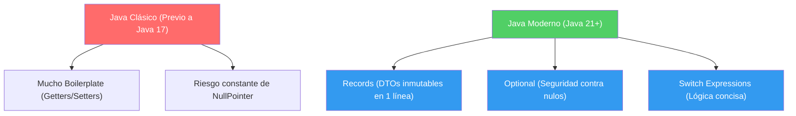

## 01 — Fundamentos Java (Moderno)

### Propósito
Aprender las características modernas de Java (21+) que son fundamentales para escribir aplicaciones Spring limpias, concisas y mantenibles, dejando atrás el código verboso de Java antiguo.

### Problema que resuelve
El Java clásico requería cientos de líneas de código repetitivo (getters, setters, equals, comprobaciones de null y type casting) que oscurecían la lógica de negocio. Esto hacía que las aplicaciones Spring fueran lentas de leer y propensas a errores (como el infame `NullPointerException`).

### Cómo lo resuelve
Java ha evolucionado enormemente. Las versiones modernas introducen herramientas como:
- **Records**: Eliminan el boilerplate de los DTOs.
- **Optional**: Fuerzan el manejo explícito de la ausencia de valores.
- **Pattern Matching**: Hacen que el código condicional sea elegante y seguro.

Spring Boot 3 y 4 están optimizados para estas características, usándolas en todos sus ejemplos y APIs modernas.

### Por qué aprenderlo
En un entorno empresarial actual (Spring Boot 3/4), verás `Record` usándose para todos los requests/responses y `Optional` en cada consulta a la base de datos. Si no dominas este "nuevo Java", no podrás entender el código de tus compañeros ni las guías oficiales.



### Glosario Básico

#### `record`
Una clase especial introducida para portar datos inmutables. Genera automáticamente constructores, getters, `equals`, `hashCode` y `toString`.
```java
// Java Antiguo: 50 líneas de código
// Java Moderno: 1 línea
public record UsuarioDto(String nombre, String email) { }
```

#### `Optional<T>`
Una clase "envoltorio" que puede o no contener un valor. Te obliga a verificar si el dato existe antes de usarlo.
```java
Optional<Usuario> usuario = repository.findById(1);
// Te obliga a pensar: ¿qué pasa si no está?
```

---

### Conceptos

#### 1. Records
- **Qué es** — Una forma concisa de crear clases inmutables cuya única responsabilidad es transportar datos.
- **Por qué importa** — En Spring, se usan masivamente como DTOs (Data Transfer Objects) para recibir JSON en los controladores o enviar respuestas.
- **Código**:
  ```java
  public record ProductoRequest(String nombre, Double precio) { 
      // Puedes agregar validaciones en un constructor compacto
      public ProductoRequest {
          if (precio < 0) throw new IllegalArgumentException("Precio inválido");
      }
  }
  ```
- **Analogía** — Es como una "tarjeta de presentación" impresa. Una vez que se imprime (se crea), sus datos no pueden ser alterados con un bolígrafo, solo sirve para leer la información.

#### 2. Pattern Matching
- **Qué es** — Una mejora al `instanceof` y al `switch` que extrae automáticamente la variable si es del tipo correcto, sin necesidad de hacer *casting*.
- **Por qué importa** — Simplifica enormemente el manejo de diferentes tipos de excepciones o respuestas en los `@ControllerAdvice`.
- **Código**:
  ```java
  // Antes
  if (obj instanceof String) {
      String s = (String) obj;
      System.out.println(s.toLowerCase());
  }
  
  // Ahora
  if (obj instanceof String s) {
      System.out.println(s.toLowerCase());
  }
  ```
- **Analogía** — Es como un portero de discoteca inteligente. No solo verifica que tengas tu ID (eres mayor de edad), sino que automáticamente te pone la pulsera VIP para que pases, en un solo movimiento.

#### 3. Streams API
- **Qué es** — Una forma funcional y declarativa de procesar colecciones de datos (filtrar, transformar, agrupar).
- **Por qué importa** — En Spring, constantemente estarás transformando listas de Entidades (Base de datos) a listas de DTOs (Respuestas HTTP).
- **Código**:
  ```java
  List<UsuarioDto> dtos = usuarios.stream()
      .filter(u -> u.isActivo())
      .map(u -> new UsuarioDto(u.nombre(), u.email()))
      .toList(); // Nuevo en Java 16+
  ```
- **Analogía** — Es como una línea de ensamblaje en una fábrica de autos. El chasis entra, se filtra (pasa control de calidad), se mapea (se le ponen puertas) y sale como un auto terminado.

#### 4. Optional
- **Qué es** — Un contenedor que previene el retorno de `null`.
- **Por qué importa** — `JpaRepository` en Spring Data devuelve `Optional` cuando buscas por ID. Debes saber cómo abrir la caja de forma segura.
- **Código**:
  ```java
  // Uso correcto en un Servicio Spring
  public Usuario getUsuario(Long id) {
      return repository.findById(id)
          .orElseThrow(() -> new RecursoNoEncontradoException("Usuario no existe"));
  }
  ```
- **Analogía** — Es como una caja de regalo misteriosa. Puede tener un regalo o estar vacía. El código te obliga a sacudirla o revisar antes de intentar usar el regalo a ciegas.

### Antes vs Ahora (Java 8 → Java 21)

| Tema | Java 8 (clásico) | Java 21 (moderno) |
|------|------------------|-------------------|
| **DTO** | Clase con campos privados, constructor manual, getters, `equals`, `hashCode`, `toString` (~50 líneas) | `public record ClienteDto(String name, String email, int age) {}` (1 línea) |
| **Lista inmutable** | `Collections.unmodifiableList(new ArrayList<>(Arrays.asList(...)))` | `List.of(...)` |
| **Filtrar lista** | `for` clásico + `if` + `ArrayList` acumulador | `stream().filter(...).toList()` |
| **Mapear lista** | `for` clásico + `list.add(x.getName())` | `stream().map(X::getName).toList()` |
| **Chequeo null** | `if (x != null) return x.getName(); else return "N/A";` | `Optional.ofNullable(x).map(X::getName).orElse("N/A")` |
| **instanceof + cast** | `if (o instanceof String) { String s = (String) o; ... }` | `if (o instanceof String s) { ... }` (pattern) |
| **switch por tipo** | Cadena de `if/else instanceof` con casts | `switch (o) { case String s -> ...; case Integer i -> ...; }` |
| **String multilínea** | `"linea1\n" + "linea2\n"` | Text blocks: `"""` linea1 linea2 `"""` |
| **Método local** | Impossible (crear clase interna) | `var doble = (IntFunction<Integer>) x -> x * 2;` |

### FAQ del Alumno

- **¿Qué es un `record` y en qué se diferencia de una clase normal?**
  Es una clase especial para transportar datos. Java te genera constructor, getters (accessors sin `get`), `equals`, `hashCode` y `toString` automáticamente. Es INMUTABLE (no puedes cambiar sus valores después de crearla).
- **¿Por qué `c.name()` y no `c.getName()`?**
  Los records usan "accessors" (métodos con el mismo nombre del campo, sin `get`). Es una convención distinta a los POJO clásicos.
- **¿Qué es una "lambda"?**
  Una función anónima corta. `x -> x * 2` es equivalente a un método `int f(int x) { return x * 2; }` pero escrito en línea.
- **¿Qué es un "method reference" (`ClienteDto::hasGmail`)?**
  Una forma abreviada de una lambda: `c -> c.hasGmail()`. Se lee: "el método `hasGmail` de `ClienteDto`".
- **¿Qué hace `Optional`?**
  Es una "caja" que puede contener un valor o estar vacía. Reemplaza el `null` y obliga al código a manejar el caso vacío explícitamente. Cero NullPointerException.
- **¿Por qué `.toList()` es mejor que `.collect(Collectors.toList())`?**
  `.toList()` (Java 16+) devuelve una lista INMUTABLE; `Collectors.toList()` devolvía una lista mutable. La inmutable es más segura por defecto.

### Ejercicios
1. Crea un `record` llamado `ClienteDto` con nombre, email y edad. Añade validación en el constructor para asegurar que la edad sea mayor a 18.
2. Dada una lista de `ClienteDto`, utiliza Streams para filtrar aquellos cuyo email termine en `@gmail.com` y devuelve una nueva lista.
3. Simula una consulta que devuelve un `Optional<ClienteDto>`. Usa `.map()` para extraer solo el nombre si está presente, o `.orElse("Desconocido")` si no lo está.

### Cómo ejecutar
Este módulo es Java puro (sin Maven/Gradle). Se compila y empaqueta a un JAR ejecutable con los scripts incluidos.

**Git Bash:**
```bash
cd 01-fundamentos-java
./build.sh
# Genera target/fundamentos-java-1.0.0.jar y ejecuta los tests
```

**PowerShell:**
```powershell
cd 01-fundamentos-java
./build.ps1
```

**Ejecutar el JAR ya generado:**
```bash
java -jar target/fundamentos-java-1.0.0.jar
```

El JAR incluye `Main-Class: Main` en su manifest, así que corre directamente con `java -jar`.

### Archivos del Proyecto
| Archivo | Propósito |
|---------|-----------|
| `src/Main.java` | Punto de entrada + tests self-checking (`assertEqual`, `assertThrows`). |
| `src/records/ClienteDto.java` | Record con validación en constructor compacto. |
| `src/streams/ProcesadorStreams.java` | Filter/map/partition con Streams API. |
| `src/optional/UsuarioServiceMock.java` | Uso seguro de `Optional` (`.map`, `.orElse`, `.orElseThrow`). |
| `build.sh` / `build.ps1` | Scripts que compilan, empaquetan a JAR y ejecutan los tests. |
| `target/fundamentos-java-1.0.0.jar` | Artefacto ejecutable (`java -jar`). |
