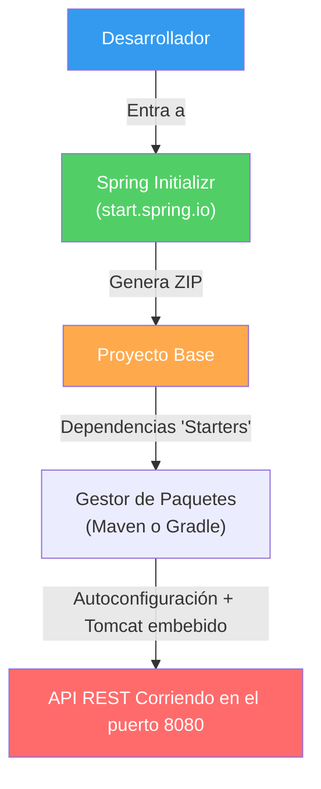

## 02 — Introducción a Spring Boot

### Propósito
Aprender a iniciar una aplicación Spring Boot desde cero, comprender la magia detrás de su autoconfiguración y crear tu primer endpoint REST funcional.

### Problema que resuelve
Históricamente, configurar una aplicación Spring Framework requería lidiar con enormes archivos XML de configuración, servidores Tomcat externos y la gestión manual de cientos de dependencias y sus versiones compatibles. Era un dolor de cabeza llamado "dependency hell".

### Cómo lo resuelve
Spring Boot elimina esa complejidad mediante:
- **Starter Dependencies** → Una sola dependencia (`spring-boot-starter-web`) agrupa todo lo necesario (Spring MVC, JSON, validación).
- **Servidor Embebido** → Tomcat ya viene incluido. Ejecutas un método `main()` y la web arranca.
- **Autoconfiguración** → Spring Boot asume configuraciones sensatas basadas en las librerías que tienes (si ve H2, configura la base de datos automáticamente).

### Por qué aprenderlo
Spring Boot es el estándar de facto para el desarrollo backend en Java a nivel global. Dominarlo es el primer paso obligatorio para crear microservicios empresariales y APIs robustas.



### Glosario Básico

#### `@SpringBootApplication`
El decorador supremo de tu proyecto. Agrupa tres anotaciones que le dicen a Spring que escanee tus componentes y aplique la autoconfiguración.
```java
@SpringBootApplication
public class MiAplicacion {
    public static void main(String[] args) {
        SpringApplication.run(MiAplicacion.class, args);
    }
}
```

#### `pom.xml` / `build.gradle`
Es el archivo maestro de configuración de dependencias donde agregamos los "Starters" de Spring.

---

### Conceptos

#### 1. Spring Initializr
- **Qué es** — Una herramienta web (start.spring.io) o integrada en el IDE para generar la estructura base del proyecto.
- **Por qué importa** — Ahorra horas de configuración inicial asegurando que las versiones de Java, Spring Boot y dependencias sean perfectamente compatibles.
- **Analogía** — Es como pedir un sándwich a medida. Eliges el tipo de pan (Maven/Gradle), la carne (Java 21) y los aderezos (Web, JPA, Security). Te entregan el proyecto empaquetado listo para comer.

#### 2. Starters de Spring Boot
- **Qué es** — Conjuntos de dependencias pre-empaquetadas para un propósito específico.
- **Por qué importa** — Si necesitas crear una API web, solo agregas `spring-boot-starter-web` en lugar de buscar manualmente Spring MVC, Tomcat, Jackson, etc.
- **Código**:
  ```xml
  <dependency>
      <groupId>org.springframework.boot</groupId>
      <artifactId>spring-boot-starter-web</artifactId>
  </dependency>
  ```
- **Analogía** — Es como comprar un "Kit de supervivencia" en lugar de comprar una linterna, cuerdas, brújula y botiquín por separado.

#### 3. Autoconfiguración
- **Qué es** — El mecanismo inteligente por el cual Spring configura automáticamente beans basándose en el classpath.
- **Por qué importa** — Reduce el "boilerplate" al mínimo. La filosofía es "convención sobre configuración". Si sigues las convenciones de Spring, él hace el trabajo duro por ti.
- **Analogía** — Es como comprar un coche automático. El coche decide cuándo cambiar de marcha basado en la velocidad, en lugar de que tú tengas que hacerlo manualmente.

#### 4. Tu primer Controlador (`@RestController`)
- **Qué es** — La puerta de entrada para recibir peticiones HTTP.
- **Por qué importa** — Es el punto de contacto entre el mundo exterior (frontend/clientes) y tu lógica de negocio.
- **Código**:
  ```java
  @RestController
  public class HolaController {
      
      @GetMapping("/api/hola")
      public String saludar() {
          return "¡Hola Mundo desde Spring Boot 4!";
      }
  }
  ```

### Antes vs Ahora (Spring 4 XML vs Spring Boot 4)

| Tema | Spring "clásico" (2010, XML + Tomcat externo) | Spring Boot 4 (moderno) |
|------|------------------------------------------------|--------------------------|
| **Configuración** | `applicationContext.xml` + `web.xml` (cientos de líneas) | `@SpringBootApplication` (1 anotación) |
| **Servidor** | Descargar Tomcat, deployar `.war`, arrancar Tomcat aparte | Tomcat viene EMBEBIDO. `java -jar app.jar` |
| **Dependencias** | Buscar Spring MVC, Jackson, Tomcat, logging por separado, alinear versiones a mano | `spring-boot-starter-web` trae todo, versiones alineadas |
| **Test de controller** | `@ContextConfiguration(locations = "...xml")` + `@WebAppConfiguration` + `MockMvcBuilders.webAppContextSetup(wac).build()` | `MockMvcBuilders.standaloneSetup(new HolaController()).build()` |
| **JUnit** | JUnit 4 + `@RunWith(SpringJUnit4ClassRunner.class)` | JUnit 5 sin `@RunWith` (extensiones automáticas) |
| **Puerto** | Configurado en `server.xml` de Tomcat | `server.port: 8080` en `application.yml` |
| **Empaquetado** | WAR desplegable en Tomcat | Fat JAR ejecutable con `java -jar` |

### FAQ del Alumno

- **¿Qué es un "endpoint"?**
  Una URL + método HTTP (GET/POST/...) que tu API expone. Ejemplo: `GET http://localhost:8080/api/hola`.
- **¿Qué es la arroba `@` en Java?**
  Se llama "anotación". Es una etiqueta que le añades a una clase o método para darle un significado especial. No hace nada por sí sola: Spring, JUnit, Lombok, etc. las LEEN y actúan según ellas.
- **¿Qué hace `@SpringBootApplication`?**
  Combina tres anotaciones: (1) `@Configuration` (esta clase declara beans), (2) `@EnableAutoConfiguration` (Spring adivina qué configurar según las librerías del classpath), (3) `@ComponentScan` (busca `@RestController`/`@Service`/etc. en este paquete y subpaquetes).
- **¿Qué es un "bean"?**
  Un objeto Java cuya creación y vida controla Spring. El `HolaController`, por ejemplo, no lo instancias tú con `new`: lo hace Spring y lo comparte.
- **¿Por qué el puerto 8080?**
  Convención histórica de servidores Java. Puedes cambiarlo editando `server.port` en `application.yml` o pasando `--server.port=9090` al ejecutar el JAR.
- **¿Qué es Tomcat "embebido"?**
  Tomcat es el servidor HTTP que atiende las peticiones. "Embebido" significa que viaja DENTRO de tu JAR — no necesitas instalarlo aparte. Antes había que descargar Tomcat y desplegar un `.war`; ahora `java -jar app.jar` levanta todo.
- **¿Qué es "autoconfiguración"?**
  Spring Boot mira las librerías que tienes disponibles (el "classpath") y configura cosas automáticamente. Si ve Tomcat → arma un servidor web. Si ve H2 → configura una base de datos en memoria. Convención sobre configuración.
- **¿Por qué el archivo se llama `pom.xml`?**
  POM = "Project Object Model". Es el archivo maestro de Maven donde declaras dependencias, plugins y configuración de build.
- **¿Qué es `IntroSpringApplication.class` (con `.class` al final)?**
  Una referencia a la propia clase (no una instancia). Spring lo usa como "punto de anclaje" para saber desde qué paquete arrancar el escaneo.
- **¿Qué son los `String[] args` del `main`?**
  Los argumentos que le pasan al programa desde la línea de comandos. Ejemplo: `java -jar app.jar --server.port=9090` → `args = ["--server.port=9090"]`.

### Ejercicios
1. Genera un proyecto en Spring Initializr con Java 21, Maven y la dependencia `Spring Web`.
2. Crea un paquete `controller` y dentro crea `SaludoController`.
3. Crea un endpoint `@GetMapping("/bienvenida")` que devuelva un mensaje personalizado.
4. Ejecuta la aplicación y pruébala en tu navegador accediendo a `http://localhost:8080/bienvenida`.
5. Añade un segundo endpoint `@GetMapping("/hora")` que retorne `LocalDateTime.now().toString()`. Observa que ambos endpoints conviven en el mismo controller.
6. Cambia el puerto por defecto editando `server.port` en `application.yml` de 8080 a 9090 y verifica el cambio.

### Cómo ejecutar

**Build + tests + JAR ejecutable:**
```bash
# Git Bash / WSL
cd 02-intro-spring
./build.sh
```
```powershell
# PowerShell
cd 02-intro-spring
./build.ps1
```

**Ejecutar el JAR ya construido:**
```bash
java -jar target/intro-spring-1.0.0.jar
```

**Modo desarrollo (recarga rápida sin recompilar el JAR):**
```bash
../apache-maven-3.9.16/bin/mvn.cmd spring-boot:run
```

**Probar el endpoint:**
```bash
curl -i http://localhost:8080/api/hola
# HTTP/1.1 200 OK
# ¡Hola Mundo desde Spring Boot 4!

curl -i http://localhost:8080/api/hora
# HTTP/1.1 200 OK
# Hora del servidor: 2026-07-10T17:24:00.123
```

### Archivos del Proyecto
| Archivo | Propósito |
|---------|-----------|
| `pom.xml` | Dependencias Maven (starter-web, starter-test), plugin de empaquetado. |
| `src/main/resources/application.yml` | Configuración (puerto, nombre, hardening de errores). |
| `src/main/java/com/springroadmap/intro/IntroSpringApplication.java` | Clase principal con `@SpringBootApplication` + `main`. |
| `src/main/java/com/springroadmap/intro/controller/HolaController.java` | Endpoints REST `/api/hola` y `/api/hora`. |
| `src/test/java/.../IntroSpringApplicationTests.java` | Smoke test del contexto Spring. |
| `src/test/java/.../HolaControllerTest.java` | 4 tests de controllers con MockMvc standalone. |
| `build.sh` / `build.ps1` | Scripts que compilan, testean y empaquetan a JAR. |
| `target/intro-spring-1.0.0.jar` | Fat JAR ejecutable (`java -jar`). |
