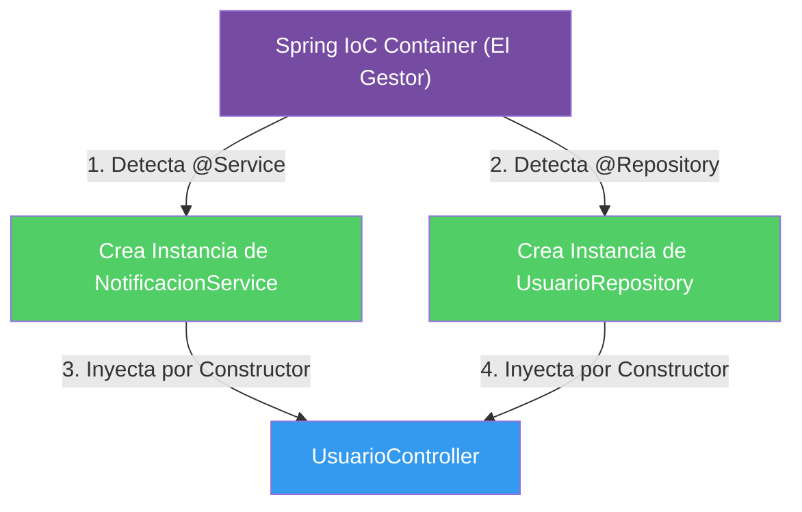

## 03 — Inyección de Dependencias e Inversión de Control (IoC)

### Propósito
Comprender el corazón absoluto de Spring Framework: cómo Spring crea, gestiona y destruye objetos (Beans) por ti, eliminando la necesidad de usar `new` manualmente.

### Problema que resuelve
En la programación tradicional, las clases crean sus propias dependencias instanciándolas con `new`. Esto genera un acoplamiento altísimo (código rígido). Si quieres cambiar un componente por otro, o "mockear" un servicio para hacer pruebas unitarias, tienes que modificar el código interno de la clase.

### Cómo lo resuelve
La Inversión de Control (IoC) delega la creación de objetos a un "Contenedor de Spring". 
Spring lee tu código, crea los objetos y te los "inyecta" (Dependency Injection - DI) a través del constructor. Tú solo pides lo que necesitas, y Spring te lo da.

### Por qué aprenderlo
Si no entiendes IoC y DI, no estás usando Spring, solo estás escribiendo Java. Es la base sobre la que funcionan las bases de datos, seguridad y APIs.



### Glosario Básico

#### `@Component` (y sus derivados `@Service`, `@Repository`)
Le dice a Spring: "Toma el control de esta clase. Crea un objeto de ella y guárdalo en tu contenedor".
```java
@Service // Un tipo de @Component para lógica de negocio
public class FacturaService { }
```

#### `Bean`
Es simplemente un objeto común y corriente, pero que ha sido creado y es gestionado por Spring en su contenedor.

#### Inyección por Constructor (Constructor Injection)
La forma recomendada de recibir dependencias. No requiere la anotación `@Autowired` en versiones modernas si hay un solo constructor.
```java
public class MiControlador {
    private final FacturaService service;
    
    // Spring inyecta la dependencia aquí automáticamente
    public MiControlador(FacturaService service) {
        this.service = service;
    }
}
```

---

### Conceptos

#### 1. Inversión de Control (IoC)
- **Qué es** — Es un principio de diseño en el que tú no llamas al framework, el framework te llama a ti. No creas los objetos, se los pides al contenedor.
- **Por qué importa** — Permite crear arquitecturas desacopladas y altamente testeables.
- **Analogía** — Es como el casting de actores (tus clases) en Hollywood. El actor no busca el trabajo, la agencia (Spring) llama al actor cuando lo necesita. "No nos llames, nosotros te llamaremos".

#### 2. Dependency Injection (DI)
- **Qué es** — Es la implementación práctica de la IoC. Es el acto de pasar dependencias (servicios, repositorios) a un objeto, generalmente a través de su constructor.
- **Por qué importa** — Hace que las clases sean independientes de cómo se crean sus dependencias. Facilita los mocks en pruebas.
- **Analogía** — Imagina que eres un cirujano. No tienes que buscar bisturís ni esterilizarlos (usar `new`). Solo extiendes la mano en el quirófano y la enfermera (Spring) te inyecta en la mano exactamente la herramienta que necesitas.

#### 3. Estereotipos de Spring (`@Component`, `@Service`, `@Repository`, `@Controller`)
- **Qué es** — Son anotaciones que marcan clases como "Beans" para que Spring las gestionen. Todos son en el fondo un `@Component`, pero se usan diferentes nombres por semántica (para humanos y para el propio Spring).
  - `@Controller`: Para la capa web.
  - `@Service`: Para la lógica de negocio.
  - `@Repository`: Para acceso a base de datos (traduce errores SQL).
- **Por qué importa** — Mantienen el código ordenado por responsabilidades (Arquitectura en capas).

#### 4. @Bean y @Configuration
- **Qué es** — Se usan para registrar Beans de clases que tú no creaste (por ejemplo, librerías de terceros) donde no puedes poner un `@Service` arriba.
- **Código**:
  ```java
  @Configuration
  public class SeguridadConfig {
      @Bean
      public PasswordEncoder encriptador() {
          return new BCryptPasswordEncoder(); // Tú lo creas, Spring lo guarda
      }
  }
  ```

### Ejercicios
1. Crea una clase `NotificacionService` con la anotación `@Service` y un método `enviarEmail()`.
2. Crea una clase `UsuarioController` anotada con `@RestController`.
3. Inyecta `NotificacionService` dentro de `UsuarioController` utilizando un constructor.
4. Llama a `enviarEmail()` desde un método de tu controlador y verifica que Spring logra conectar las dos clases correctamente.

### Cómo ejecutar
```bash
cd 03-dependency-injection
mvn spring-boot:run
```

### Archivos del Proyecto
| Archivo | Propósito |
|---------|-----------|
| `service/EmailService.java` | Lógica de negocio gestionada por Spring (`@Service`). |
| `controller/UserController.java` | Controlador que recibe la dependencia inyectada. |
| `config/AppConfig.java` | Demostración del uso de `@Configuration` y `@Bean`. |
