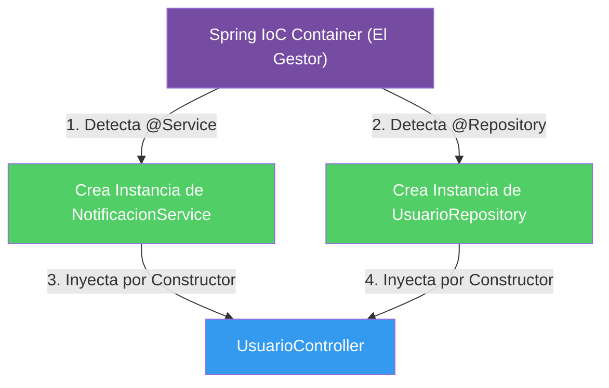

## 03 — Inyección de Dependencias e Inversión de Control (IoC)

### Propósito
Comprender el corazón absoluto de Spring Framework: cómo Spring crea, gestiona y destruye objetos (Beans) por ti, eliminando la necesidad de usar `new` manualmente.

### Problema que resuelve
En la programación tradicional, las clases crean sus propias dependencias instanciándolas con `new`. Esto genera un acoplamiento altísimo (código rígido). Si quieres cambiar un componente por otro, o "mockear" un servicio para hacer pruebas unitarias, tienes que modificar el código interno de la clase.

### Cómo lo resuelve
La Inversión de Control (IoC) delega la creación de objetos a un "Contenedor de Spring". 
Spring lee tu código, crea los objetos y te los "inyecta" (Dependency Injection - DI) a través del constructor. Tú solo pides lo que necesitas, y Spring te lo da.

### Por qué aprenderlo
Si no entiendes IoC y DI, no estás usando Spring, solo estás escribiendo Java. Es la base sobre la que funcionan las bases de datos, seguridad y APIs.



### Glosario Básico

#### `@Component` (y sus derivados `@Service`, `@Repository`)
Le dice a Spring: "Toma el control de esta clase. Crea un objeto de ella y guárdalo en tu contenedor".
```java
@Service // Un tipo de @Component para lógica de negocio
public class FacturaService { }
```

#### `Bean`
Es simplemente un objeto común y corriente, pero que ha sido creado y es gestionado por Spring en su contenedor.

#### Inyección por Constructor (Constructor Injection)
La forma recomendada de recibir dependencias. No requiere la anotación `@Autowired` en versiones modernas si hay un solo constructor.
```java
public class MiControlador {
    private final FacturaService service;
    
    // Spring inyecta la dependencia aquí automáticamente
    public MiControlador(FacturaService service) {
        this.service = service;
    }
}
```

---

### Conceptos

#### 1. Inversión de Control (IoC)
- **Qué es** — Es un principio de diseño en el que tú no llamas al framework, el framework te llama a ti. No creas los objetos, se los pides al contenedor.
- **Por qué importa** — Permite crear arquitecturas desacopladas y altamente testeables.
- **Analogía** — Es como el casting de actores (tus clases) en Hollywood. El actor no busca el trabajo, la agencia (Spring) llama al actor cuando lo necesita. "No nos llames, nosotros te llamaremos".

#### 2. Dependency Injection (DI)
- **Qué es** — Es la implementación práctica de la IoC. Es el acto de pasar dependencias (servicios, repositorios) a un objeto, generalmente a través de su constructor.
- **Por qué importa** — Hace que las clases sean independientes de cómo se crean sus dependencias. Facilita los mocks en pruebas.
- **Analogía** — Imagina que eres un cirujano. No tienes que buscar bisturís ni esterilizarlos (usar `new`). Solo extiendes la mano en el quirófano y la enfermera (Spring) te inyecta en la mano exactamente la herramienta que necesitas.

#### 3. Estereotipos de Spring (`@Component`, `@Service`, `@Repository`, `@Controller`)
- **Qué es** — Son anotaciones que marcan clases como "Beans" para que Spring las gestionen. Todos son en el fondo un `@Component`, pero se usan diferentes nombres por semántica (para humanos y para el propio Spring).
  - `@Controller`: Para la capa web.
  - `@Service`: Para la lógica de negocio.
  - `@Repository`: Para acceso a base de datos (traduce errores SQL).
- **Por qué importa** — Mantienen el código ordenado por responsabilidades (Arquitectura en capas).

#### 4. @Bean y @Configuration
- **Qué es** — Se usan para registrar Beans de clases que tú no creaste (por ejemplo, librerías de terceros) donde no puedes poner un `@Service` arriba.
- **Código**:
  ```java
  @Configuration
  public class SeguridadConfig {
      @Bean
      public PasswordEncoder encriptador() {
          return new BCryptPasswordEncoder(); // Tú lo creas, Spring lo guarda
      }
  }
  ```

### Antes vs Ahora

| Aspecto | Java 1.8 clásico | Spring XML antiguo | `@Autowired` en campo (anti-patrón) | Constructor Injection (moderno ✅) |
|---|---|---|---|---|
| Crear dependencia | `new NotificationService()` en el controller | `<bean id="svc" class="..."/>` en `applicationContext.xml` | `@Autowired private NotificationService svc;` (Spring inyecta por reflexión) | Se declara como parámetro del constructor |
| Acoplamiento | Muy alto: cambiar la impl. requiere editar código cliente | Bajo pero XML es verboso y sin type-checking | Medio: campo oculto, no aparece en la firma pública | Bajo y EXPLÍCITO: la firma del constructor lista todas las deps |
| Inmutabilidad | Depende del programador | No | No (`final` imposible) | Sí — `private final` obliga a inicializar por constructor |
| Testing | Se pierde: no puedes reemplazar `new` por un mock sin refactor | Requiere levantar XML | Requiere `ReflectionTestUtils` o `@InjectMocks` | `new UserController(mockRepo, mockSvc)` desde JUnit puro |
| Detección de deps faltantes | Runtime (NPE) | Runtime al arrancar | Runtime al arrancar | **Compile-time** (falta parámetro → no compila) |
| Recomendación 2026 | ❌ No | ❌ Legacy | ❌ Desaconsejado | ✅ Estándar |

**Comparación mínima en código (para ver el clic):**

```java
// ANTES (Java 1.8 puro — cableado manual, acoplado):
public class UserController {
    private final NotificationService svc;
    public UserController() {
        this.svc = new NotificationService();  // 👈 acoplado a la implementación concreta
    }
}

// AHORA (Spring Boot 4, constructor injection):
@RestController
public class UserController {
    private final NotificationService svc;
    public UserController(NotificationService svc) {  // 👈 Spring inyecta
        this.svc = svc;
    }
}
```

### FAQ del Alumno

- **¿Qué es exactamente un "contenedor IoC"?**
  Es un objeto interno de Spring (`ApplicationContext`) que se comporta como un `Map<Class, Object>` gigante. Al arrancar la app, Spring escanea tus paquetes, crea instancias de las clases marcadas con `@Component`/`@Service`/`@Repository`/`@RestController`/`@Configuration`, y las guarda ahí. Cuando alguien las pide (por constructor), Spring las saca del contenedor.
- **Si nunca hago `new NotificationService()`, ¿cuándo se crea?**
  Al arrancar la app, DENTRO de `SpringApplication.run(...)`. Spring instancia todos los beans una sola vez (singletons por defecto) antes de aceptar peticiones HTTP.
- **¿Por qué `private final` en los campos?**
  `final` obliga a inicializarlos en el constructor (no en un setter posterior). Garantiza que la dependencia siempre esté presente y no cambie a mitad de ejecución (más seguro con multi-hilo).
- **¿Diferencia REAL entre `@Component`, `@Service` y `@Repository`?**
  Semánticamente los tres marcan la clase como bean. `@Service` comunica "capa de negocio". `@Repository` además TRADUCE excepciones de BD (Hibernate/JDBC) a la jerarquía `DataAccessException` de Spring cuando se usa con JPA (lo veremos en módulo 07). `@Component` es genérico.
- **¿Cuándo uso `@Bean` y cuándo `@Component`?**
  `@Component` (o `@Service`/`@Repository`): cuando la clase es TUYA y puedes anotarla. `@Bean`: cuando la clase viene de una librería externa (no puedes editar su código) o cuando necesitas lógica al crearla. Ejemplo típico: `Clock`, `ObjectMapper`, `PasswordEncoder`.
- **¿Qué pasa si tengo DOS `@Service` que implementan la misma interfaz?**
  Spring lanza `NoUniqueBeanDefinitionException` al arrancar. Se resuelve con `@Qualifier("nombreDelBean")` en el parámetro del constructor, o marcando uno con `@Primary`.
- **¿Un Bean es siempre un singleton?**
  Por defecto sí. Todos los controllers, services y repositories comparten la MISMA instancia. Por eso deben ser stateless (sin variables mutables) o thread-safe.

### Ejercicios
1. Crea una clase `NotificationService` con la anotación `@Service` y un método `sendEmail(String to)`.
2. Crea una clase `UserController` anotada con `@RestController` que reciba `NotificationService` por constructor.
3. Llama a `sendEmail()` desde un método del controlador y verifica que Spring conecta las dos clases automáticamente.
4. Refactoriza el controller para que reciba también un `UserRepository` (mock in-memory) e implemente `POST /api/users/notify?email=X` que devuelva 404 si el usuario no existe.
5. Ejercicio extra: crea DOS implementaciones de una interfaz `Notifier` (`EmailNotifier`, `SmsNotifier`), ambas como `@Service`. Observa el error `NoUniqueBeanDefinitionException` y resuélvelo con `@Primary` y luego con `@Qualifier`.

### Cómo ejecutar

**Build + tests + JAR ejecutable:**
```bash
cd 03-dependency-injection
./build.sh    # Git Bash
./build.ps1   # PowerShell
```

**Modo desarrollo:**
```bash
../apache-maven-3.9.16/bin/mvn.cmd spring-boot:run
```

**Ejecutar el JAR:**
```bash
java -jar target/dependency-injection-1.0.0.jar
```

**Probar el endpoint:**
```bash
# Usuario existente (Ada Lovelace precargada)
curl -X POST "http://localhost:8080/api/users/notify?email=ada@example.com&msg=hola"
# 200 OK
# NOTIFIED:Ada Lovelace|EMAIL_SENT_TO:ada@example.com

# Usuario inexistente
curl -i -X POST "http://localhost:8080/api/users/notify?email=nadie@example.com"
# HTTP/1.1 404 Not Found
```

### Archivos del Proyecto
| Archivo | Propósito |
|---------|-----------|
| `pom.xml` | Spring Boot 4.1.0, artefacto `dependency-injection-1.0.0.jar`. |
| `src/main/resources/application.yml` | Configuración (puerto, hardening de errores). |
| `.../di/DependencyInjectionApplication.java` | `@SpringBootApplication` + `main`. |
| `.../di/service/NotificationService.java` | `@Service` con `sendEmail(to, msg)`. |
| `.../di/repository/UserRepository.java` | `@Repository` con Map in-memory + `findByEmail`. |
| `.../di/controller/UserController.java` | `@RestController` con `POST /api/users/notify`, constructor injection. |
| `.../di/config/AppConfig.java` | `@Configuration` + `@Bean Clock systemClock()`. |
| `.../di/DependencyInjectionApplicationTests.java` | Smoke test del contexto. |
| `.../di/service/NotificationServiceTest.java` | 2 tests unitarios puros. |
| `.../di/repository/UserRepositoryTest.java` | 2 tests unitarios puros. |
| `.../di/controller/UserControllerTest.java` | 2 tests MockMvc standalone (200 + 404). |
| `.../di/config/AppConfigTest.java` | 1 test de integración con `@Autowired Clock`. |
| `build.sh` / `build.ps1` | Scripts multiplataforma que compilan, testean y empaquetan. |
| `target/dependency-injection-1.0.0.jar` | Fat JAR ejecutable. |
