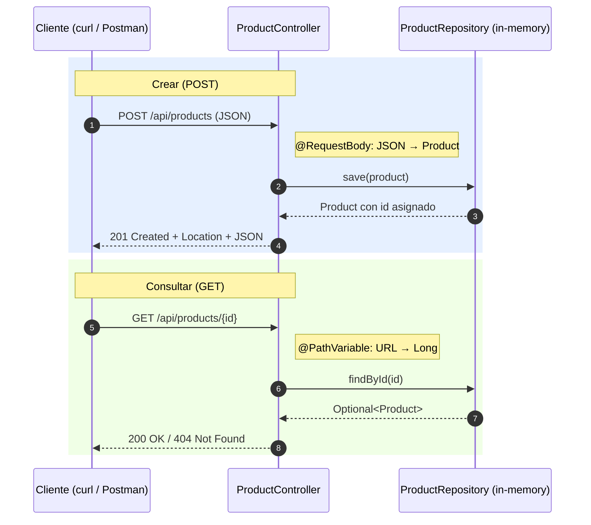

## 04 — Spring MVC y REST APIs

### Propósito
Aprenderás a construir APIs RESTful robustas y profesionales usando Spring MVC. Dominarás cómo exponer endpoints para interactuar con recursos a través de los métodos HTTP estándar, manejar datos de entrada mediante JSON, extraer parámetros dinámicos de las URLs, y gestionar correctamente los códigos de estado y respuestas.

### Problema que resuelve
Sin un framework moderno como Spring MVC, construir APIs REST en Java requería lidiar directamente con la API de Servlets (`HttpServletRequest`, `HttpServletResponse`): parsear InputStreams a mano, convertir strings a objetos Java, mapear rutas en XML, y gestionar cada cabecera y código HTTP manualmente. Código repetitivo, ilegible y propenso a errores.

### Cómo lo resuelve
Spring Web provee anotaciones declarativas (`@RestController`, `@GetMapping`, `@PostMapping`, `@RequestBody`, `@PathVariable`) que abstraen el HTTP. Jackson (incluido) convierte automáticamente POJOs/records ↔ JSON. Tú te enfocas en la lógica de negocio.

### Por qué aprenderlo
Las APIs REST son el estándar de comunicación entre sistemas. El 90% del trabajo backend involucra crearlas o consumirlas: React/Angular/Vue, apps móviles, microservicios. Dominar la capa web de Spring es indispensable.



### Glosario Básico
- **Endpoint:** URL + método HTTP que expone un recurso (ej: `GET /api/products/1`).
- **JSON:** Formato ligero de intercambio de datos.
- **`@RestController`:** Anotación de clase. Todos los retornos se serializan a JSON.
- **`@RequestMapping`:** Mapea URL base a clase o método.
- **`@GetMapping` / `@PostMapping` / `@PutMapping` / `@DeleteMapping`:** Especializaciones por verbo HTTP.
- **`@RequestBody`:** Extrae el body JSON y lo convierte a un objeto Java.
- **`@PathVariable`:** Extrae un segmento de la URL como parámetro tipado.
- **`ResponseEntity<T>`:** Wrapper que permite fijar status, headers y body de la respuesta.
- **`record`:** Clase inmutable de una sola línea (Java 14+).

---

### Conceptos

#### 1. `@RestController` + `@RequestMapping`
- **Qué es:** `@RestController` combina `@Controller` + `@ResponseBody`. `@RequestMapping` agrupa endpoints bajo un prefijo común.
- **Por qué importa:** Separa presentación de datos. Cada retorno viaja como JSON al cliente.
- **Analogía:** Un **Drive-Thru**: no entras, no ves menú; das tu orden por la ventanilla y recibes una bolsa lista (JSON).
- **Casos de uso:** microservicios, gateways de pago, BFFs para móviles.

#### 2. `@GetMapping` + `@PathVariable`
- **Qué es:** `@GetMapping` maneja GET (leer). `@PathVariable` toma fragmentos `{id}` de la URL y los convierte al tipo Java automáticamente.
- **Por qué importa:** REST exige que las URIs identifiquen recursos, y GET debe ser seguro e idempotente.
- **Analogía:** Consultar un libro en la biblioteca dando su coordenada exacta (sección, pasillo).

#### 3. `@PostMapping` + `@RequestBody`
- **Qué es:** POST envía datos al servidor para crear un recurso. `@RequestBody` deserializa el JSON entrante a un objeto Java.
- **Por qué importa:** Permite transportar datos estructurados en el body (sin límite de tamaño y no visibles en URL).
- **Analogía:** Enviar una caja de mudanza: `@RequestBody` es el asistente que abre la caja (JSON) y saca los objetos ya organizados.

#### 4. `@PutMapping` + `@DeleteMapping`
- **Qué es:** PUT reemplaza un recurso completo (idempotente). DELETE lo elimina.
- **Por qué importa:** Completan el CRUD. Deben devolver 200/204 en éxito, 404 si el recurso no existe.

#### 5. `ResponseEntity<T>` y códigos HTTP
- **200 OK** — GET/PUT exitoso.
- **201 Created** — POST exitoso (incluir header `Location`).
- **204 No Content** — DELETE exitoso.
- **404 Not Found** — el id no existe.
- **400 Bad Request** — payload/URL inválido (Spring lo genera automáticamente si el `Long` viene como texto).

---

### Antes vs Ahora (Spring MVC XML → Spring Boot 4 REST)

| Aspecto | ANTES (Spring MVC 3.x / Servlets) | AHORA (Spring Boot 4 / Java 21) |
|---|---|---|
| Bootstrap | `web.xml` + `DispatcherServlet` declarado en XML | `@SpringBootApplication` + `main()` |
| Tomcat | Instalar Tomcat, desplegar `.war` | Tomcat embebido, `java -jar` |
| Endpoint GET | `extends HttpServlet` + `doGet(req, resp)` | `@GetMapping("/{id}") Product get(@PathVariable Long id)` |
| Extraer id URL | `req.getPathInfo().split("/")` | `@PathVariable Long id` |
| Leer JSON body | `new ObjectMapper().readValue(req.getInputStream(), ...)` | `@RequestBody Product p` |
| Escribir JSON | `resp.setContentType("application/json"); mapper.writeValue(resp.getWriter(), obj)` | `return ResponseEntity.ok(obj);` |
| DTO / entidad | POJO con getters, setters, equals, hashCode, toString | `public record Product(Long id, String name, BigDecimal price) {}` |
| Chequeo null | `if (p != null) ... else ...` | `Optional<Product>` + `map/orElse` |
| Iteración | `for (Product p : list) { ... }` | `list.stream().map(...).toList()` |

---

### FAQ del Alumno

1. **¿Qué es un endpoint?**
   Una combinación de URL + verbo HTTP que expone una operación sobre un recurso. `GET /api/products/1` es un endpoint distinto a `DELETE /api/products/1`.

2. **¿Por qué el puerto 8080?**
   Es la convención histórica para servidores web de desarrollo (Tomcat, Jetty). En producción hay un reverse proxy (NGINX) delante en el puerto 80/443.

3. **¿Qué es un `record` y por qué lo usamos en lugar de una clase normal?**
   Es una clase inmutable que se declara en 1 línea. El compilador genera constructor, accessors, `equals`, `hashCode` y `toString`. Ideal para DTOs y entidades de valor donde no necesitas setters.

4. **¿Por qué `Optional<Product>` y no `Product` con posible `null`?**
   `Optional` obliga al llamador a manejar explícitamente el caso "no existe". Elimina `NullPointerException` silenciosos.

5. **¿Por qué `BigDecimal` para el precio y no `double`?**
   `double` es binario y pierde precisión con decimales (0.1 + 0.2 ≠ 0.3). En dinero eso es un bug de contabilidad. `BigDecimal` es decimal exacto.

6. **¿Qué es `MockMvc` `standaloneSetup`?**
   Un modo de test que instancia el controller manualmente (`new ProductController(repo)`) y simula peticiones HTTP sin arrancar Tomcat ni el contexto Spring. Rápido y aislado. En Spring Boot 4.1.0 es el patrón recomendado porque `@WebMvcTest` fue eliminado.

7. **¿Por qué 201 Created y no 200 OK cuando creo?**
   Es la convención REST: 201 indica "recurso nuevo creado" e incluye un header `Location` con la URL del recurso creado. Un cliente inteligente puede seguirlo.

---

### Ejercicios

1. Agrega un endpoint `GET /api/products/search?name=cafe` que filtre por nombre parcial (usa `stream().filter(...)`).
2. Añade validación con `jakarta.validation` (`@NotBlank`, `@DecimalMin`) sobre un DTO `ProductRequest` y devuelve 400 con detalles cuando falle.
3. Agrega un `@ControllerAdvice` que capture `ProductNotFoundException` (custom) y responda 404 con un body JSON `{ "error": "...", "timestamp": "..." }`.

---

### Cómo ejecutar

#### 1) Build + tests

```bash
# Git Bash / WSL
./build.sh
```

```powershell
# PowerShell
.\build.ps1
```

Ambos scripts fijan `JAVA_HOME` al JDK 21 portable de la raíz, usan el Maven portable, ejecutan `mvn clean verify` y verifican que exista `target/spring-mvc-rest-1.0.0.jar`.

#### 2) Ejecutar el JAR

```bash
java -jar target/spring-mvc-rest-1.0.0.jar
```

Espera el mensaje `Started SpringMvcRestApplication in X seconds`.

#### 3) Probar con curl

```bash
# Listar todos
curl -s http://localhost:8080/api/products

# Obtener uno
curl -s http://localhost:8080/api/products/1

# Uno que no existe (esperado: 404)
curl -i http://localhost:8080/api/products/9999

# Crear (esperado: 201 + header Location)
curl -i -X POST http://localhost:8080/api/products \
  -H "Content-Type: application/json" \
  -d '{"name":"Te verde","price":2500}'

# Actualizar (esperado: 200)
curl -i -X PUT http://localhost:8080/api/products/1 \
  -H "Content-Type: application/json" \
  -d '{"name":"Cafe 500g","price":6990}'

# Borrar (esperado: 204)
curl -i -X DELETE http://localhost:8080/api/products/1

# Borrar uno que no existe (esperado: 404)
curl -i -X DELETE http://localhost:8080/api/products/9999
```

---

### Archivos del Proyecto

| Archivo / Carpeta | Propósito |
|---|---|
| `pom.xml` | Coordenadas Maven, hereda `spring-boot-starter-parent:4.1.0`, `finalName=spring-mvc-rest-1.0.0`. |
| `build.sh` / `build.ps1` | Scripts que usan JDK 21 + Maven portables de la raíz y ejecutan `mvn clean verify`. |
| `src/main/resources/application.yml` | Puerto 8080 + hardening del módulo 02 (no filtrar stacktraces ni header `Server`). |
| `src/main/java/.../SpringMvcRestApplication.java` | Clase con `@SpringBootApplication` y `main()`. |
| `src/main/java/.../domain/Product.java` | Entidad de dominio como `record` inmutable (id, name, price). |
| `src/main/java/.../repository/ProductRepository.java` | `@Repository` in-memory con `ConcurrentHashMap` + `AtomicLong` para ids. |
| `src/main/java/.../controller/ProductController.java` | `@RestController` con GET/POST/PUT/DELETE bajo `/api/products`. |
| `src/test/java/.../SpringMvcRestApplicationTests.java` | Smoke test `contextLoads`. |
| `src/test/java/.../controller/ProductControllerTest.java` | 8 tests MockMvc en modo `standaloneSetup` (GET all, GET id 200/404, POST 201, PUT 200/404, DELETE 204/404). |
| `target/spring-mvc-rest-1.0.0.jar` | Artefacto fat-jar ejecutable (`java -jar ...`). |

---

### Nota técnica sobre tests en Spring Boot 4.1.0

En Spring Boot 4.1.0 se **eliminaron** `@WebMvcTest` y `@AutoConfigureMockMvc`. El patrón portable para testear controllers sin arrancar el contexto es:

```java
MockMvc mockMvc = MockMvcBuilders
        .standaloneSetup(new ProductController(new ProductRepository()))
        .build();
```

Instanciamos el controller manualmente, pasándole sus dependencias reales o mocks, y MockMvc simula las peticiones HTTP en memoria.
