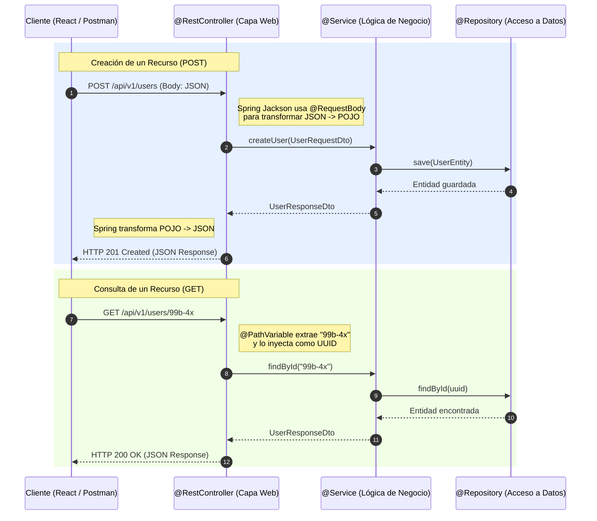

## 04 — Spring MVC y REST APIs

### Propósito
Aprenderás a construir APIs RESTful robustas y profesionales usando Spring MVC. Dominarás cómo exponer endpoints para interactuar con recursos a través de los métodos HTTP estándar, manejar datos de entrada mediante JSON, extraer parámetros dinámicos de las URLs, y gestionar correctamente los códigos de estado y respuestas.

### Problema que resuelve
Sin un framework moderno como Spring MVC, construir APIs REST en Java requería lidiar directamente con la API de Servlets (`HttpServletRequest`, `HttpServletResponse`). Esto obligaba a parsear manualmente los flujos de bytes (InputStreams) para leer JSON, convertir strings manualmente a objetos Java, mapear rutas de forma engorrosa en archivos XML, y gestionar cada cabecera y código HTTP a mano. Todo esto resultaba en un código repetitivo, difícil de leer, extremadamente propenso a errores y complejo de mantener.

### Cómo lo resuelve
Spring Web (Spring MVC) provee un conjunto de anotaciones declarativas y potentes (`@RestController`, `@GetMapping`, `@PostMapping`, `@RequestBody`, `@PathVariable`) que abstraen completamente la complejidad del protocolo HTTP subyacente. Utilizando librerías como Jackson (incluidas por defecto), Spring convierte automáticamente los objetos Java en JSON para las respuestas, y los JSON entrantes en objetos Java para las peticiones. Esto te permite enfocarte en lo verdaderamente importante: **la lógica de negocio de tu aplicación**.

### Por qué aprenderlo
En la arquitectura moderna de software, las APIs REST son el estándar de oro y la columna vertebral para la comunicación entre sistemas. Como desarrollador backend, el 90% de tu trabajo diario implicará crear o consumir estas APIs para conectar bases de datos con interfaces web modernas (React, Angular, Vue), aplicaciones móviles, o comunicarse entre microservicios en la nube. Dominar la capa web de Spring es indispensable y fundamental para tu carrera profesional.



### Glosario Básico
- **Endpoint:** URL específica expuesta por la API para que un cliente interactúe con un recurso (ej: `/api/users`).
- **JSON (JavaScript Object Notation):** Formato ligero de intercambio de datos, fácil de leer y escribir para humanos y máquinas, utilizado como el estándar de comunicación en APIs REST.
- **DTO (Data Transfer Object):** Un patrón de diseño. Es un objeto plano que se usa exclusivamente para transportar datos entre procesos (ej: del Cliente al Controller, o del Service al Controller). Ayuda a no exponer las entidades de base de datos (`@Entity`) directamente hacia el exterior.
- **`@RestController`:** Anotación de clase. Indica que la clase maneja peticiones web y sus métodos retornan directamente datos (JSON) y no vistas HTML.
- **`@RequestMapping`:** Anotación para mapear URLs a clases o métodos enteros. Generalmente se usa a nivel de clase para definir un prefijo de ruta (ej: `/api/v1/products`).
- **`@GetMapping` / `@PostMapping`:** Especializaciones de mapeo para los métodos HTTP GET y POST respectivamente.
- **`@RequestBody`:** Anotación que extrae el cuerpo (payload) de la petición HTTP entrante y lo deserializa a un objeto Java.
- **`@PathVariable`:** Anotación que extrae un segmento de la URL misma para usarlo como variable dentro del método.

---

### Conceptos

#### 1. @RestController y @RequestMapping
- **Qué es:** 
  - `@RestController` es un decorador estéreo que combina `@Controller` y `@ResponseBody`. Le avisa al motor de Spring MVC que todos los retornos de esta clase deben ser inyectados directamente en el cuerpo de la respuesta HTTP, serializándose a JSON.
  - `@RequestMapping` a nivel de clase agrupa endpoints bajo una ruta común (path base).
- **Por qué importa:** Separa de forma tajante la lógica de presentación (frontend) de los datos (backend). A diferencia de `@Controller` clásico que intentaría devolver un archivo Thymeleaf o JSP, `@RestController` construye APIs puras. Mantiene tu código organizado al agrupar responsabilidades por dominios mediante rutas lógicas.
- **Analogía:** Imagina un `@RestController` como la **ventanilla del Drive-Thru** de un restaurante de comida rápida. Tú no entras, no pides menú ni cubiertos (Vistas HTML). Llegas en tu auto, das tu orden (Request HTTP) y por la ventanilla te entregan una bolsa estandarizada lista con tu comida (Respuesta JSON).
- **Casos de Uso Empresariales:** Creación de APIs de microservicios, pasarelas de pagos (Gateways), BFFs (Backend For Frontends) diseñados específicamente para proveer datos a aplicaciones móviles (iOS/Android).

#### 2. @GetMapping y @PathVariable
- **Qué es:** 
  - `@GetMapping` es la anotación que maneja las solicitudes HTTP GET. Representa la acción de "Leer" o "Recuperar" datos.
  - `@PathVariable` toma fragmentos variables de la URL definidos entre llaves `{}` y los asigna a parámetros de tu método Java, realizando automáticamente la conversión de tipos (ej. String en la URL a `Long` o `UUID` en Java).
- **Por qué importa:** Cumple con la restricción REST de que las URIs deben identificar los recursos. Los métodos GET deben ser **seguros** e **idempotentes** (llamar un GET cien veces no debe alterar el estado de la base de datos). 
- **Analogía:** `@GetMapping` es como entrar a una biblioteca y usar la computadora para consultar un libro (solo lectura). `@PathVariable` es darle una coordenada específica al bibliotecario: "Busca en la *sección* de **{Historia}**, en el *pasillo* **{4}**".
- **Casos de Uso Empresariales:** Búsqueda en catálogos de un E-commerce (Amazon, MercadoLibre), ver el detalle de un vuelo específico, o consultar el estado de un envío (Tracking).

#### 3. @PostMapping y @RequestBody
- **Qué es:** 
  - `@PostMapping` captura solicitudes HTTP POST, que sirven para enviar información al servidor con la intención de **crear** un nuevo recurso o lanzar un proceso.
  - `@RequestBody` es la magia detrás de escenas. Toma el payload de la petición (típicamente un gran bloque JSON) y lo convierte automáticamente (deserialización) en la clase Java (POJO/Record) que definas en el parámetro.
- **Por qué importa:** Facilita la transmisión de datos complejos y estructurados. A diferencia de un GET que lleva los datos visibles en la URL, el POST encapsula la carga útil en el cuerpo, permitiendo el envío seguro e ilimitado (en tamaño) de jerarquías de datos.
- **Analogía:** `@PostMapping` es como enviar una caja de mudanza por correo. `@RequestBody` es la persona de logística que abre la caja de cartón (el string JSON) y saca los artículos individuales para organizarlos en tu nueva casa (instanciación de Objetos Java).
- **Casos de Uso Empresariales:** Formularios de registro de nuevos usuarios, procesar carritos de compras, realizar un pago con tarjeta (donde envías tokens sensibles), emisión de facturas.

---

### Código: Implementación Completa y Buenas Prácticas

A continuación, veremos un Controlador moderno para la gestión de Productos, implementando las mejores prácticas de la industria, incluyendo DTOs y validaciones de casos de error (Edge Cases).

#### El Controlador (`ProductController.java`)

```java
package com.springroadmap.mvc.controller;

import com.springroadmap.mvc.dto.ProductRequestDto;
import com.springroadmap.mvc.dto.ProductResponseDto;
import com.springroadmap.mvc.service.ProductService;
import jakarta.validation.Valid;
import lombok.RequiredArgsConstructor;
import lombok.extern.slf4j.Slf4j;
import org.springframework.http.HttpStatus;
import org.springframework.http.ResponseEntity;
import org.springframework.web.bind.annotation.*;

import java.util.List;
import java.util.UUID;

/**
 * @RestController: Todos los métodos responden JSON.
 * @RequestMapping: Prefijo base para todos los endpoints. Buena práctica versionar (/api/v1/...).
 */
@RestController
@RequestMapping("/api/v1/products")
@RequiredArgsConstructor // Inyección de dependencias recomendada vía constructor (Lombok).
@Slf4j // Logger SLF4J proporcionado por Lombok para evitar System.out.println.
public class ProductController {

    // Dependencia inyectada, final para asegurar inmutabilidad y seguridad en hilos.
    private final ProductService productService;

    /**
     * Endpoint: GET /api/v1/products
     * Uso: Listar todos los productos.
     */
    @GetMapping
    public ResponseEntity<List<ProductResponseDto>> getAllProducts() {
        log.info("REST request - Obteniendo lista de productos");
        
        // El servicio siempre nos devuelve DTOs, nunca Entidades de BD.
        List<ProductResponseDto> products = productService.findAll();
        
        // ResponseEntity.ok() construye una respuesta con status HTTP 200 (OK).
        return ResponseEntity.ok(products);
    }

    /**
     * Endpoint: GET /api/v1/products/{id}
     * Uso: Obtener el detalle de un solo producto.
     * @PathVariable extrae la variable "id" de la URL.
     */
    @GetMapping("/{id}")
    public ResponseEntity<ProductResponseDto> getProductById(@PathVariable("id") final UUID productId) {
        log.info("REST request - Consultando producto con ID: {}", productId);
        
        // Edge Case: ¿Qué pasa si el UUID en la URL es texto inválido ("abc")?
        // Spring lanzará un MethodArgumentTypeMismatchException (Ver GlobalExceptionHandler abajo).
        
        // Edge Case: ¿Qué pasa si el ID no existe en Base de Datos?
        // El servicio lanzará una ResourceNotFoundException personalizada.
        ProductResponseDto product = productService.findById(productId);
        
        return ResponseEntity.ok(product);
    }

    /**
     * Endpoint: POST /api/v1/products
     * Uso: Crear un nuevo producto.
     * @RequestBody transforma el JSON en ProductRequestDto.
     * @Valid dispara las validaciones (ej. @NotBlank, @Min) definidas dentro del DTO.
     */
    @PostMapping
    public ResponseEntity<ProductResponseDto> createProduct(
            @Valid @RequestBody final ProductRequestDto request) {
            
        log.info("REST request - Creando nuevo producto: {}", request.name());
        
        // Edge Case: ¿Qué pasa si falta el nombre en el JSON?
        // @Valid fallará y lanzará MethodArgumentNotValidException sin llegar a este punto.
        
        ProductResponseDto newProduct = productService.create(request);
        
        // BUENA PRÁCTICA: Devolver HTTP 201 (Created) cuando un recurso se crea exitosamente.
        return ResponseEntity.status(HttpStatus.CREATED).body(newProduct);
    }
}
```

#### Los DTOs (Data Transfer Objects) usando `Record` (Java 14+)

Nunca expongas tus clases `@Entity` en un controlador. Causarás problemas de serialización (referencias circulares), exponerás campos sensibles (como contraseñas o campos de auditoría) y romperás el encapsulamiento.

```java
package com.springroadmap.mvc.dto;

import jakarta.validation.constraints.DecimalMin;
import jakarta.validation.constraints.NotBlank;
import jakarta.validation.constraints.NotNull;
import java.math.BigDecimal;
import java.util.UUID;

// DTO para recibir datos del cliente
public record ProductRequestDto(
    @NotBlank(message = "El nombre del producto no puede estar vacío")
    String name,
    
    @NotBlank(message = "La descripción es obligatoria")
    String description,
    
    @NotNull(message = "El precio es obligatorio")
    @DecimalMin(value = "0.01", message = "El precio debe ser mayor a cero")
    BigDecimal price
) {}

// DTO para devolver datos al cliente
public record ProductResponseDto(
    UUID id,
    String name,
    String description,
    BigDecimal price
    // Podríamos omitir datos internos que la BD sí tiene (ej. created_at, modified_by)
) {}
```

#### Edge Cases: Manejo de Errores con `@ControllerAdvice`

En un entorno empresarial, los errores no deben devolver al cliente un terrorífico *Stack Trace* HTML gigante, ni un simple *Status 500* para todo. Debemos centralizar los errores y devolver respuestas de error estandarizadas.

```java
package com.springroadmap.mvc.exception;

import lombok.extern.slf4j.Slf4j;
import org.springframework.http.HttpStatus;
import org.springframework.http.ResponseEntity;
import org.springframework.web.bind.MethodArgumentNotValidException;
import org.springframework.web.bind.annotation.ControllerAdvice;
import org.springframework.web.bind.annotation.ExceptionHandler;
import org.springframework.web.method.annotation.MethodArgumentTypeMismatchException;

import java.time.LocalDateTime;
import java.util.HashMap;
import java.util.Map;

/**
 * @ControllerAdvice convierte a esta clase en un interceptor global de excepciones
 * para todos los @RestController. Captura errores antes de que lleguen al usuario final.
 */
@ControllerAdvice
@Slf4j
public class GlobalExceptionHandler {

    // Estructura de error corporativa sugerida (puede ser un record / clase)
    private record ErrorResponse(LocalDateTime timestamp, int status, String error, String message) {}

    /**
     * Edge Case 1: El cliente envía un JSON inválido según las reglas de @Valid en el DTO
     * (Ej. Faltó el 'name' del producto).
     */
    @ExceptionHandler(MethodArgumentNotValidException.class)
    public ResponseEntity<Map<String, String>> handleValidations(MethodArgumentNotValidException ex) {
        log.warn("Error de validación en la petición: {}", ex.getMessage());
        
        Map<String, String> errores = new HashMap<>();
        ex.getBindingResult().getFieldErrors().forEach(error -> 
            errores.put(error.getField(), error.getDefaultMessage())
        );
        
        // Devuelve HTTP 400 Bad Request
        return ResponseEntity.status(HttpStatus.BAD_REQUEST).body(errores);
    }

    /**
     * Edge Case 2: El cliente manda un texto en lugar de un UUID en la URL (ej /api/v1/products/carlitos)
     * Fallará la conversión automática de @PathVariable.
     */
    @ExceptionHandler(MethodArgumentTypeMismatchException.class)
    public ResponseEntity<ErrorResponse> handleTypeMismatch(MethodArgumentTypeMismatchException ex) {
        log.warn("Mismatch de tipo en parámetro: {}", ex.getName());
        
        String mensaje = String.format("El parámetro '%s' debe ser de tipo '%s'", 
            ex.getName(), ex.getRequiredType().getSimpleName());
            
        ErrorResponse response = new ErrorResponse(
            LocalDateTime.now(), HttpStatus.BAD_REQUEST.value(), "Invalid Parameter Type", mensaje);
            
        return ResponseEntity.status(HttpStatus.BAD_REQUEST).body(response);
    }
    
    /**
     * Edge Case 3: Capturamos una excepción de negocio (Ej. Producto no existe).
     * ResourceNotFoundException es una excepción personalizada que creamos.
     */
    @ExceptionHandler(ResourceNotFoundException.class)
    public ResponseEntity<ErrorResponse> handleNotFound(ResourceNotFoundException ex) {
        log.warn("Recurso no encontrado: {}", ex.getMessage());
        
        ErrorResponse response = new ErrorResponse(
            LocalDateTime.now(), HttpStatus.NOT_FOUND.value(), "Not Found", ex.getMessage());
            
        // Devuelve HTTP 404 Not Found
        return ResponseEntity.status(HttpStatus.NOT_FOUND).body(response);
    }
}
```

---

### Ejercicios

1. **Creación de Endpoint GET Simple:** 
   - Crea un `GreetingController` anotado con `@RestController`.
   - Implementa un endpoint usando `@GetMapping("/hello")` que retorne un simple `String` que diga `"¡Hola Mundo Spring!"`.
   - Prueba ingresando a `http://localhost:8080/hello` desde tu navegador.
2. **Uso de PathVariables múltiples:** 
   - Añade un endpoint al controlador anterior mapeado como `@GetMapping("/calculator/add/{a}/{b}")`.
   - Extrae `a` y `b` con `@PathVariable` (ambos tipo `Integer`).
   - Retorna la suma de ambos números.
3. **Endpoint de creación robusto:**
   - Construye un `UserRequestDto` que contenga un campo `email` y `age`. Añade validaciones (anotaciones de `jakarta.validation.constraints`) para que el email sea válido y la edad sea mayor o igual a 18.
   - Crea un `@PostMapping("/register")` en un `UserController`.
   - Envía un JSON con un email inválido vía Postman o cURL y verifica que la aplicación lance un error de validación 400 Bad Request, en lugar de crashear el servidor.

### Cómo ejecutar

Para levantar el proyecto y probar los endpoints que acabas de construir, abre una terminal en la raíz de este proyecto y ejecuta:

```bash
mvn spring-boot:run
```
Una vez que el servidor reporte `Started SpringRoadmapApplication in X seconds`, puedes usar un cliente HTTP (como Postman, Insomnia o cURL) para hacer pruebas:

*Ejemplo usando cURL para consultar el producto:*
```bash
curl -v http://localhost:8080/api/v1/products
```

### Archivos del Proyecto

| Archivo / Carpeta | Propósito |
|-------------------|-----------|
| `pom.xml` | Configuración de Maven, incluye dependencias como `spring-boot-starter-web` y `spring-boot-starter-validation`. |
| `controller/` | Capa encargada de exponer la API. Contiene las clases con `@RestController`. |
| `dto/` | *Data Transfer Objects*. Usamos records inmutables para definir las estructuras JSON de entrada (`Request`) y salida (`Response`). |
| `service/` | Capa de lógica de negocio (Mockeada o enlazada en los siguientes módulos). |
| `exception/` | Contiene excepciones personalizadas (`ResourceNotFoundException`) y el `@ControllerAdvice` global para manejo centralizado de errores. |
| `application.yml` | Archivo de propiedades de Spring Boot, donde se configura el puerto base y otros ajustes del servidor Tomcat embebido. |
