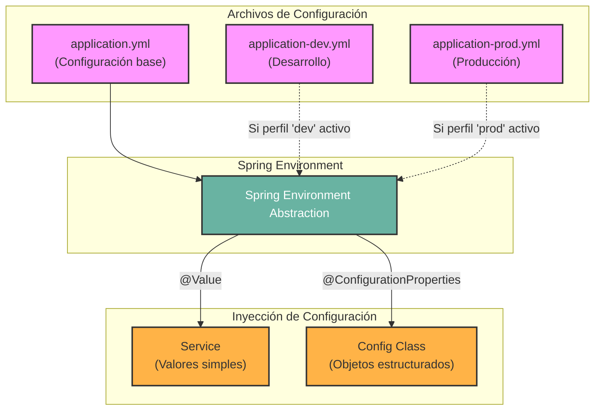

## 05 — Configuración y Entornos

### Propósito
Aprenderás a externalizar la configuración de tu aplicación Spring Boot usando `application.yml`, mapear estas propiedades a objetos fuertemente tipados con `@ConfigurationProperties`, inyectar valores simples con `@Value` y manejar diferentes entornos (desarrollo, producción) mediante perfiles (`@Profile`).

### Problema que resuelve
Imagina tener las credenciales de la base de datos, URLs de APIs externas y tiempos de espera (timeouts) escritos directamente (hardcodeados) en el código fuente de Java. Si necesitas cambiar la contraseña de la base de datos de producción, tendrías que modificar el código, recompilar la aplicación y volver a desplegarla. Además, mezclarías configuraciones de desarrollo con las de producción, arriesgándote a usar la base de datos de pruebas en el entorno en vivo.

### Cómo lo resuelve
Spring permite extraer todas estas configuraciones a archivos externos (como `application.yml` o `application.properties`). Luego, inyecta automáticamente estos valores en tus clases Java cuando la aplicación arranca. Mediante "perfiles", puedes tener un archivo `application-dev.yml` para desarrollo y un `application-prod.yml` para producción, y Spring cargará el correcto basándose en el entorno de ejecución, sin necesidad de tocar una sola línea de código Java.

### Por qué aprenderlo
En cualquier entorno empresarial real (enterprise), tu aplicación pasará por múltiples entornos: Local, Desarrollo, QA, Staging y Producción. Cada entorno tiene distintas bases de datos, claves secretas, URLs de integración y límites de recursos. Dominar la externalización de la configuración es fundamental para crear aplicaciones portátiles, seguras y preparadas para el despliegue en la nube (Cloud Native / 12-Factor App).



### Glosario Básico

- **`application.yml` / `application.properties`**: Archivos estándar de Spring Boot donde defines pares clave-valor para configurar la aplicación. YAML es preferido por su estructura jerárquica.
- **`@Value`**: Anotación usada a nivel de campo o parámetro de constructor para inyectar un valor simple desde el archivo de propiedades. Usa sintaxis de expresión `"${propiedad.nombre}"`.
- **`@ConfigurationProperties`**: Anotación usada en una clase para vincular automáticamente un conjunto de propiedades (con un prefijo común) a los campos de esa clase. Proporciona validación y tipado fuerte (type-safety).
- **Perfil (Profile)**: Una característica del core de Spring que permite registrar beans condicionalmente o cargar archivos de configuración específicos (ej. `application-prod.yml`) basándose en el perfil activo (ej. `prod`).
- **`@Profile`**: Anotación que indica que un componente (`@Component`, `@Service`, `@Configuration`) o `@Bean` solo debe cargarse si un perfil específico está activo.

### Conceptos

#### 1. application.yml (Externalización de Configuración)

**Qué es:**
Spring Boot carga configuraciones desde varias fuentes (variables de entorno, argumentos de línea de comandos, archivos). El archivo `application.yml` (ubicado en `src/main/resources/`) es la forma más común de definir la configuración por defecto de tu aplicación. YAML permite estructurar la configuración como un árbol, lo cual es mucho más legible que los archivos `.properties` tradicionales.

**Por qué importa:**
Sigue el principio de separación de preocupaciones (Separation of Concerns). El código define *cómo* funciona la aplicación; la configuración define *dónde* y *con qué* se ejecuta.

**Código:**
```yaml
# src/main/resources/application.yml
spring:
  application:
    name: "Spring Roadmap Config App"
  # Configuración estándar de la base de datos
  datasource:
    url: jdbc:postgresql://localhost:5432/roadmap_db
    username: my_user
    # NUNCA hardcodees contraseñas de producción aquí.
    # Es mejor usar variables de entorno para secretos.
    password: ${DB_PASSWORD:default_password} # edge case: valor por defecto si DB_PASSWORD no existe

# Configuración personalizada (tuya)
payment:
  gateway:
    url: "https://api.sandbox.pagos.com"
    timeout-ms: 5000
    retry-attempts: 3
    supported-currencies:
      - USD
      - EUR
      - MXN
```

**Analogía:**
Piensa en el código Java como el **motor y carrocería de un coche**, y en el archivo `application.yml` como el **panel de ajustes del conductor**. No reconstruyes el motor para cambiar la estación de radio o ajustar el aire acondicionado; simplemente modificas los ajustes en el panel.

**Casos de Uso Empresariales:**
Configurar conexiones a bases de datos (`spring.datasource`), definir el puerto del servidor (`server.port=8080`), configurar el formato de los logs (`logging.level.org.springframework=INFO`), o definir URLs de microservicios dependientes.

---

#### 2. @Value (Inyección de Valores Simples)

**Qué es:**
`@Value` es una anotación que lee una propiedad del entorno de Spring (Environment) y la inyecta en una variable. Usa la sintaxis SPEL (Spring Expression Language) de resolución de propiedades: `"${mi.propiedad}"`.

**Por qué importa:**
Es la forma más rápida y directa de obtener un dato de configuración cuando solo necesitas uno o dos valores sueltos en una clase específica, sin necesidad de crear una clase de configuración dedicada.

**Código:**
```java
package com.springroadmap.configuracion.service;

import org.springframework.beans.factory.annotation.Value;
import org.springframework.stereotype.Service;

import java.util.List;

@Service
public class PaymentService {

    private final String gatewayUrl;
    private final int timeout;
    private final List<String> currencies;

    // Inyección por constructor (Buena Práctica)
    // Edge case: Proveemos valores por defecto separados por ':'
    // por si la propiedad no existe, evitando que la app falle al arrancar.
    public PaymentService(
            @Value("${payment.gateway.url:https://default.com}") final String gatewayUrl,
            @Value("${payment.gateway.timeout-ms:1000}") final int timeout,
            @Value("${payment.gateway.supported-currencies:USD}") final List<String> currencies) {
        
        this.gatewayUrl = gatewayUrl;
        this.timeout = timeout;
        this.currencies = currencies;
    }

    public void processPayment() {
        System.out.println("Llamando a pasarela de pagos en: " + gatewayUrl);
        System.out.println("Timeout configurado a: " + timeout + " ms");
        System.out.println("Monedas soportadas: " + String.join(", ", currencies));
    }
}
```

*Edge case a tener en cuenta:* Si usas `@Value("${mi.propiedad}")` y la propiedad no existe en ningún archivo `.yml` ni variable de entorno, **Spring Boot no arrancará** (lanzará una excepción). Por eso es crucial usar valores por defecto `"${mi.propiedad:valor_default}"` o asegurar que la propiedad exista.

**Analogía:**
Es como ir a la recepción de un hotel y pedir específicamente una sola cosa: "Dame la contraseña del WiFi". Solo te interesa ese dato suelto para poder trabajar en ese momento.

**Casos de Uso Empresariales:**
Obtener una clave de API secreta, configurar el límite de resultados de una consulta a base de datos o definir un directorio temporal de subida de archivos en disco.

---

#### 3. @ConfigurationProperties (Configuración Tipada)

**Qué es:**
Mientras `@Value` inyecta campos sueltos, `@ConfigurationProperties` toma una jerarquía entera del `application.yml` (ej. todo lo que esté debajo de `payment.gateway`) y lo mapea automáticamente a los campos de una clase Java ordinaria.

**Por qué importa:**
El problema de usar `@Value` por todas partes es que el código se vuelve difícil de mantener. Si una URL cambia de nombre en el `yml`, tienes que buscar todos los `@Value` en el código. `@ConfigurationProperties` agrupa configuraciones lógicamente relacionadas en un solo objeto (POJO), proporcionando **type-safety** (errores de compilación si te equivocas de tipo) y autocompletado en tu IDE. **Es el estándar de la industria.**

**Código:**
Primero, activamos la funcionalidad y creamos el registro (Java 16+ Records son ideales para esto):

```java
package com.springroadmap.configuracion.config;

import org.springframework.boot.context.properties.ConfigurationProperties;
import org.springframework.boot.context.properties.bind.DefaultValue;
import jakarta.validation.constraints.NotBlank;
import jakarta.validation.constraints.Min;
import org.springframework.validation.annotation.Validated;

import java.util.List;

// @ConfigurationProperties mapea todo lo que empiece con "payment.gateway"
// @Validated permite usar anotaciones de validación para asegurar la integridad al arrancar
@Validated
@ConfigurationProperties(prefix = "payment.gateway")
public record PaymentProperties(
        
        @NotBlank(message = "La URL de la pasarela no puede estar vacía")
        String url,
        
        @Min(value = 1000, message = "El timeout mínimo es de 1 segundo (1000 ms)")
        int timeoutMs,
        
        int retryAttempts, // Si no tiene @DefaultValue ni validación, toma el valor del YAML
        
        // Edge Case: ¿Qué pasa si la lista está vacía en el YAML? 
        // Usamos @DefaultValue para asegurar que siempre haya al menos una moneda
        @DefaultValue({"USD"})
        List<String> supportedCurrencies
) {
}
```

Para usar este record, necesitamos habilitar el escaneo en nuestra clase principal o de configuración:

```java
package com.springroadmap.configuracion;

import com.springroadmap.configuracion.config.PaymentProperties;
import org.springframework.boot.SpringApplication;
import org.springframework.boot.autoconfigure.SpringBootApplication;
import org.springframework.boot.context.properties.ConfigurationPropertiesScan;

@SpringBootApplication
// ¡CRÍTICO! Esta anotación le dice a Spring que busque clases con @ConfigurationProperties
@ConfigurationPropertiesScan 
public class ConfigApplication {
    public static void main(String[] args) {
        SpringApplication.run(ConfigApplication.class, args);
    }
}
```

Ahora, cualquier servicio puede inyectar `PaymentProperties` directamente:

```java
package com.springroadmap.configuracion.service;

import com.springroadmap.configuracion.config.PaymentProperties;
import org.springframework.stereotype.Service;

@Service
public class AdvancedPaymentService {

    private final PaymentProperties properties;

    // Spring inyecta el objeto fuertemente tipado
    public AdvancedPaymentService(final PaymentProperties properties) {
        this.properties = properties;
    }

    public void displayConfig() {
        // En lugar de strings sueltos, tenemos un objeto real con métodos tipados
        System.out.println("URL: " + properties.url());
        System.out.println("Timeout: " + properties.timeoutMs());
        System.out.println("Reintentos: " + properties.retryAttempts());
    }
}
```

**Analogía:**
En lugar de ir a recepción a pedir la contraseña del WiFi, la hora del desayuno y el número de tu habitación uno por uno (como con `@Value`), el recepcionista te entrega un **Folleto de Bienvenida** (`@ConfigurationProperties`) que contiene toda esa información bien organizada y estructurada en secciones.

**Casos de Uso Empresariales:**
Agrupar configuraciones de seguridad (tokens JWT de expiración, firmas, secretos), configuraciones de clientes AWS/S3 (bucket names, regions), o parámetros de conexión a un sistema legado ERP.

---

#### 4. Perfiles (Profiles)

**Qué es:**
Los perfiles de Spring permiten separar partes de la configuración de la aplicación y hacer que solo estén disponibles en ciertos entornos. Puedes tener archivos `.yml` específicos por perfil (`application-dev.yml`, `application-prod.yml`) y también condicionar la creación de Beans de Java usando `@Profile("dev")`.

**Por qué importa:**
Un entorno de producción es radicalmente distinto a tu computadora local. En local, quieres usar una base de datos en memoria (H2) y logs detallados (DEBUG). En producción, necesitas conectar a un PostgreSQL manejado (RDS) y solo registrar errores (ERROR). Los perfiles evitan que un desarrollador "accidentalmente" apunte a producción mientras hace pruebas en su máquina.

**Código:**

*Paso 1: Crear los archivos YAML específicos de perfil*

```yaml
# src/main/resources/application-dev.yml
payment:
  gateway:
    url: "https://api.sandbox.pagos.com" # Apunta a un entorno de pruebas

spring:
  datasource:
    url: jdbc:h2:mem:testdb # Base de datos en memoria para el desarrollador local
```

```yaml
# src/main/resources/application-prod.yml
payment:
  gateway:
    url: "https://api.real.pagos.com" # API real con dinero de verdad

spring:
  datasource:
    url: jdbc:postgresql://produccion.cluster-xyz.eu-west-1.rds.amazonaws.com:5432/proddb
    # La contraseña en prod NO se pone aquí, se pasa como variable de entorno al contenedor Docker
```

*Paso 2: Condicionar Beans de Java (Opcional, pero potente)*

```java
package com.springroadmap.configuracion.service;

import org.springframework.context.annotation.Profile;
import org.springframework.stereotype.Service;

// Interfaz común
public interface EmailService {
    void sendEmail(String to, String message);
}

// Implementación que solo se carga en Desarrollo
@Service
@Profile("dev")
public class MockEmailService implements EmailService {
    @Override
    public void sendEmail(String to, String message) {
        // En desarrollo, no mandamos correos reales para no hacer spam a clientes
        System.out.println("[MOCK] Simulación de correo a " + to + ": " + message);
    }
}

// Implementación que solo se carga en Producción
@Service
@Profile("prod")
public class SmtpEmailService implements EmailService {
    @Override
    public void sendEmail(String to, String message) {
        // Código real para conectar a SendGrid / Amazon SES
        System.out.println("[REAL] Conectando a SMTP y enviando correo a " + to);
    }
}
```

*Edge case:* Si ningún perfil está activo, Spring usa el perfil predeterminado llamado `default`. Además, las propiedades en `application-dev.yml` **sobrescriben** a las que estén en `application.yml`, no las eliminan. `application.yml` actúa como la configuración base.

**Analogía:**
Piensa en los Perfiles como el **modo de vuelo** de un teléfono móvil. El teléfono (la aplicación) es el mismo, pero al activar un perfil ("Modo Vuelo"), ciertas antenas y componentes (Beans y configuraciones) se apagan o cambian su comportamiento sin que tengas que desarmar el teléfono físicamente.

**Casos de Uso Empresariales:**
- Activar mocks de integraciones de terceros en entornos locales (`dev`).
- Configurar credenciales de pasarelas de pago reales solo en el entorno vivo (`prod`).
- Tener un entorno intermedio (`qa` o `staging`) para que el equipo de pruebas verifique el código contra copias de las bases de datos de producción.

---

### Ejercicios

1. **Inyección Básica:** Crea una propiedad `app.welcome-message: "Hola Mundo"` en tu `application.yml`. Crea un `@RestController` que, al hacer una petición GET a `/hello`, devuelva ese mensaje inyectándolo con `@Value`.
2. **Propiedades Fuertemente Tipadas:** Convierte las configuraciones de una base de datos ficticia (host, port, name, timeout) en un `record` Java usando `@ConfigurationProperties`. Valida que el puerto siempre sea mayor a 1000.
3. **El Misterio del Perfil:** Crea tres archivos (`application.yml`, `application-dev.yml`, `application-prod.yml`). Define una propiedad `app.environment` diferente en cada uno. Arranca tu aplicación localmente, luego arráncala forzando el perfil `prod` (modificando la configuración de arranque de tu IDE o vía CLI) y verifica qué valor se imprime en consola.

### Cómo ejecutar

1. Clona el repositorio y navega al directorio del ejemplo.
2. Ejecuta con el perfil por defecto (normalmente `default`):
   ```bash
   mvn spring-boot:run
   ```
3. Para ejecutar la aplicación con un perfil específico (por ejemplo, `prod`):
   ```bash
   mvn spring-boot:run -Dspring-boot.run.profiles=prod
   ```
   *(Observa cómo los valores inyectados cambian basándose en el perfil activo).*

### Archivos del Proyecto

| Archivo | Propósito |
|---------|-----------|
| `pom.xml` | Definición de dependencias. Para usar validaciones, requiere `spring-boot-starter-validation`. |
| `src/main/resources/application.yml` | Configuración global y valores por defecto (perfil base). |
| `src/main/resources/application-dev.yml` | Sobrescritura de configuraciones específicamente para el entorno de desarrollo. |
| `src/main/resources/application-prod.yml` | Sobrescritura de configuraciones específicamente para producción. |
| `ConfigApplication.java` | Punto de entrada de la aplicación Spring Boot. Contiene `@ConfigurationPropertiesScan`. |
| `config/PaymentProperties.java` | El `record` de Java con `@ConfigurationProperties` para mapear de forma tipada el YAML. |
| `service/PaymentService.java` | Ejemplo de inyección manual de propiedades utilizando `@Value`. |
| `service/AdvancedPaymentService.java` | Ejemplo de inyección del objeto agrupado `PaymentProperties`. |
| `service/EmailService.java` | Interfaz y clases (Mock/Smtp) demostrando el uso de la anotación `@Profile`. |
| `controller/ConfigDemoController.java` | (Opcional) Endpoint REST para exponer los valores y comprobar que se inyectaron correctamente. |
