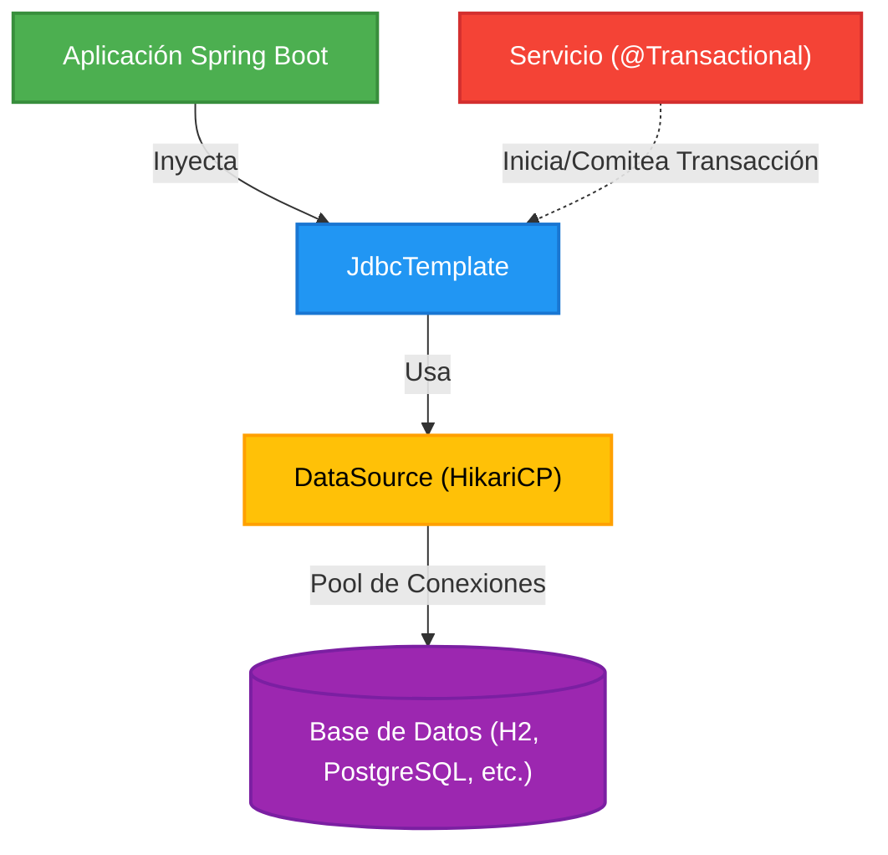

## 06 — Base de Datos con JDBC (DataSource, JdbcTemplate, H2 y @Transactional)

### Propósito
Aprenderás cómo Spring Boot se conecta a una base de datos relacional (H2 en memoria) mediante un `DataSource`, cómo ejecutar operaciones CRUD limpias y seguras usando `JdbcTemplate`, y cómo garantizar la integridad de los datos utilizando transacciones gestionadas con la anotación `@Transactional`.

### Problema que resuelve
El código tradicional de JDBC en Java (usando `Connection`, `PreparedStatement`, y `ResultSet`) es extremadamente verboso, propenso a errores humanos (olvidar cerrar una conexión o un statement, causando memory leaks) y te obliga a lidiar con las excepciones comprobadas (`SQLException`) llenando tu código de bloques `try-catch-finally`. Además, gestionar que varias operaciones se completen todas juntas o ninguna (transacciones) requiere controlar el commit y rollback manualmente, lo que ensucia la lógica de negocio.

### Cómo lo resuelve
Spring abstrae toda la complejidad y el código repetitivo de JDBC a través de la clase `JdbcTemplate`, que se encarga automáticamente de abrir y cerrar conexiones, preparar las sentencias y mapear resultados. Traduce las horribles `SQLException` en una jerarquía coherente de excepciones de Spring (`DataAccessException`), que además son `RuntimeException`, limpiando tu código de bloques try-catch innecesarios. Finalmente, la anotación `@Transactional` implementa un proxy alrededor de tus servicios para iniciar, comitear o deshacer transacciones automáticamente.

### Por qué aprenderlo
Interactuar con bases de datos relacionales es una de las tareas más críticas y comunes en cualquier aplicación empresarial (banca, e-commerce, logística). Aunque hoy en día ORMs como Hibernate (JPA) son muy populares, muchas empresas prefieren la velocidad pura y el control directo sobre las consultas SQL complejas o reportes masivos usando `JdbcTemplate`. Comprender este nivel más cercano a la base de datos es fundamental antes de pasar a abstracciones más altas, y entender cómo funcionan las transacciones (`@Transactional`) te salvará de corromper la base de datos en producción.



### Glosario Básico
- **`DataSource`**: Interfaz estándar de Java para obtener conexiones a una base de datos. Spring Boot por defecto usa HikariCP, un pool de conexiones extremadamente rápido y eficiente.
- **`JdbcTemplate`**: La clase principal de Spring para ejecutar sentencias SQL. Elimina todo el "boilerplate" (código repetitivo) de abrir y cerrar conexiones, lidiar con PreparedStatements, etc.
- **`RowMapper<T>`**: Interfaz de Spring utilizada por `JdbcTemplate` para mapear las filas (`ResultSet`) de una consulta SQL a objetos Java.
- **`@Transactional`**: Anotación de Spring que indica que un método o clase debe ejecutarse dentro de una transacción de base de datos (todo o nada).
- **H2 Database**: Una base de datos relacional escrita en Java. Se puede usar en modo "in-memory" (los datos se pierden al apagar la app), siendo ideal para pruebas, desarrollo rápido o ejemplos de aprendizaje.

### Conceptos

#### 1. DataSource (Pool de Conexiones HikariCP)

**Qué es:**
Un `DataSource` es una fábrica de conexiones a la base de datos. En vez de abrir una conexión lenta y costosa cada vez que se requiere una consulta (que podría tardar decenas de milisegundos), Spring Boot (mediante HikariCP) abre de antemano un conjunto de conexiones (pool) al arrancar. Cuando `JdbcTemplate` necesita una, simplemente la "toma prestada" del pool, ejecuta la consulta y la "devuelve". 

**Por qué importa:**
Abrir conexiones de base de datos físicamente (TCP handshakes, autenticación) es letalmente lento en un entorno web de alto tráfico. Usar un pool de conexiones como HikariCP es obligatorio para la escalabilidad, y Spring Boot lo autoconfigura por ti con solo añadir la dependencia `spring-boot-starter-jdbc` y las propiedades en `application.yml`.

**Código (Configuración de application.yml):**
```yaml
spring:
  datasource:
    # URL para base de datos H2 en memoria. 
    # mem: testdb significa que se llama testdb y se pierde al apagar la app.
    url: jdbc:h2:mem:testdb
    # Usuario por defecto de H2
    username: sa
    # Contraseña por defecto (vacía)
    password: 
    # Configuración opcional para tuning del pool HikariCP (Edge cases de alto tráfico)
    hikari:
      maximum-pool-size: 10 # Número máximo de conexiones simultáneas
      connection-timeout: 20000 # 20s. Tiempo máximo que un hilo espera por una conexión
  h2:
    console:
      # Habilita la consola web de H2 en http://localhost:8080/h2-console
      enabled: true 
      path: /h2-console
```

**Analogía:**
Imagina una empresa de taxis. Si cada vez que alguien llama pidiendo un viaje, la empresa tuviera que comprar un auto, registrarlo, contratar a un conductor (abrir la conexión real), tardarían horas en llegar. En cambio, tienen un estacionamiento con 10 taxis ya listos con conductor (el Connection Pool). Si llamas, te mandan uno al instante. Cuando tu viaje termina, el taxi vuelve al estacionamiento para el siguiente cliente.

**Casos de Uso Empresariales:**
En cualquier microservicio transaccional. Por ejemplo, en Netflix, cada servicio que necesita persistencia utiliza un pool de conexiones optimizado según el volumen de carga que reciba. Ajustar el `maximum-pool-size` previene caídas de base de datos bajo ataques de peticiones (DDoS) o cuellos de botella.

---

#### 2. Consultas CRUD con JdbcTemplate y RowMapper

**Qué es:**
`JdbcTemplate` simplifica radicalmente las operaciones de Create, Read, Update, Delete. Permite inyectar los parámetros de forma segura (previniendo inyección SQL) e iterar los resultados mapeándolos directamente a tus Records o Clases de dominio (DTOs) usando la interfaz `RowMapper`. 

**Por qué importa:**
Aunque frameworks como Hibernate son mágicos, `JdbcTemplate` te da control total sobre la sentencia SQL. Esto es crucial cuando necesitas consultas muy complejas, reportes, o cuando el rendimiento en la inserción/búsqueda es una prioridad absoluta y el ORM añade demasiada sobrecarga.

**Código:**
```java
package com.springroadmap.jdbc.repository;

import com.springroadmap.jdbc.domain.Usuario;
import org.slf4j.Logger;
import org.slf4j.LoggerFactory;
import org.springframework.dao.DataAccessException;
import org.springframework.dao.EmptyResultDataAccessException;
import org.springframework.jdbc.core.JdbcTemplate;
import org.springframework.jdbc.core.RowMapper;
import org.springframework.stereotype.Repository;

import java.util.List;
import java.util.Optional;

// @Repository indica que esta clase interactúa con la BD. 
// Traduce excepciones de BD (SQLException) a DataAccessException de Spring.
@Repository
public class UsuarioRepository {

    private static final Logger log = LoggerFactory.getLogger(UsuarioRepository.class);
    
    // JdbcTemplate es thread-safe después de configurarse.
    private final JdbcTemplate jdbcTemplate;

    // Inyección por constructor (Buena Práctica)
    public UsuarioRepository(final JdbcTemplate jdbcTemplate) {
        this.jdbcTemplate = jdbcTemplate;
    }

    // El RowMapper convierte un registro SQL (ResultSet) a un objeto Java.
    private final RowMapper<Usuario> usuarioRowMapper = (rs, rowNum) -> new Usuario(
            rs.getLong("id"),
            rs.getString("nombre"),
            rs.getString("email")
    );

    // CREATE: Inserta un registro.
    public void guardar(final Usuario usuario) {
        // Uso de parámetros (?) para prevenir INYECCIÓN SQL. 
        // ¡NUNCA concatenar Strings en la query!
        final String sql = "INSERT INTO usuarios (nombre, email) VALUES (?, ?)";
        int filasAfectadas = jdbcTemplate.update(sql, usuario.nombre(), usuario.email());
        log.info("Usuario guardado. Filas afectadas: {}", filasAfectadas);
    }

    // READ: Busca por ID. Edge Case: ¿Qué pasa si el ID no existe?
    public Optional<Usuario> buscarPorId(final Long id) {
        final String sql = "SELECT id, nombre, email FROM usuarios WHERE id = ?";
        try {
            // queryForObject espera EXACTAMENTE un resultado. 
            // Si devuelve 0 o más de 1, lanza excepción.
            Usuario usuario = jdbcTemplate.queryForObject(sql, usuarioRowMapper, id);
            return Optional.ofNullable(usuario);
        } catch (EmptyResultDataAccessException e) {
            // CASO DE ERROR: El registro no existe. 
            // Atrapamos la excepción de Spring y devolvemos Optional vacío.
            log.warn("Usuario con ID {} no encontrado.", id);
            return Optional.empty();
        } catch (DataAccessException e) {
            // Manejar otras fallas (servidor de base de datos caído, error de sintaxis SQL)
            log.error("Error grave accediendo a la base de datos para buscar usuario con ID: {}", id, e);
            throw new RuntimeException("Error interno del servidor", e);
        }
    }

    // READ ALL: Busca todos
    public List<Usuario> buscarTodos() {
        final String sql = "SELECT id, nombre, email FROM usuarios";
        // query() maneja cualquier cantidad de resultados, devolviendo una lista.
        return jdbcTemplate.query(sql, usuarioRowMapper);
    }
    
    // UPDATE
    public boolean actualizarEmail(final Long id, final String nuevoEmail) {
        final String sql = "UPDATE usuarios SET email = ? WHERE id = ?";
        int filasAfectadas = jdbcTemplate.update(sql, nuevoEmail, id);
        return filasAfectadas > 0;
    }
}
```

**Analogía:**
Piensa en el `JdbcTemplate` como un traductor y gestor de recados al mismo tiempo. Tú (el desarrollador) le das una orden precisa y segura (SQL parametrizado) y los datos a rellenar; él se encarga de ir a la bóveda (Base de Datos), pedir prestada una llave al guardia (Connection de HikariCP), ejecutar la acción de forma impecable y traerte de regreso la información perfectamente organizada en tus carpetas (gracias a `RowMapper`).

**Casos de Uso Empresariales:**
Creación de microservicios "core" donde el performance es rey. Equipos de Data Engineering y Reporting que deben hacer procesos en lote (Batch) prefieren usar el módulo JDBC (como `JdbcBatchItemWriter` en Spring Batch) en lugar de ORMs que podrían ahogar la memoria.

---

#### 3. Transacciones con @Transactional

**Qué es:**
Una transacción es un conjunto de operaciones de base de datos que se ejecutan como una única unidad lógica. Se rige por el principio ACID (Atomicidad, Consistencia, Aislamiento, Durabilidad). La anotación `@Transactional` le dice a Spring que intercepte la llamada al método, inicie una conexión en la BD (BEGIN), ejecute todo lo contenido allí, y si todo sale bien, guarde los cambios de manera permanente (COMMIT). Si se produce un error no controlado (ej. una `RuntimeException`), Spring anulará automáticamente todos los cambios (ROLLBACK).

**Por qué importa:**
Imagina una transferencia bancaria donde a la cuenta de origen se le resta dinero, pero al sumar a la cuenta destino ocurre un error (ej. se va el internet o la app colapsa por disco lleno). Si no hay transacciones, el dinero desaparece de origen pero jamás llega a destino. Si hay transacción, como la segunda parte falló, la primera parte (restar) también se deshace (Rollback), dejando los datos íntegros tal y como estaban. No utilizar transacciones en procesos multi-paso garantiza la corrupción de datos en tu base de datos empresarial.

**Código:**
```java
package com.springroadmap.jdbc.service;

import com.springroadmap.jdbc.exception.SaldoInsuficienteException;
import com.springroadmap.jdbc.repository.CuentaRepository;
import org.slf4j.Logger;
import org.slf4j.LoggerFactory;
import org.springframework.stereotype.Service;
import org.springframework.transaction.annotation.Transactional;

@Service
public class TransferenciaService {
    
    private static final Logger log = LoggerFactory.getLogger(TransferenciaService.class);
    
    // Dependencia inyectada (repositorio que usa JdbcTemplate en el fondo)
    private final CuentaRepository cuentaRepository;
    
    public TransferenciaService(final CuentaRepository cuentaRepository) {
        this.cuentaRepository = cuentaRepository;
    }

    /**
     * @Transactional es la clave aquí.
     * Si cualquier RuntimeException es lanzada dentro de este método,
     * Spring realizará un ROLLBACK automático de TODOS los cambios en base de datos.
     * Si el método termina con éxito total, Spring hace un COMMIT automático.
     */
    @Transactional
    public void transferirDinero(final String cuentaOrigen, final String cuentaDestino, final double cantidad) {
        log.info("Iniciando transferencia de {} desde {} hacia {}", cantidad, cuentaOrigen, cuentaDestino);
        
        // Operación 1: Restar de la cuenta origen
        boolean restado = cuentaRepository.restarSaldo(cuentaOrigen, cantidad);
        
        if (!restado) {
            // Lanza una excepción de Runtime, ¡esto provocará un ROLLBACK automático!
            // No se toca la BD, pero es buena práctica para frenar el flujo e informarlo arriba.
            throw new SaldoInsuficienteException("La cuenta origen no tiene saldo suficiente");
        }
        
        // Simulación de un error de sistema inesperado en medio del flujo
        if (cuentaDestino.equals("CUENTA_INEXISTENTE")) {
            // Otra RuntimeException que provoca ROLLBACK automático. 
            // El saldo restado de la cuentaOrigen ¡volverá a su estado original!
            throw new RuntimeException("Error crítico: la cuenta destino no existe, provocando rollback general.");
        }
        
        // Operación 2: Sumar a la cuenta destino
        cuentaRepository.sumarSaldo(cuentaDestino, cantidad);
        
        log.info("Transferencia completada con éxito. Spring hará COMMIT automático.");
    }
}
```

**Analogía:**
Las transacciones son como el carrito de compras en internet. Tú seleccionas 10 artículos y los vas metiendo. Hasta que no ingresas tu tarjeta y das click en "Pagar" (COMMIT), nada es tuyo y no te descuentan dinero real. Si justo después de meter el artículo 5 se corta la luz (Error), no pierdes dinero y la tienda sigue conservando sus artículos (ROLLBACK). ¡Es un paquete de "todo o nada"!

**Casos de Uso Empresariales:**
Sistemas de inventario, procesos de compra y pagos, reserva de butacas para cine o avión, transferencia de archivos financieros. Absolutamente CUALQUIER proceso de negocio que altere dos o más tablas que dependen una de la otra en la base de datos DEBE ser envuelto en `@Transactional`.

### Antes vs Ahora (Java 8 → Java 21)

| Concepto | ANTES (Java 8) | AHORA (Java 21) |
|---|---|---|
| DTO / entidad | `public class Customer { private final Long id; ... 40 líneas de getters/equals/hashCode }` | `public record Customer(Long id, String name, String email) {}` |
| RowMapper | Clase anónima con `mapRow(ResultSet rs, int rowNum)` de 6 líneas | Lambda: `(rs, rowNum) -> new Customer(rs.getLong("id"), ...)` |
| Ausencia de dato | `Customer c = repo.buscar(id); if (c == null) return 404;` | `repo.findById(id).map(ResponseEntity::ok).orElseGet(() -> ResponseEntity.notFound().build())` |
| Recuperar id generado | Manejar `PreparedStatement`, `getGeneratedKeys()`, cerrar `ResultSet` a mano | `KeyHolder` + `jdbcTemplate.update(psCreator, keyHolder)` |
| Manejo de errores JDBC | `try/catch (SQLException)` obligatorio en cada método | `DataAccessException` (unchecked): capturas SOLO si te aporta valor (ej. `EmptyResultDataAccessException`) |

### FAQ del Alumno

- **¿Qué es un `DataSource`?** Una "fábrica de conexiones" a la base de datos. HikariCP mantiene un pool de conexiones abiertas y las presta cuando las necesitas — es mucho más rápido que abrir una conexión nueva cada vez.
- **¿Quién crea el `JdbcTemplate`?** Spring Boot: en cuanto detecta el starter `spring-boot-starter-jdbc` y un `DataSource` (autoconfigurado desde `application.yml`), instancia un `JdbcTemplate` como bean y lo inyecta a quien lo pida por constructor.
- **¿Por qué la BD "desaparece" al parar la app?** Porque usamos H2 en modo `mem:` (memoria). Ideal para aprender y para tests. En producción cambiarías la URL a PostgreSQL/MySQL y NADA más del código cambia.
- **¿Cuándo se ejecutan `schema.sql` y `data.sql`?** Al arrancar la aplicación, gracias a `spring.sql.init.mode=always`. Se ejecutan en ese orden: primero el DDL, luego los INSERT.
- **¿Qué diferencia hay entre `query()` y `queryForObject()`?** `query()` acepta 0..N resultados y devuelve `List`. `queryForObject()` exige EXACTAMENTE 1 resultado; con 0 lanza `EmptyResultDataAccessException`, con más de 1 lanza otra excepción.
- **¿Por qué `Optional<Customer>` en vez de retornar `null`?** Para forzar al caller a manejar el caso "no encontrado" de forma explícita. Es imposible olvidarse: no compila si intentas `.name()` sin desenvolverlo.
- **¿Por qué el POST devuelve 201 y no 200?** Convención REST: 201 significa "recurso creado". Además incluimos header `Location` con la URL del nuevo recurso.
- **¿Qué es un `record`?** Una clase inmutable compacta de Java 14+. El compilador genera constructor, getters (sin el prefijo `get`), `equals`, `hashCode` y `toString` a partir de la declaración `record Customer(Long id, String name, String email) {}`.
- **¿Por qué `@Repository` y no `@Component`?** Ambas registran un bean, pero `@Repository` activa la traducción automática de `SQLException` a la jerarquía `DataAccessException` de Spring — mucho más manejables porque son `RuntimeException`.
- **¿Por qué usamos `KeyHolder`?** Para recuperar el `id` que la base de datos generó con `AUTO_INCREMENT`. Sin él, no sabrías el id del registro que acabas de crear.

### Ejercicios
1. Crea una tabla adicional `productos (id, nombre, precio, stock)`. En `src/main/resources/schema.sql` escribe el DDL y en `data.sql` inserta 3 productos.
2. Crea un `ProductoRepository` usando `JdbcTemplate`. Implementa un método `comprar(Long productoId, int cantidad)`.
3. Crea un `TiendaService` con un método `@Transactional` que:
   - Verifique si el usuario comprador existe.
   - Verifique si el producto existe y tiene stock suficiente.
   - Si no hay stock, lance una `RuntimeException` (provocando Rollback).
   - Si hay stock, reste el stock del producto en la base de datos e inserte un registro en la tabla `compras`.
4. Intenta ejecutar una compra donde el usuario no existe y verifica, accediendo a la consola de H2, que el stock del producto no se haya modificado (gracias al rollback de la transacción fallida).

### Cómo ejecutar

Desde la raíz de `06-base-datos-jdbc/`:

**Git Bash:**
```bash
./build.sh
java -jar target/base-datos-jdbc-1.0.0.jar
```

**PowerShell:**
```powershell
./build.ps1
java -jar target/base-datos-jdbc-1.0.0.jar
```

**Endpoints disponibles:**
- `GET  http://localhost:8080/api/customers`      -> lista todos.
- `GET  http://localhost:8080/api/customers/{id}` -> 200 con customer, 404 si no existe.
- `POST http://localhost:8080/api/customers`      -> body JSON `{"name":"...","email":"..."}`, responde 201 + header `Location`.
- `DELETE http://localhost:8080/api/customers/{id}` -> 204 si borró, 404 si no existía.

**Ejemplo curl:**
```bash
curl -i -X POST http://localhost:8080/api/customers \
  -H "Content-Type: application/json" \
  -d '{"name":"Grace Hopper","email":"grace@example.com"}'
```

**Nota sobre la consola H2:** está deshabilitada por hardening en `application.yml` (`spring.h2.console.enabled: false`). Para activarla en local, cambia a `true` y navega a `http://localhost:8080/h2-console` con URL `jdbc:h2:mem:testdb`, usuario `sa`, contraseña vacía.

### Archivos del Proyecto

| Archivo | Propósito |
|---------|-----------|
| `pom.xml` | Dependencias: `spring-boot-starter-web`, `spring-boot-starter-jdbc`, `com.h2database:h2` (runtime), `spring-boot-starter-test`. `finalName=base-datos-jdbc-1.0.0`. |
| `build.sh` / `build.ps1` | Scripts portables que exportan `JAVA_HOME` al JDK 21 local y ejecutan `mvn clean verify`. |
| `src/main/resources/application.yml` | Configuración del DataSource H2 en memoria, pool HikariCP, ejecución de `schema.sql`/`data.sql` y hardening. |
| `src/main/resources/schema.sql` | DDL: crea la tabla `customers (id, name, email)`. |
| `src/main/resources/data.sql` | DML: inserta 2 customers de ejemplo (Ada Lovelace, Alan Turing). |
| `com/springroadmap/jdbc/BaseDatosJdbcApplication.java` | Clase principal `@SpringBootApplication`. |
| `com/springroadmap/jdbc/domain/Customer.java` | Entidad como `record` de Java 21. |
| `com/springroadmap/jdbc/repository/CustomerRepository.java` | Acceso a datos con `JdbcTemplate`: `findAll`, `findById` (Optional), `save` (KeyHolder), `deleteById`. |
| `com/springroadmap/jdbc/controller/CustomerController.java` | REST controller: GET, POST (201 + Location), DELETE (204). |
| `src/test/.../BaseDatosJdbcApplicationTests.java` | `contextLoads`. |
| `src/test/.../repository/CustomerRepositoryTest.java` | `@SpringBootTest` con H2 real: findAll, save + id generado, findById OK/vacío. |
| `src/test/.../controller/CustomerControllerTest.java` | MockMvc `standaloneSetup` + repo real (H2): GET, GET 404, POST 201, DELETE 204. |
