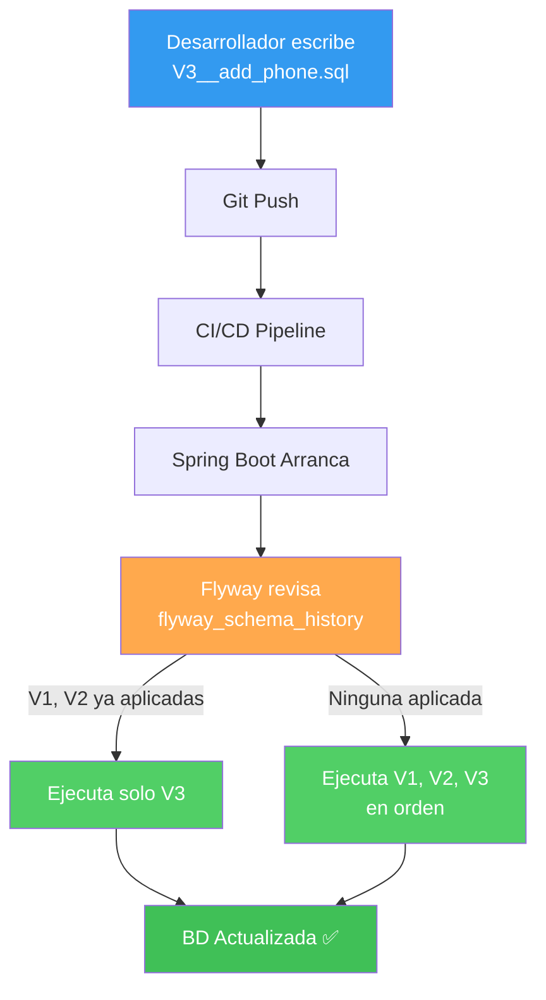

## 08 — Migraciones de Base de Datos (Flyway y Liquibase)

### Propósito
Aprender a versionar y gestionar los cambios del esquema de base de datos de forma controlada, reproducible y segura usando Flyway y Liquibase. Esto garantiza que todos los entornos (desarrollo, staging, producción) tengan exactamente la misma estructura de base de datos.

### Problema que resuelve
Sin migraciones, los desarrolladores modifican la base de datos manualmente (ejecutando SQL en consola) o confían en `hibernate.ddl-auto=update`, lo que genera:
- **Inconsistencias entre entornos**: La BD de desarrollo no coincide con producción.
- **Pérdida de datos**: Un `ALTER TABLE` mal ejecutado puede borrar columnas con datos reales.
- **Imposibilidad de rollback**: No hay historial de qué cambios se hicieron ni cuándo.
- **Conflictos en equipo**: Dos desarrolladores modifican la misma tabla sin coordinarse.

### Cómo lo resuelve
Las herramientas de migración tratan los cambios de esquema como **código versionado**:
- Cada cambio se escribe en un archivo SQL numerado (`V1__create_users.sql`, `V2__add_email_column.sql`).
- La herramienta mantiene una **tabla de historial** (`flyway_schema_history`) que registra qué migraciones ya se aplicaron.
- Al arrancar la aplicación, Spring Boot ejecuta automáticamente solo las migraciones **pendientes**.
- Si algo falla, la migración se detiene y no corrompe el esquema parcialmente.

### Por qué aprenderlo
En **todas las empresas serias**, las bases de datos en producción se gestionan con Flyway o Liquibase. Nunca se usa `ddl-auto=update` en producción. Es una práctica tan fundamental como usar Git para el código fuente: si no versionas tu esquema de BD, tarde o temprano tendrás un incidente crítico.



---

### Glosario Básico

#### `Flyway`
Herramienta de migración de base de datos basada en archivos SQL con convención de nombres estricta. Es la opción más popular en el ecosistema Spring Boot.
```xml
<dependency>
    <groupId>org.flywaydb</groupId>
    <artifactId>flyway-core</artifactId>
</dependency>
```

#### `V1__nombre_descriptivo.sql`
Convención de nombrado de Flyway. La `V` indica versión, el número es secuencial, los dos guiones bajos `__` separan la versión del nombre descriptivo.
```
V1__create_users_table.sql
V2__add_email_to_users.sql
V3__create_orders_table.sql
```

#### `flyway_schema_history`
Tabla creada automáticamente por Flyway donde registra cada migración aplicada: versión, descripción, checksum, fecha y si fue exitosa.

#### `Liquibase`
Alternativa a Flyway que usa archivos XML, YAML, JSON o SQL. Permite mayor flexibilidad (como rollbacks automáticos) pero es más verboso.

#### `hibernate.ddl-auto`
Propiedad de Hibernate que controla si el esquema se crea/actualiza automáticamente. Los valores son: `none`, `validate`, `update`, `create`, `create-drop`.
```yaml
spring:
  jpa:
    hibernate:
      ddl-auto: validate  # En producción: SOLO validar, NUNCA update/create
```

---

### Conceptos

#### 1. ¿Por qué nunca usar `ddl-auto=update` en producción?
- **Qué es** — `ddl-auto=update` le dice a Hibernate que compare tus `@Entity` con las tablas existentes y aplique cambios automáticamente (agregar columnas, crear tablas). Suena cómodo, pero es extremadamente peligroso en producción.
- **Por qué importa** — Hibernate no puede:
  - Renombrar columnas (crea una nueva y deja la vieja con datos).
  - Eliminar columnas obsoletas (acumula basura en la BD).
  - Migrar datos entre columnas.
  - Gestionar índices complejos ni constraints específicos.
  - Ejecutar scripts de datos (`INSERT` iniciales).
- **Código** — Configuración correcta por entorno:
  ```yaml
  # application-dev.yml (Desarrollo)
  spring:
    jpa:
      hibernate:
        ddl-auto: create-drop  # Recrea la BD cada vez (solo desarrollo)
      show-sql: true

  # application-prod.yml (Producción)
  spring:
    jpa:
      hibernate:
        ddl-auto: validate  # Solo verifica que el esquema coincida
    flyway:
      enabled: true  # Flyway gestiona los cambios
  ```
- **Analogía** — Es como dejar que un robot reorganice tu armario cada vez que compras ropa nueva. Puede que ponga la camisa en el lugar correcto, pero también puede tirar calcetines que cree que sobran. En producción, quieres un inventario controlado (Flyway), no un robot con iniciativa.
- **Casos de Uso Empresariales** — En entornos con bases de datos compartidas entre equipos (microservicios accediendo a la misma BD), el control de versiones del esquema es obligatorio para evitar que un equipo rompa las tablas de otro.

#### 2. Flyway: Configuración y Primeras Migraciones
- **Qué es** — Flyway se integra automáticamente con Spring Boot. Solo necesitas agregar la dependencia y crear los archivos SQL en la carpeta correcta.
- **Por qué importa** — La convención sobre configuración de Spring Boot hace que Flyway funcione "out of the box" sin XML ni configuración adicional.
- **Código** — Estructura completa:
  ```
  src/main/resources/
  └── db/
      └── migration/
          ├── V1__create_users_table.sql
          ├── V2__create_orders_table.sql
          └── V3__add_status_to_orders.sql
  ```
  ```sql
  -- V1__create_users_table.sql
  -- Migración inicial: crea la tabla de usuarios
  CREATE TABLE users (
      id         BIGINT AUTO_INCREMENT PRIMARY KEY,
      username   VARCHAR(50)  NOT NULL UNIQUE,
      email      VARCHAR(100) NOT NULL UNIQUE,
      password   VARCHAR(255) NOT NULL,
      created_at TIMESTAMP    NOT NULL DEFAULT CURRENT_TIMESTAMP,
      updated_at TIMESTAMP    NOT NULL DEFAULT CURRENT_TIMESTAMP
  );

  -- Índice para búsquedas frecuentes por email
  CREATE INDEX idx_users_email ON users(email);
  ```
  ```sql
  -- V2__create_orders_table.sql
  -- Segunda migración: crea la tabla de pedidos con FK a users
  CREATE TABLE orders (
      id         BIGINT AUTO_INCREMENT PRIMARY KEY,
      user_id    BIGINT       NOT NULL,
      product    VARCHAR(255) NOT NULL,
      quantity   INT          NOT NULL DEFAULT 1,
      total      DECIMAL(10,2) NOT NULL,
      status     VARCHAR(20)  NOT NULL DEFAULT 'PENDING',
      created_at TIMESTAMP    NOT NULL DEFAULT CURRENT_TIMESTAMP,
      
      -- Foreign Key: cada pedido pertenece a un usuario
      CONSTRAINT fk_orders_user FOREIGN KEY (user_id) REFERENCES users(id)
  );
  ```
  ```sql
  -- V3__add_status_to_orders.sql
  -- Tercera migración: agregar datos iniciales (seed data)
  INSERT INTO users (username, email, password) VALUES
      ('admin', 'admin@empresa.com', '$2a$10$hashedPasswordHere'),
      ('demo',  'demo@empresa.com',  '$2a$10$hashedPasswordHere');
  ```
- **Analogía** — Flyway es como un libro de contabilidad. Cada transacción (migración) se registra en orden cronológico. No puedes borrar una entrada del libro, solo agregar nuevas. Si alguien nuevo llega a la empresa, puede "reproducir" todo el historial desde cero.
- **Casos de Uso Empresariales** — Equipos con pipelines CI/CD donde cada deploy aplica automáticamente las migraciones pendientes antes de arrancar la aplicación.

#### 3. Reglas de Oro de Flyway
- **Qué es** — Un conjunto de reglas que NUNCA debes violar al trabajar con Flyway en equipo.
- **Por qué importa** — Romper estas reglas causa errores de checksum que bloquean el arranque de la aplicación.
- **Las reglas**:
  1. **NUNCA modifiques una migración ya aplicada.** Si `V1__create_users.sql` ya se ejecutó, no puedes cambiar ni una coma. Flyway calcula un checksum (hash) del archivo y si cambia, la aplicación no arranca.
  2. **NUNCA borres una migración.** Flyway espera que el archivo exista porque lo tiene registrado en su historial.
  3. **SIEMPRE usa números secuenciales.** `V1`, `V2`, `V3`... nunca saltes números ni repitas.
  4. **NUNCA uses `ddl-auto=update` junto con Flyway.** Son mutuamente excluyentes. Usa `ddl-auto=validate` o `none`.
  5. **USA nombres descriptivos.** `V5__add_phone_column_to_users.sql` es mejor que `V5__fix.sql`.
- **Código** — Error típico cuando se modifica una migración aplicada:
  ```
  FlywayException: Validate failed: 
  Migration checksum mismatch for migration version 1
  -> Applied to database: 1234567890
  -> Resolved locally:    9876543210
  ```
  **Solución**: Nunca edites el archivo. Crea una nueva migración `V4__fix_error_in_users.sql`.
- **Analogía** — Es como la blockchain: los bloques anteriores son inmutables. Solo puedes añadir nuevos bloques al final de la cadena.

#### 4. Liquibase: La Alternativa con Rollback
- **Qué es** — Liquibase es una alternativa a Flyway que usa un enfoque basado en "changesets" en XML/YAML. Su gran ventaja es el soporte nativo para **rollback** (deshacer cambios).
- **Por qué importa** — En entornos enterprise donde los rollbacks son obligatorios por política de la empresa, Liquibase es la opción preferida.
- **Código** — Ejemplo de changelog en YAML:
  ```yaml
  # db/changelog/db.changelog-master.yaml
  databaseChangeLog:
    - changeSet:
        id: 1
        author: edgardo
        changes:
          - createTable:
              tableName: users
              columns:
                - column:
                    name: id
                    type: BIGINT
                    autoIncrement: true
                    constraints:
                      primaryKey: true
                - column:
                    name: email
                    type: VARCHAR(100)
                    constraints:
                      nullable: false
                      unique: true
        rollback:
          - dropTable:
              tableName: users
  ```
- **Analogía** — Si Flyway es un libro de contabilidad unidireccional, Liquibase es como un procesador de texto con "Ctrl+Z" (Deshacer). Cada cambio tiene instrucciones de cómo revertirse.
- **Casos de Uso Empresariales** — Bancos y aseguradoras donde regulaciones exigen la capacidad de revertir cualquier cambio en la base de datos sin pérdida de datos.

#### 5. Edge Cases y Errores Comunes

| Error | Causa | Solución |
|-------|-------|----------|
| `FlywayException: Found non-empty schema without schema history table` | Flyway encuentra tablas existentes pero sin `flyway_schema_history` | Usa `spring.flyway.baseline-on-migrate=true` para crear el baseline |
| `Checksum mismatch` | Se editó una migración ya ejecutada | Nunca editar archivos aplicados. Crea uno nuevo con la corrección. |
| `Migration V2 not found` | Alguien borró un archivo de migración del proyecto | Recupera el archivo de Git. Nunca borres migraciones. |
| Conflicto de versiones en equipo | Dos developers crean `V5__...sql` al mismo tiempo | Usen timestamps en vez de versiones: `V20250710_1430__add_column.sql` |
| `ddl-auto=update` + Flyway | Hibernate y Flyway compiten por modificar el esquema | Usa `ddl-auto=validate` o `ddl-auto=none` con Flyway |

---

### Ejercicios
1. Agrega la dependencia `flyway-core` a tu `pom.xml` y crea tres migraciones: `V1__create_products.sql`, `V2__add_price_column.sql`, `V3__insert_sample_data.sql`.
2. Ejecuta la aplicación y verifica que la tabla `flyway_schema_history` se creó automáticamente con las 3 entradas.
3. Intenta modificar `V1` después de ejecutarlo. Observa el error de checksum y crea una `V4` para corregirlo.
4. Configura `application-dev.yml` con `ddl-auto: create-drop` y `application-prod.yml` con `ddl-auto: validate` + Flyway habilitado.
5. **(Avanzado)** Configura Liquibase como alternativa: crea un `db.changelog-master.yaml` con un changeset que cree una tabla y defina su rollback.

### Cómo ejecutar
```bash
cd 08-migraciones-bd
mvn spring-boot:run

# Para verificar las migraciones aplicadas:
# Accede a http://localhost:8080/h2-console
# Consulta: SELECT * FROM flyway_schema_history;
```

### Archivos del Proyecto
| Archivo | Propósito |
|---------|-----------|
| `pom.xml` | Dependencias: `spring-boot-starter-data-jpa`, `flyway-core`, `h2`. |
| `application.yml` | Configuración del DataSource y Flyway. |
| `application-dev.yml` | Perfil desarrollo con H2 y `ddl-auto: create-drop`. |
| `application-prod.yml` | Perfil producción con `ddl-auto: validate` + Flyway. |
| `db/migration/V1__create_users.sql` | Primera migración: tabla de usuarios. |
| `db/migration/V2__create_orders.sql` | Segunda migración: tabla de pedidos con FK. |
| `db/migration/V3__seed_data.sql` | Tercera migración: datos iniciales. |
| `domain/User.java` | Entidad JPA que mapea a la tabla `users`. |
| `domain/Order.java` | Entidad JPA que mapea a la tabla `orders`. |
| `repository/UserRepository.java` | Repositorio JPA para consultas de usuarios. |

---

### Antes vs Ahora

#### Antes (SQL manual / `ddl-auto=update`)
- El DBA (o el desarrollador) ejecutaba manualmente `ALTER TABLE` en cada entorno.
- No existía historial: nadie sabía si `staging` tenía el mismo esquema que `prod`.
- Si un desarrollador olvidaba correr un script, la aplicación reventaba en runtime con `Column not found`.
- Los rollbacks eran manuales, propensos a error y muchas veces destruían datos.
- Con `ddl-auto=update`, Hibernate agregaba columnas silenciosamente pero jamas las eliminaba ni renombraba: la BD se llenaba de basura.

```sql
-- Flujo tipico "antes"
-- Lunes: DBA en dev
ALTER TABLE authors ADD COLUMN bio VARCHAR(500);
-- Miercoles: alguien olvida correrlo en staging -> boom
```

#### Ahora (Flyway versionado)
- Cada cambio vive como archivo `V*.sql` en `src/main/resources/db/migration/`.
- Al arrancar, Spring Boot invoca Flyway automaticamente: aplica solo lo pendiente.
- La tabla `flyway_schema_history` documenta version, checksum, fecha y usuario.
- El esquema queda 100% reproducible: `git clone` + `mvn spring-boot:run` = misma BD que en produccion.
- `ddl-auto=validate` garantiza que las entidades JPA calzan con las tablas creadas por Flyway.

```
src/main/resources/db/migration/
├── V1__create_authors.sql   (crea tabla authors)
├── V2__create_books.sql     (crea tabla books + FK)
└── V3__seed_data.sql        (inserta 2 autores + 3 libros)
```

Este modulo demuestra el flujo completo: Flyway crea el esquema, JPA lo valida, los repositorios lo consultan y el controller lo expone en `GET /api/authors`.

---

### FAQ Alumno

**P: ¿Por que `ddl-auto: validate` y no `none`?**
R: `validate` verifica al arrancar que las columnas/tipos de tus `@Entity` coinciden con las tablas reales. Es una red de seguridad barata que detecta el drift entre codigo y esquema. `none` no valida nada.

**P: Cambie `V1__create_authors.sql` y ahora no arranca. ¿Que hago?**
R: Nunca edites migraciones aplicadas. Flyway calcula un checksum y si cambia, aborta. La solucion correcta es crear una `V4__fix_authors_column.sql` con el `ALTER TABLE` necesario. En desarrollo local extremo puedes borrar la BD H2 (`rm -rf` del archivo) y dejar que Flyway reaplique todo.

**P: ¿Como veo la tabla `flyway_schema_history`?**
R: Con la app corriendo, abre http://localhost:8080/h2-console, usa la URL `jdbc:h2:mem:migrationsdb`, usuario `sa`, sin password. Ejecuta `SELECT * FROM flyway_schema_history;`.

**P: ¿Por que `H2` en memoria y no PostgreSQL?**
R: Para el modulo educativo. En produccion apuntarias `spring.datasource.url` a Postgres/MySQL y Flyway se comporta identico, solo cambian las sentencias SQL propias del motor.

**P: ¿Flyway reemplaza a Hibernate?**
R: No. Son complementarios: Flyway maneja el DDL (estructura), Hibernate maneja el DML (insert/update/select desde tus entidades). Nunca uses `ddl-auto=update` junto a Flyway: se pelean.

**P: ¿Los tests corren Flyway?**
R: Si. `@SpringBootTest` levanta el contexto completo, Flyway ejecuta V1-V3 sobre la H2 en memoria y los tests ven los 2 autores del seed.

**P: ¿Que pasa si dos devs crean `V4__...sql` al mismo tiempo en ramas distintas?**
R: Al hacer merge Flyway aplicara ambos en orden alfabetico de nombre, pero es fragil. Convencion recomendada: usar timestamps (`V20260710_1430__add_isbn.sql`) para evitar colisiones.

---

### Ejecutar los tests
```bash
cd 08-migraciones-bd
./build.sh          # Linux/Mac
.\build.ps1         # Windows PowerShell
```
Genera `target/migraciones-bd-1.0.0.jar` tras `mvn clean verify`.
