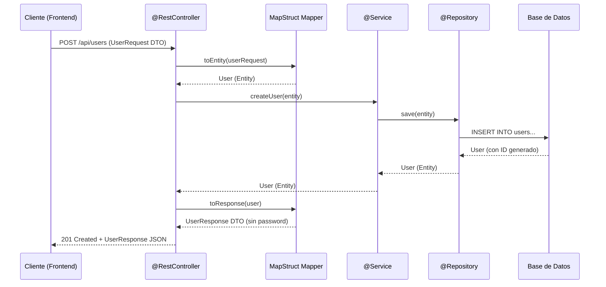

## 09 — Mapeo de DTOs con MapStruct

### Propósito
Aprender a separar las entidades de base de datos (JPA) de los objetos que se exponen en la API REST (DTOs) usando MapStruct para automatizar el mapeo entre ambos. Esto elimina el código repetitivo de conversión manual y previene la exposición accidental de datos sensibles.

### Problema que resuelve
Cuando expones directamente tus `@Entity` en los endpoints REST, enfrentas múltiples problemas graves:
- **Exposición de datos sensibles**: El campo `password` o `internalNotes` se envía al frontend por accidente.
- **Recursión infinita en JSON**: Una relación `@OneToMany` bidireccional genera un JSON infinito (`User → Orders → User → Orders...`).
- **Acoplamiento BD-API**: Un cambio en la tabla de la BD automáticamente rompe la API pública.
- **LazyInitializationException**: Hibernate intenta cargar relaciones lazy fuera de la transacción al serializar a JSON.

### Cómo lo resuelve
La arquitectura en capas dicta que cada capa tenga sus propios objetos:
- **Entity** → Representa la tabla de la BD. Solo el `@Repository` la conoce.
- **DTO (Data Transfer Object)** → Es lo que entra y sale de la API REST. Solo contiene los campos que el cliente necesita.
- **MapStruct** → Genera automáticamente el código de conversión Entity ↔ DTO en tiempo de compilación. Cero reflexión, cero rendimiento perdido.

### Por qué aprenderlo
En el 100% de los proyectos empresariales serios, las entidades JPA **nunca** se exponen directamente. MapStruct es la herramienta estándar de la industria para el mapeo, usada por empresas como Netflix, Amazon y bancos europeos. Es más seguro, más rápido y más mantenible que la conversión manual.



---

### Glosario Básico

#### `DTO (Data Transfer Object)`
Un objeto cuyo único propósito es transportar datos entre capas. No tiene lógica de negocio. En Java moderno, se implementa como un `record`.
```java
// DTO de respuesta: solo los datos que el cliente necesita ver
public record UserResponse(Long id, String username, String email) { }

// DTO de petición: solo los datos que el cliente debe enviar
public record UserRequest(String username, String email, String password) { }
```

#### `MapStruct`
Un procesador de anotaciones que genera implementaciones de mappers (convertidores) en tiempo de compilación. No usa reflexión, es type-safe y extremadamente rápido.
```xml
<dependency>
    <groupId>org.mapstruct</groupId>
    <artifactId>mapstruct</artifactId>
    <version>1.6.3</version>
</dependency>
```

#### `@Mapper`
Anotación de MapStruct que marca una interfaz como un convertidor. Spring la registra como un Bean que puedes inyectar.
```java
@Mapper(componentModel = "spring")
public interface UserMapper {
    UserResponse toResponse(User entity);
    User toEntity(UserRequest dto);
}
```

---

### Conceptos

#### 1. ¿Por qué nunca exponer @Entity en REST?
- **Qué es** — El antipatrón más común en proyectos Spring Junior: devolver directamente la entidad JPA desde el `@RestController`.
- **Por qué importa** — Viola el principio de separación de responsabilidades y crea bugs graves en producción:
  - El `password` se serializa en el JSON de respuesta.
  - Las relaciones `@OneToMany` causan recursión infinita o `LazyInitializationException`.
  - Cualquier cambio en la tabla rompe el contrato de la API.
- **Código** — Ejemplo del antipatrón vs. la solución correcta:
  ```java
  // ❌ INCORRECTO: Expone la entidad directamente
  @GetMapping("/users/{id}")
  public User getUser(@PathVariable Long id) {
      return userRepository.findById(id).orElseThrow(); // ¡Envía password al frontend!
  }
  
  // ✅ CORRECTO: Usa un DTO de respuesta
  @GetMapping("/users/{id}")
  public UserResponse getUser(@PathVariable Long id) {
      User user = userService.findById(id);
      return userMapper.toResponse(user); // Solo envía id, username, email
  }
  ```
- **Analogía** — Exponer la entidad es como entregar tu expediente médico completo cuando solo te piden tu nombre y tipo de sangre. El DTO es el formulario simplificado que solo contiene lo necesario.
- **Casos de Uso Empresariales** — En sistemas bancarios, la entidad `CuentaBancaria` tiene campos como `saldo_interno`, `score_crediticio` y `notas_del_analista` que jamás deben aparecer en la API pública.

#### 2. Records como DTOs inmutables
- **Qué es** — Java `record` es la forma moderna y concisa de crear DTOs. Un record es inmutable por diseño: una vez creado, sus datos no pueden cambiar.
- **Por qué importa** — Elimina decenas de líneas de boilerplate (`getters`, `setters`, `equals`, `hashCode`, `toString`) y garantiza la inmutabilidad.
- **Código** — DTO completo con validación:
  ```java
  /**
   * DTO de entrada para crear un usuario.
   * Cada campo tiene validaciones que Spring ejecutará automáticamente
   * cuando se combine con @Valid en el Controller.
   */
  public record CreateUserRequest(
      @NotBlank(message = "El nombre de usuario es obligatorio")
      @Size(min = 3, max = 50, message = "El nombre debe tener entre 3 y 50 caracteres")
      String username,
      
      @NotBlank(message = "El email es obligatorio")
      @Email(message = "El formato del email es inválido")
      String email,
      
      @NotBlank(message = "La contraseña es obligatoria")
      @Size(min = 8, message = "La contraseña debe tener al menos 8 caracteres")
      String password
  ) { }
  
  /**
   * DTO de salida para respuestas de usuario.
   * Nota: NO incluye el campo "password" — nunca lo devolvemos al cliente.
   */
  public record UserResponse(
      Long id,
      String username,
      String email,
      LocalDateTime createdAt
  ) { }
  ```
- **Analogía** — Un `record` es como una tarjeta postal ya sellada: tiene información escrita (campos), pero una vez que se envía (se crea), no puedes borrar ni cambiar lo que dice.

#### 3. MapStruct: Configuración Completa
- **Qué es** — MapStruct es un generador de código que crea la implementación de los mappers en tiempo de compilación. Al compilar (`mvn compile`), MapStruct lee tus interfaces anotadas con `@Mapper` y genera clases Java (`UserMapperImpl.java`) que realizan las conversiones.
- **Por qué importa** — A diferencia de otras herramientas como ModelMapper (que usa reflexión en runtime), MapStruct:
  - **No tiene impacto en rendimiento** (el código ya está compilado).
  - **Es type-safe**: errores de mapeo se detectan en compilación, no en producción.
  - **Es depurable**: puedes abrir `UserMapperImpl.java` y ver exactamente qué hace.
- **Código** — Configuración Maven completa:
  ```xml
  <!-- pom.xml -->
  <properties>
      <mapstruct.version>1.6.3</mapstruct.version>
      <lombok-mapstruct.version>0.2.0</lombok-mapstruct.version>
  </properties>

  <dependencies>
      <dependency>
          <groupId>org.mapstruct</groupId>
          <artifactId>mapstruct</artifactId>
          <version>${mapstruct.version}</version>
      </dependency>
  </dependencies>
  
  <build>
      <plugins>
          <plugin>
              <groupId>org.apache.maven.plugins</groupId>
              <artifactId>maven-compiler-plugin</artifactId>
              <configuration>
                  <annotationProcessorPaths>
                      <!-- MapStruct processor -->
                      <path>
                          <groupId>org.mapstruct</groupId>
                          <artifactId>mapstruct-processor</artifactId>
                          <version>${mapstruct.version}</version>
                      </path>
                      <!-- Si usas Lombok, este binding es obligatorio -->
                      <path>
                          <groupId>org.projectlombok</groupId>
                          <artifactId>lombok-mapstruct-binding</artifactId>
                          <version>${lombok-mapstruct.version}</version>
                      </path>
                  </annotationProcessorPaths>
              </configuration>
          </plugin>
      </plugins>
  </build>
  ```
  
  Interfaz del Mapper:
  ```java
  /**
   * MapStruct Mapper para convertir entre User (Entity) y sus DTOs.
   * 
   * componentModel = "spring" → MapStruct registra la implementación
   * como un @Component de Spring, permitiendo inyección por constructor.
   */
  @Mapper(componentModel = "spring")
  public interface UserMapper {
  
      // Entity → DTO de respuesta
      UserResponse toResponse(User user);
  
      // DTO de creación → Entity
      // @Mapping ignora el campo 'id' porque se genera automáticamente en la BD
      @Mapping(target = "id", ignore = true)
      @Mapping(target = "createdAt", ignore = true)
      User toEntity(CreateUserRequest request);
      
      // Convierte una lista completa de entidades a DTOs
      List<UserResponse> toResponseList(List<User> users);
  }
  ```
- **Analogía** — MapStruct es como un traductor simultáneo que ya memorizó el diccionario antes de la conferencia (compilación). No necesita buscar palabras durante la traducción en vivo (runtime), por eso es instantáneo.

#### 4. Mapeos Personalizados y Campos con Nombres Diferentes
- **Qué es** — Cuando los nombres de los campos de la Entity y el DTO no coinciden, o cuando necesitas transformar datos durante el mapeo.
- **Por qué importa** — En proyectos reales, la BD puede tener `first_name` pero el DTO necesita `nombre` o `fullName`.
- **Código** — Mapeos avanzados:
  ```java
  @Mapper(componentModel = "spring")
  public interface OrderMapper {
  
      // Mapear campos con nombres diferentes
      @Mapping(source = "user.username", target = "customerName")
      @Mapping(source = "createdAt", target = "orderDate", dateFormat = "dd/MM/yyyy")
      @Mapping(target = "totalFormatted", expression = "java(\"$\" + order.getTotal())")
      OrderResponse toResponse(Order order);
  
      // Mapeo inverso ignorando campos auto-generados
      @Mapping(target = "id", ignore = true)
      @Mapping(target = "status", constant = "PENDING")
      @Mapping(target = "createdAt", expression = "java(java.time.LocalDateTime.now())")
      Order toEntity(CreateOrderRequest request);
  }
  ```
- **Analogía** — Es como un formulario de aduana. El pasaporte dice "Given Name" pero el formulario del país de destino dice "Nombre de Pila". El mapper sabe que ambos campos representan lo mismo.

#### 5. Edge Cases y Errores Comunes

| Error | Causa | Solución |
|-------|-------|----------|
| `MapperImpl` no se genera | Falta el `mapstruct-processor` en `annotationProcessorPaths` | Verificar `pom.xml` y ejecutar `mvn clean compile` |
| Campos `null` en el DTO | Los nombres de Entity y DTO no coinciden | Usar `@Mapping(source="x", target="y")` explícitamente |
| Lombok + MapStruct no funciona | Falta el `lombok-mapstruct-binding` | Agregar la dependencia de binding en el compiler plugin |
| `No implementation was created for Mapper` | El `componentModel` no es `"spring"` | Verificar `@Mapper(componentModel = "spring")` |
| Recursión infinita Entity → DTO | Relación bidireccional `User → Orders → User` | Crear DTOs separados sin las relaciones circulares |

---

### Antes vs Ahora (Java 8 → Java 21 + MapStruct)

Tabla comparativa aplicada al mapeo Entity ↔ DTO de este módulo.

| Aspecto | ANTES (Java 8, mapeo manual) | AHORA (Java 21 + MapStruct 1.6) |
|---------|------------------------------|---------------------------------|
| Definición del DTO | `public class EmployeeResponse { private Long id; ... 8 getters + 8 setters + equals + hashCode + toString }` | `public record EmployeeResponse(Long id, String fullName, BigDecimal salary, LocalDate hireDate) { }` |
| Mutabilidad | DTO mutable (cualquiera puede llamar `setSalary(...)`) | `record` inmutable por diseño |
| Código de conversión Entity → DTO | 5+ líneas escritas a mano por método, un método por dirección | Una interfaz + una anotación `@Mapping`; MapStruct genera `EmployeeMapperImpl` en `target/generated-sources` |
| Concatenar `fullName` | `r.setFullName(e.getFirstName() + " " + e.getLastName());` disperso en el controller | `@Mapping(target="fullName", expression="java(e.getFirstName()+\" \"+e.getLastName())")` centralizado en el mapper |
| Ocultar campos sensibles | Recordar NO copiar `internalNotes` en cada mapper (frágil) | El DTO simplemente no declara `internalNotes` → físicamente imposible que salga |
| Rendimiento | Reflexión (ModelMapper) o código manual | Código Java plano generado en compile-time, cero reflexión |
| Detección de errores | En producción (`NullPointerException`) | En compilación (`unmappedTargetPolicy=ERROR` falla el build) |
| Inyección | `@Autowired` en campo | Constructor injection con `final` (más testable, sin dependencia de Spring en el mapper generado) |
| Dinero | `double salary` (errores de redondeo) | `BigDecimal salary` (precisión exacta, obligatorio para plata) |
| Fecha | `java.util.Date hireDate` (con zona horaria implícita) | `java.time.LocalDate hireDate` (thread-safe, sin zona horaria) |
| Iteración lista | `for(Employee e : list){ out.add(mapper.toResponse(e)); }` | `list.stream().map(mapper::toResponse).toList()` |

### FAQ del Alumno

- **¿Qué es MapStruct exactamente?** Es un procesador de anotaciones. Al compilar el proyecto, mira las interfaces anotadas con `@Mapper` y genera automáticamente una clase Java que las implementa. Después de `mvn compile`, puedes ver el archivo generado en `target/generated-sources/annotations/com/springroadmap/dtos/mapper/EmployeeMapperImpl.java`.
- **¿Dónde está la implementación de `EmployeeMapper`? Solo veo la interfaz.** MapStruct la genera en tiempo de compilación. No la escribes tú. Spring la registra como `@Component` porque el mapper usa `componentModel = "spring"`.
- **¿Qué es un `record`?** Una clase especial de Java 14+ diseñada para transportar datos. Genera automáticamente el constructor, los accessors (nota: `response.fullName()`, sin el prefijo `get`), `equals`, `hashCode` y `toString`. Es inmutable: una vez creado no se puede modificar.
- **¿Por qué la Entity no es un record?** JPA/Hibernate necesita un constructor sin argumentos y setters para instanciar la entidad al leer filas de la base de datos. Los records son inmutables, así que no sirven como Entity.
- **¿Por qué no expongo la Entity directamente en el REST?** Porque contiene datos sensibles (`internalNotes`), porque un cambio en la BD rompería el contrato del API, y porque las relaciones lazy explotarían al serializar a JSON. El DTO es un contrato limpio y estable.
- **¿Qué diferencia hay entre `EmployeeRequest` y `EmployeeResponse`?** El primero es lo que ENTRA (POST). No tiene `id` (lo genera la BD) ni `internalNotes` (el cliente no puede escribirlo). El segundo es lo que SALE (GET/POST response). Tiene `id` y `fullName` concatenado, pero no `internalNotes`.
- **¿Qué hace `expression = "java(...)"` en `@Mapping`?** Le dice a MapStruct que en lugar de copiar un campo por nombre, ejecute ese fragmento de código Java para calcular el valor. Aquí lo usamos para concatenar `firstName + " " + lastName`.
- **¿Qué es `annotationProcessorPaths` en el `pom.xml`?** Es la sección donde le decimos a `javac` qué procesadores de anotaciones debe ejecutar durante la compilación. Sin esto, MapStruct no se activa y la implementación no se genera.
- **¿Por qué mis campos salen `null` después de mapear?** Casi siempre porque los nombres de campo no coinciden entre origen y destino. Solución: usa `@Mapping(source="a", target="b")` para hacer el mapeo explícito. Con `unmappedTargetPolicy=ERROR` el compilador te avisa.
- **¿Puedo usar Lombok junto con MapStruct?** Sí, pero necesitas agregar `lombok-mapstruct-binding` en `annotationProcessorPaths` para que ambos procesadores cooperen. En este módulo NO usamos Lombok (regla del roadmap: constructor injection sin Lombok).
- **¿Cómo pruebo el mapper sin arrancar Spring?** Usando `Mappers.getMapper(EmployeeMapper.class)`. Devuelve una instancia de la implementación generada, sin necesidad de contexto Spring. Ideal para tests unitarios rápidos.

### Ejercicios
1. Crea una Entity `Product` con campos `id`, `name`, `price`, `internalCost`, `supplier`. Crea un DTO `ProductResponse` que **no incluya** `internalCost` ni `supplier`.
2. Implementa un `ProductMapper` con MapStruct que convierta `Product → ProductResponse`.
3. Crea un `CreateProductRequest` record con validaciones (`@NotBlank`, `@Positive`) y mapéalo a `Product` usando `@Mapping(target = "id", ignore = true)`.
4. Implementa un endpoint `GET /api/products` que devuelva una lista de `ProductResponse` usando el mapper.
5. **(Avanzado)** Crea un mapeo personalizado donde `Product.price` se convierta a `ProductResponse.priceFormatted` como `"$12.99"`.

### Cómo ejecutar
```bash
cd 09-mapeo-dtos-mapstruct

# Opción 1: script portable (usa JDK 21 y Maven 3.9.16 de la raíz del roadmap)
./build.sh          # Git Bash
# .\build.ps1       # PowerShell

# Verificar que MapStruct generó la implementación:
ls target/generated-sources/annotations/com/springroadmap/dtos/mapper/EmployeeMapperImpl.java

# Ejecutar el JAR ejecutable resultante
java -jar target/mapeo-dtos-mapstruct-1.0.0.jar

# Probar endpoints
curl -X POST http://localhost:8080/api/employees \
     -H "Content-Type: application/json" \
     -d '{"firstName":"Ada","lastName":"Lovelace","salary":1500.00,"hireDate":"2024-01-15"}'

curl http://localhost:8080/api/employees
curl http://localhost:8080/api/employees/1
```

### Archivos del Proyecto
| Archivo | Propósito |
|---------|-----------|
| `pom.xml` | Dependencias: `mapstruct`, `mapstruct-processor`, `lombok-mapstruct-binding`. |
| `domain/User.java` | Entidad JPA con todos los campos de la BD. |
| `domain/Order.java` | Entidad JPA con relación `@ManyToOne` a User. |
| `dto/CreateUserRequest.java` | Record DTO de entrada con validaciones. |
| `dto/UserResponse.java` | Record DTO de salida (sin password). |
| `dto/OrderResponse.java` | Record DTO con campos mapeados personalizados. |
| `mapper/UserMapper.java` | Interfaz MapStruct para conversión User ↔ DTOs. |
| `mapper/OrderMapper.java` | Interfaz MapStruct con `@Mapping` personalizados. |
| `controller/UserController.java` | Endpoints REST que usan los DTOs y mappers. |
| `service/UserService.java` | Lógica de negocio que trabaja con Entities internamente. |
