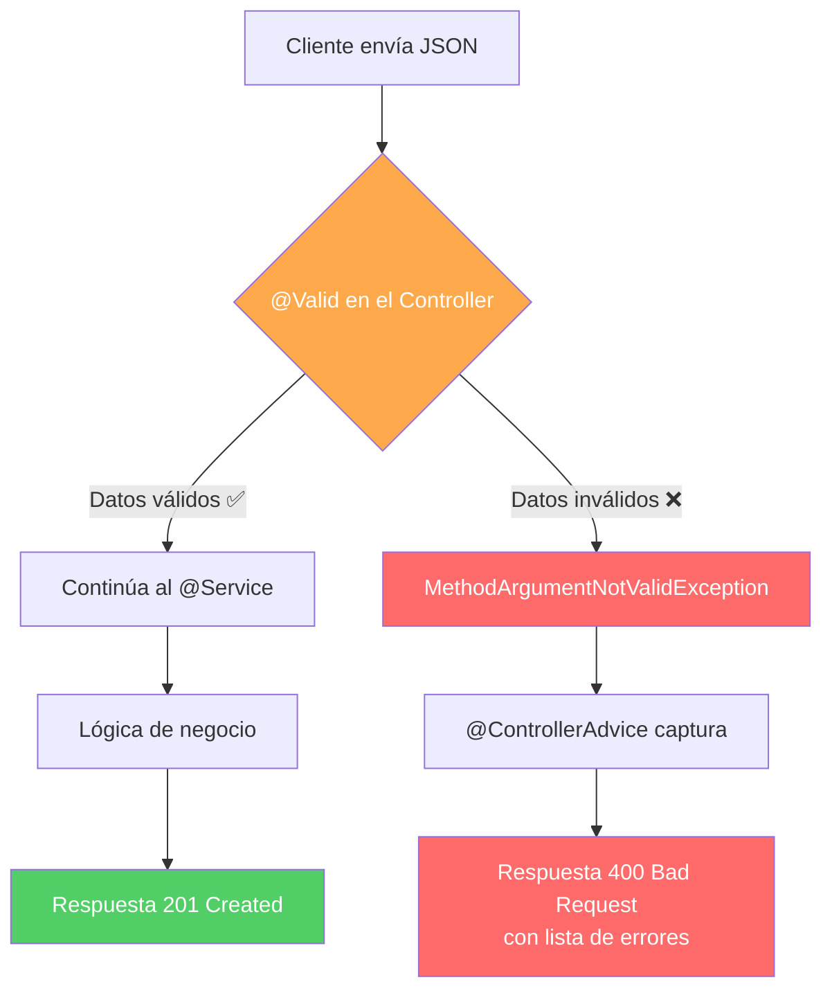

## 10 — Validación de Datos (Bean Validation)

### Propósito
Aprender a validar automáticamente los datos que llegan a tu API REST usando Bean Validation (Jakarta Validation). Spring rechazará las peticiones inválidas **antes** de que lleguen a tu lógica de negocio, devolviendo mensajes de error claros y códigos HTTP correctos.

### Problema que resuelve
Sin validación, cualquier dato entra a tu sistema sin control:
- Un usuario envía un email con formato `"pepito"` (sin @).
- Un pedido llega con `cantidad: -5` o `precio: 0`.
- Un campo obligatorio como `nombre` llega como `null` o vacío.
- Un atacante envía payloads con campos de 100,000 caracteres provocando un `OutOfMemoryError`.

Si estos datos llegan al `@Service` o peor, a la base de datos, tu aplicación tendrá datos corruptos, errores inesperados y potenciales vulnerabilidades de seguridad.

### Cómo lo resuelve
Spring integra Bean Validation (Hibernate Validator) para validar automáticamente los DTOs de entrada:
1. Anotas los campos del DTO con restricciones (`@NotBlank`, `@Email`, `@Size`, `@Min`).
2. Pones `@Valid` antes del `@RequestBody` en el Controller.
3. Si la validación falla, Spring lanza `MethodArgumentNotValidException` automáticamente.
4. Un `@ControllerAdvice` global captura la excepción y devuelve un JSON limpio con los errores.

### Por qué aprenderlo
La validación de datos es la **primera línea de defensa** de tu aplicación. En empresas, todos los endpoints reciben datos validados antes de procesarlos. Es un requisito de seguridad (OWASP) y de calidad de datos. Sin esto, tu API está desnuda ante datos malformados o ataques.



---

### Glosario Básico

#### `@Valid`
Anotación que activa la validación automática de un objeto. Se coloca antes de `@RequestBody` en el Controller.
```java
@PostMapping("/users")
public ResponseEntity<UserResponse> create(@Valid @RequestBody CreateUserRequest request) {
    // Si llega aquí, los datos ya están validados
}
```

#### `@NotBlank`
Valida que un `String` no sea `null`, no esté vacío `""` y no sea solo espacios en blanco `"   "`.
```java
@NotBlank(message = "El nombre es obligatorio")
String nombre;
```

#### `@Email`
Valida que un `String` tenga formato de email válido.

#### `@Size(min, max)`
Valida que un `String` o `Collection` tenga una longitud/tamaño dentro de los límites especificados.

#### `@Min` / `@Max`
Valida que un número sea mayor/menor o igual al valor especificado.
```java
@Min(value = 1, message = "La cantidad mínima es 1")
@Max(value = 10000, message = "La cantidad máxima es 10,000")
Integer cantidad;
```

#### `@Positive` / `@PositiveOrZero`
Valida que un número sea estrictamente positivo o positivo incluyendo cero.

#### `@Pattern(regexp)`
Valida que un `String` coincida con una expresión regular personalizada.
```java
@Pattern(regexp = "^[A-Z]{2}-\\d{4}$", message = "Formato de código inválido. Ejemplo: AB-1234")
String codigoProducto;
```

#### `MethodArgumentNotValidException`
Excepción que Spring lanza automáticamente cuando `@Valid` detecta errores. La capturamos en un `@ControllerAdvice` para devolver errores amigables.

---

### Conceptos

#### 1. Anotaciones de Validación Completas
- **Qué es** — Bean Validation define un conjunto extenso de anotaciones declarativas para validar campos. En lugar de escribir `if/else` manualmente, declaras las reglas directamente en el DTO.
- **Por qué importa** — Centraliza las reglas de validación en un solo lugar (el DTO), haciéndolas visibles y mantenibles. El Controller y el Service no necesitan conocer las reglas.
- **Código** — DTO con validación empresarial completa:
  ```java
  /**
   * DTO para registrar un nuevo empleado.
   * Cada campo tiene una o más validaciones que Spring ejecuta automáticamente.
   */
  public record CreateEmployeeRequest(
  
      // @NotBlank: no puede ser null, vacío, ni solo espacios
      @NotBlank(message = "El nombre es obligatorio")
      @Size(min = 2, max = 100, message = "El nombre debe tener entre 2 y 100 caracteres")
      String nombre,
  
      // @Email: formato de email válido
      @NotBlank(message = "El email es obligatorio")
      @Email(message = "El formato del email no es válido")
      String email,
  
      // @Pattern: expresión regular personalizada
      @NotBlank(message = "El teléfono es obligatorio")
      @Pattern(regexp = "^\\+?\\d{10,15}$", message = "El teléfono debe tener entre 10 y 15 dígitos")
      String telefono,
  
      // @Min y @Max: rango numérico
      @NotNull(message = "El salario es obligatorio")
      @Positive(message = "El salario debe ser positivo")
      @DecimalMax(value = "500000.00", message = "El salario no puede superar $500,000")
      BigDecimal salario,
  
      // @Past: la fecha debe estar en el pasado
      @NotNull(message = "La fecha de nacimiento es obligatoria")
      @Past(message = "La fecha de nacimiento debe estar en el pasado")
      LocalDate fechaNacimiento,
  
      // Validar que la lista no sea nula y tenga al menos un elemento
      @NotEmpty(message = "Debe asignar al menos un rol")
      @Size(max = 5, message = "Un empleado no puede tener más de 5 roles")
      List<@NotBlank(message = "El rol no puede estar vacío") String> roles
  ) { }
  ```
- **Analogía** — Las anotaciones de validación son como los campos de un formulario web que tienen reglas: el campo "Teléfono" solo acepta números, el campo "Email" exige un `@`, y si intentas enviar el formulario incompleto, te muestra los errores antes de enviarlo al servidor.
- **Casos de Uso Empresariales** — Onboarding de empleados en un sistema de RRHH donde cada campo debe cumplir regulaciones legales (edad mínima, formato de documentos, etc.).

#### 2. Configurar `@Valid` en el Controller
- **Qué es** — Para activar la validación, simplemente agregas `@Valid` antes del parámetro `@RequestBody`. Spring intercepta la petición, ejecuta todas las validaciones y si algo falla, lanza `MethodArgumentNotValidException` antes de que tu código se ejecute.
- **Por qué importa** — Tu método del Controller ni siquiera se invoca si los datos son inválidos. Es una barrera automática.
- **Código** — Controller con validación:
  ```java
  @RestController
  @RequestMapping("/api/employees")
  public class EmployeeController {

      private final EmployeeService employeeService;
      private final EmployeeMapper employeeMapper;

      // Constructor injection (buenas prácticas)
      public EmployeeController(EmployeeService employeeService, EmployeeMapper employeeMapper) {
          this.employeeService = employeeService;
          this.employeeMapper = employeeMapper;
      }

      /**
       * Crea un nuevo empleado.
       * @Valid activa la validación ANTES de que se ejecute el método.
       * Si algún campo es inválido, este método NUNCA se ejecuta.
       */
      @PostMapping
      public ResponseEntity<EmployeeResponse> create(
              @Valid @RequestBody CreateEmployeeRequest request) {
          
          Employee employee = employeeMapper.toEntity(request);
          Employee saved = employeeService.create(employee);
          EmployeeResponse response = employeeMapper.toResponse(saved);
          
          return ResponseEntity.status(HttpStatus.CREATED).body(response);
      }
  }
  ```

#### 3. Manejo Global de Errores de Validación (`@ControllerAdvice`)
- **Qué es** — Un `@ControllerAdvice` es una clase global que intercepta excepciones de todos los Controllers. Para validación, capturamos `MethodArgumentNotValidException` y transformamos los errores técnicos en un JSON amigable.
- **Por qué importa** — Sin esto, Spring devuelve un error 400 con un stack trace gigante e incomprensible para el frontend. Con el `@ControllerAdvice`, devolvemos un objeto limpio con la lista de campos y sus mensajes de error.
- **Código** — Manejador global completo:
  ```java
  /**
   * Manejador global de excepciones.
   * Captura excepciones específicas y las convierte en respuestas HTTP limpias.
   */
  @RestControllerAdvice
  public class GlobalExceptionHandler {

      /**
       * Captura errores de validación de @Valid.
       * Extrae cada campo inválido y su mensaje de error,
       * y los devuelve como un Map limpio.
       */
      @ExceptionHandler(MethodArgumentNotValidException.class)
      public ResponseEntity<Map<String, Object>> handleValidation(
              MethodArgumentNotValidException ex) {
          
          // Extraer cada campo con error y su mensaje
          Map<String, String> fieldErrors = new LinkedHashMap<>();
          for (FieldError error : ex.getBindingResult().getFieldErrors()) {
              fieldErrors.put(error.getField(), error.getDefaultMessage());
          }
  
          // Construir respuesta estructurada
          Map<String, Object> response = new LinkedHashMap<>();
          response.put("status", 400);
          response.put("error", "Validation Failed");
          response.put("message", "Los datos enviados contienen errores");
          response.put("fieldErrors", fieldErrors);
          response.put("timestamp", Instant.now());
          
          return ResponseEntity.badRequest().body(response);
      }
  }
  ```
  
  **Respuesta JSON resultante:**
  ```json
  {
    "status": 400,
    "error": "Validation Failed",
    "message": "Los datos enviados contienen errores",
    "fieldErrors": {
      "nombre": "El nombre es obligatorio",
      "email": "El formato del email no es válido",
      "salario": "El salario debe ser positivo"
    },
    "timestamp": "2025-07-10T15:42:00Z"
  }
  ```
- **Analogía** — El `@ControllerAdvice` es como el traductor de errores de un hospital. Si el laboratorio dice "hipoglucemia severa", el traductor lo convierte en "tu azúcar está muy baja" para que el paciente (frontend) lo entienda.
- **Casos de Uso Empresariales** — Todos los microservicios de una empresa devuelven el mismo formato de error: `{ status, error, message, fieldErrors, timestamp }`. Esto permite al frontend mostrar errores de forma consistente sin importar qué servicio los genere.

#### 4. Validación por Grupos (`@Validated`)
- **Qué es** — Permite definir diferentes conjuntos de validaciones para diferentes operaciones. Por ejemplo, al **crear** un empleado el `nombre` es obligatorio, pero al **actualizar** solo se validan los campos enviados.
- **Por qué importa** — En operaciones PATCH (actualización parcial), no quieres que todos los campos sean obligatorios.
- **Código** — Grupos de validación:
  ```java
  // Definir interfaces vacías como "marcadores de grupo"
  public interface OnCreate { }
  public interface OnUpdate { }
  
  public record EmployeeRequest(
      @NotBlank(groups = OnCreate.class, message = "Nombre obligatorio al crear")
      String nombre,
      
      @NotBlank(groups = {OnCreate.class, OnUpdate.class}, message = "Email obligatorio")
      @Email(message = "Formato de email inválido")
      String email
  ) { }
  
  // En el Controller, usar @Validated en vez de @Valid:
  @PostMapping
  public ResponseEntity<EmployeeResponse> create(
          @Validated(OnCreate.class) @RequestBody EmployeeRequest request) {
      // Valida nombre Y email
  }
  
  @PatchMapping("/{id}")
  public ResponseEntity<EmployeeResponse> update(
          @PathVariable Long id,
          @Validated(OnUpdate.class) @RequestBody EmployeeRequest request) {
      // Solo valida email
  }
  ```
- **Analogía** — Los grupos de validación son como los trámites de un gobierno. Para obtener tu pasaporte (crear) necesitas TODOS los documentos. Para renovarlo (actualizar) solo necesitas la foto nueva y el pasaporte anterior.

#### 5. Validaciones Personalizadas (Custom Validators)
- **Qué es** — Cuando las anotaciones estándar no cubren tu regla de negocio, puedes crear tus propias anotaciones de validación.
- **Por qué importa** — Reglas como "el código del país debe existir en nuestra base de datos" o "el email no debe estar registrado" requieren validadores custom.
- **Código** — Validador personalizado completo:
  ```java
  // 1. Definir la anotación personalizada
  @Documented
  @Constraint(validatedBy = UniqueEmailValidator.class)
  @Target({ElementType.FIELD})
  @Retention(RetentionPolicy.RUNTIME)
  public @interface UniqueEmail {
      String message() default "Este email ya está registrado";
      Class<?>[] groups() default {};
      Class<? extends Payload>[] payload() default {};
  }
  
  // 2. Implementar el validador
  @Component
  public class UniqueEmailValidator implements ConstraintValidator<UniqueEmail, String> {
  
      private final UserRepository userRepository;
  
      public UniqueEmailValidator(UserRepository userRepository) {
          this.userRepository = userRepository;
      }
  
      @Override
      public boolean isValid(String email, ConstraintValidatorContext context) {
          if (email == null) return true; // @NotBlank se encarga de los nulos
          return !userRepository.existsByEmail(email);
      }
  }
  
  // 3. Usar en el DTO
  public record CreateUserRequest(
      @NotBlank String nombre,
      @Email @UniqueEmail String email  // ¡Valida formato Y unicidad!
  ) { }
  ```
- **Analogía** — Es como un guardia de seguridad personalizado. Los guardias estándar revisan edad y foto (anotaciones estándar). Tu guardia personalizado además verifica que no estés en la lista negra (consulta la BD).

#### 6. Edge Cases y Errores Comunes

| Error | Causa | Solución |
|-------|-------|----------|
| Validación no se ejecuta | Falta `@Valid` antes de `@RequestBody` | Agregar `@Valid` al parámetro del método |
| Falta dependencia | Spring Boot 3+ no incluye `validation` por defecto | Agregar `spring-boot-starter-validation` al `pom.xml` |
| `@NotBlank` en un `Integer` | `@NotBlank` es solo para `String` | Usar `@NotNull` para tipos numéricos y `@NotBlank` para String |
| Validación de listas anidadas | `List<@Valid ItemDto>` no se valida | Asegurar `@Valid` dentro del genérico: `List<@Valid ItemDto>` |
| `@PathVariable` no se valida | `@Valid` solo funciona con `@RequestBody` | Usar `@Validated` a nivel de clase + `@Min`/`@Max` en `@PathVariable` |

---

### Ejercicios
1. Crea un record `CreateProductRequest` con validaciones: `nombre` (`@NotBlank`, `@Size(3,100)`), `precio` (`@Positive`), `stock` (`@Min(0)`), `sku` (`@Pattern` con formato `XX-0000`).
2. Configura un `@RestControllerAdvice` que capture `MethodArgumentNotValidException` y devuelva un JSON con la estructura `{ status, error, fieldErrors, timestamp }`.
3. Prueba enviando un JSON con todos los campos inválidos y verifica que recibes un `400` con todos los errores listados.
4. Crea una anotación personalizada `@ValidSku` que verifique que el SKU no esté duplicado en la base de datos.
5. **(Avanzado)** Implementa validación por grupos: `OnCreate` requiere todos los campos, `OnUpdate` solo requiere `nombre` y `precio`.

### Cómo ejecutar
```bash
cd 10-validacion
mvn spring-boot:run

# Probar validación con curl:
curl -X POST http://localhost:8080/api/employees \
  -H "Content-Type: application/json" \
  -d '{"nombre": "", "email": "invalido", "salario": -100}'

# Respuesta esperada: 400 Bad Request con lista de errores
```

### Archivos del Proyecto
| Archivo | Propósito |
|---------|-----------|
| `pom.xml` | Dependencias: `spring-boot-starter-validation`, `spring-boot-starter-web`. |
| `dto/CreateEmployeeRequest.java` | Record DTO con todas las anotaciones de validación. |
| `dto/EmployeeResponse.java` | Record DTO de respuesta (sin validación). |
| `controller/EmployeeController.java` | Controller con `@Valid` en los endpoints. |
| `exception/GlobalExceptionHandler.java` | `@RestControllerAdvice` para errores de validación. |
| `validation/UniqueEmail.java` | Anotación de validación personalizada. |
| `validation/UniqueEmailValidator.java` | Implementación del validador custom. |
