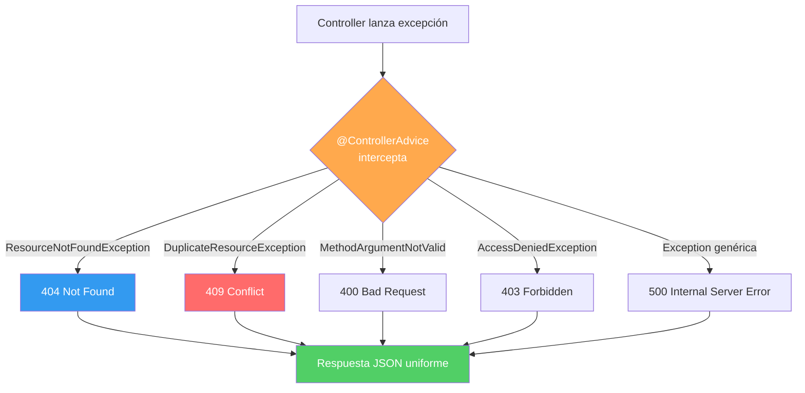

## 11 — Manejo Global de Excepciones

### Propósito
Aprender a centralizar el manejo de errores en toda tu aplicación Spring Boot usando `@ControllerAdvice` y `@ExceptionHandler`, para que cada excepción se convierta en una respuesta HTTP limpia, consistente y con el código de estado correcto.

### Problema que resuelve
Sin un manejo global de excepciones, los errores en tu API resultan en:
- **Stack traces expuestos al cliente**: Un `NullPointerException` devuelve cientos de líneas de código interno al frontend, revelando información sensible (nombres de clases, paquetes, métodos).
- **Códigos HTTP incorrectos**: Todo error devuelve `500 Internal Server Error`, incluso cuando debería ser un `404 Not Found` o `409 Conflict`.
- **Formato inconsistente**: Cada endpoint maneja errores de forma diferente, y el frontend no puede parsear los errores de manera uniforme.
- **Try-catch por todos lados**: Cada método del Controller tiene su propio `try-catch`, generando código duplicado y difícil de mantener.

### Cómo lo resuelve
Spring proporciona `@ControllerAdvice`, una clase global que intercepta excepciones lanzadas desde cualquier Controller. Cada tipo de excepción tiene su propio `@ExceptionHandler` que la convierte en una respuesta HTTP con:
- **Código de estado correcto** (400, 404, 409, 500).
- **Formato JSON uniforme** (status, error, message, timestamp).
- **Sin stack traces** en la respuesta al cliente.

### Por qué aprenderlo
En empresas, el equipo de frontend y el de backend acuerdan un contrato de errores (error contract). Todos los microservicios de la organización devuelven errores con la misma estructura JSON. Esto permite al frontend mostrar mensajes consistentes sin importar qué servicio falle. Es una práctica obligatoria en arquitecturas de microservicios.



---

### Glosario Básico

#### `@ControllerAdvice` / `@RestControllerAdvice`
Una clase anotada que actúa como un "interceptor global" de excepciones. `@RestControllerAdvice` es `@ControllerAdvice` + `@ResponseBody` (devuelve JSON automáticamente).
```java
@RestControllerAdvice
public class GlobalExceptionHandler {
    // Aquí van los @ExceptionHandler
}
```

#### `@ExceptionHandler`
Marca un método que maneja un tipo específico de excepción. Cada excepción tiene su propio handler.
```java
@ExceptionHandler(ResourceNotFoundException.class)
public ResponseEntity<ErrorResponse> handleNotFound(ResourceNotFoundException ex) {
    // Devuelve un 404
}
```

#### `ResponseEntity<T>`
Clase de Spring que permite controlar completamente la respuesta HTTP: código de estado, headers y cuerpo (body).

#### `ProblemDetail` (RFC 7807)
Formato estándar de la industria para errores HTTP, soportado nativamente por Spring Boot 3+. Define campos como `type`, `title`, `status`, `detail`, `instance`.

---

### Conceptos

#### 1. Excepciones Personalizadas (Custom Exceptions)
- **Qué es** — En lugar de lanzar excepciones genéricas (`RuntimeException`), creas excepciones específicas para cada situación de error en tu dominio. Esto permite que el `@ControllerAdvice` las identifique y devuelva el código HTTP correcto.
- **Por qué importa** — Una `ResourceNotFoundException` siempre debe devolver un `404`. Una `BusinessRuleException` debe devolver un `422`. Si lanzas `RuntimeException` para todo, no puedes distinguir entre errores y el usuario siempre recibe un `500`.
- **Código** — Jerarquía de excepciones empresariales:
  ```java
  /**
   * Excepción base para errores de la aplicación.
   * Todas las excepciones custom heredan de esta.
   */
  public abstract class ApplicationException extends RuntimeException {
      private final String errorCode;
      
      protected ApplicationException(String message, String errorCode) {
          super(message);
          this.errorCode = errorCode;
      }
      
      public String getErrorCode() {
          return errorCode;
      }
  }
  
  /**
   * Se lanza cuando un recurso no se encuentra por ID.
   * Mapea a HTTP 404 Not Found.
   */
  public class ResourceNotFoundException extends ApplicationException {
      public ResourceNotFoundException(String resource, Long id) {
          super(
              String.format("El recurso '%s' con ID %d no fue encontrado", resource, id),
              "RESOURCE_NOT_FOUND"
          );
      }
  }
  
  /**
   * Se lanza cuando se intenta crear un recurso que ya existe.
   * Mapea a HTTP 409 Conflict.
   */
  public class DuplicateResourceException extends ApplicationException {
      public DuplicateResourceException(String resource, String field, String value) {
          super(
              String.format("Ya existe un '%s' con %s = '%s'", resource, field, value),
              "DUPLICATE_RESOURCE"
          );
      }
  }
  
  /**
   * Se lanza cuando una regla de negocio se viola.
   * Mapea a HTTP 422 Unprocessable Entity.
   */
  public class BusinessRuleException extends ApplicationException {
      public BusinessRuleException(String message) {
          super(message, "BUSINESS_RULE_VIOLATION");
      }
  }
  ```
- **Analogía** — Las excepciones personalizadas son como las categorías de una oficina de atención al cliente. En vez de decir "hubo un problema" (500 genérico), dices: "no encontramos su pedido" (404), "su email ya está registrado" (409), o "su cuenta no tiene saldo suficiente" (422). Cada categoría tiene un proceso diferente.

#### 2. El Error Response Record
- **Qué es** — Un DTO inmutable que define la estructura de todos los errores de tu API.
- **Por qué importa** — El frontend solo necesita parsear UN formato de error para toda la aplicación, sin importar qué endpoint falló.
- **Código** — Record de error estandarizado:
  ```java
  /**
   * Estructura uniforme para todas las respuestas de error.
   * El frontend SIEMPRE recibe este formato.
   */
  public record ErrorResponse(
      int status,              // Código HTTP: 400, 404, 409, 500
      String error,            // Nombre del error: "Not Found"
      String errorCode,        // Código interno: "RESOURCE_NOT_FOUND"
      String message,          // Mensaje legible: "Usuario con ID 5 no encontrado"
      String path,             // Endpoint que falló: "/api/users/5"
      Instant timestamp,       // Cuándo ocurrió
      Map<String, String> fieldErrors  // Errores de validación por campo (opcional)
  ) {
      // Constructor simplificado (sin errores de campo)
      public ErrorResponse(int status, String error, String errorCode, 
                           String message, String path) {
          this(status, error, errorCode, message, path, Instant.now(), null);
      }
  }
  ```

#### 3. `@ControllerAdvice` Completo
- **Qué es** — La clase central donde registras un handler para cada tipo de excepción. Cada handler construye un `ErrorResponse` con el código HTTP apropiado.
- **Por qué importa** — Elimina 100% del manejo de errores duplicado en los Controllers. Tus Controllers quedan limpios, solo con la lógica del "happy path".
- **Código** — Handler global completo con múltiples excepciones:
  ```java
  @RestControllerAdvice
  @Slf4j  // Logger de Lombok (nunca System.out.println)
  public class GlobalExceptionHandler {
  
      /**
       * 404 — Recurso no encontrado.
       * Se activa cuando el servicio lanza ResourceNotFoundException.
       */
      @ExceptionHandler(ResourceNotFoundException.class)
      public ResponseEntity<ErrorResponse> handleNotFound(
              ResourceNotFoundException ex, HttpServletRequest request) {
          
          log.warn("Recurso no encontrado: {}", ex.getMessage());
          
          ErrorResponse error = new ErrorResponse(
              404, "Not Found", ex.getErrorCode(),
              ex.getMessage(), request.getRequestURI()
          );
          return ResponseEntity.status(404).body(error);
      }
  
      /**
       * 409 — Conflicto (recurso duplicado).
       */
      @ExceptionHandler(DuplicateResourceException.class)
      public ResponseEntity<ErrorResponse> handleDuplicate(
              DuplicateResourceException ex, HttpServletRequest request) {
          
          log.warn("Recurso duplicado: {}", ex.getMessage());
          
          ErrorResponse error = new ErrorResponse(
              409, "Conflict", ex.getErrorCode(),
              ex.getMessage(), request.getRequestURI()
          );
          return ResponseEntity.status(409).body(error);
      }
  
      /**
       * 422 — Regla de negocio violada.
       */
      @ExceptionHandler(BusinessRuleException.class)
      public ResponseEntity<ErrorResponse> handleBusinessRule(
              BusinessRuleException ex, HttpServletRequest request) {
          
          log.warn("Regla de negocio violada: {}", ex.getMessage());
          
          ErrorResponse error = new ErrorResponse(
              422, "Unprocessable Entity", ex.getErrorCode(),
              ex.getMessage(), request.getRequestURI()
          );
          return ResponseEntity.status(422).body(error);
      }
  
      /**
       * 400 — Errores de validación (@Valid).
       */
      @ExceptionHandler(MethodArgumentNotValidException.class)
      public ResponseEntity<ErrorResponse> handleValidation(
              MethodArgumentNotValidException ex, HttpServletRequest request) {
          
          Map<String, String> fieldErrors = new LinkedHashMap<>();
          ex.getBindingResult().getFieldErrors().forEach(fe ->
              fieldErrors.put(fe.getField(), fe.getDefaultMessage())
          );
          
          log.warn("Validación fallida: {} errores", fieldErrors.size());
          
          ErrorResponse error = new ErrorResponse(
              400, "Bad Request", "VALIDATION_FAILED",
              "Los datos enviados contienen errores",
              request.getRequestURI(), Instant.now(), fieldErrors
          );
          return ResponseEntity.badRequest().body(error);
      }
  
      /**
       * 500 — Error inesperado (catch-all).
       * IMPORTANTE: Logueamos el stack trace completo pero NO lo exponemos al cliente.
       */
      @ExceptionHandler(Exception.class)
      public ResponseEntity<ErrorResponse> handleGeneric(
              Exception ex, HttpServletRequest request) {
          
          log.error("Error interno inesperado en {}: ", request.getRequestURI(), ex);
          
          ErrorResponse error = new ErrorResponse(
              500, "Internal Server Error", "INTERNAL_ERROR",
              "Ocurrió un error interno. Contacte al administrador.",
              request.getRequestURI()
          );
          return ResponseEntity.internalServerError().body(error);
      }
  }
  ```
  
  **Ejemplo de respuesta JSON para un 404:**
  ```json
  {
    "status": 404,
    "error": "Not Found",
    "errorCode": "RESOURCE_NOT_FOUND",
    "message": "El recurso 'Usuario' con ID 99 no fue encontrado",
    "path": "/api/users/99",
    "timestamp": "2025-07-10T19:42:00Z",
    "fieldErrors": null
  }
  ```
- **Analogía** — El `@ControllerAdvice` es como la recepcionista de un hospital. Si un paciente llega con una fractura (404), lo envía a traumatología. Si llega con fiebre (500), lo envía a urgencias. Pero siempre llena el mismo formulario de ingreso (ErrorResponse) con los datos del paciente.
- **Casos de Uso Empresariales** — En arquitecturas de microservicios, un API Gateway centraliza los errores de todos los servicios. Si cada servicio devuelve errores con formatos diferentes, el gateway no puede procesarlos. El error contract uniforme es obligatorio.

#### 4. ProblemDetail (RFC 7807) — El Estándar Moderno
- **Qué es** — Spring Boot 3+ soporta nativamente el estándar RFC 7807 para respuestas de error. En lugar de crear tu propio `ErrorResponse`, usas `ProblemDetail` que es reconocido por la industria.
- **Por qué importa** — Es el formato estandarizado que librerías y frameworks de frontend (Angular HttpClient, Axios) pueden parsear automáticamente.
- **Código**:
  ```java
  @ExceptionHandler(ResourceNotFoundException.class)
  public ProblemDetail handleNotFound(ResourceNotFoundException ex) {
      ProblemDetail problem = ProblemDetail.forStatusAndDetail(
          HttpStatus.NOT_FOUND, ex.getMessage()
      );
      problem.setTitle("Resource Not Found");
      problem.setProperty("errorCode", ex.getErrorCode());
      problem.setProperty("timestamp", Instant.now());
      return problem;
  }
  ```
  
  **Respuesta JSON resultante:**
  ```json
  {
    "type": "about:blank",
    "title": "Resource Not Found",
    "status": 404,
    "detail": "El recurso 'Usuario' con ID 99 no fue encontrado",
    "instance": "/api/users/99",
    "errorCode": "RESOURCE_NOT_FOUND",
    "timestamp": "2025-07-10T19:42:00Z"
  }
  ```

#### 5. Uso en el Service (Lanzar Excepciones)
- **Qué es** — El Service es quien detecta los errores de negocio y lanza las excepciones personalizadas. El Controller no necesita hacer nada; el `@ControllerAdvice` se encarga.
- **Código** — Service limpio que lanza excepciones:
  ```java
  @Service
  @Slf4j
  public class UserService {
  
      private final UserRepository userRepository;
  
      public UserService(UserRepository userRepository) {
          this.userRepository = userRepository;
      }
  
      public User findById(Long id) {
          return userRepository.findById(id)
              .orElseThrow(() -> new ResourceNotFoundException("Usuario", id));
      }
  
      public User create(User user) {
          // Verificar que el email no esté duplicado
          if (userRepository.existsByEmail(user.getEmail())) {
              throw new DuplicateResourceException("Usuario", "email", user.getEmail());
          }
          return userRepository.save(user);
      }
  
      public void deactivate(Long id) {
          User user = findById(id);
          if (!user.isActive()) {
              throw new BusinessRuleException("El usuario ya está desactivado");
          }
          user.setActive(false);
          userRepository.save(user);
      }
  }
  ```

#### 6. Edge Cases y Errores Comunes

| Error | Causa | Solución |
|-------|-------|----------|
| Stack trace en la respuesta | No hay `@ControllerAdvice` o no cubre esa excepción | Agregar un handler genérico `@ExceptionHandler(Exception.class)` como fallback |
| El handler no se activa | La clase no está anotada con `@RestControllerAdvice` | Verificar la anotación y que esté en un paquete escaneado por Spring |
| Dos handlers para la misma excepción | Dos clases `@ControllerAdvice` manejan el mismo tipo | Usar `@Order` para definir prioridad o consolidar en una sola clase |
| `HttpMessageNotReadableException` | JSON malformado (syntax error) | Agregar un handler específico que devuelva "El JSON enviado no es válido" |
| Log excesivo en producción | Se loguea cada 404 como ERROR | Usar `log.warn()` para 4xx y `log.error()` solo para 5xx |

---

### Antes vs Ahora (Java 8 → Java 21)

| Tema | ANTES (Java 8) | AHORA (Java 21) |
|------|----------------|-----------------|
| DTO de error | POJO de 30+ líneas con getters/setters/equals/hashCode | `public record ErrorResponse(String code, String message, Instant timestamp, String path) {}` (1 línea) |
| Fecha/hora | `new Date()` (sin zona horaria, fuente clásica de bugs) | `Instant.now()` (UTC explícito, del paquete `java.time`) |
| Handler genérico | `catch (Exception e) { response.setStatus(500); PrintWriter w = ...; w.write("error"); }` en cada Controller | Un único `@ExceptionHandler(Exception.class)` en el `@RestControllerAdvice` — cubre TODA la aplicación |
| Mapa JSON | `Map<String, Object> m = new HashMap<>(); m.put("id", id); m.put("status", "OK");` | `Map.of("id", id, "status", "OK")` (inmutable, 1 línea) |
| Lanzar excepción de dominio | `throw new RuntimeException("Order not found: " + id)` (genérica → siempre 500) | `throw new ResourceNotFoundException("Order " + id + " not found")` (específica → 404) |

### FAQ del Alumno

- **¿Qué es `@RestControllerAdvice`?** Una anotación que marca una clase como "interceptora global" de excepciones para todos los `@RestController`. Es equivalente a `@ControllerAdvice + @ResponseBody`, lo que significa que su valor de retorno se serializa a JSON automáticamente.
- **¿Por qué mi excepción no la captura el handler?** Verifica: (1) la clase está anotada con `@RestControllerAdvice`; (2) está en un paquete escaneado por Spring (bajo `com.springroadmap.exceptions`); (3) el `@ExceptionHandler` declara el tipo EXACTO o un padre de la excepción que se lanza.
- **¿Por qué el test necesita `.setControllerAdvice(new GlobalExceptionHandler())`?** Porque en MockMvc `standaloneSetup` no hay contexto Spring, así que los `@RestControllerAdvice` no se registran solos. Hay que decírselo a MockMvc explícitamente.
- **¿Por qué el handler genérico responde `"unexpected error"` y no `ex.getMessage()`?** Seguridad. El mensaje real podría revelar rutas de archivos, credenciales pegadas por error, nombres de tablas o cualquier otra información sensible. El detalle se guarda en el log del servidor con `log.error(..., ex)`, jamás en la respuesta al cliente.
- **¿Qué es un `record`?** Una forma corta de declarar una clase inmutable en Java 14+. El compilador genera getters (con el mismo nombre que el campo, sin `get`), `equals`, `hashCode` y `toString` por ti.
- **¿Qué diferencia hay entre 404 y 422?** 404 = "el recurso no existe" (el ID que pediste no está). 422 = "el recurso existe / el input es válido sintácticamente, pero viola una regla de negocio" (por ejemplo: id impar en nuestro ejemplo, o "el usuario ya está desactivado" en un caso real).
- **¿Por qué `RuntimeException` y no `Exception`?** Porque `Exception` es checked (obliga a declararlas con `throws` o envolverlas en `try/catch`), lo que ensucia todo el código. Las excepciones de negocio siempre se modelan como unchecked (`RuntimeException`).

### Ejercicios
1. Añade una nueva excepción `DuplicateResourceException` que mapee a HTTP 409 Conflict y un handler para ella.
2. Agrega un endpoint `POST /api/orders` que reciba un pedido y valide que el `id` no sea negativo (lanzar `BusinessRuleException` en caso contrario).
3. Añade un `@ExceptionHandler(MethodArgumentNotValidException.class)` para devolver 400 con la lista de campos inválidos cuando se use `@Valid`.
4. **(Avanzado)** Migra el `GlobalExceptionHandler` para responder con `ProblemDetail` (RFC 7807) en vez del record `ErrorResponse` custom.

### Cómo ejecutar

**Con scripts portables (recomendado):**
```powershell
# PowerShell
./build.ps1
```
```bash
# Git Bash
./build.sh
```

**Con Maven directo (requiere JDK 21 en JAVA_HOME):**
```bash
cd 11-excepciones
../apache-maven-3.9.16/bin/mvn clean package
java -jar target/excepciones-1.0.0.jar
```

**Probar los endpoints:**
```bash
# 200 OK (id par):
curl -i http://localhost:8080/api/orders/2

# 422 Unprocessable Entity (id impar - regla de negocio):
curl -i http://localhost:8080/api/orders/1

# 404 Not Found (id 0):
curl -i http://localhost:8080/api/orders/0
```

Respuesta JSON de ejemplo para `GET /api/orders/1`:
```json
{
  "code": "BUSINESS_RULE",
  "message": "Odd order ids are not allowed: 1",
  "timestamp": "2026-07-10T19:42:00Z",
  "path": "/api/orders/1"
}
```

### Archivos del Proyecto
| Archivo | Propósito |
|---------|-----------|
| `pom.xml` | Coordenadas Maven: `com.springroadmap:excepciones:1.0.0`, hereda de `spring-boot-starter-parent:4.1.0`. |
| `build.sh` / `build.ps1` | Scripts portables que usan el JDK 21 y Maven de la raíz del roadmap. |
| `src/main/resources/application.yml` | Config con hardening: nunca exponer stacktrace ni cabecera Server. |
| `ExceptionsApplication.java` | Punto de entrada `@SpringBootApplication`. |
| `exception/ResourceNotFoundException.java` | Excepción para recurso no encontrado → HTTP 404. |
| `exception/BusinessRuleException.java` | Excepción para regla de negocio violada → HTTP 422. |
| `exception/GlobalExceptionHandler.java` | `@RestControllerAdvice` con 3 handlers (404, 422, 500). |
| `dto/ErrorResponse.java` | `record` con la estructura uniforme de errores. |
| `controller/OrderController.java` | `GET /api/orders/{id}` — dispara las excepciones para demostrar el advice. |
| `ExceptionsApplicationTests.java` | Smoke test `contextLoads`. |
| `controller/OrderControllerTest.java` | MockMvc standalone con `.setControllerAdvice(new GlobalExceptionHandler())`. |
