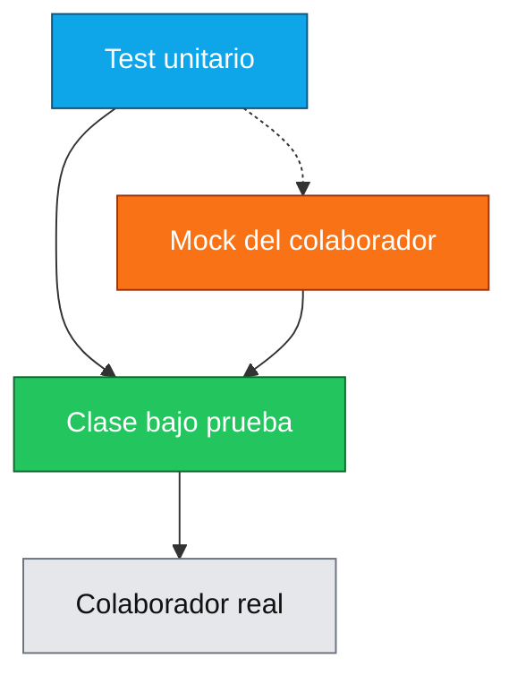

# 12 — Pruebas Unitarias (JUnit 5 + Mockito + MockMvc standalone)

## Propósito
Aprender a escribir **tests unitarios** rápidos y confiables en Spring Boot 4, usando JUnit 5 (Jupiter), Mockito y MockMvc en modo standalone. Un test unitario prueba **una clase aislada** de sus dependencias.

## Problema que resuelve
Sin tests unitarios:
- Cada cambio de código es una lotería (no sabes si rompiste algo).
- Los bugs aparecen en producción, no en desarrollo.
- El refactor es imposible (no hay red de seguridad).
- La documentación viva del comportamiento se pierde.

## Cómo lo resuelve
- **JUnit 5**: framework moderno para definir y ejecutar tests (`@Test`, `@DisplayName`, `@ParameterizedTest`).
- **Mockito**: crea "dobles de prueba" (mocks) para aislar la clase bajo test.
- **MockMvc standalone**: ejecuta HTTP simulado contra el controller sin arrancar el servidor.

## Por qué aprenderlo
El testing es la habilidad que separa al programador junior del senior. Todo proyecto empresarial serio exige >70% de cobertura. Sin dominio de JUnit 5 + Mockito, no pasas una entrevista técnica de Spring.



## Glosario Básico
| Término | Explicación |
|---------|-------------|
| `@Test` | Marca un método como test ejecutable por JUnit. |
| `@DisplayName` | Nombre humano legible del test en el reporte. |
| `@ParameterizedTest` + `@ValueSource` | Ejecuta el mismo test con distintos valores de entrada. |
| `assertEquals(esperado, actual, delta)` | Verifica igualdad (con tolerancia si son doubles). |
| `assertThrows(Excepcion.class, () -> ...)` | Verifica que el bloque lance la excepción indicada. |
| `@ExtendWith(MockitoExtension.class)` | Integra Mockito en JUnit 5 (reemplaza al viejo `@RunWith`). |
| `@Mock` | Crea un doble de prueba del tipo del campo. |
| `@InjectMocks` | Construye la clase bajo prueba inyectándole los `@Mock`. |
| `when(mock.metodo(...)).thenReturn(valor)` | Programa el comportamiento del mock. |
| `verify(mock).metodo(...)` | Verifica que el mock fue llamado con esos argumentos. |
| `MockMvcBuilders.standaloneSetup(controller)` | Construye MockMvc sin arrancar Spring. |

## Conceptos

### 1. Test unitario puro (`PricingServiceTest`)
- **Qué es**: prueba una clase que NO tiene dependencias externas.
- **Por qué importa**: es el test más rápido posible (milisegundos). Debe ser el 80% de tu suite.
- **Código**: `PricingServiceTest.calculateFinalPrice_happyPath()` verifica que `1000 - 10% = 900`.
- **Analogía**: probar una calculadora de bolsillo desconectada de todo.
- **Caso empresarial**: validar reglas de descuento del área comercial.

### 2. `@ParameterizedTest` + `@ValueSource`
- **Qué es**: mismo test ejecutado con múltiples valores de entrada.
- **Por qué importa**: elimina copiar-pegar 8 tests casi idénticos.
- **Código**: `@ValueSource(doubles = {0.0, 5.0, 10.0, ...})`.

### 3. Test con Mockito (`InvoiceServiceTest`)
- **Qué es**: prueba una clase que tiene dependencias, reemplazándolas por mocks.
- **Por qué importa**: aísla la lógica y evita que un bug de otra clase rompa este test.
- **Código**: `@Mock PricingService`, `@InjectMocks InvoiceService`.
- **Analogía**: en un simulador de vuelo, la "torre de control" es un actor entrenado, no la real.
- **Caso empresarial**: probar el orquestador de facturas sin depender del microservicio de impuestos.

### 4. MockMvc standalone (`InvoiceControllerTest`)
- **Qué es**: MockMvc construido a mano con el controller y sus dependencias.
- **Por qué importa**: en Spring Boot 4.1.0 se eliminó `@WebMvcTest`. Este patrón es OBLIGATORIO.
- **Código**: `MockMvcBuilders.standaloneSetup(new InvoiceController(mockService)).build()`.
- **Casos empresariales**: verificar endpoints REST sin arrancar Tomcat.

### 5. `@SpringBootTest` smoke (`contextLoads`)
- **Qué es**: arranca TODO el contexto Spring y verifica que no explote.
- **Por qué importa**: detecta beans mal configurados antes de despliegue.

## Antes vs Ahora

| Aspecto | ANTES (JUnit 4) | AHORA (JUnit 5) |
|---------|-----------------|-----------------|
| Runner Mockito | `@RunWith(MockitoJUnitRunner.class)` | `@ExtendWith(MockitoExtension.class)` |
| Runner Spring | `@RunWith(SpringJUnit4ClassRunner.class)` | (no hace falta) |
| Anotación test | `org.junit.Test` | `org.junit.jupiter.api.Test` |
| Excepción esperada | `@Test(expected = X.class)` | `assertThrows(X.class, () -> ...)` |
| Antes/después | `@Before`, `@After` | `@BeforeEach`, `@AfterEach` |
| Mock manual | `PricingService mock = Mockito.mock(PricingService.class);` | `@Mock PricingService mock;` |
| Inyección de mocks | Constructor manual: `new InvoiceService(pricing, tax)` | `@InjectMocks InvoiceService svc;` |
| Test de controller | `@WebMvcTest(...)` (eliminado en Boot 4.1.0) | `MockMvcBuilders.standaloneSetup(controller).build()` |
| Parametrizados | `@Parameters` + `@RunWith(Parameterized.class)` | `@ParameterizedTest` + `@ValueSource` |

### Antes: Mockito manual
```java
public class InvoiceServiceTest {
    private PricingService pricingMock;
    private TaxCalculator taxMock;
    private InvoiceService svc;

    @Before
    public void setUp() {
        pricingMock = Mockito.mock(PricingService.class);
        taxMock = Mockito.mock(TaxCalculator.class);
        svc = new InvoiceService(pricingMock, taxMock);
    }
    // ...
}
```

### Ahora: `@Mock` + `@InjectMocks`
```java
@ExtendWith(MockitoExtension.class)
class InvoiceServiceTest {
    @Mock private PricingService pricingService;
    @Mock private TaxCalculator taxCalculator;
    @InjectMocks private InvoiceService invoiceService;
    // ...
}
```

## FAQ del Alumno

- **¿Qué es un "mock"?** Un objeto FALSO que finge ser el real. Le programas qué devolver ante cada llamada. Sirve para aislar la clase bajo prueba.
- **¿Diferencia entre `@Mock` y `@InjectMocks`?** `@Mock` crea el doble; `@InjectMocks` crea la clase real y le mete los mocks por constructor.
- **¿Por qué `@Test` sin `public`?** JUnit 5 no exige métodos `public`. Basta con package-private.
- **¿Qué es "standalone" en MockMvc?** Modo sin Spring: tú instancias el controller y le pasas las dependencias. Es más rápido y no necesita `@WebMvcTest`.
- **¿Por qué se eliminó `@WebMvcTest` en Boot 4.1.0?** Es una decisión del equipo Spring: simplifican el ecosistema forzando el patrón standalone para tests unitarios de controllers.
- **¿Test unitario o de integración?** Unitario = una clase aislada, milisegundos. Integración = varias clases o el contexto completo, segundos. Este módulo cubre UNITARIOS.
- **¿Qué significa `verify(mock).metodo(...)`?** "Estoy comprobando que el mock recibió esta llamada con estos argumentos". Detecta refactors que rompen contratos.
- **¿Por qué `delta` en `assertEquals` con doubles?** Porque los `double` tienen precisión limitada. `0.1 + 0.2 != 0.3` exactamente. Se compara con tolerancia (`0.0001`).
- **¿Qué hace `@ParameterizedTest`?** Ejecuta el test una vez por cada valor de `@ValueSource`. Ideal para tablas de verdad.
- **¿Es obligatorio el smoke test `contextLoads`?** Sí, en Spring Boot es la mínima red de seguridad: si un bean está roto, el proyecto no arranca.

## Ejercicios
1. Agrega un test parametrizado que verifique varios valores INVÁLIDOS de discount (−1, −0.01, 100.01, 200) y compruebe que TODOS lanzan `IllegalArgumentException`.
2. Crea un test para `TaxCalculatorImpl` con `@ParameterizedTest` y valores `{100, 1000, 5000}`.
3. Agrega un endpoint `GET /api/tax?amount=X` y su test MockMvc standalone.
4. Usa `ArgumentCaptor` en el test del `InvoiceService` para capturar el valor pasado a `taxCalculator.calculateTax(...)`.

## Cómo ejecutar

```bash
# Git Bash
./build.sh

# PowerShell
.\build.ps1

# Solo tests (Maven)
../apache-maven-3.9.16/bin/mvn.cmd test

# Ejecutar app
java -jar target/pruebas-unitarias-1.0.0.jar
# GET http://localhost:8080/api/invoice?base=1000&discount=10
```

## Archivos del Proyecto

| Archivo | Propósito |
|---------|-----------|
| `pom.xml` | Dependencias Maven (`web`, `test`). |
| `build.sh` / `build.ps1` | Scripts de build con JDK 21 portable. |
| `src/main/resources/application.yml` | Config mínima (puerto 8080). |
| `TestsApplication.java` | Clase principal Spring Boot. |
| `service/PricingService.java` | Servicio de cálculo de descuento. |
| `service/TaxCalculator.java` | Interfaz de cálculo de impuestos. |
| `service/TaxCalculatorImpl.java` | Implementación IVA Chile 19%. |
| `service/InvoiceService.java` | Compone PricingService + TaxCalculator. |
| `controller/InvoiceController.java` | Endpoint `GET /api/invoice`. |
| `TestsApplicationTests.java` | Smoke test `contextLoads`. |
| `service/PricingServiceTest.java` | JUnit 5 puro + `@ParameterizedTest`. |
| `service/TaxCalculatorImplTest.java` | Tests unitarios de la implementación. |
| `service/InvoiceServiceTest.java` | Mockito con `@Mock` + `@InjectMocks`. |
| `controller/InvoiceControllerTest.java` | MockMvc standalone. |
