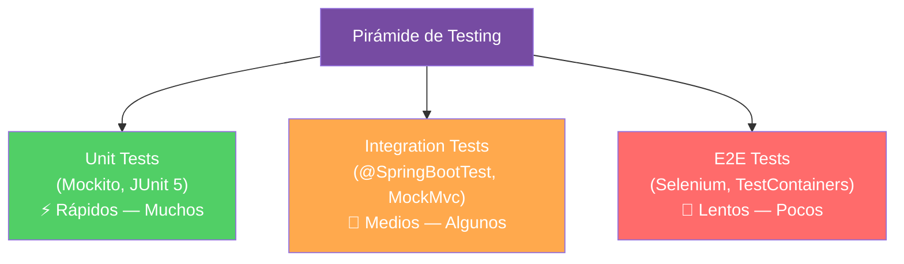

## 12 — Pruebas Unitarias y de Integración (JUnit 5 + Mockito)

### Propósito
Aprender a escribir pruebas automatizadas que validen que tu código funciona correctamente, usando JUnit 5 para la estructura de tests, Mockito para simular dependencias y las herramientas de Spring Boot Test para probar la aplicación completa.

### Problema que resuelve
Sin pruebas automatizadas:
- **Cada cambio puede romper algo** y no te das cuenta hasta que el usuario reporta el bug en producción.
- **El refactoring da miedo**: nadie se atreve a mejorar el código porque no hay forma de verificar que sigue funcionando.
- **Los deploys son arriesgados**: cada release es una moneda al aire.
- **La deuda técnica crece**: sin tests, el código se vuelve frágil e inmantenible.

### Cómo lo resuelve
Spring Boot integra un stack de testing completo:
- **JUnit 5**: Framework de assertions y ciclo de vida de tests.
- **Mockito**: Simula dependencias para aislar la unidad bajo prueba.
- **MockMvc**: Simula peticiones HTTP sin levantar un servidor real.
- **@SpringBootTest**: Levanta el contexto completo de Spring para tests de integración.
- **@WebMvcTest**: Levanta solo la capa web (Controllers) sin base de datos.
- **@DataJpaTest**: Levanta solo la capa de datos (Repositories) con H2 en memoria.

### Por qué aprenderlo
En empresas, **no se puede hacer merge a main sin tests**. Los pipelines CI/CD ejecutan `mvn test` automáticamente y si una prueba falla, el deploy se bloquea. Es tan fundamental como escribir el código mismo. Un desarrollador sin habilidades de testing no pasa la entrevista técnica.



---

### Glosario Básico

#### `@Test`
Marca un método como una prueba que JUnit debe ejecutar.
```java
@Test
void shouldReturnUserWhenIdExists() {
    // Arrange, Act, Assert
}
```

#### `@Mock`
Crea un objeto simulado (fake) que reemplaza la dependencia real. No ejecuta el código real de esa dependencia.
```java
@Mock
private UserRepository userRepository; // Simulación, no conecta a la BD
```

#### `@InjectMocks`
Crea una instancia de la clase bajo prueba e inyecta automáticamente los `@Mock` en su constructor.
```java
@InjectMocks
private UserService userService; // Recibe el userRepository mock
```

#### `when(...).thenReturn(...)`
Configura el comportamiento del mock: "cuando llamen a este método, devuelve este valor".
```java
when(userRepository.findById(1L)).thenReturn(Optional.of(mockUser));
```

#### `@WebMvcTest`
Levanta solo la capa web (Controllers) sin base de datos, servicios reales ni seguridad.

#### `MockMvc`
Herramienta de Spring para simular peticiones HTTP dentro de un test sin levantar Tomcat.
```java
mockMvc.perform(get("/api/users/1"))
    .andExpect(status().isOk())
    .andExpect(jsonPath("$.name").value("Juan"));
```

---

### Conceptos

#### 1. Unit Test con Mockito (Service Layer)
- **Qué es** — Una prueba unitaria aísla una sola clase (generalmente un `@Service`) y reemplaza todas sus dependencias por mocks. El objetivo es verificar que la lógica de negocio funciona correctamente, sin base de datos, sin red, sin filesystem.
- **Por qué importa** — Son las pruebas más rápidas (milisegundos) y las más importantes. Deben cubrir el 70-80% de tus tests.
- **Código** — Test completo de un Service:
  ```java
  /**
   * Tests unitarios para UserService.
   * Usa Mockito para simular el UserRepository.
   * NO levanta Spring ni conecta a la BD.
   */
  @ExtendWith(MockitoExtension.class)  // Activa Mockito
  class UserServiceTest {
  
      @Mock
      private UserRepository userRepository;  // Simulación del repositorio
  
      @InjectMocks
      private UserService userService;  // Clase bajo prueba
  
      private User testUser;
  
      @BeforeEach
      void setUp() {
          testUser = new User();
          testUser.setId(1L);
          testUser.setUsername("juan");
          testUser.setEmail("juan@test.com");
      }
  
      // ===== HAPPY PATH =====
  
      @Test
      @DisplayName("findById debe retornar el usuario cuando existe")
      void findById_WhenUserExists_ShouldReturnUser() {
          // Arrange: configurar el mock
          when(userRepository.findById(1L)).thenReturn(Optional.of(testUser));
  
          // Act: ejecutar el método bajo prueba
          User result = userService.findById(1L);
  
          // Assert: verificar el resultado
          assertNotNull(result);
          assertEquals("juan", result.getUsername());
          assertEquals("juan@test.com", result.getEmail());
  
          // Verify: confirmar que el repositorio fue llamado exactamente 1 vez
          verify(userRepository, times(1)).findById(1L);
      }
  
      // ===== EDGE CASE =====
  
      @Test
      @DisplayName("findById debe lanzar excepción cuando el usuario NO existe")
      void findById_WhenUserNotExists_ShouldThrowException() {
          // Arrange: el mock devuelve vacío
          when(userRepository.findById(99L)).thenReturn(Optional.empty());
  
          // Act & Assert: verificar que se lanza la excepción correcta
          ResourceNotFoundException exception = assertThrows(
              ResourceNotFoundException.class,
              () -> userService.findById(99L)
          );
  
          // Verificar el mensaje de la excepción
          assertTrue(exception.getMessage().contains("99"));
      }
  
      @Test
      @DisplayName("create debe lanzar DuplicateResourceException si el email ya existe")
      void create_WhenEmailExists_ShouldThrowDuplicate() {
          // Arrange
          when(userRepository.existsByEmail("juan@test.com")).thenReturn(true);
  
          // Act & Assert
          assertThrows(DuplicateResourceException.class,
              () -> userService.create(testUser)
          );
  
          // Verify: save() NUNCA debe ser llamado si el email está duplicado
          verify(userRepository, never()).save(any());
      }
  
      @Test
      @DisplayName("create debe guardar el usuario cuando el email es único")
      void create_WhenEmailIsUnique_ShouldSaveAndReturn() {
          // Arrange
          when(userRepository.existsByEmail("juan@test.com")).thenReturn(false);
          when(userRepository.save(testUser)).thenReturn(testUser);
  
          // Act
          User result = userService.create(testUser);
  
          // Assert
          assertNotNull(result);
          assertEquals("juan", result.getUsername());
          verify(userRepository, times(1)).save(testUser);
      }
  }
  ```
- **Analogía** — Un unit test es como probar la bocina de un coche en un taller. Desconectas la bocina del volante (mock del Controller), del motor (mock de la BD) y solo verificas que la bocina suena. No necesitas el coche completo.
- **Casos de Uso Empresariales** — Validar que la lógica de cálculo de descuentos en un e-commerce funciona correctamente para todos los escenarios: usuario premium, usuario nuevo, compra mayor a $100, cupón expirado, etc.

#### 2. Test de Controller con `@WebMvcTest` y `MockMvc`
- **Qué es** — `@WebMvcTest` levanta solo la capa web de Spring (Controllers, filtros, serializadores JSON) sin levantar servicios, repositorios ni base de datos. Usas `MockMvc` para simular peticiones HTTP.
- **Por qué importa** — Verifica que tus endpoints reciben las peticiones correctamente, validan los datos y devuelven los códigos HTTP esperados.
- **Código** — Test completo de un Controller:
  ```java
  @WebMvcTest(UserController.class)  // Solo levanta este Controller
  class UserControllerTest {
  
      @Autowired
      private MockMvc mockMvc;  // Simulador de peticiones HTTP
  
      @MockBean  // Crea un mock y lo registra en el contexto de Spring
      private UserService userService;
  
      @MockBean
      private UserMapper userMapper;
  
      @Test
      @DisplayName("GET /api/users/{id} debe retornar 200 con el usuario")
      void getById_WhenExists_ShouldReturn200() throws Exception {
          // Arrange
          User user = new User(1L, "juan", "juan@test.com");
          UserResponse response = new UserResponse(1L, "juan", "juan@test.com");
          
          when(userService.findById(1L)).thenReturn(user);
          when(userMapper.toResponse(user)).thenReturn(response);
  
          // Act & Assert
          mockMvc.perform(get("/api/users/1")
                  .contentType(MediaType.APPLICATION_JSON))
              .andExpect(status().isOk())
              .andExpect(jsonPath("$.id").value(1))
              .andExpect(jsonPath("$.username").value("juan"))
              .andExpect(jsonPath("$.email").value("juan@test.com"));
      }
  
      @Test
      @DisplayName("POST /api/users con datos inválidos debe retornar 400")
      void create_WithInvalidData_ShouldReturn400() throws Exception {
          // JSON con datos inválidos (email sin @, nombre vacío)
          String invalidJson = """
              {
                "username": "",
                "email": "no-es-email",
                "password": "123"
              }
              """;
  
          mockMvc.perform(post("/api/users")
                  .contentType(MediaType.APPLICATION_JSON)
                  .content(invalidJson))
              .andExpect(status().isBadRequest())
              .andExpect(jsonPath("$.fieldErrors.username").exists())
              .andExpect(jsonPath("$.fieldErrors.email").exists());
      }
  
      @Test
      @DisplayName("GET /api/users/{id} con ID inexistente debe retornar 404")
      void getById_WhenNotExists_ShouldReturn404() throws Exception {
          when(userService.findById(99L))
              .thenThrow(new ResourceNotFoundException("Usuario", 99L));
  
          mockMvc.perform(get("/api/users/99"))
              .andExpect(status().isNotFound())
              .andExpect(jsonPath("$.errorCode").value("RESOURCE_NOT_FOUND"));
      }
  }
  ```
- **Analogía** — `@WebMvcTest` es como probar la ventanilla de atención de un banco. Verificas que la ventanilla recibe formularios, los valida y te responde correctamente, pero el cajero detrás (Service) es un actor de simulación (mock), no hace transacciones reales.

#### 3. Test de Integración con `@SpringBootTest`
- **Qué es** — `@SpringBootTest` levanta TODO el contexto de Spring: Controllers, Services, Repositories, base de datos (H2 en memoria). Verifica que todas las capas funcionan juntas.
- **Por qué importa** — Un unit test puede pasar perfectamente pero la aplicación puede fallar cuando las capas interactúan (errores de configuración, SQL incorrecta, mapeos rotos).
- **Código** — Test de integración completo:
  ```java
  @SpringBootTest(webEnvironment = SpringBootTest.WebEnvironment.RANDOM_PORT)
  class UserIntegrationTest {
  
      @Autowired
      private TestRestTemplate restTemplate;
  
      @Test
      @DisplayName("Flujo completo: crear usuario y buscarlo")
      void createAndFindUser_ShouldWork() {
          // 1. Crear usuario
          CreateUserRequest request = new CreateUserRequest("maria", "maria@test.com", "password123");
          
          ResponseEntity<UserResponse> createResponse = restTemplate.postForEntity(
              "/api/users", request, UserResponse.class
          );
          
          assertEquals(HttpStatus.CREATED, createResponse.getStatusCode());
          assertNotNull(createResponse.getBody());
          assertNotNull(createResponse.getBody().id());
  
          // 2. Buscar el usuario creado
          Long userId = createResponse.getBody().id();
          ResponseEntity<UserResponse> getResponse = restTemplate.getForEntity(
              "/api/users/" + userId, UserResponse.class
          );
          
          assertEquals(HttpStatus.OK, getResponse.getStatusCode());
          assertEquals("maria", getResponse.getBody().username());
      }
  }
  ```

#### 4. Edge Cases y Errores Comunes

| Error | Causa | Solución |
|-------|-------|----------|
| `NullPointerException` en test | Olvidar `@ExtendWith(MockitoExtension.class)` | Agregar la anotación a nivel de clase |
| `@MockBean` no funciona | Usarlo fuera de `@WebMvcTest` o `@SpringBootTest` | `@MockBean` solo funciona dentro del contexto de Spring |
| El test tarda 30+ segundos | Usar `@SpringBootTest` para todo | Reservar `@SpringBootTest` para integración. Usar Mockito para unit tests |
| Tests pasan local pero fallan en CI | Puerto hardcodeado | Usar `RANDOM_PORT` en `@SpringBootTest` |
| `Unable to mock final class` | Mockito no puede mockear `record` o clases `final` | Usar `mockito-inline` o crear interfaces |

---

### Ejercicios
1. Escribe 3 unit tests para un `ProductService`: `findById` (happy path), `findById` (not found) y `create` (duplicado).
2. Escribe un `@WebMvcTest` para `ProductController` verificando que `GET /api/products/1` devuelve `200` y `GET /api/products/999` devuelve `404`.
3. Escribe un test que verifique que `POST /api/products` con un JSON inválido devuelve `400` con los errores de validación.
4. Escribe un test de integración con `@SpringBootTest` que cree un producto y luego lo busque por ID.
5. **(Avanzado)** Ejecuta `mvn test` y verifica que todos los tests pasan correctamente.

### Cómo ejecutar
```bash
cd 12-pruebas-unitarias

# Ejecutar todos los tests
mvn test

# Ejecutar solo una clase de test
mvn test -Dtest=UserServiceTest

# Ejecutar con reporte de cobertura (si tienes JaCoCo configurado)
mvn test jacoco:report
```

### Archivos del Proyecto
| Archivo | Propósito |
|---------|-----------|
| `pom.xml` | Dependencias: `spring-boot-starter-test` (incluye JUnit 5 + Mockito). |
| `test/service/UserServiceTest.java` | Unit tests del Service con Mockito. |
| `test/controller/UserControllerTest.java` | Tests del Controller con `@WebMvcTest` + MockMvc. |
| `test/integration/UserIntegrationTest.java` | Test de integración con `@SpringBootTest`. |
| `service/UserService.java` | Service bajo prueba. |
| `controller/UserController.java` | Controller bajo prueba. |
