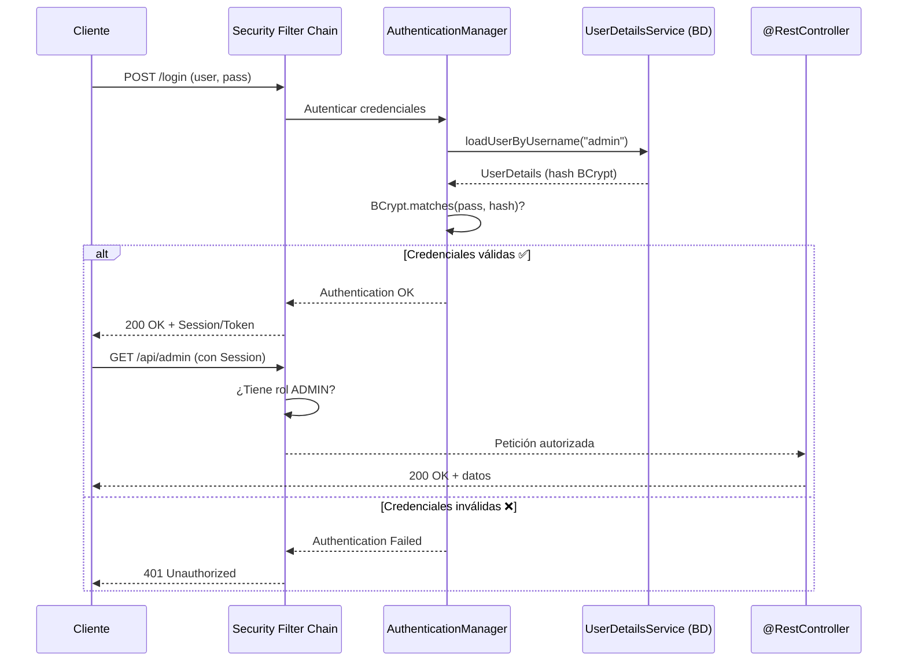

## 13 — Spring Security Básica (Autenticación y Autorización)

### Propósito
Aprender a proteger tu aplicación Spring Boot con Spring Security: configurar autenticación (quién eres), autorización (qué puedes hacer), encriptar contraseñas con BCrypt y crear un flujo de login seguro basado en formulario y en endpoints REST.

### Problema que resuelve
Sin seguridad, tu API está completamente abierta:
- **Cualquiera puede acceder** a todos los endpoints, incluso los de administración (`DELETE /api/users`).
- **Las contraseñas se almacenan en texto plano**: una brecha de datos expone todas las credenciales.
- **No hay distinción de roles**: un usuario normal puede ejecutar operaciones de administrador.
- **No hay auditoría**: no sabes quién hizo qué acción en el sistema.

### Cómo lo resuelve
Spring Security añade una cadena de filtros (Filter Chain) que intercepta **cada petición HTTP** antes de que llegue a tu Controller:
1. **Autenticación**: Verifica la identidad del usuario (credenciales válidas).
2. **Autorización**: Verifica que el usuario tenga el rol necesario para ese endpoint.
3. **Password Encoding**: Las contraseñas se almacenan hasheadas con BCrypt (irreversible).

### Por qué aprenderlo
La seguridad no es opcional. Toda API empresarial debe tener autenticación y autorización. Spring Security es el framework de seguridad más usado en el ecosistema Java y es requisito obligatorio en entrevistas técnicas para posiciones backend.



---

### Glosario Básico

#### `SecurityFilterChain`
El bean central de Spring Security que define las reglas de seguridad: qué endpoints son públicos, cuáles requieren autenticación y cuáles requieren roles específicos.
```java
@Bean
public SecurityFilterChain filterChain(HttpSecurity http) throws Exception {
    return http
        .authorizeHttpRequests(auth -> auth
            .requestMatchers("/api/public/**").permitAll()
            .requestMatchers("/api/admin/**").hasRole("ADMIN")
            .anyRequest().authenticated()
        )
        .build();
}
```

#### `UserDetailsService`
Interfaz que Spring Security usa para cargar los datos del usuario desde tu base de datos. Tú implementas el método `loadUserByUsername()`.

#### `BCryptPasswordEncoder`
Algoritmo de hashing unidireccional para contraseñas. Cada vez que hasheas la misma contraseña, el resultado es diferente (por el salt), pero `matches()` siempre puede verificar si coincide.
```java
BCryptPasswordEncoder encoder = new BCryptPasswordEncoder();
String hash = encoder.encode("mi_password_123");
// hash = "$2a$10$N9qo8uLOickgx2ZMRZoMye..." (diferente cada vez)
boolean coincide = encoder.matches("mi_password_123", hash); // true
```

#### `@PreAuthorize`
Anotación que restringe el acceso a un método según una expresión SpEL.
```java
@PreAuthorize("hasRole('ADMIN')")
@DeleteMapping("/users/{id}")
public void deleteUser(@PathVariable Long id) { }
```

---

### Conceptos

#### 1. Configuración de `SecurityFilterChain`
- **Qué es** — La configuración central donde defines las reglas de acceso para todos los endpoints de tu aplicación.
- **Por qué importa** — Sin esta configuración, Spring Security bloquea TODO por defecto (incluso tu endpoint `/api/public`). Debes especificar explícitamente qué es público y qué requiere autenticación.
- **Código** — Configuración completa de seguridad:
  ```java
  @Configuration
  @EnableWebSecurity  // Activa Spring Security
  @EnableMethodSecurity  // Activa @PreAuthorize en métodos
  public class SecurityConfig {
  
      @Bean
      public SecurityFilterChain filterChain(HttpSecurity http) throws Exception {
          return http
              // Desactivar CSRF para APIs REST (se protege con JWT en módulo 14)
              .csrf(csrf -> csrf.disable())
              
              // Reglas de autorización
              .authorizeHttpRequests(auth -> auth
                  // Endpoints públicos (no requieren login)
                  .requestMatchers("/api/auth/**").permitAll()
                  .requestMatchers("/api/public/**").permitAll()
                  .requestMatchers("/h2-console/**").permitAll()
                  
                  // Endpoints que requieren rol ADMIN
                  .requestMatchers(HttpMethod.DELETE, "/api/**").hasRole("ADMIN")
                  .requestMatchers("/api/admin/**").hasRole("ADMIN")
                  
                  // Todo lo demás requiere autenticación (cualquier rol)
                  .anyRequest().authenticated()
              )
              
              // Usar HTTP Basic para simplicidad (en módulo 14 usaremos JWT)
              .httpBasic(Customizer.withDefaults())
              
              // Stateless: no crear sesiones HTTP (para APIs REST)
              .sessionManagement(session -> 
                  session.sessionCreationPolicy(SessionCreationPolicy.STATELESS)
              )
              
              .build();
      }
  
      @Bean
      public PasswordEncoder passwordEncoder() {
          return new BCryptPasswordEncoder();
      }
  }
  ```
- **Analogía** — El `SecurityFilterChain` es como el sistema de seguridad de un edificio corporativo. La recepción (endpoints públicos) es accesible para todos. Las oficinas (endpoints autenticados) requieren tarjeta de acceso. La bóveda (endpoints admin) requiere tarjeta + código + huella digital.

#### 2. `UserDetailsService` — Cargar Usuarios desde la BD
- **Qué es** — Una implementación de la interfaz `UserDetailsService` que le dice a Spring Security cómo buscar usuarios en tu base de datos.
- **Por qué importa** — Spring Security no sabe dónde están tus usuarios. Tú le enseñas a buscarlos implementando `loadUserByUsername()`.
- **Código** — Implementación completa:
  ```java
  @Service
  public class CustomUserDetailsService implements UserDetailsService {
  
      private final UserRepository userRepository;
  
      public CustomUserDetailsService(UserRepository userRepository) {
          this.userRepository = userRepository;
      }
  
      /**
       * Spring Security llama a este método automáticamente durante el login.
       * Busca al usuario por username en la BD y lo convierte a UserDetails.
       */
      @Override
      public UserDetails loadUserByUsername(String username) throws UsernameNotFoundException {
          User user = userRepository.findByUsername(username)
              .orElseThrow(() -> new UsernameNotFoundException(
                  "Usuario no encontrado: " + username
              ));
  
          // Convertir tu Entity a UserDetails de Spring Security
          return org.springframework.security.core.userdetails.User.builder()
              .username(user.getUsername())
              .password(user.getPassword())  // Ya debe estar hasheado con BCrypt
              .roles(user.getRoles().stream()
                  .map(Role::getName)  // "ADMIN", "USER"
                  .toArray(String[]::new))
              .build();
      }
  }
  ```

#### 3. Registro de Usuarios con BCrypt
- **Qué es** — Al crear un usuario, la contraseña debe hashearse con BCrypt antes de guardarla. Jamás se almacena en texto plano.
- **Código** — Servicio de registro:
  ```java
  @Service
  @Slf4j
  public class AuthService {
  
      private final UserRepository userRepository;
      private final PasswordEncoder passwordEncoder;
  
      public AuthService(UserRepository userRepository, PasswordEncoder passwordEncoder) {
          this.userRepository = userRepository;
          this.passwordEncoder = passwordEncoder;
      }
  
      public User register(RegisterRequest request) {
          // Verificar que el username no exista
          if (userRepository.existsByUsername(request.username())) {
              throw new DuplicateResourceException("Usuario", "username", request.username());
          }
  
          User user = new User();
          user.setUsername(request.username());
          user.setEmail(request.email());
          
          // IMPORTANTE: hashear la contraseña ANTES de guardar
          user.setPassword(passwordEncoder.encode(request.password()));
          
          log.info("Nuevo usuario registrado: {}", request.username());
          // NUNCA loguear la contraseña, ni siquiera hasheada
          
          return userRepository.save(user);
      }
  }
  ```

#### 4. Edge Cases y Errores Comunes

| Error | Causa | Solución |
|-------|-------|----------|
| Todo devuelve 401/403 | `SecurityFilterChain` no configurado o endpoints mal definidos | Verificar `requestMatchers` y el orden (más específico primero) |
| Contraseña no coincide | Se guardó sin hashear o se hasheó dos veces | Verificar que `passwordEncoder.encode()` se llama exactamente una vez al crear |
| `There is no PasswordEncoder mapped` | Falta el Bean `PasswordEncoder` | Registrar `new BCryptPasswordEncoder()` como `@Bean` |
| H2 Console no carga | Spring Security bloquea frames | Agregar `.headers(h -> h.frameOptions(f -> f.sameOrigin()))` |
| CSRF impide POST/PUT/DELETE | CSRF activo en API REST stateless | Desactivar CSRF para APIs stateless: `.csrf(csrf -> csrf.disable())` |
| `@PreAuthorize` no funciona | Falta `@EnableMethodSecurity` | Agregar `@EnableMethodSecurity` en la clase `SecurityConfig` |

---

### Ejercicios
1. Agrega `spring-boot-starter-security` al proyecto. Observa que ahora TODO está bloqueado y Spring genera una contraseña aleatoria en la consola.
2. Crea un `SecurityConfig` con `SecurityFilterChain` que permita `/api/auth/**` como público y requiera autenticación para el resto.
3. Implementa `UserDetailsService` para cargar usuarios desde la BD con JPA.
4. Crea un endpoint `POST /api/auth/register` que registre usuarios con contraseña hasheada en BCrypt.
5. Prueba acceder a un endpoint protegido sin credenciales (espera 401) y con credenciales válidas (espera 200).

### Cómo ejecutar
```bash
cd 13-seguridad-basica
mvn spring-boot:run

# Registrar un usuario:
curl -X POST http://localhost:8080/api/auth/register \
  -H "Content-Type: application/json" \
  -d '{"username":"admin","email":"admin@test.com","password":"admin123"}'

# Acceder a un endpoint protegido con HTTP Basic:
curl -u admin:admin123 http://localhost:8080/api/users
```

### Archivos del Proyecto (implementación actual del módulo)
| Archivo | Propósito |
|---------|-----------|
| `pom.xml` | Dependencias: web + `spring-boot-starter-security` + test + `spring-security-test`. |
| `SeguridadBasicaApplication.java` | Clase principal con `@SpringBootApplication`. |
| `config/SecurityConfig.java` | `SecurityFilterChain`, `UserDetailsService` in-memory y `BCryptPasswordEncoder`. |
| `controller/PublicController.java` | `GET /api/public/hello` sin autenticación. |
| `controller/PrivateController.java` | `GET /api/private/hello` protegido (Basic Auth). |
| `application.yml` | Puerto 8080 + nivel de log de Security. |
| `SeguridadBasicaApplicationTests.java` | Smoke test `contextLoads`. |
| `SecurityIntegrationTest.java` | Tests con `@SpringBootTest(RANDOM_PORT)` + `TestRestTemplate` (público 200, privado 401/200/401). |
| `build.sh` / `build.ps1` | Scripts de build con JDK 21 portable y Maven 3.9.16. |

---

### Antes vs Ahora — `web.xml` security-constraint vs `SecurityFilterChain` lambda DSL

En Java EE clásico + Spring 3, la seguridad de URLs se declaraba en `web.xml`
usando `<security-constraint>`. Con Spring Security 6/7 esto se declara en
Java, con un DSL fluido basado en lambdas y un `@Bean SecurityFilterChain`.

| Aspecto | ANTES (`web.xml`, Java EE + Spring 3/4) | AHORA (Spring Security 6/7, Java 21) |
|---------|-----------------------------------------|---------------------------------------|
| Ubicación | `WEB-INF/web.xml` (XML) | Clase `@Configuration` con `@Bean` |
| Declaración de URL protegida | `<security-constraint><url-pattern>/api/private/*</url-pattern></security-constraint>` | `.requestMatchers("/api/private/**").authenticated()` |
| Declaración de URL pública | Se dejaba fuera del `<security-constraint>` (o `<url-pattern>` separado con `<auth-constraint/>` vacío) | `.requestMatchers("/api/public/**").permitAll()` |
| Método de auth | `<login-config><auth-method>BASIC</auth-method></login-config>` | `.httpBasic(Customizer.withDefaults())` |
| Fuente de usuarios | `tomcat-users.xml`, `JAASRealm`, JDBCRealm | `@Bean UserDetailsService` (in-memory, JPA, LDAP, etc.) |
| Passwords | A menudo texto plano en `tomcat-users.xml` | `BCryptPasswordEncoder` (hash con salt) |
| Extensión clásica | `extends WebSecurityConfigurerAdapter` (Spring Security 5.6-) | `WebSecurityConfigurerAdapter` fue eliminado; sólo `@Bean SecurityFilterChain` |
| Testing | Difícil: requería contenedor real | `@SpringBootTest(RANDOM_PORT) + TestRestTemplate.withBasicAuth(...)` |

**Ejemplo comparativo:**

```xml
<!-- ANTES — web.xml -->
<security-constraint>
    <web-resource-collection>
        <url-pattern>/api/private/*</url-pattern>
    </web-resource-collection>
    <auth-constraint>
        <role-name>ADMIN</role-name>
    </auth-constraint>
</security-constraint>
<login-config>
    <auth-method>BASIC</auth-method>
</login-config>
<security-role>
    <role-name>ADMIN</role-name>
</security-role>
```

```java
// AHORA — SecurityConfig.java
@Bean
public SecurityFilterChain filterChain(HttpSecurity http) throws Exception {
    return http
        .csrf(csrf -> csrf.disable())
        .authorizeHttpRequests(auth -> auth
            .requestMatchers("/api/public/**").permitAll()
            .requestMatchers("/api/private/**").authenticated()
            .anyRequest().authenticated())
        .httpBasic(Customizer.withDefaults())
        .build();
}
```

---

### FAQ del Alumno

- **¿Qué es Basic Auth?** — Un esquema HTTP en el que el cliente envía la
  cabecera `Authorization: Basic <base64(user:pass)>` en cada request.
  Es simple pero requiere HTTPS obligatoriamente en producción, porque
  base64 NO es cifrado (se puede revertir trivialmente).
- **¿Por qué deshabilitamos CSRF?** — Porque nuestra API es stateless
  (Basic Auth, sin sesión ni cookies). CSRF protege peticiones basadas
  en cookies de sesión; sin cookies, no hay ataque CSRF que prevenir.
- **¿Qué es un `SecurityFilterChain`?** — Es la lista ordenada de filtros
  Servlet que Spring Security intercala delante de tus controllers para
  autenticar, autorizar, gestionar sesión, CSRF, headers, etc.
- **¿Por qué necesito un `PasswordEncoder` si guardo el usuario en memoria?** —
  Porque Spring Security 6/7 obliga a declarar cómo se comparan las contraseñas.
  Si guardaras `admin123` en plano lanzaría un error de "PasswordEncoder mapping".
- **¿Qué significa 401 vs 403?** — 401 (Unauthorized) = "no sé quién eres, envía credenciales".
  403 (Forbidden) = "sé quién eres pero no tienes permiso para este recurso".
- **¿Por qué no usar MockMvc `standaloneSetup`?** — Porque `standaloneSetup`
  monta solo el controller SIN la cadena de filtros de Spring Security.
  Los tests darían 200 aunque la seguridad no funcione. Con `@SpringBootTest`
  se arranca el contexto completo y los filtros se ejecutan de verdad.
- **¿Qué es un `Principal`?** — Es la interfaz estándar de Java que
  representa la identidad del usuario autenticado. Spring lo inyecta
  automáticamente como argumento del método del controller.
- **¿Puedo tener varios usuarios en memoria?** — Sí. `InMemoryUserDetailsManager`
  acepta múltiples `UserDetails` en su constructor.

---

### Cómo ejecutar (módulo 13)

```powershell
# Windows PowerShell
./build.ps1
java -jar target/seguridad-basica-1.0.0.jar
```

```bash
# Git Bash
./build.sh
java -jar target/seguridad-basica-1.0.0.jar
```

Prueba manual:

```bash
# Público → 200 "public"
curl -i http://localhost:8080/api/public/hello

# Privado sin auth → 401
curl -i http://localhost:8080/api/private/hello

# Privado con Basic Auth → 200 "private for admin"
curl -i -u admin:admin123 http://localhost:8080/api/private/hello
```
