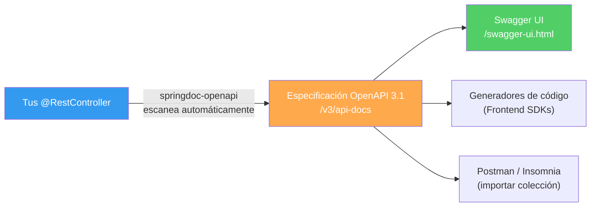

## 15 — Documentación de API (OpenAPI 3.1 + Swagger UI)

### Propósito
Aprender a documentar automáticamente tu API REST usando OpenAPI 3.1 y Swagger UI mediante la librería `springdoc-openapi`, para que cualquier desarrollador frontend o consumidor de tu API pueda explorar y probar los endpoints desde un navegador.

### Problema que resuelve
Sin documentación de API:
- El equipo frontend **no sabe qué endpoints existen**, qué parámetros necesitan ni qué respuestas esperar.
- Cada cambio en la API requiere actualizar un documento Word/Confluence **manualmente** (que siempre se desactualiza).
- Los QA no pueden probar los endpoints sin herramientas externas como Postman.
- Los nuevos miembros del equipo tardan semanas en entender la API.

### Cómo lo resuelve
`springdoc-openapi` escanea tus Controllers automáticamente y genera:
- Una especificación **OpenAPI 3.1** en formato JSON (`/v3/api-docs`).
- Una interfaz **Swagger UI** interactiva (`/swagger-ui.html`) donde puedes explorar y probar endpoints directamente desde el navegador.
- Todo se actualiza automáticamente cuando cambias tu código. La documentación **nunca se desactualiza**.



---

### Antes vs Ahora

#### Antes — Swagger 2 con `springfox` y XML/JSON manual
```xml
<!-- pom.xml -->
<dependency>
    <groupId>io.springfox</groupId>
    <artifactId>springfox-swagger2</artifactId>
    <version>2.9.2</version>
</dependency>
<dependency>
    <groupId>io.springfox</groupId>
    <artifactId>springfox-swagger-ui</artifactId>
    <version>2.9.2</version>
</dependency>
```
```java
// Config manual + spec Swagger 2 (obsoleto)
@Configuration
@EnableSwagger2
public class SwaggerConfig {
    @Bean
    public Docket api() {
        return new Docket(DocumentationType.SWAGGER_2)
            .select()
            .apis(RequestHandlerSelectors.basePackage("com.example"))
            .paths(PathSelectors.any())
            .build()
            .apiInfo(new ApiInfoBuilder()
                .title("Books API")
                .version("1.0")
                .build());
    }
}

@Api(tags = "Books")
@RestController
public class BookController {
    @ApiOperation(value = "Listar libros")
    @ApiResponses({
        @ApiResponse(code = 200, message = "OK")
    })
    @GetMapping("/api/books")
    public List<Book> findAll() { ... }
}
```
Problemas:
- `springfox` está **sin mantenimiento** desde 2020 y **no soporta Spring Boot 3/4**.
- Usa la spec **Swagger 2**, no la moderna **OpenAPI 3.1**.
- Requiere `@EnableSwagger2` y un `Docket` bean con builders anidados.
- Anotaciones (`@Api`, `@ApiOperation`, `code=`) usan la API vieja `io.swagger.annotations`.

#### Ahora — OpenAPI 3.1 con `springdoc-openapi`
```xml
<dependency>
    <groupId>org.springdoc</groupId>
    <artifactId>springdoc-openapi-starter-webmvc-ui</artifactId>
    <version>2.6.0</version>
</dependency>
```
```java
@Configuration
public class OpenApiConfig {
    @Bean
    public OpenAPI customOpenAPI() {
        return new OpenAPI().info(new Info()
            .title("Books API").version("1.0")
            .description("API de ejemplo del módulo 15"));
    }
}

@RestController
@RequestMapping("/api/books")
@Tag(name = "Books")
public class BookController {
    @Operation(summary = "Listar libros")
    @ApiResponses({
        @ApiResponse(responseCode = "200", description = "OK")
    })
    @GetMapping
    public List<Book> findAll() { ... }
}
```
Beneficios:
- Compatible con **Spring Boot 4** y **Jakarta EE 10**.
- Genera **OpenAPI 3.1**, la spec estándar actual soportada por todo el ecosistema.
- Cero configuración: agregar la dependencia ya expone `/swagger-ui.html`.
- Anotaciones modernas `io.swagger.v3.oas.annotations` (`@Operation`, `@Tag`, `responseCode`).

---

### Estructura
```
15-documentacion-api/
├── pom.xml
├── build.ps1 / build.sh
├── src/main/java/com/springroadmap/docs/
│   ├── DocumentacionApiApplication.java
│   ├── config/OpenApiConfig.java
│   ├── controller/BookController.java
│   └── model/Book.java
├── src/main/resources/application.yml
└── src/test/java/com/springroadmap/docs/
    ├── DocumentacionApiApplicationTests.java     (contextLoads)
    ├── OpenApiIntegrationTest.java               (TestRestTemplate)
    └── controller/BookControllerTest.java        (MockMvc standalone)
```

### Cómo ejecutar
```bash
# Windows
./build.ps1
# Linux/macOS
./build.sh

java -jar target/documentacion-api-1.0.0.jar
```
Luego abrir:
- Swagger UI:  http://localhost:8080/swagger-ui.html
- OpenAPI JSON: http://localhost:8080/v3/api-docs

### Endpoints
| Método | Ruta              | Descripción                  |
|--------|-------------------|------------------------------|
| GET    | `/api/books`      | Listar todos los libros      |
| GET    | `/api/books/{id}` | Buscar un libro por ID       |
| POST   | `/api/books`      | Crear un nuevo libro         |
| GET    | `/v3/api-docs`    | Spec OpenAPI 3.1 (JSON)      |
| GET    | `/swagger-ui.html`| Swagger UI                   |

---

### FAQ

**1. ¿Por qué `springdoc` y no `springfox`?**
`springfox` no se actualiza desde 2020 y no funciona con Spring Boot 3/4. `springdoc-openapi` es el estándar de facto para OpenAPI 3.1 en el ecosistema Spring moderno.

**2. ¿Necesito anotar todos mis Controllers para que aparezcan?**
No. `springdoc` escanea automáticamente cualquier `@RestController`. Las anotaciones `@Operation`, `@ApiResponse` y `@Tag` solo enriquecen la documentación con textos más claros.

**3. ¿Dónde está `/swagger-ui.html`? Me redirige a `/swagger-ui/index.html`.**
Es intencional. `/swagger-ui.html` es un alias configurable (`springdoc.swagger-ui.path`) que redirige (302) a la ruta real `/swagger-ui/index.html` servida por WebJars.

**4. ¿Puedo cambiar el path `/v3/api-docs`?**
Sí, con `springdoc.api-docs.path: /openapi.json` (por ejemplo). Muchas empresas lo mueven a `/api/docs` para uniformizar prefijos.

**5. Si uso Spring Security, ¿por qué Swagger UI da 401?**
Porque Security bloquea las rutas por defecto. Hay que permitirlas explícitamente:
```java
.requestMatchers("/v3/api-docs/**", "/swagger-ui/**", "/swagger-ui.html").permitAll()
```

**6. ¿Puedo generar clientes (SDKs) del frontend automáticamente?**
Sí. Con la spec JSON `/v3/api-docs` puedes usar `openapi-generator` para generar clientes TypeScript, Java, Python, etc. Es una de las mayores ventajas de OpenAPI.

**7. ¿Diferencia entre `@ApiResponse` (OpenAPI 3) y el viejo de Swagger 2?**
El moderno vive en `io.swagger.v3.oas.annotations.responses.ApiResponse` y usa `responseCode = "200"` (String). El viejo era `io.swagger.annotations.ApiResponse` con `code = 200` (int). **Nunca los mezcles**: usa siempre `io.swagger.v3.*`.

**8. ¿Por qué el test de integración usa TestRestTemplate y no MockMvc?**
Porque los endpoints `/v3/api-docs` y `/swagger-ui/index.html` son servidos por filtros/servlets registrados por springdoc que **solo se activan con un servidor real**. MockMvc no los levanta.

**9. ¿Cómo desactivo Swagger UI en producción?**
```yaml
springdoc:
  swagger-ui:
    enabled: false
  api-docs:
    enabled: false
```
O usa perfiles: activa el bloque solo cuando `spring.profiles.active=dev`.
