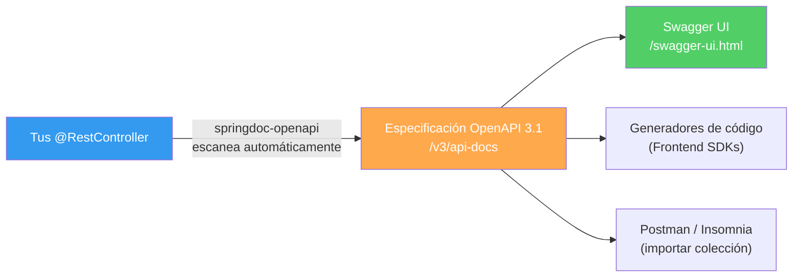

## 15 — Documentación de API (OpenAPI 3.1 + Swagger UI)

### Propósito
Aprender a documentar automáticamente tu API REST usando OpenAPI 3.1 y Swagger UI mediante la librería `springdoc-openapi`, para que cualquier desarrollador frontend o consumidor de tu API pueda explorar y probar los endpoints desde un navegador.

### Problema que resuelve
Sin documentación de API:
- El equipo frontend **no sabe qué endpoints existen**, qué parámetros necesitan ni qué respuestas esperar.
- Cada cambio en la API requiere actualizar un documento Word/Confluence **manualmente** (que siempre se desactualiza).
- Los QA no pueden probar los endpoints sin herramientas externas como Postman.
- Los nuevos miembros del equipo tardan semanas en entender la API.

### Cómo lo resuelve
`springdoc-openapi` escanea tus Controllers automáticamente y genera:
- Una especificación **OpenAPI 3.1** en formato JSON (`/v3/api-docs`).
- Una interfaz **Swagger UI** interactiva (`/swagger-ui.html`) donde puedes explorar y probar endpoints directamente desde el navegador.
- Todo se actualiza automáticamente cuando cambias tu código. La documentación **nunca se desactualiza**.

### Por qué aprenderlo
En empresas, la documentación de API es el **contrato** entre el backend y el frontend. Es obligatoria para equipos distribuidos, APIs públicas y arquitecturas de microservicios. Swagger UI es la herramienta de documentación más usada en la industria.



---

### Glosario Básico

#### `springdoc-openapi`
Librería que genera automáticamente documentación OpenAPI 3.1 a partir de tus Controllers de Spring.
```xml
<dependency>
    <groupId>org.springdoc</groupId>
    <artifactId>springdoc-openapi-starter-webmvc-ui</artifactId>
    <version>2.8.0</version>
</dependency>
```

#### `@Operation`
Describe un endpoint específico: qué hace, resumen y descripción detallada.
```java
@Operation(summary = "Obtener usuario por ID", description = "Busca un usuario en la BD por su ID único")
@GetMapping("/{id}")
public UserResponse getById(@PathVariable Long id) { }
```

#### `@ApiResponse`
Documenta los posibles códigos de respuesta de un endpoint.

#### `@Schema`
Documenta los campos de un DTO en la especificación OpenAPI.

---

### Conceptos

#### 1. Configuración Básica
- **Qué es** — Con solo agregar la dependencia, Swagger UI ya está disponible. Para personalizar la información de la API (título, versión, contacto), creas un `@Bean` de `OpenAPI`.
- **Código** — Configuración personalizada:
  ```java
  @Configuration
  public class OpenApiConfig {
  
      @Bean
      public OpenAPI customOpenAPI() {
          return new OpenAPI()
              .info(new Info()
                  .title("Spring Roadmap API")
                  .version("1.0.0")
                  .description("API REST para el roadmap de aprendizaje de Spring Boot 4")
                  .contact(new Contact()
                      .name("Edgardo")
                      .email("edgardo@example.com")
                      .url("https://github.com/edgardo001"))
              )
              .addSecurityItem(new SecurityRequirement().addList("bearerAuth"))
              .components(new Components()
                  .addSecuritySchemes("bearerAuth",
                      new SecurityScheme()
                          .type(SecurityScheme.Type.HTTP)
                          .scheme("bearer")
                          .bearerFormat("JWT")
                          .description("Ingresa tu JWT token")
                  )
              );
      }
  }
  ```
  ```yaml
  # application.yml
  springdoc:
    api-docs:
      path: /v3/api-docs
    swagger-ui:
      path: /swagger-ui.html
      operations-sorter: method  # Ordenar por método HTTP
      tags-sorter: alpha         # Ordenar tags alfabéticamente
  ```

#### 2. Anotar Controllers con `@Operation` y `@ApiResponse`
- **Qué es** — Anotaciones que enriquecen la documentación generada, añadiendo descripciones, códigos de respuesta y ejemplos.
- **Código** — Controller completamente documentado:
  ```java
  @RestController
  @RequestMapping("/api/users")
  @Tag(name = "Usuarios", description = "Operaciones CRUD para gestión de usuarios")
  public class UserController {
  
      @Operation(
          summary = "Obtener usuario por ID",
          description = "Busca un usuario en la base de datos por su identificador único"
      )
      @ApiResponses({
          @ApiResponse(responseCode = "200", description = "Usuario encontrado",
              content = @Content(schema = @Schema(implementation = UserResponse.class))),
          @ApiResponse(responseCode = "404", description = "Usuario no encontrado",
              content = @Content(schema = @Schema(implementation = ErrorResponse.class)))
      })
      @GetMapping("/{id}")
      public UserResponse getById(
              @Parameter(description = "ID del usuario", example = "1")
              @PathVariable Long id) {
          return userMapper.toResponse(userService.findById(id));
      }
  
      @Operation(summary = "Crear nuevo usuario")
      @ApiResponses({
          @ApiResponse(responseCode = "201", description = "Usuario creado exitosamente"),
          @ApiResponse(responseCode = "400", description = "Datos de entrada inválidos"),
          @ApiResponse(responseCode = "409", description = "El email ya está registrado")
      })
      @PostMapping
      public ResponseEntity<UserResponse> create(
              @io.swagger.v3.oas.annotations.parameters.RequestBody(
                  description = "Datos del nuevo usuario",
                  required = true,
                  content = @Content(schema = @Schema(implementation = CreateUserRequest.class))
              )
              @Valid @RequestBody CreateUserRequest request) {
          User user = userService.create(userMapper.toEntity(request));
          return ResponseEntity.status(HttpStatus.CREATED)
              .body(userMapper.toResponse(user));
      }
  }
  ```

#### 3. Documentar DTOs con `@Schema`
- **Qué es** — La anotación `@Schema` añade descripciones y ejemplos a los campos de tus DTOs, que luego aparecen en Swagger UI.
- **Código**:
  ```java
  @Schema(description = "Datos para crear un nuevo usuario")
  public record CreateUserRequest(
      @Schema(description = "Nombre de usuario único", example = "edgardo", minLength = 3, maxLength = 50)
      @NotBlank String username,
      
      @Schema(description = "Correo electrónico", example = "edgardo@gmail.com")
      @Email String email,
      
      @Schema(description = "Contraseña segura", example = "miPassword123!", minLength = 8)
      @NotBlank @Size(min = 8) String password
  ) { }
  ```

#### 4. Edge Cases y Errores Comunes

| Error | Causa | Solución |
|-------|-------|----------|
| Swagger UI no carga | Spring Security bloquea `/swagger-ui/**` | Agregar `.requestMatchers("/swagger-ui/**", "/v3/api-docs/**").permitAll()` |
| Endpoints de Security no aparecen | Los filtros no son Controllers | Los filtros JWT no se documentan automáticamente; documentar manualmente `/login` |
| Anotaciones duplicadas | Usar `@ApiResponse` de Swagger 2 y OpenAPI 3 mezcladas | Solo usar `io.swagger.v3.oas.annotations` |

---

### Ejercicios
1. Agrega `springdoc-openapi-starter-webmvc-ui` al `pom.xml` y accede a `http://localhost:8080/swagger-ui.html`.
2. Crea un `OpenApiConfig` con título, versión y esquema de seguridad JWT.
3. Documenta un Controller con `@Operation`, `@ApiResponse` y `@Tag`.
4. Documenta un DTO con `@Schema` incluyendo descripciones y ejemplos.
5. Prueba ejecutar un endpoint directamente desde Swagger UI usando el botón "Try it out".

### Cómo ejecutar
```bash
cd 15-documentacion-api
mvn spring-boot:run
# Abrir: http://localhost:8080/swagger-ui.html
```

### Archivos del Proyecto
| Archivo | Propósito |
|---------|-----------|
| `pom.xml` | Dependencia: `springdoc-openapi-starter-webmvc-ui`. |
| `config/OpenApiConfig.java` | Personalización del título, versión y seguridad JWT. |
| `controller/UserController.java` | Controller documentado con `@Operation` y `@ApiResponse`. |
| `dto/CreateUserRequest.java` | DTO documentado con `@Schema`. |
| `dto/UserResponse.java` | DTO de respuesta documentado. |
