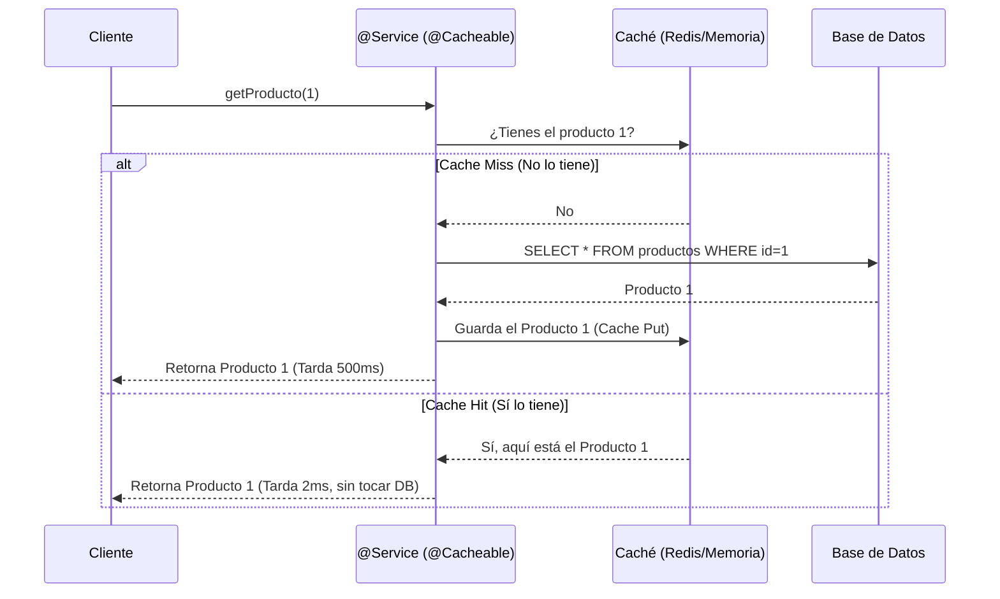

## 17 — Caché en Spring Boot (@Cacheable, Redis/Caffeine)

### Propósito
Aprender a mejorar drásticamente el rendimiento de tu aplicación Spring Boot almacenando en caché los resultados de operaciones lentas (como consultas a base de datos o llamadas a APIs externas), utilizando las anotaciones estándar de Spring (`@Cacheable`, `@CacheEvict`, `@CachePut`) y motores de caché como ConcurrentHashMap, Caffeine o Redis.

### Problema que resuelve
Imagina un endpoint que devuelve el catálogo de productos de una tienda. Este catálogo rara vez cambia (quizás una vez a la semana), pero la consulta a la base de datos toma 500ms y tienes 1,000 usuarios consultándolo por minuto.
- **Sobrecarga de Base de Datos:** Tu BD se satura respondiendo 1,000 veces por minuto la misma pregunta con la misma respuesta.
- **Latencia alta:** El usuario siempre espera 500ms para ver la pantalla principal.
- **Desperdicio de recursos:** Gasto innecesario de CPU y memoria en el servidor y en la BD.

### Cómo lo resuelve
Spring Cache actúa como un "atajo". Cuando llamas a un método anotado con `@Cacheable("productos")`, Spring intercepta la llamada:
1. Verifica si la respuesta ya está en el caché `"productos"`.
2. Si está, la devuelve inmediatamente (0ms) sin ejecutar tu método.
3. Si no está, ejecuta tu método (500ms), guarda la respuesta en el caché, y la devuelve.

### Por qué aprenderlo
En aplicaciones de alto tráfico, la base de datos siempre es el cuello de botella. Añadir una capa de caché es la forma más barata y efectiva de escalar una aplicación para soportar millones de peticiones. Es una técnica fundamental de arquitectura de software; no saber implementar caché te descalifica para crear sistemas escalables.



---

### Glosario Básico

#### `@EnableCaching`
Anotación que se coloca en una clase de configuración o en la clase principal (Main) para activar el soporte de caché en Spring. Sin ella, las demás anotaciones son ignoradas.

#### `@Cacheable(value="nombreCache", key="#id")`
Se pone sobre un método. Indica que el resultado del método debe guardarse en caché. Si se llama otra vez con los mismos parámetros, se devuelve el caché sin ejecutar el método.

#### `@CacheEvict(value="nombreCache", key="#id")`
Elimina un elemento específico (o todo el caché con `allEntries=true`). Se usa cuando actualizas o borras un registro en la base de datos, para que el caché no tenga datos viejos.

#### `@CachePut`
A diferencia de `@Cacheable`, este **siempre** ejecuta el método y actualiza el caché con el nuevo resultado. Útil en métodos de actualización (Update).

#### Redis / Caffeine
Spring Cache es solo una abstracción (una interfaz). Necesita un motor real detrás.
- **ConcurrentMap (Por defecto):** Usa la RAM de la propia app. Básico, para pruebas.
- **Caffeine:** Usa la RAM, pero súper optimizado, con expiración por tiempo (TTL) y tamaño máximo.
- **Redis:** Servidor externo de caché. Permite que múltiples instancias de tu app compartan el mismo caché (Caché Distribuido).

---

### Conceptos

#### 1. Activación y Uso Básico (`@Cacheable`)
- **Qué es** — La forma más simple de implementar caché. Le dices a Spring "recuerda la salida de esta función basándote en su entrada".
- **Por qué importa** — Te permite agregar caché sin modificar la lógica interna de tu método, siguiendo el principio de Separation of Concerns (usando AOP, Programación Orientada a Aspectos).
- **Código** — Caché básico:
  ```java
  @SpringBootApplication
  @EnableCaching // ¡Obligatorio activar el caché!
  public class CacheApp { ... }
  ```
  ```java
  @Service
  @Slf4j
  public class ProductService {
  
      private final ProductRepository repository;
      
      public ProductService(ProductRepository repository) {
          this.repository = repository;
      }
  
      /**
       * Si llamo getById(5):
       * 1ra vez: Imprime el LOG, consulta la BD (lento) y guarda en caché "products".
       * 2da vez: NO imprime LOG, NO consulta la BD, devuelve instantáneo.
       */
      @Cacheable(value = "products", key = "#id")
      public Product getById(Long id) {
          log.info("Consultando BD por producto ID: {}", id);
          simulateSlowService(); // Simula demora de 2 segundos
          return repository.findById(id).orElseThrow();
      }
      
      private void simulateSlowService() {
          try { Thread.sleep(2000L); } catch (InterruptedException e) { }
      }
  }
  ```
- **Analogía** — Es como memorizar una tabla de multiplicar. La primera vez que te preguntan 13x14, haces el cálculo mental (consulta a BD). Si te lo preguntan 5 segundos después, respondes inmediatamente de memoria (Caché Hit) sin calcular nada.

#### 2. Mantenimiento del Caché (`@CacheEvict` y `@CachePut`)
- **Qué es** — El mayor problema del caché es la "invalidación". Si un producto cambia de precio, pero el caché sigue devolviendo el precio viejo, tienes un problema grave. Evict borra el caché, Put lo actualiza.
- **Por qué importa** — Garantiza que los usuarios siempre vean la información más reciente después de una modificación (consistencia de datos).
- **Código** — Manejo de actualizaciones:
  ```java
  @Service
  public class ProductService {
      
      // ... (método getById con @Cacheable)
  
      /**
       * @CachePut siempre ejecuta el método y pone el resultado en el caché.
       * Así, la próxima vez que llamen a getById(), tendrá el dato fresco.
       */
      @CachePut(value = "products", key = "#product.id")
      public Product updatePrice(Product product) {
          log.info("Actualizando precio en BD y actualizando caché...");
          return repository.save(product);
      }
  
      /**
       * @CacheEvict elimina el elemento del caché.
       * allEntries = true borraría TODOS los productos del caché "products".
       */
      @CacheEvict(value = "products", key = "#id")
      public void deleteProduct(Long id) {
          log.info("Borrando de la BD y limpiando caché...");
          repository.deleteById(id);
      }
  }
  ```
- **Analogía** — Imagina el menú de un restaurante escrito en una pizarra (Caché). Si cambias el precio de la hamburguesa en el sistema interno (BD), debes mandar a alguien a borrar el precio viejo de la pizarra (`@CacheEvict`) o escribir el nuevo encima (`@CachePut`), sino los clientes pagarán el precio incorrecto.

#### 3. Caché Local Profesional con Caffeine
- **Qué es** — El caché por defecto de Spring (ConcurrentHashMap) crece infinitamente hasta causarte un OutOfMemory (OOM). Caffeine es una librería de alto rendimiento que permite poner reglas: "máximo 10,000 elementos" o "borrar después de 5 minutos".
- **Por qué importa** — Previene que el servidor colapse por uso de RAM y asegura que los datos no se vuelvan "eternos" (Stale Data).
- **Código** — Configuración de Caffeine:
  ```xml
  <!-- En el pom.xml -->
  <dependency>
      <groupId>com.github.ben-manes.caffeine</groupId>
      <artifactId>caffeine</artifactId>
  </dependency>
  ```
  ```yaml
  # application.yml
  spring:
    cache:
      type: caffeine
      caffeine:
        # spec: máximo 1000 items, expiran 10 minutos después de ser escritos
        spec: maximumSize=1000,expireAfterWrite=10m
  ```

#### 4. Caché Distribuido con Redis
- **Qué es** — Cuando tienes tu aplicación replicada en 3 servidores (instancias), un caché local (Caffeine) significa que cada servidor tiene su propia copia. Redis es un servidor de caché centralizado que todos comparten.
- **Por qué importa** — Si el servidor A actualiza un producto (borra su caché local), el servidor B seguirá mostrando el precio viejo porque su caché local no se enteró. Con Redis (distribuido), todos leen y borran de la misma fuente.
- **Casos de Uso Empresariales** — E-commerce en Black Friday. Tienes 50 contenedores Docker corriendo tu app. Todos consultan un cluster de Redis ElastiCache en AWS. Si se cae un contenedor, el caché sigue intacto en Redis.

#### 5. Edge Cases y Errores Comunes

| Error | Causa | Solución |
|-------|-------|----------|
| El método no se guarda en caché | Llamar a un método `@Cacheable` desde otro método dentro de la *misma clase* | Spring AOP usa proxies. Debes llamar al método desde *otra clase* (ej: Controller) o inyectarte a ti mismo (Self-injection). |
| Out Of Memory (OOM) | Usar el caché por defecto sin límite de tamaño | Usar Caffeine (local) o Redis con TTL y Eviction Policy. |
| Clave de caché incorrecta | Objetos complejos como key sin implementar `equals()`/`hashCode()` | Usar IDs únicos como llave: `key = "#user.id"`. |
| Datos desactualizados (Stale) | Olvidar colocar `@CacheEvict` en los métodos de Update/Delete | Revisar siempre el ciclo de vida del dato; si se lee con caché, debe invalidarse al modificar. |
| Clases no serializables | Guardar objetos en Redis que no implementan `Serializable` | Implementar `Serializable` o configurar Spring Data Redis con `GenericJackson2JsonRedisSerializer`. |

---

### Ejercicios
1. Crea un servicio `WeatherService` con un método `getTemperature(String city)` que simule un retraso de 3 segundos (usando `Thread.sleep`).
2. Anota la clase principal con `@EnableCaching`.
3. Anota el método con `@Cacheable("weather")`.
4. Crea un endpoint REST y consúltalo dos veces. Verifica en los logs que la primera vez demora 3 segundos y la segunda responde instantáneamente.
5. **(Avanzado)** Agrega Caffeine al `pom.xml` y configura en el `application.yml` para que el caché expire a los 15 segundos (`expireAfterWrite=15s`). Haz la consulta, espera 16 segundos, y verifica que vuelve a demorar 3 segundos.

### Cómo ejecutar
```bash
cd 17-cache
mvn spring-boot:run

# 1ra llamada: tomará ~2 segundos
curl http://localhost:8080/api/products/1

# 2da llamada: instantánea (Cache Hit)
curl http://localhost:8080/api/products/1
```

### Archivos del Proyecto
| Archivo | Propósito |
|---------|-----------|
| `pom.xml` | Dependencias: `spring-boot-starter-cache` y `caffeine`. |
| `CacheApplication.java` | Main class con la anotación `@EnableCaching`. |
| `application.yml` | Configuración de especificaciones de Caffeine (TTL, Size). |
| `service/ProductService.java` | Lógica de negocio con `@Cacheable`, `@CachePut` y `@CacheEvict`. |
| `controller/ProductController.java` | Endpoints REST para probar los tiempos de respuesta. |
| `domain/Product.java` | Entidad JPA o Record DTO. |

---

## Implementación real de este módulo

Este módulo implementa la abstracción de caché de Spring con **Caffeine** (in-memory), sin depender de Redis para evitar servidores externos en los tests.

### Estructura

```
17-cache/
├── pom.xml                              spring-boot-starter-cache + caffeine
├── build.sh / build.ps1                 scripts de build (JDK 21 + Maven 3.9)
└── src/
    ├── main/java/com/springroadmap/cache/
    │   ├── CacheApplication.java        Main
    │   ├── config/CacheConfig.java      @EnableCaching + CaffeineCacheManager
    │   ├── service/SlowService.java     @Cacheable + @CacheEvict (contador)
    │   └── controller/ItemController.java  GET /api/items/{id}, DELETE /api/items/{id}
    ├── main/resources/application.yml
    └── test/java/com/springroadmap/cache/
        ├── CacheApplicationTests.java           contextLoads
        ├── service/SlowServiceCacheTest.java    verifica hit/miss/evict
        └── controller/ItemControllerTest.java   MockMvc standalone
```

### Endpoints

| Método | Path | Efecto |
|--------|------|--------|
| `GET`    | `/api/items/{id}` | Primera vez: ~500ms + guarda en caché. Siguientes: instantáneo. |
| `DELETE` | `/api/items/{id}` | Invalida el caché (`@CacheEvict`). |

### Configuración de Caffeine

```java
CaffeineCacheManager manager = new CaffeineCacheManager("items");
manager.setCaffeine(Caffeine.newBuilder()
        .maximumSize(100)
        .expireAfterWrite(60, TimeUnit.SECONDS));
```

- `maximumSize=100` evita OOM en caso de muchas entradas distintas.
- `expireAfterWrite=60s` evita "stale data" indefinido.

---

## Antes vs Ahora

### Antes: caché manual con `HashMap` + `volatile`

```java
@Service
public class SlowServiceManual {

    // "volatile" garantiza visibilidad entre hilos, pero NO atomicidad.
    private volatile Map<Long, String> cache = new ConcurrentHashMap<>();

    public String getItem(Long id) {
        String cached = cache.get(id);
        if (cached != null) {
            return cached;                     // hit manual
        }
        // Sección crítica: dos hilos pueden entrar antes de cachear -> stampede.
        try { Thread.sleep(500); } catch (InterruptedException e) { }
        String value = "ITEM_" + id;
        cache.put(id, value);                  // put manual
        return value;
    }

    public void invalidate(Long id) {
        cache.remove(id);                      // evict manual
    }
}
```

Problemas:
- El código **de negocio se mezcla con la lógica de caché** (viola Separation of Concerns).
- **Crece infinito** hasta OOM: no hay `maximumSize`.
- **No expira**: si el dato cambia en la BD, el caché sirve datos viejos para siempre.
- **Cache stampede**: bajo concurrencia, N hilos pueden ejecutar `sleep(500)` a la vez para la misma llave.
- Cada método (`get`, `evict`, `update`) hay que **implementarlo a mano** en cada servicio.
- Testear el comportamiento (hit/miss/evict) requiere inspeccionar el `Map` interno.

### Ahora: `@Cacheable` + `@CacheEvict` + Caffeine

```java
@Service
public class SlowService {

    @Cacheable("items")
    public String getItem(Long id) {
        try { Thread.sleep(500); } catch (InterruptedException e) { }
        return "ITEM_" + id;
    }

    @CacheEvict("items")
    public void invalidate(Long id) { }
}
```

Ventajas:
- El método queda **puro**: 0 líneas dedicadas a caché.
- El `CacheManager` centraliza `maximumSize` y `expireAfterWrite` (una sola línea cambia toda la política).
- Caffeine implementa **W-TinyLFU** (mejor hit-rate que LRU) y estrategias contra stampede.
- Cambiar de Caffeine a **Redis distribuido** = cambiar solo el bean `CacheManager`. **Cero cambios** en el service.
- Los tests verifican el comportamiento observando un contador externo, sin conocer la estructura interna del caché.

---

## FAQ

**1. ¿Por qué el `SlowServiceCacheTest` usa `@SpringBootTest` y no un unit test puro?**
Porque `@Cacheable` funciona vía **proxy AOP**: solo se activa cuando el bean lo entrega el contexto de Spring. Si haces `new SlowService()` no hay proxy y el caché NO se aplica: los tests parecerían fallar aunque el código sea correcto.

**2. ¿Por qué en `ItemControllerTest` usamos MockMvc standalone si eso ignora el caché?**
Ese test verifica solamente el **binding HTTP** (ruta, verbo, status, payload). La verificación del caché ya está cubierta en `SlowServiceCacheTest` con contexto real. Standalone es más rápido y evita levantar todo el contexto para una prueba de wiring.

**3. Llamé a un método `@Cacheable` desde otro método de la misma clase y no cachea. ¿Por qué?**
Porque el proxy AOP intercepta llamadas **externas** al bean. Una llamada `this.getItem(id)` va directo al método, sin pasar por el proxy. Soluciones: (a) inyectar el propio bean vía `@Autowired` a sí mismo (self-injection), (b) mover el método a otro bean, o (c) usar `AopContext.currentProxy()`.

**4. ¿Por qué Caffeine y no Redis?**
Redis es un **servidor externo** que requiere levantarlo (Docker, Testcontainers, un servidor local) para que los tests pasen. Caffeine es una librería in-memory: **cero dependencias externas**, tests deterministas. La API de Spring Cache es la misma, así que la migración a Redis luego es trivial (solo cambia el `CacheManager`).

**5. ¿Qué diferencia hay entre `@CacheEvict` y `@CachePut`?**
`@CacheEvict` **borra** la entrada del caché (la próxima lectura ejecuta el método real). `@CachePut` **siempre ejecuta el método** y guarda el resultado en el caché, sin importar si ya había un valor. Usa `@CachePut` en operaciones de update para que la nueva lectura ya tenga el dato fresco sin un ciclo miss.

**6. ¿Qué pasa cuando el caché se llena (maximumSize=100)?**
Caffeine expulsa entradas usando **W-TinyLFU** (Window-TinyLFU), un algoritmo que combina LRU con frecuencia de acceso. Es superior a LRU puro en cargas reales: preserva ítems "populares" aunque no sean los más recientes.

**7. ¿Por qué `expireAfterWrite` y no `expireAfterAccess`?**
- `expireAfterWrite`: expira N segundos después de **escribir**. Garantiza refresco cada N segundos aunque el dato se lea mucho -> mejor para datos que pueden desactualizarse.
- `expireAfterAccess`: expira N segundos después de la **última lectura**. Mantiene "calientes" los datos que se usan; útil para sesiones, pero puede servir datos viejos indefinidamente si se leen constantemente.

**8. Mi contador (`callCount`) da valores raros bajo concurrencia. ¿Por qué usar `AtomicInteger`?**
Un `int` normal no es thread-safe para `count++` (operación de 3 pasos: leer, sumar, escribir). `AtomicInteger.incrementAndGet()` es atómico vía CAS (Compare-And-Swap) del CPU, así que dos hilos concurrentes cuentan correctamente.

**9. ¿El caché sobrevive a reiniciar la app?**
No. Caffeine vive en la RAM del proceso. Si reinicias, el caché arranca vacío (cold cache). Para persistencia entre reinicios necesitas Redis, Hazelcast o similar.

**10. ¿Cómo cacheo con múltiples parámetros?**
Con `key` en SpEL: `@Cacheable(value="items", key="#tenantId + ':' + #id")`. Si no defines `key`, Spring usa `SimpleKeyGenerator` que compone los parámetros (funciona si todos tienen buen `equals/hashCode`).

