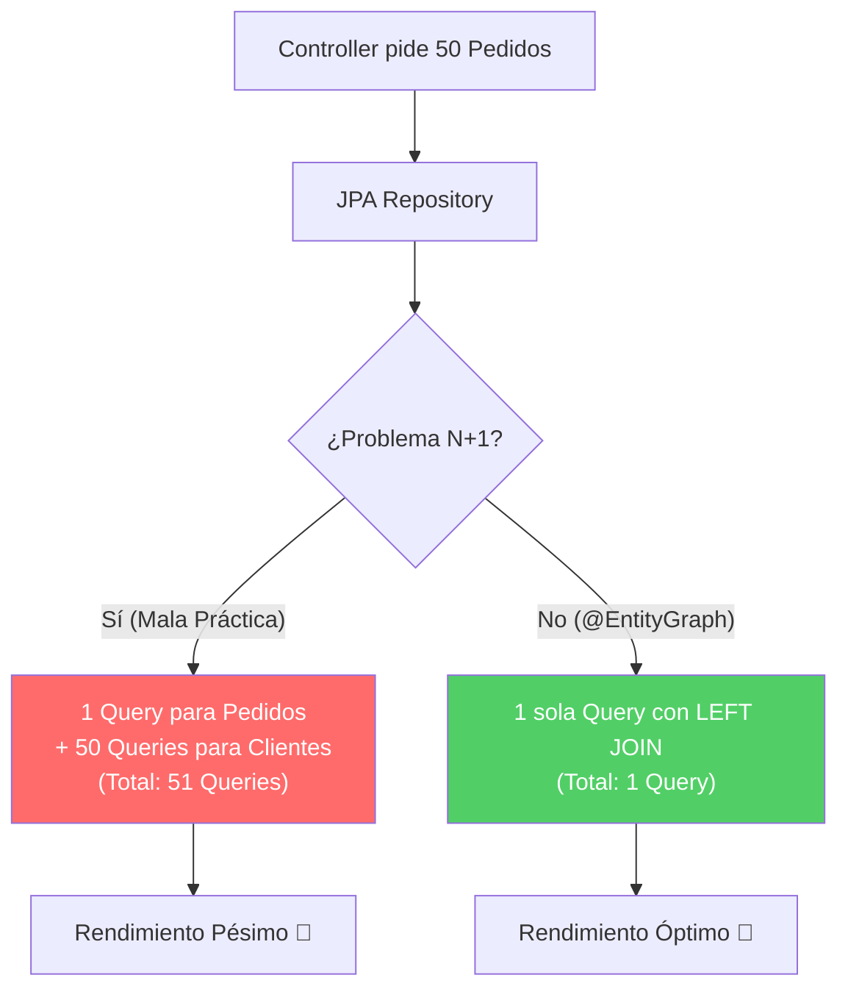

## 18 — JPA Avanzado (EntityGraph, Problema N+1 y Auditing)

### Propósito
Aprender técnicas avanzadas de JPA e Hibernate para resolver problemas graves de rendimiento (como el famoso "Problema N+1") usando `@EntityGraph` o `JOIN FETCH`, y aprender a llevar un registro automático de creación y modificación de entidades usando Spring Data JPA Auditing.

### Problema que resuelve
- **Problema N+1 Queries**: Tienes una lista de 50 pedidos y quieres mostrar el nombre del cliente de cada uno. Si las relaciones son `FetchType.LAZY`, JPA hace 1 consulta para traer los 50 pedidos, y luego **50 consultas adicionales** (una por cada cliente). Esto mata el rendimiento de la base de datos (51 consultas en lugar de 1).
- **Auditoría Manual**: Toda tabla empresarial necesita saber "quién creó esto" y "cuándo se modificó por última vez". Llenar estos campos a mano (`setCreatedAt`, `setUpdatedAt`) en cada Service es repetitivo y propenso a olvidos.

### Cómo lo resuelve
- **@EntityGraph / JOIN FETCH**: Permiten decirle a JPA: "Trae los Pedidos Y también trae los Clientes en una sola consulta SQL usando un JOIN", eliminando las múltiples consultas.
- **JPA Auditing**: Anotaciones como `@CreatedDate`, `@LastModifiedDate` y `@CreatedBy` que Spring llena automáticamente justo antes de hacer el `INSERT` o `UPDATE` en la base de datos.

### Por qué aprenderlo
El problema N+1 es la **causa número uno** de problemas de rendimiento en aplicaciones Java empresariales. Detectarlo y resolverlo es una habilidad obligatoria para un desarrollador backend Senior. La auditoría, por otro lado, es un requisito legal y de seguridad en el 99% de los proyectos corporativos.



---

### Glosario Básico

#### `FetchType.LAZY`
Carga perezosa. El objeto relacionado no se busca en la base de datos hasta que llamas a su método `get()` (ej: `pedido.getCliente()`).

#### Problema N+1
Ocurre cuando iteras sobre una lista de "N" elementos cargados y, dentro del bucle, accedes a una relación `LAZY`. Hibernate genera 1 query inicial + "N" queries adicionales.

#### `@EntityGraph`
Anotación en el Repository que le indica a JPA qué relaciones `LAZY` debe traer de forma "Eager" (inmediata) en esa consulta específica, resolviendo el N+1.

#### `@EnableJpaAuditing`
Anotación en una clase de configuración que enciende el motor de auditoría automática de Spring Data JPA.

---

### Conceptos

#### 1. Entendiendo y Solucionando el N+1
- **Qué es** — El N+1 es una anomalía de rendimiento. Afecta especialmente al cargar listas. Aunque configures `@ManyToOne(fetch = FetchType.LAZY)` (que es la mejor práctica), si devuelves esa lista en un DTO y mapeas el hijo, el N+1 ocurrirá.
- **Por qué importa** — Si tu API devuelve 1,000 registros, harás 1,001 consultas a la base de datos. El servidor de base de datos colapsará bajo tráfico real.
- **Código** — Solución con `@EntityGraph`:
  ```java
  // 1. La Entidad (La relación es LAZY, buena práctica)
  @Entity
  public class Pedido {
      @Id @GeneratedValue(strategy = GenerationType.IDENTITY)
      private Long id;
  
      @ManyToOne(fetch = FetchType.LAZY)
      private Cliente cliente;
  }
  
  // 2. El Repositorio
  public interface PedidoRepository extends JpaRepository<Pedido, Long> {
      
      // MALA PRÁCTICA (Generará N+1 si accedes al cliente de cada pedido)
      List<Pedido> findAll(); 
  
      // BUENA PRÁCTICA: @EntityGraph
      // Le dice a JPA: "Para esta consulta, hazle JOIN a 'cliente'"
      @EntityGraph(attributePaths = {"cliente"})
      @Query("SELECT p FROM Pedido p")
      List<Pedido> findAllConCliente();
      
      // OTRA ALTERNATIVA: JOIN FETCH en JPQL
      @Query("SELECT p FROM Pedido p JOIN FETCH p.cliente")
      List<Pedido> findAllConClienteJpql();
  }
  ```
- **Analogía** — Problema N+1: Vas al supermercado, compras un tomate, vuelves a casa. Regresas al supermercado, compras una lechuga, vuelves a casa. ¡Un viaje por cada ingrediente! EntityGraph (JOIN FETCH) es hacer una lista de compras y traer TODO en un solo viaje.

#### 2. Configurando JPA Auditing
- **Qué es** — Un mecanismo interceptor de Hibernate que escucha los eventos `PrePersist` y `PreUpdate` para rellenar campos de auditoría automáticamente.
- **Por qué importa** — Elimina código repetitivo de tus servicios y garantiza que el registro de fechas sea exacto y consistente.
- **Código** — Configuración y Entidad Base:
  ```java
  // 1. Activar la auditoría en una clase de configuración (o el Main)
  @Configuration
  @EnableJpaAuditing(auditorAwareRef = "auditorProvider")
  public class JpaAuditConfig {
      
      // Bean para decirle a JPA "quién" es el usuario actual
      @Bean
      public AuditorAware<String> auditorProvider() {
          return () -> {
              // Extraemos el usuario autenticado de Spring Security
              Authentication auth = SecurityContextHolder.getContext().getAuthentication();
              if (auth == null || !auth.isAuthenticated()) {
                  return Optional.of("SYSTEM");
              }
              return Optional.of(auth.getName());
          };
      }
  }
  
  // 2. Crear una clase base reutilizable (@MappedSuperclass)
  @MappedSuperclass
  @EntityListeners(AuditingEntityListener.class) // ¡Obligatorio!
  public abstract class AuditableEntity {
  
      @CreatedDate
      @Column(updatable = false)
      private LocalDateTime createdAt;
  
      @LastModifiedDate
      private LocalDateTime updatedAt;
  
      @CreatedBy
      @Column(updatable = false)
      private String createdBy;
  
      @LastModifiedBy
      private String lastModifiedBy;
      
      // Getters y Setters...
  }
  
  // 3. Heredar en tus entidades reales
  @Entity
  public class Producto extends AuditableEntity {
      @Id @GeneratedValue
      private Long id;
      private String nombre;
      private Double precio;
  }
  ```
- **Casos de Uso Empresariales** — Cumplimiento de normas (Compliance). Si un precio cambia mágicamente, sistemas financieros exigen saber exactamente a qué hora ocurrió la modificación y qué usuario (cajero/admin) la realizó (usando `@LastModifiedBy`).

#### 3. Edge Cases y Errores Comunes

| Error | Causa | Solución |
|-------|-------|----------|
| N+1 con colecciones múltiples | `@EntityGraph` a dos relaciones de tipo List | Causa Producto Cartesiano en BD. Usar `@EntityGraph` para una List, y `@BatchSize` para la segunda. |
| Fechas de auditoría son `null` | Faltó `@EntityListeners(AuditingEntityListener.class)` en la entidad | Agregar la anotación a la clase `@Entity` o `@MappedSuperclass`. |
| Las fechas son `null` (Caso 2) | Faltó `@EnableJpaAuditing` en la clase de configuración | Añadirlo en tu `@SpringBootApplication` o clase `@Configuration`. |
| `LazyInitializationException` | Acceder a una relación Lazy fuera de una transacción y sin EntityGraph | Usar `@EntityGraph` o DTO projections para traer los datos dentro de la transacción original. |

---

### Ejercicios
1. Crea una entidad `Autor` y una entidad `Libro` (`@ManyToOne` a Autor). Llena la base de datos con 10 libros y 3 autores (usa un archivo `data.sql`).
2. Activa en tu `application.yml`: `spring.jpa.show-sql=true`.
3. Haz un endpoint que devuelva todos los libros con el nombre de su autor usando `findAll()`. Observa la consola: verás el Problema N+1 (muchas consultas SELECT).
4. Crea un método en el repositorio `findAllConAutores()` y anótalo con `@EntityGraph(attributePaths = {"autor"})`. Cambia tu endpoint para usar este método. Observa la consola: ¡Solo hay un SELECT con LEFT OUTER JOIN!
5. Crea una clase base `Auditable` con `@CreatedDate` y `@LastModifiedDate`. Haz que `Libro` la herede. Crea un libro y verifica que la base de datos guarda la fecha automáticamente.

### Cómo ejecutar
```bash
cd 18-jpa-avanzado
mvn spring-boot:run

# Llama al endpoint malo y mira la consola del servidor (verás el N+1)
curl http://localhost:8080/api/libros/bad

# Llama al endpoint bueno y mira la consola (verás 1 solo query)
curl http://localhost:8080/api/libros/good
```

### Archivos del Proyecto
| Archivo | Propósito |
|---------|-----------|
| `config/JpaAuditConfig.java` | Configuración con `@EnableJpaAuditing`. |
| `domain/AuditableEntity.java` | Clase base abstracta con campos de auditoría. |
| `domain/Libro.java` | Entidad hija que sufre N+1. |
| `domain/Autor.java` | Entidad padre en la relación. |
| `repository/LibroRepository.java` | Consultas usando `@EntityGraph`. |
| `controller/LibroController.java` | Comparativa entre endpoint con y sin N+1. |
