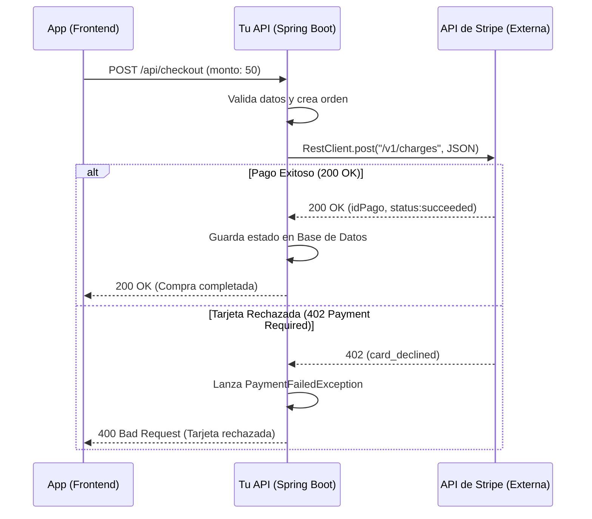

## 19 — Consumo de APIs Externas (RestClient y WebClient)

### Propósito
Aprender a consumir APIs externas (de terceros u otros microservicios) desde tu aplicación Spring Boot, utilizando la moderna interfaz `RestClient` (introducida en Spring 3.2 como reemplazo de RestTemplate) y un vistazo a `WebClient` para flujos reactivos.

### Problema que resuelve
Las aplicaciones modernas raramente viven aisladas. Necesitan:
- Cobrar tarjetas usando la API de Stripe o PayPal.
- Enviar notificaciones SMS vía Twilio.
- Consultar un microservicio de Inventario desde el microservicio de Ventas.

Hacer peticiones HTTP en Java puro (`HttpURLConnection`) es verboso, complejo (manejo de streams de entrada/salida) y requiere hacer el mapeo manual de JSON a objetos Java, lo cual genera código repetitivo y propenso a errores.

### Cómo lo resuelve
Spring provee clientes HTTP que abstraen toda la complejidad:
- Gestionan los headers y métodos HTTP fácilmente.
- Convierten automáticamente JSON a DTOs (Records/Clases) y viceversa usando Jackson.
- Lanzan excepciones de Spring específicas (ej: `HttpClientErrorException`) cuando la API externa devuelve un 4xx o 5xx.

### Por qué aprenderlo
Si estás creando arquitecturas de microservicios, el consumo de APIs entre servicios es el pan de cada día. En cualquier empresa, interactuarás con al menos 3 a 5 APIs de terceros (pagos, correos, mapas). Dominar un cliente HTTP moderno como `RestClient` es obligatorio.



---

### Glosario Básico

#### `RestClient`
El cliente HTTP síncrono, moderno y fluido (fluent-API) introducido en Spring Framework 6.1 (Spring Boot 3.2). Es el reemplazo oficial y recomendado para el antiguo y obsoleto `RestTemplate`.

#### `RestTemplate`
El cliente HTTP síncrono "clásico" de Spring. Sigue siendo muy usado por aplicaciones antiguas (legacy), pero Spring recomienda migrar a `RestClient` para nuevos desarrollos.

#### `WebClient`
El cliente HTTP asíncrono y reactivo de Spring (parte de Spring WebFlux). Si necesitas llamadas no bloqueantes (alta concurrencia), es la opción a elegir.

#### `Jackson (ObjectMapper)`
Librería que Spring usa por debajo en el `RestClient` para convertir los objetos Java (DTOs) a JSON antes de enviarlos, y de JSON a Java al recibir la respuesta.

---

### Conceptos

#### 1. Creación e Inyección del `RestClient`
- **Qué es** — En lugar de instanciar `new RestClient()` en cada clase, creas un Bean preconfigurado. Puedes configurarle una URL base, headers por defecto (ej. tokens de autorización) y timeouts.
- **Por qué importa** — Evitas repetir la misma URL base o el mismo token de autorización en 50 métodos diferentes. Centralizas la configuración.
- **Código** — Configuración del RestClient:
  ```java
  @Configuration
  public class RestClientConfig {
  
      @Bean
      public RestClient githubRestClient(@Value("${github.api.url}") String baseUrl,
                                         @Value("${github.api.token}") String token) {
          
          return RestClient.builder()
                  .baseUrl(baseUrl) // ej: "https://api.github.com"
                  .defaultHeader(HttpHeaders.AUTHORIZATION, "Bearer " + token)
                  .defaultHeader(HttpHeaders.ACCEPT, "application/vnd.github.v3+json")
                  .build();
      }
  }
  ```

#### 2. Consumo de un GET (Leer datos)
- **Qué es** — Llamar a un endpoint externo para obtener información, y mapear la respuesta JSON a un Record de Java directamente.
- **Código** — Petición GET:
  ```java
  @Service
  @Slf4j
  public class GithubService {
  
      private final RestClient restClient;
  
      // Inyección por constructor
      public GithubService(RestClient githubRestClient) {
          this.restClient = githubRestClient;
      }
  
      public GithubUserResponse getUserProfile(String username) {
          log.info("Consultando API de Github para el usuario: {}", username);
          
          return restClient.get()
                  .uri("/users/{username}", username) // Expande la variable en la URI
                  .retrieve()                         // Ejecuta la petición
                  .body(GithubUserResponse.class);    // Mapea el JSON de respuesta a este Record
      }
  }
  
  // El DTO
  public record GithubUserResponse(
      String login,
      String name,
      @JsonProperty("public_repos") int publicRepos // Mapea nombres que no son camelCase
  ) { }
  ```

#### 3. Consumo de un POST (Enviar datos)
- **Qué es** — Enviar un objeto Java (Payload) a una API externa. `RestClient` lo convierte automáticamente a JSON.
- **Código** — Petición POST con manejo de respuestas:
  ```java
  public IssueResponse createIssue(String repo, IssueRequest request) {
      
      // La API externa puede devolver un 201 Created o un ResponseEntity
      ResponseEntity<IssueResponse> response = restClient.post()
              .uri("/repos/{repo}/issues", repo)
              .contentType(MediaType.APPLICATION_JSON)
              .body(request) // Convierte a JSON el record IssueRequest
              .retrieve()
              .toEntity(IssueResponse.class); // Obtener headers, status y body
              
      if (response.getStatusCode().is2xxSuccessful()) {
          log.info("Issue creado exitosamente con ID: {}", response.getBody().id());
          return response.getBody();
      }
      
      throw new RuntimeException("Error inesperado al crear issue");
  }
  ```

#### 4. Manejo de Errores Externos (4xx y 5xx)
- **Qué es** — Por defecto, si la API externa devuelve un 404 o 500, `RestClient` lanza una excepción (`RestClientResponseException`). Puedes interceptar estos errores para manejar la respuesta externa de forma elegante.
- **Por qué importa** — Si no los capturas, tu API devolverá un 500 genérico a tu cliente, en lugar de un error útil como "El usuario no existe en Github".
- **Código** — Manejo de estado personalizado (Custom Error Handler):
  ```java
  public GithubUserResponse getUserSafe(String username) {
      return restClient.get()
              .uri("/users/{username}", username)
              .retrieve()
              .onStatus(HttpStatusCode::is4xxClientError, (request, response) -> {
                  if (response.getStatusCode().value() == 404) {
                      throw new ResourceNotFoundException("Usuario de Github", username);
                  }
                  throw new BusinessRuleException("Error del cliente al consultar API externa");
              })
              .onStatus(HttpStatusCode::is5xxServerError, (request, response) -> {
                  throw new IntegrationException("La API de Github está caída en este momento");
              })
              .body(GithubUserResponse.class);
  }
  ```

#### 5. Alternativa: `WebClient` (Reactivo)
Aunque `RestClient` es perfecto para la mayoría (síncrono), si necesitas hacer 10 peticiones simultáneas sin bloquear el hilo principal, usas `WebClient`.
```java
// Requiere dependencia spring-boot-starter-webflux
WebClient webClient = WebClient.create("https://api.github.com");

public Mono<GithubUserResponse> getUserAsync(String username) {
    return webClient.get()
            .uri("/users/{username}", username)
            .retrieve()
            .bodyToMono(GithubUserResponse.class); // Devuelve una Promesa (Mono)
}
```

#### 6. Edge Cases y Errores Comunes

| Error | Causa | Solución |
|-------|-------|----------|
| `UnrecognizedPropertyException` | El JSON de la API tiene campos (ej: `avatar_url`) que no están en tu DTO. | Anotar tu Record con `@JsonIgnoreProperties(ignoreUnknown = true)`. |
| API bloquea la llamada (HTTP 403) | Falta el header `User-Agent`. Muchas APIs (como Github) exigen identificarte. | Configurar `.defaultHeader(HttpHeaders.USER_AGENT, "MiApp-Spring")` en el RestClient. |
| Timeouts (Hilo bloqueado) | La API externa se colgó y no responde, tu app se queda esperando infinitamente. | Usar un `ClientHttpRequestFactory` en el Builder del RestClient para configurar Timeouts (ReadTimeout, ConnectTimeout). |
| Certificados SSL (HTTPS) | Consumiendo un servidor interno con certificado auto-firmado o inválido. | (No recomendado en PROD) Configurar un TrustManager ignorante en el RequestFactory del cliente. |

---

### Ejercicios
1. Crea un `RestClientConfig` configurando la base URL de JSONPlaceholder (`https://jsonplaceholder.typicode.com`).
2. Crea un DTO `PostResponse` con campos `id`, `userId`, `title`, `body`.
3. Escribe un `PostService` con un método `getAllPosts()` que consulte `/posts` usando `RestClient.get()` y devuelva un `List<PostResponse>`.
4. Añade un método `getPostById(Long id)` que maneje errores: si la API externa devuelve 404, lanza tu propia excepción `ResourceNotFoundException`.
5. Crea un endpoint en tu aplicación para probar estos servicios.

### Cómo ejecutar
```bash
cd 19-rest-client
mvn spring-boot:run

# Probar obtención de posts
curl http://localhost:8080/api/posts

# Probar error 404 manejado (petición de post inexistente)
curl http://localhost:8080/api/posts/99999
```

### Archivos del Proyecto
| Archivo | Propósito |
|---------|-----------|
| `config/RestClientConfig.java` | Bean de configuración de `RestClient` (Base URL, Headers). |
| `dto/PostResponse.java` | Record que mapea la respuesta JSON externa, ignorando campos desconocidos. |
| `service/PostIntegrationService.java` | Lógica de integración externa usando `RestClient`. |
| `controller/PostController.java` | Exposición de los datos externos en tu propia API. |
| `exception/IntegrationException.java` | Excepción custom lanzada en el `onStatus()` para errores 5xx externos. |

---

## Implementación de este módulo

Este módulo implementa el consumo de la API pública `https://jsonplaceholder.typicode.com/todos/{id}` usando dos enfoques modernos:

1. **`RestClient` fluido** — usado directamente por `TodoService`.
2. **`@HttpExchange` interface-based** — la interfaz `TodoHttpClient` se registra como bean vía `HttpServiceProxyFactory`.

### Estructura

```
19-rest-client/
├── pom.xml                     (Spring Boot 4.1.0 · Java 21 · finalName rest-client-1.0.0)
├── build.sh / build.ps1
└── src/
    ├── main/java/com/springroadmap/restclient/
    │   ├── RestClientApplication.java
    │   ├── config/RestClientConfig.java       (Beans RestClient + TodoHttpClient)
    │   ├── client/TodoHttpClient.java         (@GetExchange declarativo)
    │   ├── dto/Todo.java                      (record inmutable)
    │   ├── service/TodoService.java           (RestClient fluido + retry manual)
    │   └── controller/TodoController.java     (GET /api/todos/{id})
    ├── main/resources/application.yml         (external.api.url configurable)
    └── test/java/com/springroadmap/restclient/
        ├── RestClientApplicationTests.java    (contextLoads)
        ├── service/TodoServiceTest.java       (MockRestServiceServer)
        └── controller/TodoControllerTest.java (MockMvc standalone + Mockito)
```

### Ejecución

```bash
cd 19-rest-client
mvn spring-boot:run
curl http://localhost:8080/api/todos/1
# {"id":1,"title":"delectus aut autem","completed":false}
```

O bien:

```bash
./build.sh          # Linux / macOS / Git Bash
./build.ps1         # Windows PowerShell
```

### Tests

```bash
mvn test
```

- `RestClientApplicationTests#contextLoads` — smoke test.
- `TodoServiceTest#fetch_devuelveTodoEsperado` — usa `MockRestServiceServer` bindeando al `RestClient.Builder`, verifica la URL, método y mapeo JSON → `Todo`.
- `TodoControllerTest#getById_devuelve200YJson` — MockMvc standalone; el `TodoService` está mockeado con Mockito.

---

## Antes vs Ahora — resumen ejecutivo

| Tema | Antes (`RestTemplate`) | Ahora (`RestClient` / `@HttpExchange`) |
|------|------------------------|----------------------------------------|
| Estado | **Deprecated** desde Spring 6.1 | Recomendado desde Spring Boot 3.2 |
| API | Métodos rígidos: `getForObject`, `exchange`, `postForEntity`... | Fluida: `.get().uri().retrieve().body()` |
| Base URL | Requiere `DefaultUriBuilderFactory` externo | `.baseUrl(...)` directo en el builder |
| Cliente declarativo | `@FeignClient` (Spring Cloud, dependencia extra) | `@HttpExchange` nativo de Spring Framework |
| Manejo de errores | `ResponseErrorHandler` global, verboso | `.onStatus(predicate, handler)` inline |
| Testing | `MockRestServiceServer.createServer(restTemplate)` | `MockRestServiceServer.bindTo(RestClient.Builder)` |
| Reactivo | No | Alternativa `WebClient` para no-bloqueante |

Ejemplo lado a lado:

```java
// Antes
RestTemplate rt = new RestTemplate();
Todo t = rt.getForObject("https://jsonplaceholder.typicode.com/todos/{id}", Todo.class, 1);

// Ahora (fluido)
Todo t = restClient.get().uri("/todos/{id}", 1).retrieve().body(Todo.class);

// Ahora (declarativo)
interface TodoHttpClient {
    @GetExchange("/todos/{id}") Todo getById(@PathVariable long id);
}
Todo t = todoHttpClient.getById(1);
```

---

## FAQ

**¿Por qué no usar `RestTemplate` si "todavía funciona"?**
Está marcado como *deprecated for removal*. En proyectos nuevos usar `RestClient` es la línea oficial. Migrar más tarde es fricción innecesaria.

**¿`RestClient` es bloqueante como `RestTemplate`?**
Sí. Es un cliente **síncrono**. Si necesitas no-bloqueante/reactivo o back-pressure, usa `WebClient`. Para llamadas normales entre microservicios, `RestClient` sobra.

**¿Cuándo elegir `@HttpExchange` en vez de `RestClient` directo?**
- **`@HttpExchange`** — cuando tienes un contrato estable con muchos endpoints. Reduce código repetitivo, se documenta solo.
- **`RestClient` directo** — cuando necesitas control fino por request: headers dinámicos, `onStatus` por endpoint, streaming, etc.

**¿`@HttpExchange` requiere Spring Cloud (como Feign)?**
**No.** Está en `spring-web` desde Spring Framework 6. Solo necesitas construir un `HttpServiceProxyFactory` con un `RestClientAdapter` (o `WebClientAdapter`).

**¿Cómo pruebo un `RestClient` sin arrancar un servidor real?**
Con `MockRestServiceServer.bindTo(RestClient.Builder)` **antes** de llamar a `.build()`. Ver `TodoServiceTest`. No requiere WireMock ni contenedores.

**¿El retry manual del `TodoService` es correcto para producción?**
Es una demostración didáctica. En producción usa **Resilience4j** (módulo 30) con `@Retry`, back-off exponencial y jitter, o `RetryTemplate` de Spring.

**¿Por qué `Todo` es un `record` con `@JsonIgnoreProperties(ignoreUnknown = true)`?**
- `record` → DTO inmutable y conciso (sin Lombok, que no está permitido).
- `ignoreUnknown` → tolera cambios en la API externa: si añaden `userId` u otros campos, no rompe el mapeo.

**¿Por qué el test del controller es *standalone* y no `@WebMvcTest`?**
`standaloneSetup` no arranca ApplicationContext; es milisegundos vs segundos. Suficiente cuando solo pruebas mapeo HTTP y no filtros/security.

