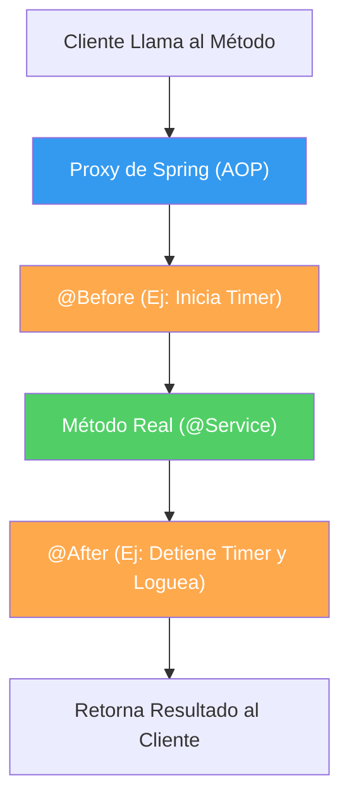

## 20 — Programación Orientada a Aspectos (Spring AOP)

### Propósito
Aprender a desacoplar código técnico (cross-cutting concerns como logs, métricas, seguridad o transacciones) de tu lógica de negocio principal utilizando Aspect-Oriented Programming (AOP).

### Problema que resuelve
Imagina que quieres medir el tiempo de ejecución (métricas) y loguear la entrada/salida de los 50 métodos de tus servicios. Sin AOP, tendrías que modificar los 50 métodos manualmente:
```java
// CÓDIGO ACOPPLADO Y REPETITIVO (Mala Práctica)
public void realizarTransferencia(Double monto) {
    long start = System.currentTimeMillis();       // Código técnico
    log.info("Iniciando transferencia...");        // Código técnico
    
    // --> Única línea de Lógica de Negocio Real <--
    repository.transferir(monto);
    
    log.info("Transferencia terminada");           // Código técnico
    long end = System.currentTimeMillis();         // Código técnico
    System.out.println("Tomó: " + (end - start));  // Código técnico
}
```
Esto viola el Principio de Responsabilidad Única (SRP). Tu clase de negocio ahora está contaminada con código de métricas y logs. Si quieres cambiar el formato de los logs, debes editar 50 clases.

### Cómo lo resuelve
Spring AOP te permite escribir el código de logs/métricas **una sola vez** en una clase separada (un Aspecto). Luego, usas reglas (Pointcuts) para decirle a Spring: *"Interpreta el Aspecto antes y después de cada método que esté en el paquete de servicios, sin tocar su código fuente"*.

### Por qué aprenderlo
AOP es la magia detrás de anotaciones como `@Transactional`, `@Cacheable` o `@PreAuthorize`. Entender AOP te permite crear tus propias anotaciones corporativas (ej: `@LogEjecucion`, `@AuditarEnBaseDeDatos`) para centralizar reglas técnicas de toda la empresa, manteniendo tu código de negocio 100% puro.



---

### Glosario Básico

#### `Aspect` (Aspecto)
Una clase que contiene código transversal (ej. LogAspect). Se anota con `@Aspect` y `@Component`.

#### `JoinPoint` (Punto de Enlace)
Cualquier punto en tu aplicación donde se puede insertar un Aspecto. En Spring AOP, un JoinPoint siempre representa **la ejecución de un método**.

#### `Pointcut` (Punto de Corte)
Una expresión regular/regla que selecciona en qué métodos específicos (JoinPoints) se debe aplicar el Aspecto. Ej: *"Todos los métodos que empiecen con 'find'"* o *"Cualquier método anotado con @MiAnotacion"*.

#### `Advice` (Consejo/Acción)
El código real que se ejecutará en el Pointcut. Tipos principales:
- `@Before`: Se ejecuta justo antes del método.
- `@AfterReturning`: Se ejecuta solo si el método terminó con éxito.
- `@AfterThrowing`: Se ejecuta solo si el método lanzó una excepción.
- `@Around`: Rodea al método, ejecutándose antes y después. Tiene el poder de evitar que el método se ejecute o alterar lo que devuelve.

---

### Conceptos

#### 1. Configuración Inicial y Pointcuts Básicos
- **Qué es** — Necesitas la dependencia de AOP. Luego creas un componente `@Aspect` y defines dónde quieres interceptar (Pointcut).
- **Código** — Aspecto básico con ejecución basada en paquetes:
  ```xml
  <!-- En pom.xml -->
  <dependency>
      <groupId>org.springframework.boot</groupId>
      <artifactId>spring-boot-starter-aop</artifactId>
  </dependency>
  ```
  ```java
  @Aspect
  @Component
  @Slf4j
  public class LoggingAspect {
  
      // Pointcut: "Cualquier método de cualquier clase en el paquete 'service'"
      @Pointcut("execution(* com.roadmap.app.service.*.*(..))")
      public void todosLosServicios() {}
  
      // Advice: Se ejecuta ANTES del método
      @Before("todosLosServicios()")
      public void logBefore(JoinPoint joinPoint) {
          // El JoinPoint permite extraer info del método que se está interceptando
          String nombreMetodo = joinPoint.getSignature().getName();
          Object[] argumentos = joinPoint.getArgs();
          
          log.info(">> Iniciando método: {} con argumentos: {}", nombreMetodo, Arrays.toString(argumentos));
      }
      
      // Advice: Se ejecuta AL TERMINAR BIEN el método
      @AfterReturning(pointcut = "todosLosServicios()", returning = "resultado")
      public void logAfter(JoinPoint joinPoint, Object resultado) {
          log.info("<< Método {} finalizado. Retornó: {}", joinPoint.getSignature().getName(), resultado);
      }
  }
  ```
- **Analogía** — El código original es un actor en el teatro (Lógica). El Pointcut es el guión que dice "Escena 1" (Regla). El Aspecto (Advice) es el técnico de iluminación que prende los reflectores (Logs) cuando lee "Escena 1". El actor nunca interactúa con el técnico.

#### 2. Creando Anotaciones Propias (`@Around`)
- **Qué es** — Interceptar todo un paquete puede generar demasiado ruido (loguear demasiadas cosas). La mejor práctica en AOP moderno es crear una Anotación personalizada y usarla como Pointcut, aplicándola solo donde lo desees.
- **Por qué importa** — Te da control granular y semántico. Si ves `@MedirTiempo` en un método, sabes exactamente qué hace, y AOP hará la magia por detrás.
- **Código** — Implementando un `@TrackTime` personalizado:
  
  **Paso A: Crear la Anotación**
  ```java
  @Target(ElementType.METHOD) // Solo se aplica en métodos
  @Retention(RetentionPolicy.RUNTIME) // Debe vivir en ejecución para que AOP la vea
  public @interface TrackTime {
      // Puedes añadir parámetros si lo deseas
  }
  ```
  
  **Paso B: Crear el Aspecto que rodea a la anotación**
  ```java
  @Aspect
  @Component
  @Slf4j
  public class PerformanceAspect {
  
      // El Pointcut busca cualquier método anotado con @TrackTime
      @Around("@annotation(com.roadmap.app.annotation.TrackTime)")
      public Object trackTime(ProceedingJoinPoint pjp) throws Throwable {
          long start = System.currentTimeMillis();
          
          // EJECUTAR EL MÉTODO REAL (Obligatorio en @Around)
          Object result = pjp.proceed(); 
          
          long time = System.currentTimeMillis() - start;
          String methodName = pjp.getSignature().toShortString();
          
          log.warn("⏱️ [Performance] El método {} tardó {} ms", methodName, time);
          
          // Debes retornar el resultado para no romper el flujo
          return result; 
      }
  }
  ```
  
  **Paso C: Usarlo en la lógica de negocio purificada**
  ```java
  @Service
  public class FacturaService {
      
      @TrackTime  // ¡AOP interceptará esto!
      public void procesarMilesDeFacturas() {
          // Lógica pura de negocio, 0 código de logs o cronómetros
          // ... 
      }
  }
  ```

#### 3. Control de Excepciones Global (`@AfterThrowing`)
- **Qué es** — Puedes configurar un Aspecto para que escuche si cualquier método dentro del Pointcut falla, y actuar en consecuencia (notificar a Slack/Email o guardar en BD).
- **Código**:
  ```java
  @Aspect
  @Component
  @Slf4j
  public class ErrorNotificationAspect {
  
      @AfterThrowing(
          pointcut = "execution(* com.roadmap.app.service.*.*(..))",
          throwing = "ex"
      )
      public void notifyAdmin(JoinPoint joinPoint, Throwable ex) {
          // Si el Service arroja un error, esto se ejecuta
          String metodo = joinPoint.getSignature().toShortString();
          log.error("🚨 ALERTA ROJA: Falló el método {}. Error: {}", metodo, ex.getMessage());
          // Aquí enviarías un Email o mensaje a Slack, sin ensuciar tus try-catch
      }
  }
  ```

#### 4. Edge Cases y Errores Comunes

| Error | Causa | Solución |
|-------|-------|----------|
| El Aspecto no se ejecuta | Llamar al método dentro de la misma clase (Ej: `this.miMetodo()`) | AOP funciona con Proxies sobre objetos externos. Nunca interceptará auto-llamadas (self-invocation). Inyecta un self-reference o llama desde fuera. |
| Excepciones desaparecen | Usar `@Around` y olvidar propagar `throws Throwable` u olvidar retornar el resultado | Siempre haz `return pjp.proceed();` en un `@Around`. |
| Lentitud extrema | Poner un Aspecto pesado en métodos que se llaman miles de veces (ej: getters) | Refinar el Pointcut. Solo aplica aspectos a la capa de Servicios y omite métodos triviales. |
| Aspectos desordenados | Tienes varios aspectos sobre el mismo método y se ejecutan en orden aleatorio | Usar la anotación `@Order(1)` en la clase del aspecto para priorizar (menor = antes). |

---

### Ejercicios
1. Crea un proyecto con la dependencia `spring-boot-starter-aop`.
2. Crea tu propia anotación `@AuditarAccion` que tome un parámetro `String accion() default "GENERICA"`.
3. Crea un componente `@Aspect` que use `@Before` interceptando tu anotación. Debe imprimir en consola la acción que se está realizando y el usuario de turno.
4. Aplica tu anotación en algún controlador o servicio: `@AuditarAccion(accion = "ELIMINAR_USUARIO")`.
5. Ejecuta y comprueba que, sin escribir lógica dentro del servicio, los logs de auditoría aparecen correctamente.

### Antes vs Ahora (Decorator manual vs `@Aspect`)

| Aspecto | ANTES (Decorator Pattern manual) | AHORA (`@Aspect` + `@Around`) |
|---------|----------------------------------|-------------------------------|
| Añadir logging a 50 métodos | Envolver cada método a mano o crear 50 clases decoradoras | Anotar los métodos con `@Loggable`. El aspecto se aplica solo. |
| Contar llamadas | Contador manual dentro de cada método (`counter++`) | `AtomicInteger` en el aspecto, invisible al servicio |
| Cambiar formato del log | Editar los 50 métodos | Editar 1 archivo (`LoggingAspect`) |
| SRP (Single Responsibility) | Roto: servicio hace negocio + logging | Cumplido: servicio hace negocio, aspecto hace logging |
| Sintaxis Java | Interfaz + `implements` + `super.metodo()` | `@Around("@annotation(...Loggable)")` + `pjp.proceed()` |

**Comparación de código:**

```java
// ANTES — Decorator manual
public class CalculatorLoggingDecorator implements Calculator {
    private final Calculator delegate;
    private final AtomicInteger count = new AtomicInteger();
    public CalculatorLoggingDecorator(Calculator d) { this.delegate = d; }
    public int add(int a, int b) {
        long t0 = System.currentTimeMillis();
        count.incrementAndGet();
        int r = delegate.add(a, b);
        log.info("add tardó {} ms", System.currentTimeMillis() - t0);
        return r;
    }
    // ...y repetir para cada método
}

// AHORA — Aspecto declarativo
@Aspect @Component
public class LoggingAspect {
    @Around("@annotation(com.springroadmap.aop.annotation.Loggable)")
    public Object measure(ProceedingJoinPoint pjp) throws Throwable {
        long t0 = System.currentTimeMillis();
        try { return pjp.proceed(); }
        finally { log.info("{} tardó {} ms", pjp.getSignature().toShortString(),
                           System.currentTimeMillis() - t0); }
    }
}
```

### FAQ del Alumno

- **¿Qué es una anotación custom (`@interface`)?** — Una etiqueta que tú defines y que el compilador (y en runtime, la reflexión / Spring) puede leer. `@Loggable` no hace nada por sí sola; el aspecto es quien reacciona a verla.
- **¿Por qué el aspecto NO se activa en `MockMvc.standaloneSetup`?** — Porque standalone NO usa el contexto Spring completo, y sin ese contexto no hay auto-proxy. Los aspectos requieren proxies. Por eso `LoggingAspectTest` usa `@SpringBootTest`.
- **¿Qué es un "proxy" en Spring AOP?** — Un objeto envoltorio que Spring genera en tiempo de ejecución. Cuando el controller pide `CalculatorService`, Spring le entrega el proxy (no el objeto real). El proxy intercepta las llamadas y ejecuta los aspectos antes/después.
- **¿Por qué mi aspecto no se dispara cuando llamo `this.otroMetodo()`?** — Porque `this` es el objeto real, NO el proxy. Autoinvocaciones saltan el proxy. Es el error más común de AOP.
- **¿Qué diferencia hay entre `@Before`, `@After` y `@Around`?** — `@Before` corre antes; `@After` corre después (pase lo que pase); `@Around` los engloba y te da el control de decidir si ejecutar el método (`pjp.proceed()`) y qué devolver.
- **¿`AtomicInteger` vs `int`?** — `int` no es seguro entre hilos: dos requests simultáneos pueden perder incrementos. `AtomicInteger` garantiza incrementos atómicos.
- **¿Por qué `throws Throwable` en el advice?** — Porque el método interceptado puede lanzar cualquier excepción (checked, unchecked o `Error`). Declarar `Throwable` te obliga a re-lanzarlas y no "tragártelas".

### Cómo ejecutar
```bash
cd 20-spring-aop
./build.sh                      # o .\build.ps1 en PowerShell
java -jar target/spring-aop-1.0.0.jar

# Prueba los endpoints
curl "http://localhost:8080/api/calc/add?a=2&b=3"   # -> 5   (aspecto se dispara)
curl "http://localhost:8080/api/calc/sub?a=10&b=4"  # -> 6   (aspecto NO se dispara)
```

### Archivos del Proyecto
| Archivo | Propósito |
|---------|-----------|
| `pom.xml` | Coordenadas Maven + dependencias `web`, `aop`, `test`. |
| `build.sh` / `build.ps1` | Scripts que fijan `JAVA_HOME` al JDK 21 portable y ejecutan `mvn clean package`. |
| `SpringAopApplication.java` | Clase principal (`main`) que arranca Spring Boot. |
| `annotation/Loggable.java` | Anotación custom `@Loggable` (RUNTIME, METHOD). |
| `aspect/LoggingAspect.java` | `@Aspect` + `@Around` que mide tiempo y cuenta llamadas con `AtomicInteger`. |
| `service/CalculatorService.java` | `add()` (con `@Loggable`) y `sub()` (sin `@Loggable`). |
| `controller/CalculatorController.java` | Endpoints `GET /api/calc/add` y `GET /api/calc/sub`. |
| `application.yml` | Puerto 8080 y niveles de logging. |
| `SpringAopApplicationTests.java` | `contextLoads` — verifica que el contexto arranca. |
| `aspect/LoggingAspectTest.java` | `@SpringBootTest` — valida que el aspecto SÍ intercepta `add` (callCount=3) y NO `sub`. |
| `controller/CalculatorControllerTest.java` | MockMvc standalone — valida routing (aspects no aplican aquí). |
