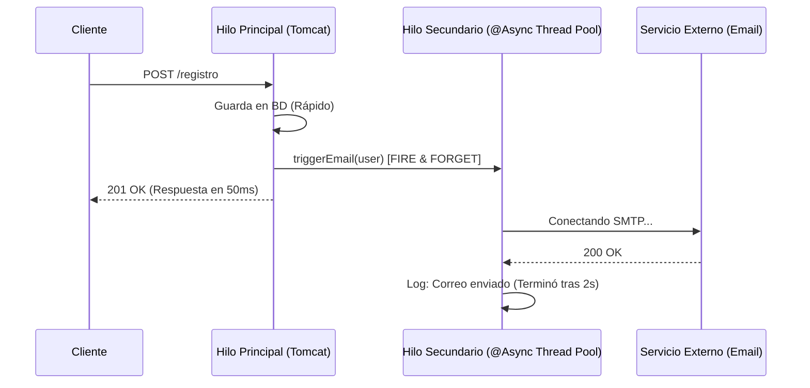

## 21 — Programación Asíncrona (@Async y CompletableFuture)

### Propósito
Aprender a ejecutar tareas pesadas o que toman mucho tiempo en hilos secundarios (background threads) sin bloquear el hilo principal de la petición HTTP, utilizando la anotación `@Async` de Spring y manejando resultados futuros con `CompletableFuture`.

### Problema que resuelve
Cuando un usuario se registra en tu app, tu código típicamente hace esto:
1. Guarda el usuario en BD (50ms).
2. Llama a la API de MailChimp (500ms).
3. Envía un correo de bienvenida (2000ms).

Si es síncrono, el usuario debe esperar **2.5 segundos** mirando una pantalla de carga. Peor aún, si la API del correo se cae, el usuario recibe un error `500` y su registro falla, ¡aunque los datos de la base de datos se guardaron bien!

### Cómo lo resuelve
Con `@Async`, le dices a Spring: "Envía el correo en un hilo paralelo y tú sigue de largo". El hilo principal guarda en BD y responde inmediatamente al usuario en **50ms**. El envío de correo ocurre invisiblemente en el fondo (background). 

### Por qué aprenderlo
La asincronía es vital para mantener tiempos de respuesta bajos (baja latencia) en cualquier API empresarial moderna. Es indispensable para reportes pesados, envío de emails, notificaciones push, integraciones con terceros lentos, y procesamiento por lotes (batch).



---

### Glosario Básico

#### `@EnableAsync`
Anotación de configuración que enciende el soporte de asincronía en Spring Boot. Sin ella, `@Async` es ignorado.

#### `@Async`
Marca un método para que se ejecute en un hilo separado del "TaskExecutor" (un pool de hilos). Devuelve el control al llamador inmediatamente.

#### `CompletableFuture<T>`
Clase de Java moderna que representa un valor que aún no existe, pero existirá en el futuro. Permite encadenar callbacks (`thenApply`, `thenAccept`) y correr múltiples futuros en paralelo.

#### `TaskExecutor` / `ThreadPool`
Un grupo de hilos reciclables que Spring usa para ejecutar las tareas. Es mejor reusar hilos de un "pool" que crear un hilo nuevo para cada tarea, porque crear hilos consume CPU y RAM.

---

### Conceptos

#### 1. Activación y Fire-and-Forget
- **Qué es** — "Fire and forget" significa disparar la tarea y no importarte el resultado (ni bloquearte esperando). Es el caso de uso perfecto para enviar emails.
- **Por qué importa** — Si el proceso falla, el usuario no se da por enterado y no cortas su flujo de experiencia.
- **Código** — Asincronía simple:
  ```java
  @SpringBootApplication
  @EnableAsync // ¡Obligatorio!
  public class AsyncApp { ... }
  ```
  
  ```java
  @Service
  @Slf4j
  public class NotificationService {
  
      // Este método se ejecutará en un hilo secundario
      // Tipo de retorno: void (no le importa al que llama)
      @Async
      public void sendWelcomeEmail(String email) {
          log.info("Iniciando envío de email en hilo: {}", Thread.currentThread().getName());
          try {
              Thread.sleep(3000); // Simulando red lenta
          } catch (InterruptedException e) { }
          log.info("Email enviado exitosamente a {}", email);
      }
  }
  
  @RestController
  @RequestMapping("/users")
  public class UserController {
      private final NotificationService notificationService;
      
      // Constructor ...
  
      @PostMapping
      public String registerUser() {
          // 1. Guardar BD
          // 2. Disparar proceso asíncrono
          notificationService.sendWelcomeEmail("test@test.com");
          
          // 3. Esto se ejecuta AL INSTANTE. No espera los 3 segundos.
          return "Usuario registrado OK. Recibirá un email pronto.";
      }
  }
  ```
- **Analogía** — Estás en un restaurante. El mesero anota tu orden, la tira a la cocina (Fire-and-forget al hilo asíncrono) y sigue atendiendo otras mesas. No se queda mirando al cocinero hasta que termine tu plato.

#### 2. Obteniendo Resultados con `CompletableFuture`
- **Qué es** — A veces, SÍ necesitas el resultado de la tarea asíncrona (ej: llamar a 3 APIs de cotización de vuelos en paralelo y luego sumar los precios). Usas `CompletableFuture`.
- **Por qué importa** — Te permite transformar operaciones seriales (A, luego B, luego C = 9s) en operaciones paralelas (A, B y C al mismo tiempo = 3s).
- **Código** — Retornando valores asíncronos:
  ```java
  @Service
  public class ReportService {
  
      @Async
      public CompletableFuture<String> fetchVentasEuropa() {
          simulateDelay(2000); // 2 segundos
          return CompletableFuture.completedFuture("Ventas EU: 15K");
      }
  
      @Async
      public CompletableFuture<String> fetchVentasLatam() {
          simulateDelay(3000); // 3 segundos
          return CompletableFuture.completedFuture("Ventas LATAM: 25K");
      }
      
      private void simulateDelay(long millis) {
          try { Thread.sleep(millis); } catch (InterruptedException e) {}
      }
  }
  ```
  ```java
  @RestController
  public class ReportController {
      
      private final ReportService service;
      
      @GetMapping("/informe-global")
      public String getGlobalReport() {
          // Las dos llamadas se disparan al MISMO TIEMPO
          CompletableFuture<String> futureEU = service.fetchVentasEuropa();
          CompletableFuture<String> futureLatam = service.fetchVentasLatam();
          
          // Esperar (bloquear el hilo principal) HASTA que TODOS terminen.
          // El tiempo total será 3 segundos (el más lento), NO 5 segundos (2+3).
          CompletableFuture.allOf(futureEU, futureLatam).join();
          
          // Extraer los resultados ya resueltos
          return futureEU.join() + " | " + futureLatam.join();
      }
  }
  ```

#### 3. Configuración Custom del Thread Pool
- **Qué es** — Spring usa un `SimpleAsyncTaskExecutor` por defecto, que *crea un hilo nuevo cada vez*. Si recibes 1,000 requests, crearás 1,000 hilos y tu servidor morirá por OOM. Debes definir un Pool personalizado.
- **Por qué importa** — Un Thread Pool profesional recicla hilos y tiene una "cola" (Queue) de tareas pendientes si no hay hilos libres, previniendo el colapso.
- **Código** — Pool custom seguro:
  ```java
  @Configuration
  @EnableAsync
  public class AsyncConfig {
  
      @Bean(name = "taskExecutor")
      public Executor taskExecutor() {
          ThreadPoolTaskExecutor executor = new ThreadPoolTaskExecutor();
          executor.setCorePoolSize(5);        // Hilos base activos siempre
          executor.setMaxPoolSize(20);        // Máximo hilos si hay mucho tráfico
          executor.setQueueCapacity(100);     // Cola de espera si los 20 están ocupados
          executor.setThreadNamePrefix("AsyncThread-");
          
          // Configuración clave: ¿qué pasa si la cola de 100 se llena?
          // CallerRunsPolicy: El hilo principal (Tomcat) ejecuta la tarea, ralentizándose en vez de fallar.
          executor.setRejectedExecutionHandler(new ThreadPoolExecutor.CallerRunsPolicy());
          
          executor.initialize();
          return executor;
      }
  }
  ```

#### 4. Edge Cases y Errores Comunes

| Error | Causa | Solución |
|-------|-------|----------|
| El método no es asíncrono (bloquea) | Llamar a un método `@Async` desde la **misma clase** (self-invocation). | AOP requiere llamadas externas. Separa el método en otro `@Service` e inyéctalo. |
| Memory Leak / CPU 100% | Confiar en el Executor por defecto en un entorno de alta carga. | SIEMPRE crea un `@Bean` de `ThreadPoolTaskExecutor` para poner límites. |
| Excepciones invisibles | Métodos `void` con `@Async` que arrojan errores, y tú nunca te enteras (se pierden). | Configurar un `AsyncUncaughtExceptionHandler` para capturar e imprimir errores asíncronos en los logs. |
| Contexto de Seguridad Perdido | El `SecurityContextHolder` o MDC (Logs) está atado a un hilo (ThreadLocal). Al saltar a otro hilo, pierdes al "Usuario Autenticado". | Usar la estrategia de delegación: `SecurityContextHolder.setStrategyName(SecurityContextHolder.MODE_INHERITABLETHREADLOCAL)`. |

---

### Ejercicios
1. Crea un endpoint `/sync` que procese datos por 3 segundos de manera bloqueante. (Tiempo total = 3s).
2. Crea un `@Service` con `@Async` y mueve el código bloqueante allí (dejándolo como `void`). Modifica un nuevo endpoint `/async` que llame a este servicio. Verifica en Postman que `/async` devuelve `200 OK` en 5 milisegundos, y en los logs de la consola el proceso real termina 3 segundos después.
3. Observa en los logs el nombre del hilo: verás `http-nio-8080-exec` en la parte web y `task-1` (o tu prefijo custom) en la parte asíncrona.
4. **(Avanzado)** Modifica tu clase `@Configuration` para usar un Thread Pool con cola límite de 1, inyéctale 10 peticiones asíncronas de golpe y observa cómo el `CallerRunsPolicy` hace que el hilo principal tenga que ayudar.

### Antes vs Ahora (Java 8 → Java 21)

| Concepto | ANTES (Java 8 clásico) | AHORA (Java 21 + Spring 4) |
|---|---|---|
| Lanzar tarea en background | `new Thread(runnable).start()` | `@Async` + método que retorna `CompletableFuture<T>` |
| Esperar N tareas | Compartir arrays + `Thread.join()` | `CompletableFuture.allOf(f1, f2).join()` |
| Encadenar transformación | Callbacks anidados | `future.thenApply(x -> ...)` |
| Timeout en la espera | Lógica manual con `wait/notify` | `future.get(5, TimeUnit.SECONDS)` |
| Pool de hilos | `Executors.newFixedThreadPool(5)` | `@Bean ThreadPoolTaskExecutor` + `@Async("taskExecutor")` |

### FAQ del Alumno

- **¿Qué es un "hilo" (thread)?** — Una línea de ejecución dentro del programa. Tu JVM puede tener muchas líneas ejecutándose "a la vez" para no bloquearse cuando una está esperando algo lento (red, disco).
- **¿Qué hace exactamente `@Async`?** — Le dice a Spring "cuando alguien llame a este método, no lo ejecutes en el hilo del que llama; despáchalo a un pool de hilos y devuelve el control inmediatamente".
- **¿Por qué necesito `@EnableAsync`?** — Sin ella, `@Async` es un simple comentario decorativo. `@EnableAsync` es el interruptor que activa el motor AOP que crea los proxies de asincronía.
- **¿Qué es un `CompletableFuture`?** — Una "promesa" de valor. Al momento de llamar al método, el valor todavía no existe; el objeto te lo entregará cuando la tarea termine (`.get()`) o te avisará (`.thenAccept(...)`).
- **¿Por qué no puedo llamar al método `@Async` desde la MISMA clase?** — Porque Spring intercepta las llamadas mediante un proxy que envuelve al bean. Si te llamas a ti mismo (`this.metodo()`) esquivas el proxy y pierdes la asincronía. Regla: los métodos `@Async` viven en un `@Service` aparte y se inyectan.
- **¿Qué pasa si el pool se llena?** — Depende de la `RejectedExecutionHandler`. En este módulo usamos `CallerRunsPolicy`: el hilo de Tomcat ejecuta la tarea él mismo. Ralentiza al servidor pero no pierde trabajo.
- **¿Por qué `.get(5, SECONDS)` y no `.get()`?** — `.get()` sin timeout bloquea indefinidamente. En un endpoint web eso agota hilos Tomcat y tumba el servidor. Siempre timeout explícito.
- **¿Por qué el test del controller mockea el service en vez de arrancar Spring?** — Porque queremos una prueba unitaria rápida. El comportamiento asíncrono real ya está cubierto por `EmailServiceTest` (que sí usa `@SpringBootTest`).

### Cómo ejecutar

```bash
# Con los scripts portables (JDK + Maven en la raíz del roadmap):
cd 21-async
./build.sh          # Git Bash
# o
.\build.ps1         # PowerShell

# Ejecutar el JAR:
java -jar target/async-1.0.0.jar

# O modo dev con Maven:
mvn spring-boot:run

# Prueba manual:
curl -X POST "http://localhost:8080/api/emails?to=ada@x.com"
# Respuesta esperada: SENT:ada@x.com
```

### Archivos del Proyecto
| Archivo | Propósito |
|---------|-----------|
| `pom.xml` | Coordenadas Maven + dependencias web y test. |
| `build.sh` / `build.ps1` | Scripts portables (JDK 21 + Maven 3.9.16 en la raíz). |
| `src/main/resources/application.yml` | Puerto 8080 + hardening de errores. |
| `AsyncApplication.java` | Clase `main` con `@SpringBootApplication`. |
| `config/AsyncConfig.java` | `@EnableAsync` + `@Bean("taskExecutor")` (core=2, max=5, queue=10, CallerRunsPolicy). |
| `service/EmailService.java` | `@Async("taskExecutor") CompletableFuture<String> sendEmail(String)`. |
| `controller/EmailController.java` | `POST /api/emails?to=X` que espera hasta 5 s el resultado. |
| `AsyncApplicationTests.java` | Smoke test `contextLoads`. |
| `service/EmailServiceTest.java` | `@SpringBootTest`: verifica retorno `SENT:ada@x.com`. |
| `controller/EmailControllerTest.java` | MockMvc standalone + service mockeado con `CompletableFuture.completedFuture(...)`. |
