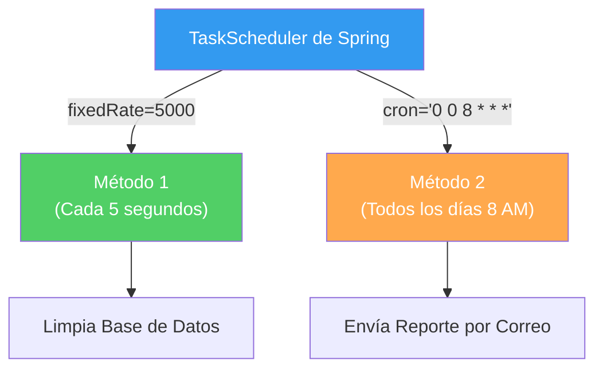

## 22 — Tareas Programadas (@Scheduled y Cron)

### Propósito
Aprender a ejecutar código automáticamente en tu aplicación Spring Boot en base a un horario, un intervalo de tiempo fijo o una expresión Cron, utilizando la anotación `@Scheduled`.

### Problema que resuelve
En la mayoría de las aplicaciones empresariales, necesitas procesos automáticos que se ejecuten "de fondo" (background jobs) sin intervención del usuario:
- Enviar reportes de ventas diarios a las 8:00 AM.
- Borrar tokens de seguridad expirados de la base de datos cada 15 minutos (limpieza).
- Consultar un banco externo cada hora para verificar el estado de las transferencias pendientes.
- Procesar nóminas el día 30 de cada mes a la medianoche.

Hacer esto manualmente o usar hilos infinitos (`while(true) { sleep(); }`) es una muy mala práctica, consume recursos y es difícil de sincronizar o gestionar.

### Cómo lo resuelve
Spring provee la anotación `@Scheduled`, que permite convertir cualquier método vacío (sin argumentos) en una tarea programada administrada por el TaskScheduler nativo de Spring.

### Por qué aprenderlo
El procesamiento Batch y los Cron Jobs son piezas angulares de cualquier backend moderno. Si no sabes programar tareas repetitivas, tendrías que depender de herramientas externas (como Crontab en Linux) para llamar a tus endpoints, fragmentando la lógica de negocio y complicando el despliegue de tu aplicación.



---

### Glosario Básico

#### `@EnableScheduling`
Anotación colocada en tu clase de configuración o Main para activar el soporte de tareas programadas. Obligatoria.

#### `@Scheduled`
Se coloca sobre el método que deseas ejecutar automáticamente. Soporta diferentes estrategias de programación (`fixedRate`, `fixedDelay`, `cron`).

#### `fixedRate`
Ejecuta la tarea cada `X` milisegundos, contando **desde que inició** la ejecución anterior.

#### `fixedDelay`
Ejecuta la tarea `X` milisegundos **después de que terminó** la ejecución anterior.

#### `Cron Expression`
Una cadena de 6 campos (Segundos, Minutos, Horas, Día del Mes, Mes, Día de la Semana) que define un patrón de tiempo exacto (Ej: `0 15 10 * * MON-FRI` = 10:15 AM de lunes a viernes).

---

### Conceptos

#### 1. Configuración Básica e Intervalos Fijos
- **Qué es** — Activar la anotación central y configurar un método para que corra cada cierta cantidad de milisegundos.
- **Por qué importa** — Es la solución ideal para procesos de "polling" (revisar si hay cambios continuamente).
- **Código** — Tarea de intervalo fijo:
  ```java
  @SpringBootApplication
  @EnableScheduling // <-- Paso 1: Activar Scheduler
  public class ScheduledApp { ... }
  ```
  
  ```java
  @Service
  @Slf4j
  public class CleanupService {
  
      // Se ejecutará cada 10 segundos, no importa cuánto tarde
      @Scheduled(fixedRate = 10000)
      public void cleanupExpiredSessions() {
          log.info("Iniciando limpieza de sesiones a las: {}", LocalDateTime.now());
          // lógica: repository.deleteExpired();
      }
      
      // Esperará 5 segundos DESPUÉS de terminar para volver a correr
      @Scheduled(fixedDelay = 5000, initialDelay = 1000) 
      public void pollExternalApi() {
          log.info("Revisando API externa...");
          // initialDelay hace que la primera vez espere 1 segundo antes de arrancar
      }
  }
  ```
- **Analogía** — `fixedRate` es un tren que sale de la estación cada 10 minutos exactos, no importa si va vacío o lleno. `fixedDelay` es un taxi que espera a que termines tu viaje actual; una vez que te bajas, espera 5 minutos fumando un cigarrillo antes de tomar al siguiente pasajero.

#### 2. Expresiones Cron
- **Qué es** — En la industria, las horas importan. Para ejecutar un proceso en una fecha/hora exacta, usamos el estándar Unix `cron`. Spring soporta 6 campos: `Segundos Minutos Horas Día-de-mes Mes Día-de-semana`.
- **Por qué importa** — Permite reglas complejas como: "El último viernes de cada mes a las 23:59".
- **Código** — Tareas por calendario:
  ```java
  @Service
  @Slf4j
  public class ReportingService {
  
      // 0 = Segundos (en el segundo exacto cero)
      // 0 = Minutos
      // 8 = Horas (8 AM)
      // * = Todos los días del mes
      // * = Todos los meses
      // MON-FRI = Lunes a Viernes
      @Scheduled(cron = "0 0 8 * * MON-FRI", zone = "America/Bogota")
      public void sendDailyReport() {
          log.info("Enviando reporte diario corporativo a las 8 AM");
          // emailService.sendReport();
      }
      
      // Es MUY BUENA PRÁCTICA sacar los magic strings al application.yml
      @Scheduled(cron = "${app.cron.billing}")
      public void processMonthlyBilling() {
          log.info("Procesando cobros mensuales según configuración");
      }
  }
  ```
  ```yaml
  # application.yml
  app:
    cron:
      # "0 0 0 1 * *" -> Día 1 de cada mes a medianoche
      billing: "0 0 0 1 * *"
  ```

#### 3. Configuración Custom del Thread Pool
- **Qué es** — Por defecto, Spring usa un Thread Pool con **UN SOLO HILO (Pool Size = 1)** para TODAS las tareas `@Scheduled`. 
- **Por qué importa** — Si tienes 3 tareas programadas, y la Tarea 1 se bloquea por 5 horas esperando una API, la Tarea 2 y 3 **NUNCA SE EJECUTARÁN** porque el único hilo disponible está ocupado. Esto destruye aplicaciones en producción. Siempre debes configurar un Pool más grande.
- **Código** — Solución segura para Producción:
  ```java
  @Configuration
  @EnableScheduling
  public class SchedulerConfig implements SchedulingConfigurer {
  
      @Override
      public void configureTasks(ScheduledTaskRegistrar taskRegistrar) {
          ThreadPoolTaskScheduler scheduler = new ThreadPoolTaskScheduler();
          
          scheduler.setPoolSize(10); // Permitir hasta 10 tareas al mismo tiempo
          scheduler.setThreadNamePrefix("CronThread-");
          scheduler.initialize();
          
          taskRegistrar.setTaskScheduler(scheduler);
      }
  }
  ```

#### 4. Ejecución Condicional con ShedLock (Microservicios)
- **Qué es** — En microservicios, despliegas tu app en 3 servidores diferentes. Si configuras un Cron para enviar correos a las 8:00 AM, **¡se enviarán 3 correos duplicados!** (uno por cada servidor).
- **Por qué importa** — Necesitas una librería de coordinación distribuida. `ShedLock` guarda un "candado" (lock) en la Base de Datos compartida. A las 8:00 AM, el servidor que llega primero pone el candado y ejecuta la tarea. Los otros servidores ven el candado y no hacen nada.
- **Casos de Uso Empresariales** — Facturación distribuida, reportes consolidados en contenedores Kubernetes.

#### 5. Edge Cases y Errores Comunes

| Error | Causa | Solución |
|-------|-------|----------|
| Tareas no se ejecutan | La tarea 1 se quedó colgada en un bucle infinito o esperando respuesta HTTP y el pool es 1 | Configurar un `ThreadPoolTaskScheduler` con size > 1. Añadir timeouts a las peticiones HTTP. |
| El cron no funciona en producción | Tu servidor local (Mac/Windows) está en tu zona horaria, pero el servidor AWS de producción está en UTC | Definir explícitamente el atributo `zone = "America/Mexico_City"` en el `@Scheduled(cron="...", zone="...")`. |
| `@Scheduled` y `@Async` | Son conceptos distintos. Si un `@Scheduled` llama a tareas pesadas de 1 segundo | Puedes mezclar ambos: que el método Cron sea corto y asigne tareas con `@Async` para liberar el hilo del cron de inmediato. |
| Ejecuciones duplicadas | Tu aplicación está corriendo en 2 contenedores Docker simultáneos | Integrar ShedLock o Quartz (usar base de datos como coordinador global). |

---

### Ejercicios
1. Crea una tarea `@Scheduled` con `fixedRate=3000` que imprima un log con la hora actual. Inicia la app y mira la consola.
2. Agrega una pausa dentro de la tarea (`Thread.sleep(5000)`). ¿Qué pasa con el `fixedRate`? Cambia a `fixedDelay=3000` y observa cómo el comportamiento del logueo cambia.
3. Crea un Cron Job que se ejecute en los primeros 10 segundos de cada minuto (`"0-10 * * * * *"`).
4. **(Avanzado)** Modifica la clase de configuración implementando `SchedulingConfigurer` para darle un Pool de 5 hilos.
5. Inyecta la expresión Cron desde el `application.yml` usando `@Value` o la notación de propiedades `${...}` directamente en la anotación `@Scheduled`.

### Cómo ejecutar
```bash
cd 22-scheduling
mvn spring-boot:run

# No hay necesidad de curl, solo mira la consola para ver los logs apareciendo automáticamente.
```

### Archivos del Proyecto
| Archivo | Propósito |
|---------|-----------|
| `config/SchedulerConfig.java` | `@EnableScheduling` y configuración de hilos (ThreadPool). |
| `service/CleanupJob.java` | Tareas programadas con `fixedRate` y `fixedDelay`. |
| `service/ReportJob.java` | Tarea programada usando Cron Expression extraída del YAML. |
| `application.yml` | Variables de configuración de intervalos de tiempo. |
