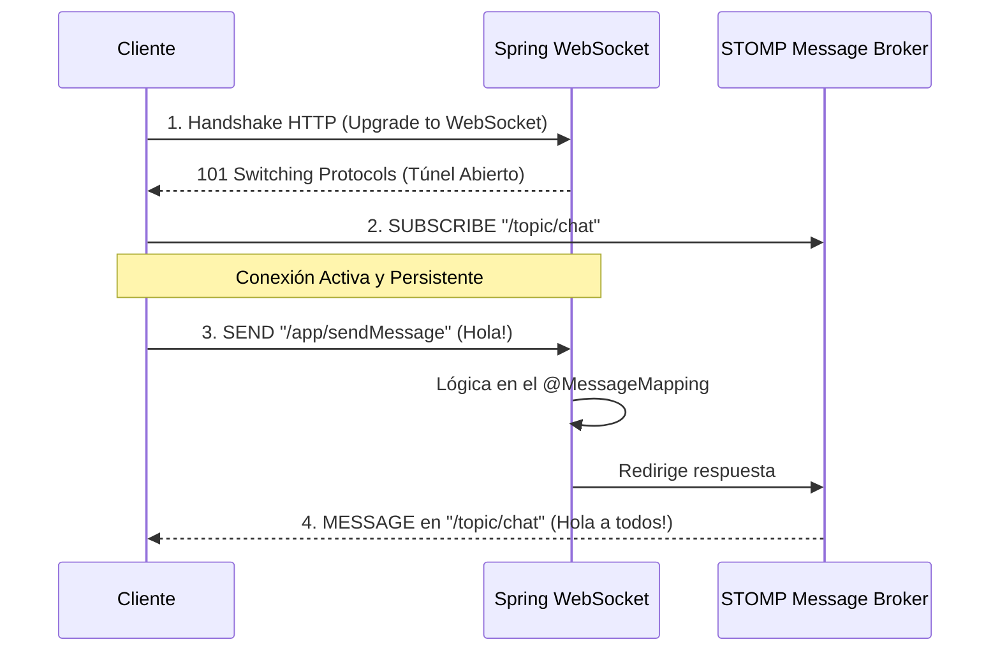

## 23 — WebSockets (Comunicaciones en Tiempo Real)

### Propósito
Aprender a implementar comunicaciones bidireccionales en tiempo real entre el servidor y el cliente (Navegador, App Móvil) utilizando WebSockets sobre el protocolo STOMP (Simple Text Oriented Messaging Protocol) en Spring Boot.

### Problema que resuelve
El protocolo HTTP tradicional es **unidireccional** y sigue el modelo Petición-Respuesta: el cliente (Navegador) siempre debe dar el primer paso. El servidor no puede "enviarle" un mensaje al cliente si este no se lo ha pedido.
- Si haces una aplicación de Chat con HTTP, el navegador debe estar preguntando al servidor "¿Hay mensajes nuevos?" cada 1 segundo (Short Polling).
- El Polling consume un exceso brutal de recursos (CPU, red, batería en móviles), abre y cierra conexiones TCP constantemente y no es verdaderamente en tiempo real.

### Cómo lo resuelve
WebSocket crea un "túnel" TCP **persistente y bidireccional**. Una vez abierto, permanece conectado; el servidor puede empujar (push) datos al cliente instantáneamente en cuanto ocurren los eventos, sin que el cliente tenga que preguntar. Spring usa STOMP, un subprotocolo que organiza los mensajes en "canales" o "tópicos", muy parecido a como funciona el correo postal (buzones y suscripciones).

### Por qué aprenderlo
Si vas a construir un Chat (WhatsApp), un Dashboard Financiero en tiempo real (Trading), Notificaciones Push (como Facebook/Instagram) o juegos multijugador, HTTP no sirve. WebSockets es la tecnología estándar de la industria para el streaming bidireccional y es un skill de alta demanda para perfiles frontend y backend.



---

### Glosario Básico

#### `WebSocket`
Protocolo de red a nivel de aplicación (sobre TCP) que provee canales de comunicación full-duplex. Empieza como HTTP pero hace un "Upgrade".

#### `STOMP`
Un protocolo simple basado en texto que se monta sobre WebSocket. Define comandos (`CONNECT`, `SUBSCRIBE`, `SEND`) para que Spring sepa a quién debe ir el mensaje, como un "enrutador" para sockets. Sin STOMP, un WebSocket solo envía y recibe un bloque de texto sin formato ni destino claro.

#### `@EnableWebSocketMessageBroker`
Anotación de configuración que enciende el servidor WebSocket de Spring y el "Message Broker" (el cartero en memoria).

#### `@MessageMapping`
Equivalente a `@PostMapping`, pero para WebSockets. Define a qué ruta STOMP (ej. `/chat.send`) responde este método cuando un cliente le envía un mensaje.

#### `SimpMessagingTemplate`
Herramienta de Spring que usas en cualquier servicio (ej: `OrderService`) para enviar un mensaje a los clientes de forma proactiva, sin que ellos te hayan enviado uno primero.

---

### Conceptos

#### 1. Configuración del Broker y Endpoint
- **Qué es** — Debes decirle a Spring dónde los clientes pueden conectarse para abrir el túnel, qué prefijo usarán para enviarte cosas al servidor, y qué buzones (topics) existen para que se suscriban.
- **Por qué importa** — Es la infraestructura central. Un error aquí (ej. bloquear CORS) y el Frontend jamás podrá establecer el Handshake (Conexión Inicial).
- **Código** — Configuración completa:
  ```java
  @Configuration
  @EnableWebSocketMessageBroker
  public class WebSocketConfig implements WebSocketMessageBrokerConfigurer {
  
      @Override
      public void registerStompEndpoints(StompEndpointRegistry registry) {
          // El punto de entrada inicial. El frontend hace "new SockJS('/ws')"
          registry.addEndpoint("/ws")
                  .setAllowedOriginPatterns("*") // En PROD poner la URL real del frontend
                  .withSockJS(); // Soporte de compatibilidad para navegadores viejos
      }
  
      @Override
      public void configureMessageBroker(MessageBrokerRegistry registry) {
          // Destino para mensajes desde el Servidor hacia el Cliente (Suscripción)
          registry.enableSimpleBroker("/topic");
  
          // Destino para mensajes desde el Cliente hacia el Servidor (Acción)
          // El frontend usará, ej: /app/chat.sendMessage
          registry.setApplicationDestinationPrefixes("/app");
      }
  }
  ```

#### 2. Controlador Reactivo (Receptor)
- **Qué es** — El controlador ya no recibe peticiones HTTP, recibe mensajes STOMP. Tomas el mensaje, haces algo con él, y lo retransmites al canal público.
- **Código** — El Controlador WebSocket:
  ```java
  @Controller
  @Slf4j
  public class ChatController {
  
      /**
       * El cliente envía a: /app/chat.send
       * El método se ejecuta y retorna el objeto al canal: /topic/public
       */
      @MessageMapping("/chat.send")
      @SendTo("/topic/public") // Canal público donde todos escuchan
      public ChatMessage sendMessage(@Payload ChatMessage chatMessage) {
          log.info("Mensaje recibido de {}: {}", chatMessage.sender(), chatMessage.content());
          
          // Se puede modificar el mensaje (ej: limpiar groserías, añadir hora del servidor)
          return new ChatMessage(
              chatMessage.sender(),
              chatMessage.content(),
              LocalDateTime.now().toString()
          );
      }
      
      /**
       * Evento especial cuando alguien "entra" al chat
       */
      @MessageMapping("/chat.addUser")
      @SendTo("/topic/public")
      public ChatMessage addUser(@Payload ChatMessage chatMessage, 
                                 SimpMessageHeaderAccessor headerAccessor) {
          // Guardar el nombre de usuario en la sesión de WebSocket
          headerAccessor.getSessionAttributes().put("username", chatMessage.sender());
          
          return new ChatMessage("SISTEMA", chatMessage.sender() + " se ha unido!", LocalDateTime.now().toString());
      }
  }
  ```

#### 3. Enviando Mensajes Proactivamente (Notificaciones)
- **Qué es** — Muchas veces el mensaje no nace en el chat. Nace de un evento de negocio (ej: Una compra fue aprobada). Puedes enviar un mensaje WebSocket desde cualquier parte de tu código usando `SimpMessagingTemplate`.
- **Por qué importa** — Permite crear sistemas de Notificaciones Push (Campanita de la web) atadas a flujos transaccionales y bases de datos.
- **Código** — Disparar un WebSocket desde un Service normal:
  ```java
  @Service
  public class OrderService {
  
      private final SimpMessagingTemplate messagingTemplate;
  
      public OrderService(SimpMessagingTemplate messagingTemplate) {
          this.messagingTemplate = messagingTemplate;
      }
  
      public void approveOrder(Long orderId) {
          // 1. Lógica de negocio pesada (Cobro, Guardado BD)
          // ...
          
          // 2. Notificar al Frontend (Panel de Administración) en tiempo real
          String mensaje = "La orden #" + orderId + " ha sido procesada con éxito.";
          
          // Empuja el mensaje a todos los administradores suscritos a "/topic/orders"
          messagingTemplate.convertAndSend("/topic/orders", mensaje);
      }
  }
  ```

#### 4. Frontend Básico (JavaScript puro)
- Para probar WebSockets no basta con `curl` ni Postman tradicional (aunque Postman moderno lo soporta). Se requieren librerías de cliente como `sockjs-client` y `stompjs`.
- **Snippet de Frontend** (Solo para entendimiento):
  ```javascript
  const socket = new SockJS('http://localhost:8080/ws');
  const stompClient = Stomp.over(socket);

  stompClient.connect({}, function (frame) {
      console.log('Conectado: ' + frame);
      
      // Suscribirse para escuchar al servidor
      stompClient.subscribe('/topic/public', function (message) {
          console.log("Nuevo mensaje recibido: " + JSON.parse(message.body).content);
      });
      
      // Enviar un mensaje al servidor
      stompClient.send("/app/chat.send", {}, JSON.stringify({
          sender: "Edgardo",
          content: "Hola a todos!"
      }));
  });
  ```

#### 5. Edge Cases y Errores Comunes

| Error | Causa | Solución |
|-------|-------|----------|
| Handshake Fallido (CORS Error) | El frontend en `localhost:4200` (Angular) intenta conectarse al backend en `8080` | Usar `.setAllowedOriginPatterns("*")` en `registerStompEndpoints`. |
| El servidor cierra la conexión rápido | Red proxy (Nginx, AWS ALB) o inactividad matan el túnel | Configurar los *Heartbeats* (latidos) en SockJS para mantener la conexión viva enviando PINGs vacíos. |
| OOM (Out of Memory) o lentitud | Usar el Broker en memoria simple para miles de usuarios concurrentes | Reemplazar el `SimpleBroker` por un broker completo (RabbitMQ o ActiveMQ) conectándolo en `WebSocketConfig`. |
| Autenticación perdida (JWT) | Los tokens Bearer por headers no funcionan bien en el Handshake WebSocket nativo del navegador | Enviar el JWT token dentro del STOMP frame `CONNECT` o como un parámetro URL (`?token=x`) en el endpoint de SockJS. |

---

### Ejercicios
1. Crea un proyecto con la dependencia `spring-boot-starter-websocket`.
2. Configura el `WebSocketConfig` definiendo el endpoint `/ws` y los prefijos `/app` (envío) y `/topic` (escucha).
3. Crea un DTO `Notification(String user, String message)`.
4. Crea un `@RestController` normal con un endpoint HTTP `POST /api/notify`. Este controlador inyectará `SimpMessagingTemplate` y cada vez que lo llames con CURL, empujará la notificación al canal `/topic/notifications`.
5. Si sabes algo de HTML/JS, crea un archivo `index.html` estático usando `SockJS` y conéctate para ver llegar las notificaciones de consola en tiempo real.

### Cómo ejecutar
```bash
cd 23-websocket
mvn spring-boot:run

# Para probar, puedes usar la interfaz visual de Postman v10+ creando un request tipo "WebSocket Request"
# Conectarse a: ws://localhost:8080/ws/websocket
```

### Archivos del Proyecto
| Archivo | Propósito |
|---------|-----------|
| `pom.xml` | Dependencia: `spring-boot-starter-websocket`. |
| `config/WebSocketConfig.java` | Endpoints, CORS y Message Broker. |
| `dto/ChatMessage.java` | Payload del mensaje (Record). |
| `controller/ChatController.java` | Receptor `@MessageMapping` para lógica de chat. |
| `controller/NotifyController.java` | Endpoint HTTP que dispara mensajes vía `SimpMessagingTemplate`. |
