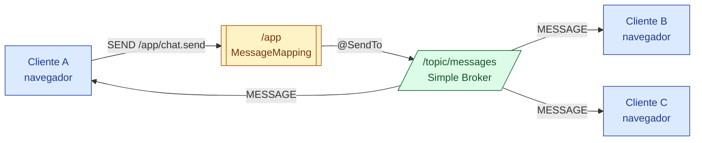

## 23 — WebSocket con STOMP

### Propósito
Aprender a enviar y recibir mensajes en tiempo real entre navegador y servidor usando **WebSocket** con el sub-protocolo **STOMP** y un broker in-memory de Spring.

### Problema que resuelve
HTTP es *request/response*: el cliente pregunta, el servidor responde y la conexión se cierra. Para "notificar" al usuario de un evento (chat, precio de bolsa, jugada de un partido) se recurría al *long polling* — consultas repetidas cada N segundos. Malgasta batería, latencia alta, no escala.

### Cómo lo resuelve
- **WebSocket** abre una conexión TCP bidireccional persistente sobre HTTP (upgrade `101 Switching Protocols`).
- **STOMP** es un protocolo de texto simple (como HTTP para mensajería) que corre DENTRO del WebSocket: define *destinos* (`/topic/x`), *frames* (`SEND`, `SUBSCRIBE`, `MESSAGE`) y *encabezados*.
- **Broker in-memory de Spring** (`enableSimpleBroker`) redistribuye a todos los suscritos sin necesidad de un RabbitMQ/ActiveMQ externo.

### Por qué aprenderlo
Cualquier dashboard "vivo", chat, notificaciones push web, colaboración estilo Google Docs, o tickers financieros usan este patrón.



### Glosario Básico
| Término | Explicación |
|---|---|
| **WebSocket** | Conexión TCP bidireccional persistente iniciada sobre HTTP (upgrade). |
| **STOMP** | *Simple Text Oriented Messaging Protocol.* Formato de frames sobre el socket. |
| **Broker** | Componente que recibe mensajes y los reparte a los suscriptores. |
| **Destino** | Cadena que identifica una "cola" o "topic" (`/topic/messages`). |
| **`/app`** | Prefijo para mensajes que van AL servidor (los procesa un `@MessageMapping`). |
| **`/topic`** | Prefijo para mensajes que van DESDE el servidor (broadcast a todos los suscritos). |
| **SockJS** | Fallback JS para navegadores/proxies que bloquean WebSocket nativo. |
| **`@MessageMapping`** | Equivalente a `@GetMapping` pero para mensajes STOMP. |
| **`@SendTo`** | Publica el retorno del método en un destino del broker. |
| **`record`** | Clase inmutable de datos de Java 14+ (aquí para el DTO `ChatMessage`). |
| **`Instant`** | Punto exacto en el tiempo en UTC (`java.time`), reemplazo de `Date`. |

### Conceptos

#### 1. `@EnableWebSocketMessageBroker`
- **Qué es**: activa el subsistema completo de mensajería (STOMP over WebSocket) en el contexto.
- **Por qué importa**: sin ella, los `@MessageMapping` se ignoran y no hay broker.
- **Analogía**: encender la torre de transmisión de una radio; sin corriente, los locutores hablan al aire y nadie los oye.
- **Caso empresarial**: microservicio de notificaciones que empuja alertas a un dashboard operativo.

#### 2. Endpoint STOMP `/ws` con SockJS
- **Qué es**: la URL HTTP donde el cliente hace *upgrade* a WebSocket.
- **Por qué importa**: es la puerta única; todo cliente entra por aquí. Con SockJS obtenemos degradación elegante.
- **Casos**: apps móviles híbridas o corporativos con proxies estrictos.

#### 3. Broker simple `/topic` + prefijo `/app`
- **Qué es**: dos "carriles" separados. `/app/*` entra al servidor, `/topic/*` sale a los clientes.
- **Por qué importa**: la asimetría clarifica quién puede publicar dónde y previene abusos.
- **Analogía**: `/app` = buzón de sugerencias (entrada); `/topic` = tablón de anuncios (salida pública).
- **Casos**: chat, feed de precios, notificaciones de sistema.

#### 4. `ChatController` con `@MessageMapping` + `@SendTo`
- **Qué es**: el "locutor" que toma un mensaje entrante, lo procesa y lo re-emite a todos.
- **Edge case**: el timestamp lo sella el SERVIDOR (no el cliente) para evitar spoofing y desfases horarios.

### Antes vs Ahora (Java 8 → Java 21)

| Tema | ANTES (Java 8) | AHORA (Java 21) |
|---|---|---|
| DTO `ChatMessage` | Clase con 3 campos `private final`, constructor, 3 getters, `equals`, `hashCode`, `toString` (25+ líneas o Lombok `@Value`). | `public record ChatMessage(String from, String content, Instant timestamp) {}` en 1 línea. |
| Fecha/hora | `new java.util.Date()` — mutable, sin zona horaria clara, bug histórico en producción. | `Instant.now()` — inmutable, siempre UTC. |
| Notificaciones al navegador | Long polling con `setInterval(fetch, 2000)` desde JS. | WebSocket + STOMP: el servidor **empuja**; latencia < 50 ms. |
| Acceso a campo del DTO | `dto.getFrom()` | `dto.from()` (accessor del record). |

### FAQ del Alumno

- **¿Qué es un WebSocket exactamente?** Una conexión TCP que arranca como una petición HTTP normal y luego "cambia de piel" (upgrade) para quedar abierta permanentemente. Ambos lados pueden mandar datos en cualquier momento.
- **¿Por qué necesito STOMP si ya tengo WebSocket?** WebSocket sólo transporta bytes; no sabe qué es un "canal" ni cómo suscribirse. STOMP añade esa capa (frames, destinos, encabezados). Es como HTTP sobre TCP: TCP mueve bytes, HTTP les da estructura.
- **¿Qué es `/topic/messages`?** Un *destino*: una etiqueta acordada entre el server y todos los suscriptores. No es una URL de tu app; vive dentro del broker.
- **¿Qué es SockJS?** Un plan B: si el WebSocket falla, SockJS negocia long-polling. Se activa sólo con `.withSockJS()`.
- **¿Por qué `@Controller` y no `@RestController`?** Porque no devolvemos HTTP JSON: devolvemos objetos que Spring publica en el broker vía `@SendTo`.
- **¿Puedo mandar mensajes desde el server sin que un cliente los pida?** Sí, inyectando `SimpMessagingTemplate` y llamando a `convertAndSend("/topic/messages", obj)`.
- **¿Y si tengo miles de conexiones?** Se cambia `enableSimpleBroker` por `enableStompBrokerRelay(...)` apuntando a RabbitMQ con soporte STOMP.
- **¿Por qué el timestamp lo pone el server?** Para evitar que el cliente mienta o tenga el reloj mal.

### Ejercicios
1. Añadir un segundo `@MessageMapping` para `/app/chat.private` que envíe un mensaje sólo a un usuario específico (`SimpMessagingTemplate#convertAndSendToUser`).
2. Cambiar el broker simple por un relay a RabbitMQ y comparar la configuración.
3. Añadir un `HandshakeInterceptor` para autenticar al usuario que se conecta al `/ws`.
4. Escribir un cliente Java con `WebSocketStompClient` que se conecte, se suscriba y publique 5 mensajes.

### Cómo ejecutar

```bash
# Build (Git Bash)
./build.sh

# Build (PowerShell)
.\build.ps1

# Ejecutar (después de build)
java -jar target/websocket-1.0.0.jar

# Modo desarrollo
mvn spring-boot:run
```

Endpoint de handshake: `http://localhost:8080/ws` (STOMP over SockJS).

Probar con un cliente JS:
```html
<script src="https://cdn.jsdelivr.net/npm/sockjs-client/dist/sockjs.min.js"></script>
<script src="https://cdn.jsdelivr.net/npm/stompjs/lib/stomp.min.js"></script>
<script>
  const stomp = Stomp.over(new SockJS("http://localhost:8080/ws"));
  stomp.connect({}, () => {
    stomp.subscribe("/topic/messages", m => console.log(JSON.parse(m.body)));
    stomp.send("/app/chat.send", {}, JSON.stringify({from:"ada", content:"hola"}));
  });
</script>
```

### Archivos del Proyecto

| Archivo | Propósito |
|---|---|
| `pom.xml` | Dependencias: `spring-boot-starter-web`, `spring-boot-starter-websocket`, test. |
| `application.yml` | Puerto 8080 + logging del subsistema messaging. |
| `WebsocketApplication.java` | Clase `main` con `@SpringBootApplication`. |
| `config/WebSocketConfig.java` | `@EnableWebSocketMessageBroker`, endpoint `/ws`, broker `/topic`, prefijo `/app`. |
| `dto/ChatMessage.java` | `record` inmutable con `from`, `content`, `timestamp`. |
| `controller/ChatController.java` | `@MessageMapping("/chat.send")` + `@SendTo("/topic/messages")`. |
| `WebsocketApplicationTests.java` | Test `contextLoads`. |
| `controller/ChatControllerTest.java` | Test unitario del handler. |
| `build.sh` / `build.ps1` | Build con toolchain portable. |
