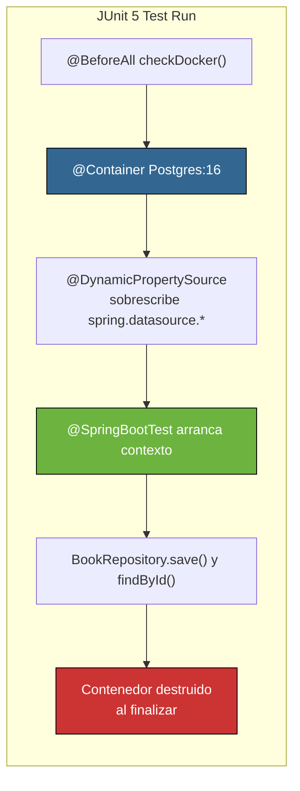

## 25 — Testing Avanzado con Testcontainers

### Propósito
Aprender a testear la capa de persistencia contra una **base de datos real (Postgres)** levantada
en un contenedor Docker efímero durante los tests, usando **Testcontainers**. Este es el
estándar de la industria desde ~2020 para tests de integración de BD.

### Problema que resuelve
Durante años los equipos usaron **H2 in-memory** simulando ser Postgres o MySQL. H2 no soporta
JSONB, tipos array, extensiones (pg_trgm, PostGIS), dialectos avanzados ni CTEs recursivos
completos. Resultado: "en mi máquina con H2 pasa; en staging con Postgres explota".
La alternativa manual (instalar Postgres en cada dev y CI) es frágil y no reproducible.

### Cómo lo resuelve
Testcontainers arranca un contenedor **Postgres oficial** al comenzar la suite de tests,
inyecta dinámicamente la URL/usuario/password en el `Environment` de Spring, y lo destruye
al terminar. Cero residuos, misma versión que producción.

### Por qué aprenderlo
Toda oferta senior de Spring en 2026 espera que sepas usar Testcontainers. Es la base para
tests de integración creíbles con Postgres, MySQL, Kafka, Redis, MongoDB, LocalStack (AWS), etc.



### Glosario Básico
| Término | Explicación |
|---------|-------------|
| **Testcontainers** | Librería Java que gestiona el ciclo de vida de contenedores Docker desde tests JUnit. |
| **`@Testcontainers`** | Extensión JUnit 5 que arranca/detiene los `@Container` de la clase. |
| **`@Container`** | Marca el campo de tipo `GenericContainer` (o subclase como `PostgreSQLContainer`) para gestionar. |
| **`@DynamicPropertySource`** | Hook Spring Test que inyecta propiedades **en runtime** (para URLs con puerto aleatorio). |
| **`Assumptions.assumeTrue`** | JUnit 5: si es falso, marca el test como SKIPPED (no FAILED). |
| **`DockerClientFactory`** | API de Testcontainers para preguntar si Docker está disponible. |
| **`postgres:16-alpine`** | Imagen oficial de Postgres 16, variante Alpine Linux (ligera, ~100 MB). |

### Conceptos

#### 1. `@SpringBootTest` + Testcontainers (integración real)
- **Qué es**: combinación que arranca el contexto Spring completo apuntando a un Postgres real.
- **Por qué importa**: única forma de detectar bugs específicos de dialecto (tipos, funciones, índices).
- **Código**: ver `BookRepositoryTestcontainersTest.java`.
- **Analogía**: en vez de simular en Excel cómo se comporta un motor V8 (H2), enciendes el motor real (Postgres) 30 segundos y observas.
- **Casos empresariales**: bancos verificando migraciones Flyway; fintech asegurando cálculos con `NUMERIC(19,4)`; e-commerce probando full-text search de Postgres.

#### 2. Skip automático si Docker no está disponible
- **Qué es**: `Assumptions.assumeTrue(DockerClientFactory.instance().isDockerAvailable(), ...)`.
- **Por qué importa**: el build no debe romperse en máquinas de desarrolladores sin Docker (ni en pipelines especiales).
- **Analogía**: si no hay electricidad, no intentas cocinar con inducción; te haces un sándwich. El test dice "no hay Docker → skip" en vez de romperse.

#### 3. `@DynamicPropertySource`
- **Qué es**: método `static` que recibe un `DynamicPropertyRegistry` y añade propiedades **antes** de crear beans.
- **Por qué importa**: la URL JDBC del contenedor solo existe tras arrancarlo (puerto aleatorio). No puedes escribirla en `application.yml`.

### Antes vs Ahora (H2 falso vs Postgres real)

| Aspecto | ANTES (H2 in-memory) | AHORA (Testcontainers + Postgres) |
|--------|----------------------|------------------------------------|
| Dialecto SQL | H2 imita SQL 92 | Postgres 16 REAL |
| `JSONB`, `ARRAY`, `UUID` | No soportado o parcial | Nativo |
| Reproducibilidad | Depende del H2 mode | 100% igual en laptop / CI / staging |
| Setup | Solo dependencia H2 | Docker + dependencia Testcontainers |
| Confianza | Media (bugs de dialecto en prod) | Alta |
| Velocidad primer run | Instantáneo | ~30s descargar imagen + arranque |
| Velocidad runs siguientes | Instantáneo | ~2-3s (imagen cacheada) |

### Antes vs Ahora (sintaxis Java 8 → Java 21)

| Concepto | Java 8 | Java 21 |
|----------|--------|---------|
| Method reference al supplier | `() -> pg.getJdbcUrl()` | `pg::getJdbcUrl` |
| Anotación de test | `@RunWith(SpringRunner.class)` + `@SpringApplicationConfiguration` | `@SpringBootTest` a secas |
| Test-slice de JPA | `@DataJpaTest` (**eliminada en Boot 4**) | `@SpringBootTest` + `@Transactional` |
| Colecciones inmutables | `Collections.singletonList(x)` | `List.of(x)` |
| `Optional` presente | `if (opt.isPresent()) { opt.get()... }` | `opt.map(...).orElseGet(...)` |

### FAQ del Alumno

- **¿Qué es un contenedor Docker?**
  Una "cajita" aislada con un sistema operativo mínimo y una aplicación (Postgres, en este caso).
  Se arranca en ~1 segundo, no ensucia tu máquina, y se borra al terminar.
- **¿Necesito Docker instalado para compilar el JAR?**
  **No.** El JAR usa H2 y arranca sin Docker. Docker solo hace falta para los tests de integración.
- **¿Y si no tengo Docker? ¿Se rompen los tests?**
  No: `@BeforeAll checkDocker()` los marca como **SKIPPED**, el build sigue verde.
- **¿Por qué no usar `@DataJpaTest` como en cursos viejos?**
  Fue **eliminada en Spring Boot 4.1.0** (ver `MEMORY.md`). Usamos `@SpringBootTest`.
- **¿El contenedor se queda vivo entre ejecuciones?**
  No. Se destruye al terminar la suite. Testcontainers también ofrece "reusable containers" para tests locales rápidos, fuera del alcance del módulo.
- **¿Qué es `@DynamicPropertySource` y por qué no puedo poner la URL en `application.yml`?**
  Porque Docker asigna un puerto aleatorio al arrancar Postgres; la URL solo se conoce en runtime.
- **¿Por qué la imagen dice `alpine`?**
  Es una variante Linux muy pequeña (~50 MB). Ideal para tests: se descarga rápido.
- **La primera vez tarda mucho. ¿Por qué?**
  Docker descarga la imagen `postgres:16-alpine` (~100 MB una sola vez). Los siguientes runs son rápidos.

### Ejercicios

1. Añade un método `List<Book> findByAuthor(String author)` al repositorio y un test.
2. Cambia la imagen a `postgres:15-alpine` y verifica que sigue pasando.
3. Añade un segundo container (`GenericContainer` con Redis) para practicar múltiples backends.
4. Introduce Flyway (módulo 08) y comprueba que las migraciones corren contra Postgres real.
5. Escribe un test que pruebe una columna `JSONB` — imposible con H2, trivial con Testcontainers.

### Cómo ejecutar

```bash
# Build (compila + tests + empaqueta JAR)
./build.sh              # Git Bash / Linux / macOS
.\build.ps1             # PowerShell Windows

# Ejecutar solo los tests
../apache-maven-3.9.16/bin/mvn test

# Ejecutar el JAR (usa H2, no requiere Docker)
java -jar target/testing-avanzado-1.0.0.jar

# Endpoints
curl http://localhost:8080/api/books
curl -X POST http://localhost:8080/api/books \
  -H "Content-Type: application/json" \
  -d '{"title":"Clean Code","author":"Robert C. Martin"}'
```

> **Nota sobre Docker:** los tests de `BookRepositoryTestcontainersTest` requieren Docker
> Desktop corriendo. Si no lo tienes, se marcan como **SKIPPED** automáticamente y el build
> sigue verde. El JAR final NO necesita Docker (usa H2 en runtime).

### Archivos del Proyecto

| Archivo | Propósito |
|---------|-----------|
| `pom.xml` | Dependencias: web, data-jpa, postgresql (runtime), h2 (runtime), spring-boot-starter-test, testcontainers junit-jupiter + postgresql. |
| `src/main/resources/application.yml` | Config por defecto con H2 (para el JAR ejecutable). |
| `src/main/java/.../TestingAvanzadoApplication.java` | Bootstrap Spring Boot. |
| `src/main/java/.../domain/Book.java` | Entity JPA (id, title, author). |
| `src/main/java/.../repository/BookRepository.java` | `JpaRepository<Book, Long>`. |
| `src/main/java/.../controller/BookController.java` | CRUD REST mínimo. |
| `src/test/java/.../TestingAvanzadoApplicationTests.java` | `contextLoads` con H2 (fallback). |
| `src/test/java/.../repository/BookRepositoryTestcontainersTest.java` | Integración con Postgres 16 vía Testcontainers + skip si no hay Docker. |
| `build.sh` / `build.ps1` | Scripts portables (usan JDK 21 + Maven de la raíz del roadmap). |
