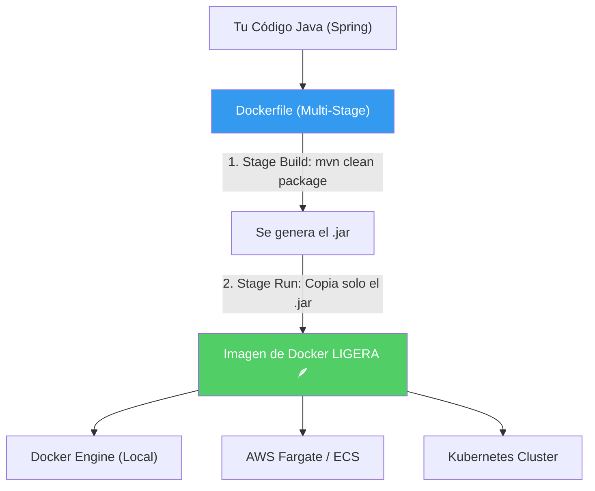

## 26 — Contenedores (Docker y Spring Boot)

### Propósito
Aprender a empaquetar tu aplicación Spring Boot en un contenedor Docker usando un "Multi-Stage Build" para generar imágenes ligeras y seguras. También aprenderemos a orquestar la aplicación junto con su base de datos usando `docker-compose`.

### Problema que resuelve
El clásico problema "En mi máquina sí funciona". 
- **Diferencia de entornos**: Tu PC tiene Java 21, pero el servidor de Producción tiene Java 11. El despliegue falla.
- **Configuración compleja**: Tu app necesita Postgres y Redis. Si un nuevo desarrollador entra al equipo, pasa su primer día instalando estas bases de datos en su PC en lugar de programar.
- **Dificultad de Despliegue**: Copiar el archivo `.jar` al servidor mediante SSH, instalar dependencias y configurar servicios de Linux (systemd) es un proceso lento y manual.

### Cómo lo resuelve
Docker empaqueta tu aplicación (`.jar`) y todo su entorno (el sistema operativo base, la versión exacta de Java, las variables de entorno) en un único artefacto inmutable llamado **Imagen**. Si la Imagen corre en tu PC, tienes la garantía absoluta de que correrá de forma idéntica en AWS, Azure o el PC de un colega.

### Por qué aprenderlo
Docker revolucionó el despliegue de software. Hoy en día, **ninguna** empresa despliega archivos `.jar` crudos directamente en máquinas virtuales; todo va a través de contenedores. Sin Docker, no puedes trabajar en la nube moderna ni entender Kubernetes. Es un skill troncal en el currículum de un Backend Developer.



---

### Glosario Básico

#### `Dockerfile`
Es un archivo de texto con las instrucciones paso a paso para crear una Imagen de Docker. (Ej: `FROM openjdk:21`, `COPY ...`, `CMD ...`).

#### `Imagen`
La "plantilla" estática e inmutable que se genera al compilar el Dockerfile. Incluye el SO base, Java y tu `.jar`. (Ej: `mi-app-spring:1.0`).

#### `Contenedor`
Una instancia viva y en ejecución de una Imagen. Puedes crear múltiples contenedores a partir de la misma imagen.

#### `Multi-Stage Build` (Construcción en múltiples etapas)
Una técnica en el `Dockerfile` donde usas una imagen "pesada" (que incluye Maven y JDK completo) para compilar el código, y luego copias solo el `.jar` resultante a una imagen "ligera" (Solo JRE) que irá a producción. Reduce drásticamente el tamaño final (de 800MB a 150MB) y mejora la seguridad (no dejas herramientas de compilación en producción).

#### `docker-compose.yml`
Archivo de configuración que permite levantar múltiples contenedores interconectados (Ej: Tu app Spring + Postgres) con un solo comando (`docker-compose up`).

---

### Conceptos

#### 1. Creando el Dockerfile (Multi-Stage Build)
- **Qué es** — Las instrucciones para Dockerizar tu aplicación con las mejores prácticas de la industria.
- **Por qué importa** — Si copias tu código local y lo metes a un contenedor simple, estás llevando "basura" a producción. El Multi-Stage asegura que la compilación es repetible e independiente (no necesita que tengas Maven instalado en tu PC).
- **Código** — `Dockerfile` empresarial:
  ```dockerfile
  # ==========================================
  # ETAPA 1: BUILD (Compilación)
  # Usa una imagen pesada con Maven y JDK 21
  # ==========================================
  FROM eclipse-temurin:21-jdk-alpine AS builder
  
  # Directorio de trabajo en el contenedor
  WORKDIR /app
  
  # Copiamos el pom.xml y el wrapper de Maven
  COPY pom.xml mvnw ./
  COPY .mvn .mvn
  
  # Descargamos dependencias (Caché: si el pom no cambia, esta capa no se reconstruye)
  RUN ./mvnw dependency:go-offline
  
  # Copiamos el código fuente
  COPY src src
  
  # Compilamos la aplicación saltando los tests (los tests se corren en el CI/CD)
  RUN ./mvnw package -DskipTests
  
  # ==========================================
  # ETAPA 2: RUN (Producción)
  # Usa una imagen súper ligera solo con JRE 21
  # ==========================================
  FROM eclipse-temurin:21-jre-alpine
  
  WORKDIR /app
  
  # Creamos un usuario sin privilegios por seguridad (No correr como root)
  RUN addgroup -S spring && adduser -S spring -G spring
  USER spring:spring
  
  # Copiamos SOLO el .jar desde la etapa 'builder'
  COPY --from=builder /app/target/*.jar app.jar
  
  # Exponemos el puerto
  EXPOSE 8080
  
  # Comando para ejecutar la aplicación
  ENTRYPOINT ["java", "-jar", "/app/app.jar"]
  ```

#### 2. Comandos Docker Esenciales
Para compilar y correr tu imagen, abres la terminal donde está el `Dockerfile`:
```bash
# 1. Construir la Imagen (el punto final indica "este directorio")
docker build -t app-roadmap-spring:1.0 .

# 2. Ver la imagen creada
docker images

# 3. Correr el contenedor
# -d = en segundo plano (detached)
# -p 8080:8080 = mapea puerto del Host al Contenedor
# --name = le da un nombre para referenciarlo
docker run -d -p 8080:8080 --name mi-backend app-roadmap-spring:1.0

# 4. Ver los logs de tu Spring Boot corriendo dentro
docker logs -f mi-backend
```

#### 3. Orquestación con `docker-compose.yml`
- **Qué es** — Tu app asume que hay una Base de Datos `localhost:5432`. Pero en Docker, `localhost` para tu app es ella misma, no tu computadora real. `docker-compose` crea una red privada donde tu app y Postgres pueden verse usando nombres como DNS (ej: `postgres-db`).
- **Código** — `docker-compose.yml`:
  ```yaml
  version: '3.8'
  
  services:
    # 1. Base de Datos
    postgres-db:
      image: postgres:15-alpine
      environment:
        POSTGRES_USER: roadmap
        POSTGRES_PASSWORD: secretpassword
        POSTGRES_DB: roadmapdb
      ports:
        - "5432:5432"
      volumes:
        - pgdata:/var/lib/postgresql/data # Persistencia (no se borra al apagar)
  
    # 2. Tu Aplicación Spring
    backend-api:
      build: . # Construye la imagen usando el Dockerfile de esta carpeta
      ports:
        - "8080:8080"
      environment:
        # Aquí sobreescribes las variables del application.yml
        # Nota: La URL usa 'postgres-db' en vez de 'localhost' (DNS del docker-compose)
        SPRING_DATASOURCE_URL: jdbc:postgresql://postgres-db:5432/roadmapdb
        SPRING_DATASOURCE_USERNAME: roadmap
        SPRING_DATASOURCE_PASSWORD: secretpassword
      depends_on:
        - postgres-db # Le dice a Docker que arranque la BD primero
  
  # Volumen para persistir los datos de la base de datos
  volumes:
    pgdata:
  ```

#### 4. Edge Cases y Errores Comunes

| Error | Causa | Solución |
|-------|-------|----------|
| `Connection refused` a Postgres | Spring en Docker intenta conectarse a `localhost:5432` de tu PC real. | Usar la IP del host de Docker (`host.docker.internal` en Windows/Mac) o usar `docker-compose` y usar el nombre del servicio (ej: `postgres-db`). |
| OOMKilled (Contenedor Muerto por RAM) | La JVM de Java reserva más memoria que la asignada al contenedor. | Ajustar RAM en Docker Compose o limitar Java con `-XX:MaxRAMPercentage=75.0` en el ENTRYPOINT. |
| Datos de la base de datos se borran al apagar | El contenedor de Postgres es efímero. Destruirlo destruye los datos. | Siempre mapear un `volume:` a la ruta de datos del motor de DB (`/var/lib/postgresql/data`). |
| Imagen pesa > 500MB | Estás usando la imagen JDK (`openjdk:21`) en Producción. | Usar Multi-stage Build y usar imagen JRE-Alpine (`eclipse-temurin:21-jre-alpine`). |

---

### Antes vs Ahora (WAR + Tomcat externo → fat JAR + Docker)

| Aspecto | ANTES (Java 8 / Spring 4 clásico) | AHORA (Java 21 / Spring Boot 4 + Docker) |
|---------|-----------------------------------|------------------------------------------|
| Empaquetado | `.war` (necesita servidor externo) | `.jar` ejecutable (Tomcat embebido) |
| Servidor de aplicaciones | Tomcat/WildFly INSTALADO en el servidor | Tomcat viaja DENTRO del JAR |
| Configuración web | `web.xml` con `<servlet-mapping>` manual | Anotaciones (`@RestController`, `@GetMapping`) |
| Despliegue | `scp app.war user@server:/opt/tomcat/webapps/` + `systemctl restart tomcat` | `docker build` + `docker run` (identico en cualquier host) |
| "En mi máquina funciona" | Habitual: Java 8 local vs Java 11 en producción | Imposible: la imagen encapsula el SO + JRE + JAR |
| Iniciar la app | Reiniciar el Tomcat compartido (afecta a otras apps) | `docker run -p 8080:8080 docker-demo` (aislado) |
| Actualizar Java | Cambiar el JDK del servidor (riesgoso, compartido) | Cambiar `FROM eclipse-temurin:21-jre-alpine` en el Dockerfile |
| Escalar horizontalmente | Instalar Tomcat en N máquinas, replicar configuración | `docker run` N veces detrás de un load balancer |
| Rollback | Restaurar `.war` anterior manualmente | `docker run imagen:vAnterior` (versionado por tag) |
| Sintaxis del código | Servlets extendiendo `HttpServlet` | Métodos anotados con `@GetMapping` |

### FAQ del Alumno

- **¿Qué es una "imagen" en Docker?** Es una plantilla congelada e inmutable que contiene un sistema operativo mínimo + Java + tu `.jar`. Piensa en ella como una "foto" comprimida de un disco duro listo para arrancar.
- **¿Qué diferencia hay entre imagen y contenedor?** La imagen es la receta; el contenedor es el plato ya cocinado y corriendo. De una misma imagen puedes lanzar 10 contenedores.
- **¿Por qué el `Dockerfile` tiene DOS `FROM`?** Es un "multi-stage build". La primera etapa (`FROM ...jdk...`) tiene todo lo pesado (JDK + Maven) para compilar. La segunda etapa (`FROM ...jre...`) es liviana y solo copia el `.jar` ya construido. La imagen final es la de la segunda etapa: más pequeña y segura.
- **¿Qué hace `WORKDIR /app`?** Es el equivalente a `cd /app` dentro del contenedor: fija la carpeta activa para las instrucciones siguientes.
- **¿Qué es `EXPOSE 8080`?** Documenta que el contenedor USA el puerto 8080, pero NO lo publica al host. La publicación se hace con `-p 8080:8080` al ejecutar `docker run`.
- **¿Por qué crear un usuario `spring` en vez de correr como root?** Buena práctica de seguridad: si un atacante logra ejecutar código dentro del contenedor, tendrá menos permisos.
- **¿Por qué se saltan los tests (`-DskipTests`) dentro del Dockerfile?** Porque los tests ya se ejecutaron en el pipeline de CI (módulo 27) ANTES de construir la imagen. Reejecutarlos aquí duplicaría trabajo.
- **¿Qué es `.dockerignore`?** Es el equivalente a `.gitignore` para Docker: le dice qué NO copiar al "build context". Evita meter `target/`, `.git/` o `.idea/` a la imagen.
- **¿Puedo modificar el JAR después de meterlo al contenedor?** No. Los contenedores son inmutables. Si cambias código, reconstruyes la imagen con un nuevo tag y despliegas de nuevo.
- **¿Necesito Docker para que este módulo compile?** No. `mvn clean verify` genera el JAR y pasa los tests sin Docker. Docker solo se necesita para construir la imagen (`docker build`) y ejecutarla (`docker run`).

### Ejercicios
1. En tu proyecto, crea un archivo llamado exactamente `Dockerfile` en la raíz (junto al `pom.xml`) y pega el código del Multi-Stage build.
2. Ejecuta `docker build -t app-test:1.0 .` y verifica en `docker images` que se haya creado.
3. Crea un archivo `docker-compose.yml` que levante un servicio Postgres. Inicia la BD con `docker-compose up -d postgres-db`.
4. Añade tu app al `docker-compose.yml`, configurando la variable `SPRING_DATASOURCE_URL` correctamente.
5. Apaga todo (`docker-compose down`) y levanta todo junto con `docker-compose up -d`. Haz una petición a `localhost:8080` y valida que tu app en contenedor se conectó al Postgres en contenedor.

### Cómo ejecutar

#### 1. Compilar el JAR (no requiere Docker)
```bash
# Git Bash
./build.sh

# PowerShell
./build.ps1

# Manual (con toolchain portable)
mvn clean verify
java -jar target/docker-1.0.0.jar
```

Salida esperada: se levanta Tomcat embebido en `http://localhost:8080` y `GET /api/hello` retorna `Hello from Docker container`.

#### 2. Construir y correr la imagen Docker (requiere Docker Desktop corriendo)
```bash
# Construye la imagen (el punto final = "usa el Dockerfile de esta carpeta")
docker build -t docker-demo .

# Corre el contenedor mapeando el puerto
docker run -p 8080:8080 docker-demo

# En otra terminal, probar el endpoint
curl http://localhost:8080/api/hello
# → Hello from Docker container
```

#### 3. Con docker-compose (opcional)
```bash
docker compose up --build
docker compose down
```

### Archivos del Proyecto
| Archivo | Propósito |
|---------|-----------|
| `pom.xml` | Coordenadas Maven, dependencia `spring-boot-starter-web`, `finalName=docker-1.0.0`. |
| `Dockerfile` | Multi-stage build: JDK+Maven (build) → JRE Alpine (runtime). Usuario no-root. |
| `.dockerignore` | Excluye `target/`, `.git/`, `.idea/`, `*.iml` del contexto de build. |
| `docker-compose.yml` | Orquestación opcional del servicio `app` en el puerto 8080. |
| `build.sh` / `build.ps1` | Scripts que compilan el JAR con el toolchain portable. NO ejecutan `docker build`. |
| `src/main/java/.../DockerApplication.java` | Clase principal con `@SpringBootApplication`. |
| `src/main/java/.../controller/HelloController.java` | Endpoint `GET /api/hello` → `"Hello from Docker container"`. |
| `src/main/resources/application.yml` | Configuración mínima (puerto 8080, logging). |
| `src/test/java/.../DockerApplicationTests.java` | `contextLoads()` — smoke test de arranque. |
| `src/test/java/.../controller/HelloControllerTest.java` | MockMvc standalone: `GET /api/hello` retorna 200 con "Docker container". |
