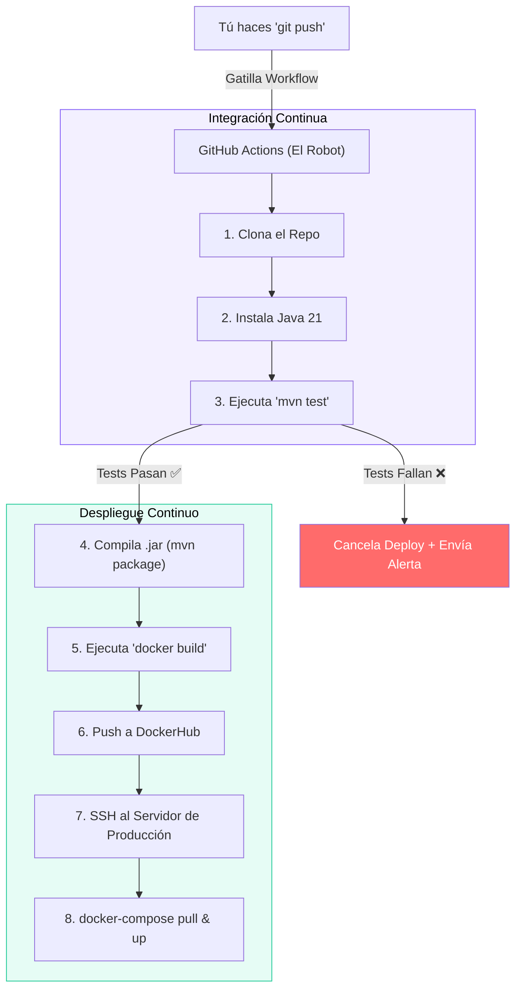

## 27 — Integración y Despliegue Continuo (CI/CD con GitHub Actions)

### Propósito
Aprender a automatizar todo el ciclo de vida de tu código: cada vez que haces un `git push`, un servidor remoto descargará tu código, correrá los tests automáticamente (Integración Continua) y, si todo sale bien, lo empaquetará en Docker y lo enviará al servidor de producción (Despliegue Continuo) sin intervención humana.

### Problema que resuelve
El proceso manual de despliegue ("Deploy") es un infierno:
1. Terminas de programar. Haces `mvn clean package` localmente.
2. Abres un cliente FTP o SSH. Subes el archivo `.jar` de 50MB a tu servidor en AWS.
3. Te conectas por SSH, matas el proceso anterior de Java, y levantas el nuevo.
4. **ERROR**: Olvidaste correr los tests localmente y rompiste el login. Tienes que revertir todo a mano mientras los clientes se quejan por Twitter.
Este proceso es lento, estresante y el principal causante de caídas en producción.

### Cómo lo resuelve
CI/CD utiliza plataformas como GitHub Actions, GitLab CI o Jenkins. Escribes un archivo de configuración (`.yml`) que actúa como un "Robot" en la nube.
- **CI (Continuous Integration):** El robot clona tu código, instala Java, ejecuta `mvn test` y reporta si hay errores. Previene que código roto llegue a `main`.
- **CD (Continuous Deployment):** Si CI pasa, el robot ejecuta `docker build`, se conecta a tu servidor real (AWS/DigitalOcean) y actualiza el contenedor automáticamente.

### Por qué aprenderlo
Ninguna empresa seria despliega a mano. Las startups y corporaciones exigen que los desarrolladores entiendan las pipelines de CI/CD para integrarse al ciclo de desarrollo ágil (DevOps). Sin esto, no eres productivo en un equipo moderno.



---

### Glosario Básico

#### `Pipeline` / `Workflow`
Una secuencia automatizada de pasos definida en un archivo de configuración.

#### `GitHub Actions`
La herramienta nativa de GitHub para hacer CI/CD. Se configura creando archivos `.yml` en la carpeta especial `.github/workflows/`.

#### `Job` (Trabajo)
Un conjunto de pasos que se ejecutan en un mismo servidor virtual (Runner). Los Jobs pueden ejecutarse en paralelo o en secuencia (ej. el Job de `deploy` requiere que el Job de `build` termine primero).

#### `Secrets` (Secretos)
Las contraseñas de Base de Datos o llaves SSH NO se guardan en el código (GitHub). Se configuran en la interfaz web de GitHub (Settings > Secrets) y el robot las lee de forma segura durante la ejecución.

---

### Conceptos

#### 1. Configurando Integración Continua (CI)
- **Qué es** — Una regla que dice: "Cada vez que se haga un Pull Request a la rama `main`, levanta un servidor de Linux, instala Maven, y corre `mvn test`".
- **Por qué importa** — Si tu compañero rompe el código, el CI mostrará una "X roja" en GitHub y bloqueará el botón de *Merge*, protegiendo la rama principal.
- **Código** — Archivo `.github/workflows/ci.yml`:
  ```yaml
  name: Java CI (Spring Boot)
  
  # Cuándo se ejecuta este robot
  on:
    push:
      branches: [ "main" ]
    pull_request:
      branches: [ "main" ]
  
  jobs:
    build-and-test:
      # Sistema operativo del servidor que nos presta GitHub
      runs-on: ubuntu-latest
  
      steps:
      - name: Descargar el código del repositorio
        uses: actions/checkout@v4
  
      - name: Configurar Java 21
        uses: actions/setup-java@v4
        with:
          java-version: '21'
          distribution: 'temurin'
          cache: maven # Guarda las dependencias descargadas para acelerar futuros runs
  
      - name: Compilar y correr pruebas
        run: mvn clean verify
  ```

#### 2. Configurando Despliegue Continuo (CD) con Docker
- **Qué es** — Tras pasar los tests, el robot empaqueta tu app, crea una imagen de Docker, la sube a DockerHub y le dice a tu servidor (vía SSH) que la descargue y la corra.
- **Por qué importa** — El equipo hace Push el viernes a las 5 PM y se va a casa. En 3 minutos, la nueva versión ya está disponible para todos los clientes, sin tocar el servidor con las manos.
- **Código** — Añadimos el paso de Deploy al mismo u otro Workflow (ej. `deploy.yml`):
  ```yaml
  name: CI / CD Workflow
  
  on:
    push:
      branches: [ "main" ]
  
  jobs:
    # --- JOB 1: TEST ---
    test:
      runs-on: ubuntu-latest
      steps:
        - uses: actions/checkout@v4
        - uses: actions/setup-java@v4
          with:
            java-version: '21'
            distribution: 'temurin'
        - run: mvn clean test
  
    # --- JOB 2: DOCKER & DEPLOY ---
    deploy:
      runs-on: ubuntu-latest
      needs: test # ESTO ES VITAL: Si 'test' falla, 'deploy' no se ejecuta
      
      steps:
        - uses: actions/checkout@v4
        
        - name: Iniciar sesión en Docker Hub
          uses: docker/login-action@v3
          with:
            username: ${{ secrets.DOCKERHUB_USERNAME }}
            password: ${{ secrets.DOCKERHUB_TOKEN }}
            
        - name: Build y Push de la Imagen Docker
          uses: docker/build-push-action@v5
          with:
            context: .
            push: true
            tags: edgardo/mi-api-spring:latest
            
        - name: Conectar al Servidor por SSH y Desplegar
          uses: appleboy/ssh-action@v1.0.3
          with:
            host: ${{ secrets.SERVER_IP }}
            username: ${{ secrets.SERVER_USER }}
            key: ${{ secrets.SERVER_SSH_KEY }}
            script: |
              cd /opt/miapp
              # Detiene el contenedor actual, descarga la nueva imagen y arranca de nuevo
              docker-compose pull backend-api
              docker-compose up -d --no-deps backend-api
  ```

#### 3. Protegiendo la Rama `main` (Branch Protections)
- **Qué es** — Una configuración en los "Settings" de tu repositorio en GitHub. Marcas la rama `main` y le dices: *"Nadie puede hacer push directo. Todo debe ser por Pull Request, y el Pull Request DEBE pasar el Action `build-and-test` antes de ser mergeado"*.
- **Casos de Uso Empresariales** — Ningún desarrollador, ni siquiera el líder técnico, puede subir código directamente a Producción. Todos pasan por la auditoría automática del CI.

#### 4. Edge Cases y Errores Comunes

| Error | Causa | Solución |
|-------|-------|----------|
| `BUILD FAILURE` en GitHub, pero local pasa | Local tienes configurada una Base de Datos en el puerto 5432, pero el servidor de GitHub Actions no la tiene. | Los tests que corran en CI deben usar TestContainers (Módulo 25) o la Base H2, de lo contrario fallarán por no poder conectarse a la BD. |
| El SSH de GitHub al servidor rechaza la conexión | Tu servidor (EC2 en AWS) tiene bloqueado el puerto 22 en su Firewall para IPs desconocidas. | Debes abrir el puerto SSH para las IPs de GitHub, o usar una VPN/Túnel seguro. |
| Secretos vacíos (`${{ secrets.PASSWORD }}`) | El workflow se gatilló desde un *Fork* o Pull Request externo. | Por seguridad, GitHub Actions no expone secretos a repositorios no confiables. Si necesitas conectarte a BDs, usa variables de entorno genéricas para los tests. |

---

### Ejercicios
1. Crea la estructura de carpetas obligatoria en la raíz de tu proyecto: `.github/workflows/`.
2. Crea el archivo `ci.yml` copiando el Job de "Configurando Integración Continua (CI)" de arriba.
3. Asegúrate de que el código del módulo tiene un error de compilación (ej: borra un punto y coma).
4. Haz `git push` a tu repositorio en GitHub.
5. Ve a la pestaña **Actions** en tu repositorio de GitHub. Observa cómo el robot arranca, detecta el error de compilación y marca el commit con una X roja ❌. Corrige el código, haz push de nuevo y recibe el check verde ✅.

### Cómo ejecutar
```bash
# Este código no se ejecuta localmente (a menos que uses herramientas como 'act').
# Se dispara automáticamente al hacer push:

git add .
git commit -m "feat(27): configurar github actions"
git push origin main
```

### Archivos del Proyecto
| Archivo | Propósito |
|---------|-----------|
| `.github/workflows/ci.yml` | Pipeline de Integración Continua (solo Testing). |
| `.github/workflows/deploy.yml` | Pipeline de Despliegue Continuo (Docker + SSH). |
