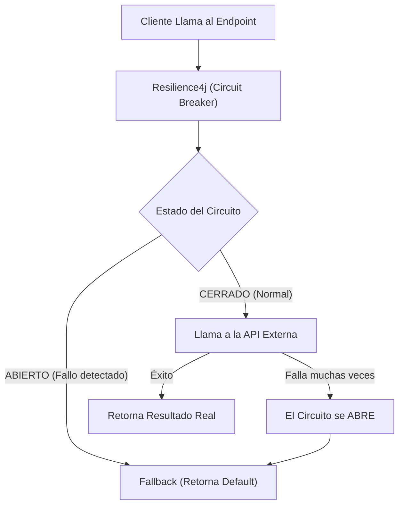

## 30 — Tolerancia a Fallos (Resilience4j)

### Propósito
Aprender a proteger tu aplicación contra fallos en servicios de terceros o caídas de otros microservicios utilizando patrones de resiliencia como Circuit Breaker (Cortacircuitos), Retry (Reintentos) y Rate Limiter (Limitador de Tasa) con la librería estándar de la industria: **Resilience4j**.

### Problema que resuelve
En arquitecturas distribuidas y de microservicios, el fallo es la norma, no la excepción. Si tu `Servicio de Pagos` consulta a la API de `Stripe` y Stripe está caído (responde en 30 segundos o arroja 500):
- **Efecto Dominó:** Tu aplicación se quedará esperando 30 segundos por cada cliente. Los hilos de Tomcat se agotarán, tu servidor consumirá toda la memoria, y tu propia aplicación se caerá (Cascading Failure), aunque el problema sea de Stripe.
- **Mala Experiencia:** El usuario ve un error críptico o la pantalla se queda cargando infinitamente.

### Cómo lo resuelve
Resilience4j envuelve tus llamadas a APIs externas en "protectores":
- **Circuit Breaker:** Si detecta que Stripe falla el 50% de las veces, "Abre" el circuito. Las siguientes llamadas ya no intentarán ir a Stripe (para no esperar 30s), sino que fallarán instantáneamente (Fail-fast), salvando los hilos de tu servidor.
- **Fallback (Respaldo):** Si falla el servicio, puedes configurar una respuesta por defecto (ej: "Servicio no disponible, intente más tarde").
- **Retry:** Si falla por un error temporal de red, automáticamente reintenta 3 veces antes de rendirse.

### Por qué aprenderlo
La resiliencia separa un sistema de juguete de un sistema de calidad empresarial. Spring Cloud recomendaba Hystrix en el pasado (ya obsoleto). Hoy, Resilience4j es la herramienta oficial y es conocimiento obligatorio en el diseño de microservicios (Microservices Design Patterns).



---

### Glosario Básico

#### `Circuit Breaker`
Máquina de estados con 3 estados: 
- `CLOSED` (Cerrado): Todo funciona normal. Deja pasar las peticiones.
- `OPEN` (Abierto): Detectó muchos fallos. Corta la conexión y rechaza todas las peticiones instantáneamente.
- `HALF_OPEN` (Medio-abierto): Tras un tiempo, deja pasar unas pocas peticiones para ver si el servicio externo ya se recuperó. Si tienen éxito, se cierra; si fallan, se vuelve a abrir.

#### `Retry`
Mecanismo que captura una excepción y vuelve a ejecutar el código automáticamente `N` veces, opcionalmente esperando `X` segundos entre intentos (Backoff).

#### `Rate Limiter`
Limita la cantidad de peticiones que se pueden hacer a un método en un periodo de tiempo. Ej: "Máximo 5 peticiones por segundo".

#### `Fallback`
Un método alternativo que se ejecuta cuando el Circuit Breaker está abierto o cuando se acaban los reintentos. Garantiza que el usuario siempre reciba una respuesta controlada, no un Stack Trace.

---

### Conceptos

#### 1. Configuración Básica y Circuit Breaker
- **Qué es** — Envolver la llamada externa (`RestClient` o `RestTemplate`) con la anotación `@CircuitBreaker`.
- **Código** — Ejemplo de consumo con protección:
  ```xml
  <!-- En pom.xml -->
  <dependency>
      <groupId>org.springframework.cloud</groupId>
      <artifactId>spring-cloud-starter-circuitbreaker-resilience4j</artifactId>
  </dependency>
  <dependency>
      <groupId>org.springframework.boot</groupId>
      <artifactId>spring-boot-starter-actuator</artifactId>
  </dependency>
  <!-- Obligatorio para que funcionen las anotaciones AOP de Resilience4j -->
  <dependency>
      <groupId>org.springframework.boot</groupId>
      <artifactId>spring-boot-starter-aop</artifactId>
  </dependency>
  ```
  
  ```java
  @Service
  @Slf4j
  public class InventoryService {
  
      private final RestClient restClient;
  
      public InventoryService(RestClient restClient) {
          this.restClient = restClient;
      }
  
      // Aplica el patrón usando la configuración "inventoryService"
      // Si falla, llama al método "defaultInventory"
      @CircuitBreaker(name = "inventoryService", fallbackMethod = "defaultInventory")
      public InventoryResponse checkStock(String productId) {
          log.info("Consultando stock a servicio externo para: {}", productId);
          // Llamada real que podría fallar
          return restClient.get()
                  .uri("http://localhost:9090/api/inventory/{id}", productId)
                  .retrieve()
                  .body(InventoryResponse.class);
      }
      
      // Mismo nombre, mismos parámetros + la excepción que causó la falla
      public InventoryResponse defaultInventory(String productId, Exception e) {
          log.warn("El servicio externo falló. Retornando stock por defecto. Error: {}", e.getMessage());
          // Respuesta de salvavidas (Fallback)
          return new InventoryResponse(productId, 0, "No Disponible por el momento");
      }
  }
  ```

#### 2. Configurando las Reglas del Circuito (YAML)
- **Qué es** — Decidir cuándo se abre el circuito. ¿Después de 3 errores? ¿Si el 50% de 10 peticiones fallan?
- **Código** — En el `application.yml`:
  ```yaml
  resilience4j:
    circuitbreaker:
      instances:
        inventoryService:
          # Tipo de ventana: Basado en cantidad de peticiones (COUNT_BASED) o tiempo (TIME_BASED)
          sliding-window-type: COUNT_BASED
          sliding-window-size: 10 # Evalúa las últimas 10 peticiones
          failure-rate-threshold: 50 # Si el 50% fallan (5 peticiones), el circuito se ABRE
          wait-duration-in-open-state: 10s # Se queda ABIERTO por 10 segundos antes de intentar HALF_OPEN
          permitted-number-of-calls-in-half-open-state: 3 # En HALF_OPEN, deja pasar 3 peticiones de prueba
          minimum-number-of-calls: 5 # Espera al menos 5 peticiones antes de empezar a calcular porcentajes
  ```
- **Analogía** — El interruptor de luz de tu casa (Breaker). Si hay un corto circuito en un enchufe, se "baja" (Abre) para evitar que la casa se incendie. No puedes usar la luz por un rato, pero el resto de tu casa sigue funcionando perfectamente.

#### 3. Implementando Retry (Reintentos Inteligentes)
- **Qué es** — Si la red parpadea por 1 segundo, la petición falla. En vez de mostrar error al usuario, intentas de nuevo.
- **Código**:
  ```java
  @Service
  @Slf4j
  public class PaymentService {
      
      // Se puede combinar con CircuitBreaker!
      @Retry(name = "paymentRetry", fallbackMethod = "paymentFailed")
      public String processPayment(Double amount) {
          log.info("Intentando cobrar ${}...", amount);
          // Simular fallo
          if(Math.random() > 0.1) { 
              throw new RuntimeException("Error temporal de red al cobrar"); 
          }
          return "Cobro exitoso";
      }
      
      public String paymentFailed(Double amount, Exception e) {
          return "Fallo definitivo tras reintentos. Intente usar otra tarjeta.";
      }
  }
  ```
  ```yaml
  resilience4j:
    retry:
      instances:
        paymentRetry:
          max-attempts: 3 # Intenta 3 veces en total (1 original + 2 reintentos)
          wait-duration: 2s # Espera 2 segundos entre cada intento
  ```

#### 4. Monitoreando la Salud con Actuator
- **Qué es** — Cuando expones los endpoints de Actuator (`/actuator/health`), Resilience4j inyecta automáticamente el estado de tus Circuit Breakers.
- **Por qué importa** — Los sistemas de monitoreo como Prometheus pueden leer esto y enviarte una alerta de Slack: *"Alerta: El CircuitBreaker 'inventoryService' está OPEN!"*.
- **Código** — `application.yml`:
  ```yaml
  management:
    endpoints:
      web:
        exposure:
          include: health, prometheus, circuitbreakers
    health:
      circuitbreakers:
        enabled: true # Muestra el detalle CLOSED/OPEN en el JSON de /health
  ```

#### 5. Edge Cases y Errores Comunes

| Error | Causa | Solución |
|-------|-------|----------|
| El CircuitBreaker no hace nada | Falta la dependencia de AOP (`spring-boot-starter-aop`). | Las anotaciones de Resilience4j funcionan con AOP. Si falta la dependencia, Spring ignora la anotación silenciosamente. |
| FallbackMethod not found | La firma del método fallback no coincide exactamente con el original. | El método de fallback debe tener exactamente los mismos argumentos que el original, y añadir un parámetro final `Exception e` (o el tipo específico de excepción). |
| Llamadas internas no protegidas | Llamar a un método con `@CircuitBreaker` desde OTRO método en la *misma clase*. | Por limitaciones de los Proxies AOP (Self-Invocation), debes inyectar la dependencia o mover el método a otra clase. |
| Excepciones que no deberían abrir el circuito | Una API externa devuelve 404. Eso es un error de negocio, no un fallo del servidor. | Configurar `ignore-exceptions:` en el YAML para excluir `ResourceNotFoundException` o similares del conteo de fallas. |

---

### Ejercicios
1. Crea un proyecto con `spring-cloud-starter-circuitbreaker-resilience4j`, `aop`, y `actuator`.
2. Crea un `@Service` con un método que siempre lance una excepción simulando un servicio caído. Anótalo con `@CircuitBreaker(name="test")`.
3. Configura en el `application.yml` que el circuito se abra tras 2 errores seguidos (`sliding-window-size: 2`, `minimum-number-of-calls: 2`).
4. Haz un Endpoint REST que llame a este servicio. Ejecuta `curl` 3 veces. 
5. Observa los logs: La petición 1 y 2 ejecutan el código y fallan. La petición 3 ya NO ejecuta el código, arroja un error inmediato o salta al `fallbackMethod`.
6. Ve a `http://localhost:8080/actuator/health` y verifica que el estado del CircuitBreaker es `OPEN`.

### Cómo ejecutar
```bash
# Windows PowerShell
./build.ps1
java -jar target/resilience4j-1.0.0.jar

# Git Bash
./build.sh
java -jar target/resilience4j-1.0.0.jar

# O directamente con Maven portable
../apache-maven-3.9.16/bin/mvn spring-boot:run

# Probar el endpoint (las primeras llamadas atraviesan Retry; el CB se abre si sigue fallando):
curl http://localhost:8080/api/resilience/call
```

### Implementación (Módulo 30 — código incluido)

Este módulo **no** usa `resilience4j-spring-boot3` (esa autoconfig está publicada para Boot 3.x y no está homologada con Spring Boot 4.1.0). En su lugar usamos la **API programática** de Resilience4j: `resilience4j-circuitbreaker` + `resilience4j-retry`, construyendo los objetos `CircuitBreaker` y `Retry` como `@Bean` y decorando manualmente el `Supplier<String>` que invoca al servicio.

**Piezas clave:**

- `FlakyService.call()` — servicio "inestable" que lanza `RuntimeException` en las primeras 3 llamadas y luego retorna `OK`.
- `ResilienceConfig` — define dos beans:
  - `CircuitBreaker` con `failureRateThreshold=50%`, `slidingWindowSize=4`, `waitDurationInOpenState=5s`.
  - `Retry` con `maxAttempts=3`, `waitDuration=100ms`, reintenta ante cualquier `RuntimeException`.
- `ResilientClient.callWithProtection()` — compone `Retry.decorateSupplier(retry, CircuitBreaker.decorateSupplier(cb, flaky::call))` y ejecuta.
- `ResilienceController` — expone `GET /api/resilience/call`.

**Tests:**
- `ResilienceApplicationTests.contextLoads` — el contexto arranca con los beans bien cableados.
- `ResilientClientTest` (`@SpringBootTest`) — verifica que `flakyService.call()` sin protección lanza excepción y que `callWithProtection()` termina retornando `OK`.
- `ResilienceControllerTest` — MockMvc **standalone** (no usamos `@WebMvcTest`, eliminado en Boot 4), cableando el controller a mano con un `Retry` amplio para asegurar respuesta OK en un solo request.

### Antes vs Ahora (Java 8 → Java 21) — aplicado al módulo

| Situación | Java 8 clásico (try-catch + Thread.sleep) | Java 21 + Resilience4j (declarativo) |
|-----------|-------------------------------------------|--------------------------------------|
| Reintentar N veces | `for (int i=0; i<3; i++) { try { return svc.call(); } catch (Ex e) { Thread.sleep(100); } }` | `Retry.decorateSupplier(retry, svc::call).get()` |
| Cortar cascada de fallos | Contador manual + variable `boolean broken` + timestamp de "quema" | `CircuitBreaker.decorateSupplier(cb, svc::call).get()` |
| Componer políticas | `try { retry-loop { circuit-check { ... } } }` — anidamiento profundo | Composición fluida de `Supplier` con dos decoradores |
| Contador thread-safe | `synchronized int counter` | `AtomicInteger counter` |
| Referencia a método | `new Supplier<String>() { public String get() { return svc.call(); } }` | `svc::call` (method reference) |
| Predicado de excepción | Clase anónima `Predicate<Throwable>` | Lambda: `ex -> ex instanceof RuntimeException` |

### FAQ del Alumno

- **¿Por qué NO usé `@CircuitBreaker` como anotación?** Porque la anotación viene de `resilience4j-spring-boot3`, cuyo autoconfig no está publicado para Boot 4.1.0. Se puede lograr el mismo efecto de forma **programática** definiendo un `@Bean CircuitBreaker` y envolviendo el `Supplier`.
- **¿Qué es un `Supplier<String>`?** Una interfaz funcional de Java 8: representa "algo que, cuando lo invocas con `.get()`, te devuelve un String". Resilience4j la usa para envolver la operación real y meterla en su pipeline de protección.
- **¿Qué diferencia hay entre `Retry` y `CircuitBreaker`?** `Retry` insiste (vuelve a llamar); `CircuitBreaker` observa la tasa de fallos y CORTA temporalmente para no seguir gastando recursos. Se usan juntos.
- **¿Qué es "sliding window"?** La ventana de las últimas N llamadas que el CB observa para calcular el % de fallo. Configurada en 4: si 2 de las últimas 4 fallaron, abre el circuito.
- **¿Cuándo se cierra el circuito de vuelta?** Después de `waitDurationInOpenState` (5 s aquí), pasa a `HALF_OPEN` y deja pasar 2 llamadas de prueba; si tienen éxito, vuelve a `CLOSED`.
- **¿Por qué el test de MockMvc no usa `@WebMvcTest`?** Porque Spring Boot 4.1.0 eliminó `@WebMvcTest` (ver `MEMORY.md`). Patrón portable: `MockMvcBuilders.standaloneSetup(new Controller(deps)).build()`.
- **¿Qué es `AtomicInteger`?** Un contador thread-safe sin `synchronized`. Sus métodos (`incrementAndGet`, `get`) son atómicos gracias a instrucciones CAS del procesador.
- **¿Qué es un "method reference" (`::`)?** Azúcar sintáctico para lambdas simples. `flakyService::call` equivale a `() -> flakyService.call()`.

### Archivos del Proyecto (implementación)

| Archivo | Propósito |
|---------|-----------|
| `pom.xml` | Boot 4.1.0 + `resilience4j-circuitbreaker` 2.2.0 + `resilience4j-retry` 2.2.0 + `spring-aspects` + `aspectjweaver`. |
| `build.sh` / `build.ps1` | Scripts con toolchain portable (JDK 21 + Maven 3.9.16 de la raíz). |
| `src/main/resources/application.yml` | Config mínima (no incluye bloque `resilience4j:` porque no usamos autoconfig). |
| `ResilienceApplication.java` | Punto de entrada Spring Boot. |
| `config/ResilienceConfig.java` | Beans programáticos `CircuitBreaker` + `Retry`. |
| `service/FlakyService.java` | Servicio que falla las 3 primeras llamadas. |
| `service/ResilientClient.java` | Compone Retry + CircuitBreaker sobre `flakyService.call()`. |
| `controller/ResilienceController.java` | `GET /api/resilience/call`. |
| `ResilienceApplicationTests.java` | `contextLoads`. |
| `service/ResilientClientTest.java` | `@SpringBootTest` — Flaky sin protección falla, con protección retorna OK. |
| `controller/ResilienceControllerTest.java` | MockMvc standalone → `200 OK` + respuesta `OK from FlakyService...`. |
| `target/resilience4j-1.0.0.jar` | Artefacto ejecutable (`java -jar`). |
