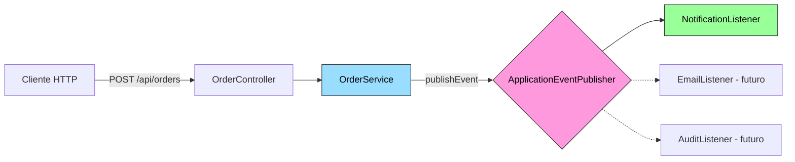

# Módulo 31 — Mensajería (ApplicationEventPublisher)

## Propósito
Aprender el patrón **Publish/Subscribe** (publicar/suscribir) dentro de una sola JVM usando el `ApplicationEventPublisher` que trae Spring Boot. Este módulo es la puerta de entrada al mundo de la mensajería **antes** de saltar a brokers externos (RabbitMQ, Kafka).

## Problema que resuelve
Cuando un servicio `OrderService` crea un pedido, necesitamos disparar N acciones colaterales: enviar email, actualizar métricas, notificar auditoría, activar métricas, etc. Si el service llama a cada uno directamente (`emailService.send(...)`, `auditService.log(...)`), el código se **acopla** y cualquier nueva acción obliga a modificar `OrderService`.

## Cómo lo resuelve
El service publica un **evento** (`OrderCreatedEvent`) al bus interno de Spring. Cualquier bean anotado con `@EventListener` que reciba ese tipo lo procesará. `OrderService` no sabe cuántos oyentes hay ni quiénes son. **Desacoplamiento total**.

## Por qué aprenderlo
Es el mismo modelo mental que Kafka/RabbitMQ, pero **sin infraestructura**. Cuando pases a brokers externos ya conocerás el patrón; solo cambia el transporte.



## Glosario Básico
| Término | Significado |
|---|---|
| **Evento** | Objeto inmutable que describe algo que YA pasó (`OrderCreatedEvent`). |
| **Publisher** | Quien lanza el evento al bus (`OrderService`). |
| **Listener / Subscriber** | Quien reacciona al evento (`NotificationListener`). |
| **Bus** | El intermediario de Spring: `ApplicationEventPublisher`. |
| **Síncrono** | El listener corre en la misma hebra del publisher (por defecto). |
| **Asíncrono** | El listener corre en otra hebra (`@Async` + `@EnableAsync`). |
| **Broker** | Software externo (RabbitMQ, Kafka) que mueve mensajes entre JVMs. |

## Conceptos clave

### `ApplicationEventPublisher`
- **Qué es:** bean autoinyectado por Spring que expone `publishEvent(Object)`.
- **Por qué importa:** permite desacoplar productor y consumidor dentro de la misma app.
- **Analogía:** un altavoz en un pasillo: quien grita no conoce a los que escuchan.
- **Casos de uso empresariales:** auditoría, notificaciones, invalidación de caché, métricas de dominio.

### `@EventListener`
- **Qué es:** marca un método como suscriptor. Spring lo enruta por el tipo del parámetro.
- **Por qué importa:** cero configuración XML/YAML, cero acoplamiento.
- **Analogía:** una "oreja" pegada al altavoz que solo reacciona a cierta palabra.

### `record` para eventos
- **Qué es:** clase inmutable de Java 16+ con constructor/getters/equals/hashCode/toString autogenerados.
- **Por qué importa:** un evento debe ser inmutable; `record` lo garantiza en 1 línea.

## Antes vs Ahora
| Concepto | ANTES (Java 8 / Spring 4) | AHORA (Java 21 / Spring Boot 4.1.0) |
|---|---|---|
| Evento | `class Evt extends ApplicationEvent` con 30 líneas | `record OrderCreatedEvent(Long id, String c) {}` |
| Suscriptor | `implements ApplicationListener<Evt>` | Cualquier método con `@EventListener` |
| Inyección | `@Autowired` en campo | Constructor injection (campo `final`) |
| Test web | `@WebMvcTest` + `MockMvc` autoconfigurado | `MockMvcBuilders.standaloneSetup(...)` **obligatorio** (Boot 4 eliminó `@WebMvcTest`) |
| Cliente HTTP en tests | `TestRestTemplate` | `RestClient` (Boot 4 eliminó `TestRestTemplate`) |

## In-memory vs Broker externo
| Aspecto | `ApplicationEventPublisher` (este módulo) | RabbitMQ / Kafka |
|---|---|---|
| Ámbito | Misma JVM | Entre procesos / máquinas |
| Persistencia | NO (se pierde al reiniciar) | SÍ (cola durable / log) |
| Entrega garantizada | Best-effort | At-least-once / exactly-once |
| Reintentos | Manual | Nativos |
| Backpressure | No aplica | Sí (consumer lag / prefetch) |
| Curva de aprendizaje | Baja | Media/Alta |
| Cuándo usarlo | Monolito, side-effects locales, DDD Domain Events | Microservicios, integración de sistemas |

> **En producción real** para comunicación entre microservicios usa **Kafka** (log de eventos, alto throughput) o **RabbitMQ** (colas tradicionales, routing complejo). Este módulo es la **base conceptual** que te prepara para ambos.

## FAQ del Alumno

**P: ¿El listener corre en otra hebra?**
R: No por defecto. Es síncrono en la misma hebra del publisher. Añade `@Async` + `@EnableAsync` para asíncrono.

**P: ¿Qué pasa si un listener lanza excepción?**
R: En modo síncrono, propaga al publisher y aborta la publicación al resto. En `@Async`, solo se loguea.

**P: ¿Puedo tener varios listeners para el mismo evento?**
R: Sí. Spring los invoca a todos. Puedes ordenarlos con `@Order`.

**P: ¿Los eventos sobreviven a un reinicio?**
R: **NO.** Este bus es en memoria. Si necesitas persistencia usa Kafka/Rabbit.

**P: ¿Por qué no un `record` para el `OrderService`?**
R: `record` es para datos inmutables. Los servicios tienen comportamiento y dependencias mutables (aunque los campos sean `final`, la lógica cambia); una clase normal es lo adecuado.

**P: ¿Por qué no usar `@Autowired` en el campo?**
R: Regla del proyecto: **constructor injection** siempre. Da campos `final`, testeabilidad y falla en el arranque si falta el bean (mejor que un `NullPointerException` en runtime).

**P: ¿Por qué el test del controller no usa `@WebMvcTest`?**
R: **Spring Boot 4.1.0 ELIMINÓ `@WebMvcTest`, `@AutoConfigureMockMvc`, `@DataJpaTest` y `TestRestTemplate`.** El patrón portable oficial del proyecto es `MockMvcBuilders.standaloneSetup(controller).build()`.

## Ejercicios
1. Agregar un segundo listener `AuditListener` que también incremente un contador. Verificar que ambos reciben cada evento.
2. Convertir el listener a asíncrono (`@Async` + `@EnableAsync`). Ajustar el test para esperar con `Awaitility`.
3. Agregar un evento `OrderCancelledEvent` y un listener que decremente un stock ficticio.
4. Ordenar listeners con `@Order(1)` y `@Order(2)`.

## Cómo ejecutar

### Build (produce el JAR ejecutable)
```powershell
# Windows PowerShell
.\build.ps1
```
```bash
# Git Bash / Linux / macOS
./build.sh
```

### Ejecutar el JAR
```bash
java -jar target/mensajeria-1.0.0.jar
```

### Modo desarrollo (Maven)
```bash
../apache-maven-3.9.16/bin/mvn spring-boot:run
```

### Probar con curl
```bash
# Crear un pedido (produce el evento)
curl -X POST "http://localhost:8080/api/orders?customer=Juan"
# -> HTTP 201
# -> {"orderId":1,"customer":"Juan","status":"CREATED"}

# En los logs del servidor verás:
# [NotificationListener] Recibido pedido #1 para cliente Juan
```

## Archivos del Proyecto

| Archivo | Rol |
|---|---|
| `pom.xml` | Coordenadas Maven + dependencias (web, test). |
| `build.ps1` / `build.sh` | Build portable con JDK 21 + Maven 3.9.16. |
| `src/main/resources/application.properties` | Configuración (puerto 8080). |
| `src/main/java/.../MessagingApplication.java` | Bootstrap `@SpringBootApplication`. |
| `src/main/java/.../event/OrderCreatedEvent.java` | Evento (record inmutable). |
| `src/main/java/.../service/OrderService.java` | Publica el evento al bus. |
| `src/main/java/.../listener/NotificationListener.java` | Reacciona al evento con `@EventListener`. |
| `src/main/java/.../controller/OrderController.java` | `POST /api/orders?customer=X`. |
| `src/test/.../MessagingApplicationTests.java` | `contextLoads`. |
| `src/test/.../service/OrderServiceTest.java` | `@SpringBootTest` verifica publish/subscribe end-to-end. |
| `src/test/.../controller/OrderControllerTest.java` | MockMvc standalone con service mockeado. |

## Artefacto
`target/mensajeria-1.0.0.jar` (fat JAR ejecutable con Tomcat embebido).
