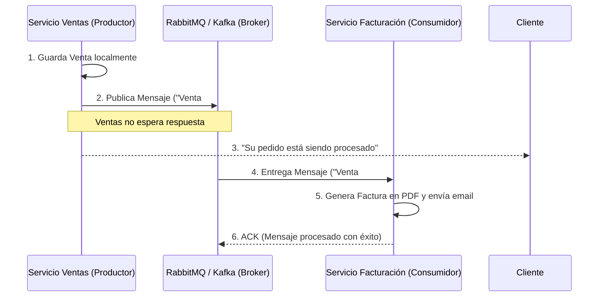

## 31 — Mensajería Asíncrona (RabbitMQ y Apache Kafka)

### Propósito
Aprender a desacoplar microservicios utilizando colas de mensajes (Message Brokers). En lugar de que el "Servicio A" llame directamente al "Servicio B" por HTTP, el "Servicio A" dejará un mensaje en una cola y el "Servicio B" lo leerá cuando esté listo.

### Problema que resuelve
El acoplamiento temporal y espacial de las peticiones REST (HTTP).
- **Caídas en Cadena:** Si el Microservicio de Facturación se cae, el Microservicio de Ventas no podrá completar la compra porque su llamada HTTP `POST /facturar` fallará. Se pierden ventas.
- **Picos de Tráfico:** Si tu e-commerce tiene una venta flash (Black Friday) y recibe 10,000 pedidos por minuto, la base de datos de Facturación colapsará intentando procesar todo al instante.

### Cómo lo resuelve
Introducimos un intermediario (Broker) como RabbitMQ o Kafka. 
1. El Servicio de Ventas genera el pedido y envía un mensaje: *"Oye, se vendió el producto X"*. Lo deja en la cola y le responde al cliente "Compra exitosa" en 10 milisegundos.
2. El Servicio de Facturación lee la cola. Si hay 10,000 mensajes, no entra en pánico; los va procesando poco a poco (a su propio ritmo). Si Facturación se apaga por 2 horas, los mensajes se quedan guardados en la cola de forma segura. Cuando Facturación vuelva a encender, empezará a procesar desde donde se quedó.

### Por qué aprenderlo
La mensajería es el corazón de las arquitecturas de microservicios modernas (Event-Driven Architecture). Es el único mecanismo que garantiza verdadera tolerancia a fallos y escalabilidad masiva. Sin dominar RabbitMQ o Kafka, no puedes diseñar sistemas distribuidos resilientes.



---

### Glosario Básico

#### `Producer` (Productor)
La aplicación que emite o publica el mensaje (Ej: Servicio de Ventas).

#### `Consumer` (Consumidor)
La aplicación que está "suscrita" y lee los mensajes (Ej: Servicio de Facturación).

#### `Message Broker`
El servidor intermediario (RabbitMQ, Kafka, ActiveMQ) que recibe, almacena de forma segura y distribuye los mensajes.

#### `Queue` (Cola) - *RabbitMQ*
Una estructura de datos FIFO (First-In, First-Out) donde se guardan los mensajes. Cada mensaje es procesado por un solo consumidor.

#### `Topic` (Tópico) - *Kafka*
Un canal de eventos inmutable. A diferencia de las colas, muchos consumidores distintos pueden leer el mismo mensaje de un Topic.

---

### Conceptos

#### 1. Implementación Básica con RabbitMQ (AMQP)
- **Qué es** — Usar el protocolo AMQP para publicar y consumir mensajes usando `RabbitTemplate` y `@RabbitListener`.
- **Código** — Productores y Consumidores:
  ```xml
  <!-- En pom.xml -->
  <dependency>
      <groupId>org.springframework.boot</groupId>
      <artifactId>spring-boot-starter-amqp</artifactId>
  </dependency>
  ```
  
  **El Productor (Servicio A):**
  ```java
  @Service
  @Slf4j
  public class OrderProducer {
  
      private final RabbitTemplate rabbitTemplate;
  
      public OrderProducer(RabbitTemplate rabbitTemplate) {
          this.rabbitTemplate = rabbitTemplate;
      }
  
      public void placeOrder(String orderId) {
          log.info("Enviando orden {} a la cola...", orderId);
          // Envía al Exchange por defecto, con la routing key "orders.queue"
          rabbitTemplate.convertAndSend("orders.queue", orderId);
      }
  }
  ```

  **El Consumidor (Servicio B):**
  ```java
  @Component
  @Slf4j
  public class InvoiceConsumer {
  
      // Este método se ejecutará automáticamente cada vez que llegue un mensaje
      @RabbitListener(queues = "orders.queue")
      public void receiveOrder(String orderId) {
          log.info("Mensaje recibido. Procesando factura para la orden: {}", orderId);
          // Lógica de facturación...
      }
  }
  ```

#### 2. Configurando el Broker (Docker Compose)
- Tu código Java necesita un servidor RabbitMQ real al cual conectarse.
  ```yaml
  # docker-compose.yml
  version: '3.8'
  services:
    rabbitmq:
      image: rabbitmq:3-management-alpine # Incluye interfaz web de administración
      ports:
        - "5672:5672"   # Puerto de la app
        - "15672:15672" # Puerto del panel web (admin/admin)
  ```
  ```yaml
  # application.yml
  spring:
    rabbitmq:
      host: localhost
      port: 5672
      username: guest
      password: guest
  ```

#### 3. Tipos de Exchanges (Enrutamiento Avanzado)
- **Qué es** — En la vida real, el Productor no envía a una "Queue", envía a un "Exchange" (El Centro de Distribución), y este enruta el mensaje a diferentes colas basándose en reglas.
- Tipos comunes:
  - **Direct**: Enruta exactamente a la cola que coincida con la llave (Routing Key).
  - **Fanout**: Ignora las llaves y envía una COPIA del mensaje a TODAS las colas conectadas (Patrón Publish/Subscribe). Ej: Avisar a Inventario y a Notificaciones al mismo tiempo.
  - **Topic**: Enruta usando patrones (ej: `orders.*.created`).

#### 4. Alternativa: Apache Kafka
- **Qué es** — Mientras RabbitMQ es como una oficina de correos (el mensaje se entrega y se borra), Kafka es como un periódico inmutable (el evento se escribe en un registro y se queda ahí por días; muchos sistemas pueden "suscribirse" al periódico).
- **Por qué importa** — Si tienes 100,000 eventos por segundo, RabbitMQ se satura. Kafka fue diseñado por LinkedIn para manejar millones de eventos por segundo (Big Data, Tracking de clics, Event Sourcing).
- **Código Kafka (Spring Kafka):**
  ```java
  // Productor
  @Autowired
  private KafkaTemplate<String, String> kafkaTemplate;
  
  public void send(String msg) {
      kafkaTemplate.send("mi-topico", msg);
  }
  
  // Consumidor
  @KafkaListener(topics = "mi-topico", groupId = "facturacion-group")
  public void listen(String message) {
      log.info("Recibido de Kafka: " + message);
  }
  ```

#### 5. Edge Cases y Errores Comunes

| Error | Causa | Solución |
|-------|-------|----------|
| Mensajes Perdidos (Loss) | La aplicación consumió el mensaje, falló a la mitad del proceso, y el mensaje ya se borró de la cola. | Activar el `Acknowledge` manual (ACK). El mensaje solo se borra de RabbitMQ cuando la app confirma que lo procesó sin lanzar excepciones. |
| Poison Pill (La pastilla envenenada) | Un mensaje está malformado. La app falla al leerlo, lanza excepción, RabbitMQ lo re-encola y la app lo vuelve a leer en un bucle infinito que quema la CPU. | Configurar una **Dead Letter Queue (DLQ)**. Si un mensaje falla 3 veces, enviarlo a la DLQ (la cola de los "muertos") para revisión manual y continuar con el siguiente. |
| Clases no serializables | Estás enviando el objeto `Order`, pero Spring no sabe cómo pasarlo por la red. | Configurar un `MessageConverter` (como `Jackson2JsonMessageConverter`) para que los objetos se envíen automáticamente como JSON. |

---

### Ejercicios
1. Crea un proyecto con `spring-boot-starter-amqp`. Levanta RabbitMQ usando el Docker Compose proporcionado.
2. Crea una clase `@Configuration` y define un Bean para la cola: `new Queue("orders.queue", true);` (true = durable, no se borra si se reinicia Rabbit).
3. Crea un Controlador REST (`POST /api/orders`) que reciba un String y use `RabbitTemplate` para enviarlo a la cola.
4. Entra a la consola web de RabbitMQ (`http://localhost:15672`) y verifica que los mensajes están encolados.
5. Crea un `@Component` con `@RabbitListener` que lea la cola e imprima los mensajes. Inicia la app y verás cómo consume instantáneamente lo que estaba atascado en la cola.

### Cómo ejecutar
```bash
cd 31-mensajeria

# 1. Levantar RabbitMQ
docker-compose up -d

# 2. Correr aplicación Spring
mvn spring-boot:run

# 3. Enviar mensaje
curl -X POST http://localhost:8080/api/orders -d "Orden 500"
```

### Archivos del Proyecto
| Archivo | Propósito |
|---------|-----------|
| `docker-compose.yml` | Servidor RabbitMQ con Management Plugin. |
| `config/RabbitConfig.java` | Definición de Queues, Exchanges y MessageConverters. |
| `producer/OrderProducer.java` | Lógica de publicación (`RabbitTemplate`). |
| `consumer/InvoiceConsumer.java` | Lógica de suscripción (`@RabbitListener`). |
