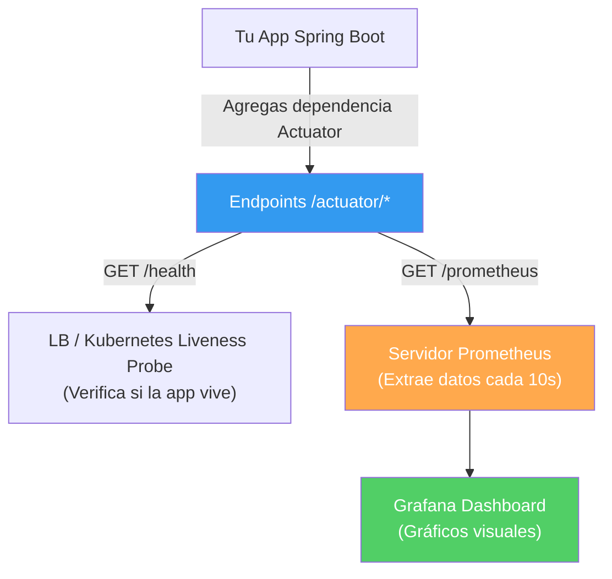

## 32 — Monitoreo de Producción (Spring Boot Actuator y Prometheus)

### Propósito
Aprender a instrumentar tu aplicación Spring Boot para que informe sobre su salud, métricas de rendimiento (CPU, RAM, tiempos de respuesta HTTP) y configuraciones en tiempo real utilizando **Spring Boot Actuator**, y exponerlas para ser consumidas por sistemas de monitoreo profesionales como **Prometheus** y **Grafana**.

### Problema que resuelve
El código está en producción, es viernes por la noche y los usuarios reportan que "la app está lenta". Sin telemetría:
- No sabes si es un problema de CPU.
- No sabes si la Base de Datos está caída o lenta.
- No sabes cuántos megas de memoria RAM está consumiendo la JVM.
- Te toca entrar al servidor por SSH, leer logs gigantes en texto plano e intentar adivinar el problema. Trabajas "a ciegas".

### Cómo lo resuelve
Spring Boot Actuator añade automáticamente endpoints (rutas REST) como `/actuator/health` o `/actuator/metrics` a tu aplicación. Sin escribir ni una sola línea de código Java, puedes ver si tu conexión a la base de datos funciona, cuánta memoria libre queda, o cuánto tardó en promedio el endpoint de pagos. Al integrarlo con Prometheus, estos datos se grafican en hermosos paneles visuales.

### Por qué aprenderlo
A programar se aprende rápido, a operar sistemas en producción no. En Arquitecturas de Microservicios, la Observabilidad (Logs, Métricas y Trazas) es un requisito innegociable. No puedes ser Ingeniero Backend o DevOps si despliegas aplicaciones y no sabes cómo se están comportando.



---

### Glosario Básico

#### `Actuator`
Librería oficial de Spring Boot que inspecciona tu aplicación por dentro y expone la información a través de HTTP o JMX.

#### `Endpoint /health`
Muestra el estado de la aplicación (`UP` o `DOWN`). Verifica automáticamente cosas como: ¿Está conectada la Base de Datos? ¿Hay espacio en el Disco Duro? ¿Está Redis vivo?

#### `Endpoint /metrics`
Expone números clave: Hilos activos de Tomcat, memoria Heap de Java usada, tiempos de respuesta de los endpoints HTTP, etc.

#### `Prometheus / Micrometer`
Micrometer es el "SLF4J" de las métricas: una abstracción de código. Prometheus es la base de datos de series de tiempo que viene cada 10 segundos, lee (scrapea) esas métricas de tu app y las guarda. Grafana luego las dibuja.

---

### Conceptos

#### 1. Activación de Actuator
- **Qué es** — Simplemente agregando la dependencia, tienes acceso a los endpoints básicos. Por razones de seguridad, casi todos están ocultos por defecto, por lo que debes exponerlos en el YAML.
- **Por qué importa** — Es información delicada. Si expones `/env` públicamente, cualquiera puede ver tu contraseña de base de datos. ¡NUNCA expongas endpoints de Actuator al público en Producción sin protección (Spring Security)!
- **Código**:
  ```xml
  <!-- En pom.xml -->
  <dependency>
      <groupId>org.springframework.boot</groupId>
      <artifactId>spring-boot-starter-actuator</artifactId>
  </dependency>
  ```
  ```yaml
  # application.yml
  management:
    endpoints:
      web:
        exposure:
          # Exponemos health, info, métricas y los mappings de rutas
          include: health, info, metrics, mappings
    
    # Detalle extremo para el Health Check
    endpoint:
      health:
        show-details: always # Muestra el motivo del UP/DOWN (BD conectada, disco libre, etc)
  ```
  Prueba haciendo GET a `http://localhost:8080/actuator/health`. Verás un JSON diciendo `"status": "UP"`.

#### 2. Información Personalizada (Info y Health Custom)
- **Qué es** — Puedes agregar datos propios al endpoint `/info` (ej: Versión de tu app, nombre del desarrollador) o crear tu propio validador de Salud.
- **Código**:
  ```yaml
  # application.yml -> Para el endpoint /actuator/info
  info:
    app:
      name: Sistema de Ventas
      version: 1.0.0-BETA
      author: Edgardo
  ```
  
  ```java
  // Para un Health Indicator Personalizado
  @Component
  public class ExternalApiHealthIndicator implements HealthIndicator {
  
      @Override
      public Health health() {
          boolean apiIsUp = checkExternalApi(); // Lógica tuya (Ping a API externa)
          
          if (apiIsUp) {
              return Health.up().withDetail("api_externa", "Respondiendo OK").build();
          } else {
              return Health.down().withDetail("api_externa", "Error de timeout").build();
          }
      }
      
      private boolean checkExternalApi() { return true; }
  }
  ```
  Si el Ping a la API falla, todo el endpoint `/health` devolverá `DOWN`. Kubernetes detectará esto y podría reiniciar tu contenedor.

#### 3. Integración con Prometheus
- **Qué es** — Prometheus no entiende el JSON nativo de `/metrics`. Spring Boot usa la librería Micrometer para transformar las métricas al formato de texto raro que usa Prometheus.
- **Código**:
  ```xml
  <!-- En pom.xml (Junto a actuator) -->
  <dependency>
      <groupId>io.micrometer</groupId>
      <artifactId>micrometer-registry-prometheus</artifactId>
  </dependency>
  ```
  ```yaml
  # application.yml
  management:
    endpoints:
      web:
        exposure:
          include: health, prometheus # Ahora exponemos /actuator/prometheus
  ```
- **Resultado:** Si entras a `http://localhost:8080/actuator/prometheus`, verás un texto extraño como:
  ```text
  # HELP jvm_memory_used_bytes The amount of used memory
  # TYPE jvm_memory_used_bytes gauge
  jvm_memory_used_bytes{area="heap",id="G1 Survivor Space",} 1.4680064E7
  http_server_requests_seconds_count{method="GET",status="200",uri="/api/users",} 45.0
  ```
  Esa última línea indica que el endpoint `/api/users` ha sido llamado exitosamente 45 veces.

#### 4. Creando Métricas de Negocio (Custom Metrics)
- **Qué es** — Las métricas técnicas (RAM, CPU) son útiles, pero tu jefe quiere saber "Cuántos pedidos se han pagado hoy". Puedes inyectar el `MeterRegistry` para crear tus propios contadores.
- **Código**:
  ```java
  @Service
  public class OrderService {
  
      private final Counter ordersCounter;
  
      public OrderService(MeterRegistry meterRegistry) {
          // Creamos un contador llamado "business.orders.created"
          this.ordersCounter = Counter.builder("business.orders.created")
                  .description("Número total de órdenes creadas")
                  .register(meterRegistry);
      }
  
      public void createOrder() {
          // ... lógica de guardar orden en BD ...
          
          // Incrementamos el contador!
          ordersCounter.increment(); 
      }
  }
  ```
  Esta métrica aparecerá automáticamente en el endpoint `/prometheus` y la podrás graficar en Grafana.

#### 5. Edge Cases y Errores Comunes

| Error | Causa | Solución |
|-------|-------|----------|
| Filtración de Datos (Data Leak) | Dejar expuesto `*` en Producción | Exponer todos los endpoints (`include: "*"`) habilita `/env`, revelando variables de entorno, passwords y tokens a cualquier atacante. Sé estricto en el YAML. |
| `/health` dice DOWN por culpa de BD | La BD se cayó 1 segundo, la app se marca DOWN, y Kubernetes mata el contenedor inyectando inestabilidad | Configurar Liveness y Readiness probes por separado. Las fallas de BD temporales deben fallar en Readiness (para dejar de recibir tráfico), pero no en Liveness (para evitar el reinicio abrupto). |
| Variables en URIs (Métricas infladas) | Si tu API es `/users/1` y `/users/2`, Spring crea una métrica separada para cada ID, causando Memory Leak | Esto se resuelve nativamente si usas `@PathVariable`. Si no lo usas, Spring Boot creará miles de variables "distintas". |

---

### Ejercicios
1. Añade `spring-boot-starter-actuator` a tu proyecto.
2. Expón el endpoint `health` mostrando detalles completos (`show-details: always`). 
3. Asegúrate de tener Base de Datos H2 o Postgres en el classpath. Entra a `http://localhost:8080/actuator/health` y observa cómo Spring automáticamente verificó que la DB estuviera "UP".
4. Añade `micrometer-registry-prometheus` al `pom.xml`, exponlo en el YAML y visita `/actuator/prometheus`.
5. **(Avanzado)** Configura Spring Security (si lo tienes) para requerir ROL `ADMIN` en la ruta `/actuator/**`.

### Cómo ejecutar
```bash
cd 32-actuator
mvn spring-boot:run

# Ver la salud de la aplicación
curl http://localhost:8080/actuator/health

# Extraer métricas para Prometheus
curl http://localhost:8080/actuator/prometheus
```

### Archivos del Proyecto
| Archivo | Propósito |
|---------|-----------|
| `pom.xml` | `spring-boot-starter-actuator` y `micrometer-registry-prometheus`. |
| `application.yml` | Configuración de exposición segura y metadatos (`info`). |
| `indicator/CustomHealthIndicator.java` | Lógica personalizada de Health Check. |
| `service/BusinessService.java` | Uso de `MeterRegistry` para métricas personalizadas de negocio. |
