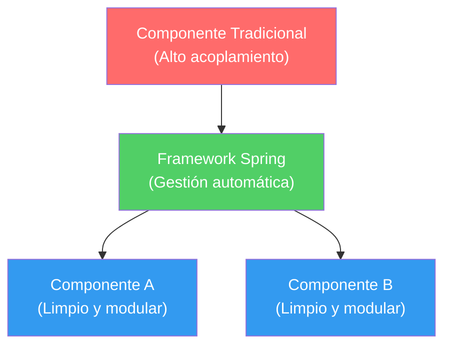

## 32 — Graphql

### Propósito
Aprender cómo Graphql funciona en Spring, permitiendo resolver problemas comunes de arquitectura y diseño.

### Problema que resuelve
Sin este concepto, los desarrolladores suelen escribir código espagueti, altamente acoplado y difícil de mantener o probar. No hay un flujo claro y los bugs son difíciles de rastrear.

### Cómo lo resuelve
Spring define un enfoque estructurado:
- **Abstracción** → Oculta la complejidad detrás de interfaces y decoradores.
- **Inversión de Control** → Spring maneja el ciclo de vida.

Esto crea un flujo claro, fácil de razonar y depurar.

### Por qué aprenderlo
Es un patrón fundamental en Spring Boot. Sin esto no se pueden construir aplicaciones empresariales escalables. Cada componente debe tener una responsabilidad única.



---

### Glosario Básico

#### `@AnotacionPrincipal` — Decorador clave
Es una **etiqueta** que le dice a Spring cómo tratar a esta clase o método.
```java
@AnotacionPrincipal
public class EjemploClass { }
```

#### `ClaseConfiguracion` — Contrato o configuración
Define **qué hace este componente**. Es como un formulario de reglas.

---

### Conceptos
Cada concepto con:
- **Qué es** — explicación simple
- **Por qué importa** — conexión con Spring
- **Código** — ejemplo comentado
- **Analogía** — comparación con el mundo real

### Ejercicios
Práctica del concepto aprendido.

### Cómo ejecutar
Instrucciones para ejecutar el ejemplo.

### Archivos del Proyecto
Tabla con cada archivo y su propósito.
