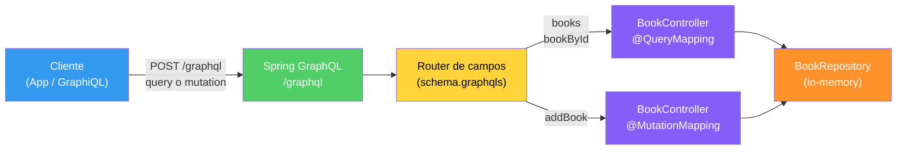

# 32 — Spring GraphQL

## Propósito
Aprender a exponer un API GraphQL con **Spring Boot 4.1.0** usando `spring-boot-starter-graphql`. El módulo implementa un catálogo de libros (`Book`) con queries y mutations, resueltas por un `@Controller` con `@QueryMapping` y `@MutationMapping`.

## Problema que resuelve
En APIs REST tradicionales, cada nueva pantalla suele necesitar un endpoint nuevo o parámetros extra para **evitar over-fetching** (recibir campos de más) o **under-fetching** (tener que hacer N peticiones para armar una vista). El backend termina lleno de endpoints casi iguales (`/books/summary`, `/books/full`, `/books/withAuthor`, ...).

## Cómo lo resuelve
GraphQL:
- Expone **UN solo endpoint** `POST /graphql`.
- Define un **schema tipado** (SDL) que el cliente lee para saber qué campos existen.
- El cliente **elige qué campos** quiere en cada consulta.
- Las **mutations** encapsulan escrituras.

Spring GraphQL:
- Auto-descubre el schema en `classpath:/graphql/*.graphqls`.
- Enruta cada campo del schema al método `@QueryMapping` / `@MutationMapping` cuyo nombre coincide.
- Ofrece **GraphiQL** (UI web) integrada para explorar.

## Por qué aprenderlo
GraphQL es estándar en frontends modernos (Apollo, Relay, urql). Saber exponerlo desde Spring te habilita para BFF (Backend-for-Frontend), APIs para móviles con ancho de banda limitado, y consolidación de microservicios.

## Diagrama



## Glosario básico
| Término | Definición |
|---|---|
| **Schema** | Contrato tipado del API GraphQL. Se escribe en SDL (`.graphqls`). |
| **Query** | Operación de lectura. No modifica estado. |
| **Mutation** | Operación de escritura (crear, actualizar, borrar). |
| **Resolver / Data Fetcher** | Método Java que produce el valor de un campo del schema. |
| **SDL** | Schema Definition Language, la sintaxis de `.graphqls`. |
| **Escalar** | Tipo primitivo del schema: `Int`, `Float`, `String`, `Boolean`, `ID`. |
| **`!`** | Marca de non-null. `String!` = obligatorio; `[Book!]!` = lista obligatoria de elementos obligatorios. |
| **GraphiQL** | IDE web para explorar y probar queries contra tu API. |

## Conceptos

### 1. Schema-first
- **Qué es:** definir primero el contrato (`schema.graphqls`) y luego los resolvers en Java.
- **Por qué importa:** el schema es documentación viva. Rompe compilación si un resolver falta o cambia de firma.
- **Código:** ver `src/main/resources/graphql/schema.graphqls`.
- **Analogía:** el menú del restaurante se publica antes que el chef cocine. Cualquiera sabe qué puede pedir.
- **Casos empresariales:** APIs públicas para partners, BFF de apps móviles.

### 2. `@QueryMapping` / `@MutationMapping`
- **Qué es:** anotaciones que enlazan un método con un campo raíz del schema (Query o Mutation).
- **Por qué importa:** eliminan el ceremonial del data-fetcher manual de graphql-java.
- **Código:** ver `BookController`.
- **Analogía:** son etiquetas en cada estación del buffet indicando qué plato se sirve ahí.

### 3. GraphiQL
- **Qué es:** una UI web (activada con `spring.graphql.graphiql.enabled: true`) para probar queries interactivamente.
- **Por qué importa:** acelera onboarding y debugging.
- **URL:** http://localhost:8080/graphiql

## Antes vs Ahora

### REST tradicional vs GraphQL
| Aspecto | ANTES (REST) | AHORA (GraphQL) |
|---|---|---|
| Endpoints | `GET /books`, `GET /books/{id}`, `POST /books` | Uno solo: `POST /graphql` |
| Selección de campos | Fija: el servidor decide qué manda | El cliente elige: `{ books { title } }` |
| Over-fetching | Frecuente (`GET /books` trae 20 campos aunque uses 2) | Eliminado por diseño |
| Under-fetching | Frecuente (N+1 peticiones para armar una vista) | Reducido: consultas anidadas en un solo round-trip |
| Contrato | OpenAPI/Swagger (opcional, se desactualiza) | `schema.graphqls` obligatorio, tipado |
| Versionado | Rutas `/v1`, `/v2` | Evolución del schema con `@deprecated` |

### Java 8 vs Java 21 (aplicado al módulo)
| Aspecto | ANTES (Java 8) | AHORA (Java 21) |
|---|---|---|
| Modelo | Clase POJO ~35 líneas | `record Book(Long id, String title, String author) {}` |
| Búsqueda | `for` + `if` + `return null` | `stream().filter(...).findFirst()` retornando `Optional<Book>` |
| Colecciones | `new ArrayList<Book>()` | `new ArrayList<>()` (diamond) |
| Getter | `book.getTitle()` | `book.title()` (accessor del record) |

## FAQ del Alumno

**P: ¿Por qué el id de GraphQL llega como `String` al método Java si en el modelo es `Long`?**
R: En GraphQL el escalar `ID` **siempre** se serializa como texto (así lo define la especificación). Convertimos con `Long.parseLong(id)` dentro del resolver.

**P: ¿Necesito `@RequestBody` o `@RequestParam`?**
R: No. Spring GraphQL parsea el body del POST `/graphql` y enruta los argumentos con `@Argument`. Nada de anotaciones MVC.

**P: ¿Por qué `@Controller` y no `@RestController`?**
R: Porque no devolvemos JSON directamente desde métodos. Es la infraestructura de Spring GraphQL la que serializa la respuesta según el schema. `@Controller` alcanza.

**P: ¿Y si el cliente pide un campo que no existe?**
R: GraphQL responde con un error de validación **antes** de invocar cualquier resolver. El schema actúa como gate.

**P: ¿Puedo tener REST y GraphQL a la vez?**
R: Sí. `spring-boot-starter-web` + `spring-boot-starter-graphql` conviven sin problema. `/api/**` para REST, `/graphql` para GraphQL.

**P: ¿No existe `@GraphQlTest` como slice en Boot 4?**
R: Los test-slices fueron eliminados/no homologados en Spring Boot 4.1.0 (ver `MEMORY.md`). Por eso usamos `@SpringBootTest` + `HttpGraphQlTester` con `RANDOM_PORT`. Más portable y no depende de anotaciones que pueden cambiar.

## Ejercicios
1. Agrega el campo `year: Int` al tipo `Book` y ajusta resolvers + repositorio.
2. Añade la mutation `deleteBook(id: ID!): Boolean!`.
3. Crea la query `booksByAuthor(author: String!): [Book!]!`.
4. Modela un tipo `Review { rating: Int!, comment: String! }` y anídalo dentro de `Book` con `reviews: [Review!]!`.

## Cómo ejecutar

### Build (Windows PowerShell)
```powershell
.\build.ps1
```

### Build (Git Bash)
```bash
./build.sh
```

### Ejecutar
```powershell
java -jar target\graphql-1.0.0.jar
```

### Probar con GraphiQL
Abre en el navegador: **http://localhost:8080/graphiql**

### Probar con curl (query)
```bash
curl -X POST http://localhost:8080/graphql ^
  -H "Content-Type: application/json" ^
  -d "{\"query\":\"{ books { id title author } }\"}"
```

### curl (mutation)
```bash
curl -X POST http://localhost:8080/graphql ^
  -H "Content-Type: application/json" ^
  -d "{\"query\":\"mutation { addBook(title: \\\"Refactoring\\\", author: \\\"Martin Fowler\\\") { id title } }\"}"
```

## Archivos del proyecto
| Archivo | Rol |
|---|---|
| `pom.xml` | Coordenadas Maven, dependencias (`web`, `graphql`, `test`, `spring-graphql-test`). |
| `src/main/java/.../GraphqlApplication.java` | Bootstrap Spring Boot. |
| `src/main/java/.../Book.java` | Record de dominio inmutable. |
| `src/main/java/.../BookRepository.java` | Almacén in-memory con 3 libros precargados. |
| `src/main/java/.../BookController.java` | Resolvers `@QueryMapping` + `@MutationMapping`. |
| `src/main/resources/graphql/schema.graphqls` | Contrato del API. |
| `src/main/resources/application.yml` | Habilita GraphiQL en `/graphiql`. |
| `src/test/java/.../GraphqlApplicationTests.java` | `contextLoads` (valida schema + beans). |
| `src/test/java/.../BookControllerGraphQlTest.java` | Query `{ books { title } }` retorna 3. |
| `build.ps1` / `build.sh` | Build portable con JDK 21 + Maven 3.9.16 locales. |

## Artefacto
`target/graphql-1.0.0.jar` — fat JAR ejecutable con `java -jar`.
