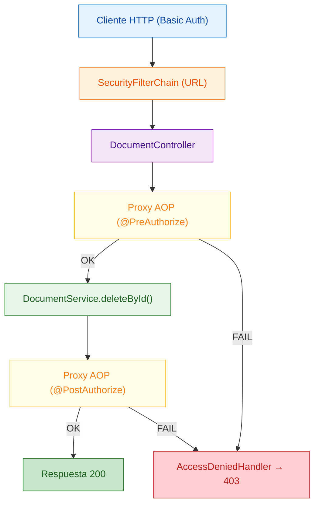

## 33 — Security Avanzado (Method Security con @PreAuthorize / @PostAuthorize)

### Propósito
Aprender **Method Security**: autorización declarativa en la capa de servicio con `@PreAuthorize` y `@PostAuthorize`, incluyendo *object-level security* (permitir/negar acceso segun datos del objeto retornado).

### Problema que resuelve
La seguridad por URL (modulo 13) alcanza para reglas gruesas ("/admin/** solo ADMIN"), pero no para reglas finas como "un usuario solo puede leer SUS documentos". Repetir esa logica en cada metodo del servicio ensucia la logica de negocio con `if (auth.getName().equals(...)) throw new AccessDeniedException(...)`.

### Cómo lo resuelve
Spring Security ofrece anotaciones declarativas activadas por `@EnableMethodSecurity`:
- `@PreAuthorize("hasRole('ADMIN')")` — se evalua ANTES del metodo.
- `@PostAuthorize("returnObject.owner == authentication.name")` — se evalua DESPUES, con acceso al objeto retornado (`returnObject`).

Spring intercepta la llamada via AOP y lanza `AccessDeniedException` si la expresion SpEL es falsa, sin contaminar el metodo con codigo de seguridad.

### Por qué aprenderlo
Toda aplicacion empresarial real necesita reglas por objeto: "un vendedor solo ve sus clientes", "un usuario edita solo su perfil", "un admin puede todo". Method Security es el patron industrial estandar.



### Glosario Básico
- **`@EnableMethodSecurity`** — activa proxies AOP para procesar `@PreAuthorize`/`@PostAuthorize`.
- **`@PreAuthorize("expr")`** — SpEL evaluado ANTES del metodo. Si `false` → `AccessDeniedException`.
- **`@PostAuthorize("expr")`** — SpEL evaluado DESPUES. Puede usar `returnObject`.
- **`hasRole('X')`** — verdadero si el usuario tiene la autoridad `ROLE_X`. Spring agrega `ROLE_` automaticamente.
- **`authentication.name`** — username del usuario autenticado en el `SecurityContext`.
- **`returnObject`** — variable especial dentro de `@PostAuthorize` con el valor retornado por el metodo.
- **Object-level security** — reglas basadas en datos del objeto (no solo en el rol).
- **`AccessDeniedHandler`** — bean que decide como responder cuando SS lanza `AccessDeniedException`.
- **`RestClient`** — cliente HTTP fluido de Spring Framework 7, reemplazo de `TestRestTemplate` en Boot 4.1.0.
- **`@LocalServerPort`** — inyecta el puerto aleatorio del servidor de test (paquete `org.springframework.boot.test.web.server`).

### Conceptos

#### 1. `@EnableMethodSecurity`
- **Qué es** — anotacion que enciende la infraestructura AOP para `@PreAuthorize`/`@PostAuthorize` sobre beans Spring.
- **Por qué importa** — sin esta anotacion las expresiones se ignoran silenciosamente. Es un error clasico creer que la anotacion sola basta.
- **Código** — ver `SecurityConfig`. En Spring Security 6/7 reemplaza al viejo `@EnableGlobalMethodSecurity(prePostEnabled=true)`; por defecto ya viene `prePostEnabled=true`.
- **Analogía** — enciende los guardias que estan dentro de cada oficina. Sin electricidad, los guardias duermen.
- **Casos de Uso Empresariales** — cualquier back-office con reglas de acceso por accion (aprobar factura, cerrar caja, editar precio).

#### 2. `@PreAuthorize`
- **Qué es** — verificacion previa: si la expresion SpEL es falsa, el metodo NUNCA se ejecuta y se lanza `AccessDeniedException`.
- **Por qué importa** — evita contaminar el servicio con `if` de seguridad. Reglas centralizadas y auditables.
- **Código**:
  ```java
  @PreAuthorize("hasRole('ADMIN')")
  public void deleteById(Long id) { docs.remove(id); }
  ```
- **Analogía** — el guardia te lee el gafete ANTES de dejarte entrar a la sala del servidor.
- **Casos de Uso Empresariales** — DELETEs administrativos, aprobacion de creditos, cambio de precio de catalogo.

#### 3. `@PostAuthorize` y object-level security
- **Qué es** — verificacion posterior: el metodo se ejecuta y luego SpEL evalua `returnObject`. Si es falso, Spring descarta el resultado y lanza `AccessDeniedException`.
- **Por qué importa** — es la unica forma limpia de decir "solo puedes ver TU documento".
- **Código**:
  ```java
  @PostAuthorize("returnObject.owner == authentication.name")
  public Document findById(Long id) { return docs.get(id); }
  ```
- **Analogía** — el guardia te deja entrar al archivador, pero antes de que salgas con la carpeta revisa que sea la tuya. Si no lo es, la confisca.
- **Casos de Uso Empresariales** — multi-tenant (un usuario solo ve datos de su empresa), banca personal (solo tus cuentas), historial medico (solo tu ficha).

#### 4. `AccessDeniedHandler`
- **Qué es** — bean que traduce `AccessDeniedException` en una respuesta HTTP.
- **Por qué importa** — sin este handler, la excepcion lanzada por el proxy AOP puede burbujear al `DispatcherServlet` y convertirse en 500. Nosotros la fijamos en 403.

### Antes vs Ahora (Java 8 / Spring Security 5 → Java 21 / Spring Security 7)

| Aspecto | ANTES (Java 8, Security 5) | AHORA (Java 21, Security 7) |
|--------|-----------------------------|------------------------------|
| Habilitar method security | `@EnableGlobalMethodSecurity(prePostEnabled = true)` | `@EnableMethodSecurity` (default `prePostEnabled=true`) |
| Config base | `extends WebSecurityConfigurerAdapter` + `@Override configure(...)` | `@Bean SecurityFilterChain filterChain(HttpSecurity http)` |
| Reglas HTTP | `antMatchers("/x").hasRole("A")` | `requestMatchers("/x").hasRole("A")` |
| Autorizacion por URL en `web.xml` | `<security-constraint><url-pattern>/admin/*</url-pattern><auth-constraint><role-name>ADMIN</role-name></auth-constraint></security-constraint>` | `@PreAuthorize("hasRole('ADMIN')")` en el metodo del servicio |
| DTO/objeto de dominio | POJO con getters/setters/equals/hashCode (30+ lineas) | `public record Document(Long id, String content, String owner) {}` |
| Chequeo de owner en servicio | `if (!doc.getOwner().equals(auth.getName())) throw new AccessDeniedException(...)` | `@PostAuthorize("returnObject.owner == authentication.name")` |
| Cliente HTTP en test | `TestRestTemplate` (ELIMINADO en Boot 4.1.0) | `RestClient.builder().baseUrl("http://localhost:" + port).build()` |
| Puerto aleatorio | `@LocalServerPort` en `org.springframework.boot.web.server` | `@LocalServerPort` en `org.springframework.boot.test.web.server` |

### FAQ del Alumno

- **¿Cual es la diferencia entre `@PreAuthorize` y la seguridad por URL del modulo 13?**
  URL-based protege el ENDPOINT (`/admin/**` solo ADMIN). Method security protege el METODO del servicio, y con `@PostAuthorize` incluso el OBJETO retornado. Se pueden y deben usar juntas.

- **¿Por que Spring pide `ROLE_ADMIN` pero yo escribo `hasRole('ADMIN')` sin `ROLE_`?**
  Porque el metodo `hasRole` agrega el prefijo `ROLE_` por ti. Si escribes `hasAuthority('ADMIN')` NO lo agrega. Es fuente comun de bugs.

- **¿Cuando uso `@PreAuthorize` y cuando `@PostAuthorize`?**
  `@PreAuthorize` cuando la decision se puede tomar solo con el usuario y los parametros. `@PostAuthorize` cuando necesitas mirar el resultado (typically para reglas por dueño de recurso).

- **¿Por que `@PostAuthorize` ejecuta el metodo aunque luego lo rechace?**
  Porque necesita el `returnObject` para evaluar la expresion. Es mas costoso; uselo solo cuando la regla depende del resultado. Si el metodo tiene efectos secundarios (por ej. envia un email), NO uses `@PostAuthorize` — usa `@PreAuthorize` con parametros suficientes.

- **¿Por que en el test `@LocalServerPort` viene de `org.springframework.boot.test.web.server`?**
  En Spring Boot 4.1.0 se movio ahi. Es la ubicacion documentada en `MEMORY.md`.

- **¿Por que no hay `TestRestTemplate`?**
  Fue eliminado en Boot 4.1.0. El reemplazo es `RestClient` de Spring Framework 7.

- **¿Que hace `csrf.disable()`?**
  Desactiva el token CSRF. Es seguro en APIs REST stateless con Basic Auth/JWT. En apps con formularios y cookies debe estar ENCENDIDO.

- **¿Que es `authentication.name` dentro del SpEL?**
  Es el username del usuario logeado (el mismo que devuelve `Authentication#getName()`).

### Ejercicios
1. Añade un tercer usuario `manager` con roles `USER` y `MANAGER`. Crea un metodo `approve(Long id)` autorizado solo para `MANAGER`.
2. Cambia `@PostAuthorize` para permitir tambien al `ADMIN` ver cualquier documento: `returnObject.owner == authentication.name or hasRole('ADMIN')`.
3. Añade `@PreFilter`/`@PostFilter` sobre `findAll()` para que devuelva solo los documentos del owner autenticado (excepto ADMIN, que ve todos).
4. Extrae las reglas SpEL a un `PermissionEvaluator` personalizado y usalo como `hasPermission(#id, 'Document', 'READ')`.

### Cómo ejecutar

```bash
# Git Bash
./build.sh
java -jar target/security-avanzado-1.0.0.jar
```

```powershell
# PowerShell
.\build.ps1
java -jar target\security-avanzado-1.0.0.jar
```

Ejemplos con `curl`:
```bash
# admin lista todo
curl -u admin:admin123 http://localhost:8080/api/docs
# user ve su doc
curl -u user:user123 http://localhost:8080/api/docs/2
# user intenta ver doc ajeno → 403
curl -u user:user123 http://localhost:8080/api/docs/1
# admin borra
curl -u admin:admin123 -X DELETE http://localhost:8080/api/docs/2
# user intenta borrar → 403
curl -u user:user123 -X DELETE http://localhost:8080/api/docs/1
```

### Archivos del Proyecto

| Archivo | Propósito |
|--------|-----------|
| `pom.xml` | Coordenadas Maven + dependencias (web, security, security-test). |
| `build.sh` / `build.ps1` | Scripts con toolchain portable (JDK 21 + Maven 3.9.16). |
| `src/main/resources/application.yml` | Configuracion base. |
| `SecurityAvanzadoApplication.java` | Punto de entrada `main`. |
| `config/SecurityConfig.java` | `@EnableMethodSecurity` + `SecurityFilterChain` + usuarios in-memory + `AccessDeniedHandler`. |
| `domain/Document.java` | Record con `id`, `content`, `owner`. |
| `service/DocumentService.java` | Reglas `@PreAuthorize` / `@PostAuthorize`. |
| `controller/DocumentController.java` | Endpoints REST `/api/docs`. |
| `test/.../SecurityAvanzadoApplicationTests.java` | `contextLoads`. |
| `test/.../MethodSecurityIntegrationTest.java` | Tests de integracion con `RestClient` + `@LocalServerPort`. |
