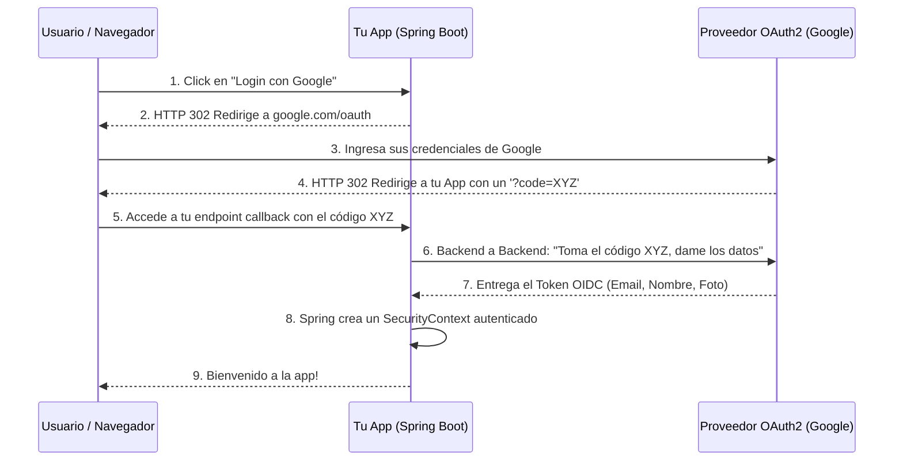

## 34 — OAuth2 y OIDC (Social Login: Login con Google / GitHub)

### Propósito
Aprender a delegar la autenticación de tus usuarios a proveedores de identidad gigantes como Google, GitHub, Microsoft o Facebook, utilizando los protocolos estándar de la industria: **OAuth 2.0** y **OpenID Connect (OIDC)**.

### Problema que resuelve
- **Fricción para el usuario:** Rellenar formularios de registro, crear contraseñas seguras, verificar correos electrónicos... Muchos usuarios abandonan tu aplicación antes de terminar este proceso.
- **Riesgo de seguridad (Breaches):** Si gestionas tus propias contraseñas en tu base de datos y te hackean, eres responsable de la filtración de credenciales. Además, tienes que implementar la recuperación de contraseñas, validación de complejidad, etc.

### Cómo lo resuelve
En lugar de pedirle una contraseña al usuario, lo rediriges a la página oficial de Google. Él inicia sesión en Google de forma segura (con biometría o 2FA). Si tiene éxito, Google lo redirige de vuelta a tu aplicación enviándote un "Token" que te garantiza quién es esa persona, su nombre real y su correo electrónico verificado.

### Por qué aprenderlo
El "Social Login" es el estándar de facto para aplicaciones modernas orientadas al consumidor (B2C) y corporativas (SSO corporativo con Azure AD). Spring Security tiene un soporte nativo brutal para OAuth2, reduciendo cientos de líneas de código complejo (validación criptográfica, manejo de redirecciones) a unas simples líneas de configuración en un YAML.



---

### Glosario Básico

#### `OAuth 2.0`
Protocolo de **Autorización**. Creado para que una aplicación externa (Tu App) pueda acceder a datos de una plataforma (Fotos de Google) sin que el usuario te dé su contraseña.

#### `OpenID Connect (OIDC)`
Protocolo de **Autenticación** montado encima de OAuth2. Mientras OAuth2 es para "dar permisos", OIDC es específicamente para responder a la pregunta "¿Quién es este usuario?". Utiliza JWT para empaquetar los datos de identidad.

#### `Client ID` y `Client Secret`
Las credenciales que Google o GitHub te otorgan al registrar tu aplicación en su portal de desarrolladores. Tu app en Spring las usa para identificarse ante el proveedor.

#### `Callback / Redirect URI`
La URL exacta de tu aplicación a la cual Google redirigirá al usuario después de que inicie sesión exitosamente. En Spring Boot suele ser `http://localhost:8080/login/oauth2/code/google`.

---

### Conceptos

#### 1. Consiguiendo las Credenciales (Ej: GitHub)
Antes de escribir código, debes crear una "Aplicación OAuth" en el panel de desarrollador de GitHub o en la Consola Cloud de Google.
1. Vas a `GitHub > Settings > Developer Settings > OAuth Apps`.
2. Haces click en "New OAuth App".
3. **Homepage URL:** `http://localhost:8080`
4. **Authorization callback URL:** `http://localhost:8080/login/oauth2/code/github`
5. GitHub te dará un `Client ID` y un `Client Secret`. **(NUNCA subas el secret al repositorio de código)**.

#### 2. Configurando Spring Boot
- **Qué es** — Spring Boot autoconfigura toda la danza de redirecciones (el flujo Authorization Code Grant) si le provees las credenciales.
- **Código** — Configuración en `.yml`:
  ```xml
  <!-- En pom.xml -->
  <dependency>
      <groupId>org.springframework.boot</groupId>
      <artifactId>spring-boot-starter-oauth2-client</artifactId>
  </dependency>
  ```
  ```yaml
  # application.yml
  spring:
    security:
      oauth2:
        client:
          registration:
            # Puedes tener múltiples proveedores a la vez
            github:
              client-id: tu-client-id-de-github
              client-secret: tu-secret-de-github # En prod: ${GITHUB_SECRET}
            google:
              client-id: tu-client-id-de-google
              client-secret: tu-secret-de-google
  ```
  *Nota: Google, GitHub, Facebook y Okta ya vienen "pre-mapeados" en Spring. Sabe exactamente a qué URLs ir.*

#### 3. Configurando Spring Security
- **Qué es** — Solo debes decirle al `SecurityFilterChain` que active el login por OAuth2 en lugar del viejo formulario con usuario y contraseña (o junto a él).
- **Código**:
  ```java
  @Configuration
  @EnableWebSecurity
  public class SecurityConfig {
  
      @Bean
      public SecurityFilterChain filterChain(HttpSecurity http) throws Exception {
          http
              .authorizeHttpRequests(auth -> auth
                  .requestMatchers("/", "/public").permitAll()
                  .anyRequest().authenticated()
              )
              // ¡Esta línea hace la magia!
              .oauth2Login(oauth2 -> oauth2
                  .defaultSuccessUrl("/dashboard", true) // A donde ir tras el login exitoso
              );
              
          return http.build();
      }
  }
  ```
  Si entras a `http://localhost:8080/dashboard`, como no estás autenticado, Spring te redirigirá a una pantalla generada automáticamente con los botones "Login with Google" y "Login with GitHub".

#### 4. Extrayendo los Datos del Usuario
- **Qué es** — Una vez logueado, necesitas extraer el nombre, email o foto para guardarlo en tu base de datos o mostrarlo en la interfaz.
- **Código** — Controlador inyectando el usuario autenticado:
  ```java
  @RestController
  public class UserController {
  
      @GetMapping("/dashboard")
      public String dashboard(@AuthenticationPrincipal OAuth2User oauth2User) {
          
          // oauth2User.getAttributes() contiene todo el JSON que devolvió Google/GitHub
          String nombre = oauth2User.getAttribute("name");
          String email = oauth2User.getAttribute("email");
          String foto = oauth2User.getAttribute("avatar_url"); // GitHub
          // String foto = oauth2User.getAttribute("picture"); // Google
          
          return "Bienvenido " + nombre + " (" + email + ")";
      }
  }
  ```

#### 5. Edge Cases y Errores Comunes

| Error | Causa | Solución |
|-------|-------|----------|
| `redirect_uri_mismatch` en Google/GitHub | La URL en el portal de desarrolladores no coincide exactamente con la que tu servidor envió. | Asegúrate de registrar EXACTAMENTE `http://localhost:8080/login/oauth2/code/google` (o el proveedor que sea). Ojo con el `/` al final y con http vs https. |
| El `email` viene como `null` (GitHub) | En GitHub, si el usuario tiene su email puesto como "privado", la API pública no lo devuelve. | Debes usar un flujo especial. Primero atrapar la autenticación exitosa creando un `OAuth2UserService` personalizado, y usar el token obtenido para hacer un request extra a la API `/user/emails` de Github. |
| Mezclar JWT Stateless con OAuth2 Login | Quieres usar OAuth2 pero tienes una API React/Angular separada. | El `oauth2Login()` de Spring está diseñado para aplicaciones monolíticas (usa cookies `JSESSIONID` tras bambalinas). Si quieres una API 100% Stateless con React, el Frontend debe hacer el flujo OAuth2 y enviarle a Spring Boot el *IdToken* JWT de Google. Spring Boot usará la dependencia `oauth2-resource-server` para validar la firma de ese JWT. |

---

### Ejercicios
1. Ve a GitHub y crea una OAuth App (Settings -> Developer Settings). Obtén tu ID y Secret.
2. Agrega las dependencias de `spring-boot-starter-security` y `spring-boot-starter-oauth2-client`.
3. Pega tus credenciales en el `application.yml` (sección `spring.security.oauth2.client.registration.github`).
4. Crea un `@RestController` con un endpoint `/perfil` que retorne todo el mapa de atributos del usuario: `return oauth2User.getAttributes();`.
5. Ejecuta la aplicación y entra a `http://localhost:8080/perfil`. Serás redirigido a GitHub. Autoriza la aplicación y observa el JSON enorme que Github le entregó a tu aplicación (Nombre, bio, empresa, avatar).

### Cómo ejecutar
```bash
cd 34-oauth2
mvn spring-boot:run

# Abre el navegador en:
# http://localhost:8080
# NOTA: Debes usar un navegador real, CURL no funciona porque requiere interacción de login visual.
```

### Archivos del Proyecto
| Archivo | Propósito |
|---------|-----------|
| `pom.xml` | Dependencias de Security y OAuth2 Client. |
| `application.yml` | Declaración de proveedores (Google/GitHub) e inyección de credenciales. |
| `config/SecurityConfig.java` | Activación de `.oauth2Login()`. |
| `controller/HomeController.java` | Extracción de datos del perfil usando `@AuthenticationPrincipal OAuth2User`. |
