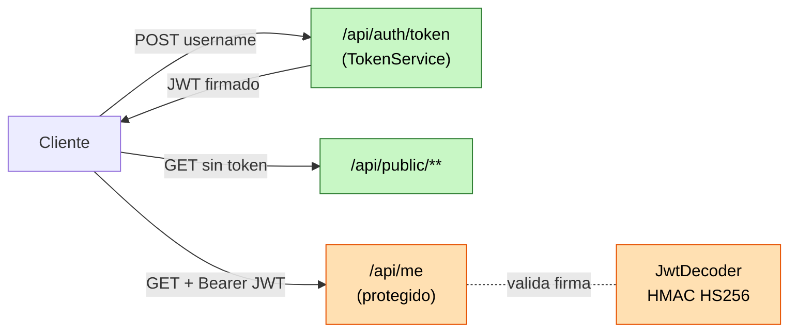

# Módulo 34 — OAuth2 Resource Server con JWT

## Propósito
Aprender a proteger una API REST como **OAuth2 Resource Server** validando **JWT**
firmados. Es el patrón estándar de seguridad de microservicios modernos: stateless,
escalable horizontal y desacoplado del Identity Provider (IdP).

## Problema que resuelve
Las sesiones + cookie (módulo 13) obligan a mantener estado en el servidor
(`HttpSession`), no escalan sin *sticky sessions* y acoplan el frontend al backend
por el dominio de la cookie. Con **JWT** el cliente lleva su credencial firmada;
cualquier instancia del backend la valida solo con la clave pública/secreta.

## Cómo lo resuelve Spring
- `spring-boot-starter-oauth2-resource-server` + `oauth2ResourceServer(o -> o.jwt())`
  activa el filtro que extrae `Authorization: Bearer <jwt>` y lo valida.
- Un `JwtDecoder` (Nimbus JOSE JWT) verifica firma y expiración.
- El controller recibe el token decodificado como `@AuthenticationPrincipal Jwt`.

## Por qué aprenderlo
Es la base de cualquier arquitectura moderna con Keycloak, Auth0, Cognito, Okta,
Azure AD, etc. Entender el flujo con clave HMAC embebida (esta demo) te prepara
para el flujo real con JWKS público de un IdP externo.

## Diagrama



## Glosario Básico
| Término | Qué es |
|--------|--------|
| **JWT** | JSON Web Token: `header.payload.signature` en Base64URL. |
| **HS256** | Firma HMAC con SHA-256 usando clave secreta compartida. |
| **Resource Server** | Servicio que valida tokens emitidos por un Authorization Server. |
| **Claim** | Campo dentro del payload (p.ej. `sub`, `iss`, `exp`, `scope`). |
| **Bearer** | Esquema del header `Authorization: Bearer <token>`. |

## Conceptos clave

### 1. `oauth2ResourceServer(o -> o.jwt())`
- **Qué es:** activa el filtro `BearerTokenAuthenticationFilter`.
- **Por qué importa:** una sola línea reemplaza toda la infraestructura clásica
  de sesiones + login form.
- **Analogía:** cambiar el guardia que consulta un archivador (sesión) por uno
  que solo verifica un sello (firma del JWT).

### 2. `NimbusJwtDecoder.withSecretKey(...)`
- Construye el validador HS256 con la misma clave que firma.
- En producción se cambia a `withJwkSetUri(...)` apuntando al `/.well-known/jwks.json`
  del IdP (Keycloak/Auth0/Cognito).

### 3. `@AuthenticationPrincipal Jwt jwt`
- Inyecta el token ya decodificado en el método del controller.
- `jwt.getSubject()`, `jwt.getClaim("scope")`, `jwt.getExpiresAt()`.

## Antes vs Ahora

| Aspecto | ANTES (módulo 13, sesión + cookie) | AHORA (módulo 34, OAuth2 + JWT) |
|---|---|---|
| Estado en servidor | `HttpSession` (memoria/Redis) | Ninguno (stateless) |
| Escalabilidad | Requiere sticky sessions | Cualquier nodo valida cualquier token |
| Credencial en cada request | `Cookie: JSESSIONID=...` | `Authorization: Bearer <jwt>` |
| Login | `formLogin()` + password | POST `/api/auth/token` (real: IdP externo) |
| CSRF | Necesario (cookie) | No aplica (header manual) |
| Sintaxis Spring Sec | `http.formLogin().and().httpBasic()` | `http.oauth2ResourceServer(o -> o.jwt())` |
| Java 8 | Clases anónimas `new Customizer<>() {...}` | Lambdas `authz -> authz. ...` |
| Java 8 respuestas | `new HashMap<>()` + `put()` | `Map.of("k","v")` inmutable |

## FAQ del Alumno

**¿Puedo probar sin Keycloak?**
Sí, esta demo firma tokens con clave HMAC embebida. En prod NO harías esto.

**¿Qué diferencia hay entre HS256 y RS256?**
HS256 = una sola clave secreta (simétrica). RS256 = par pública/privada
(asimétrica). Los IdP reales usan RS256 y publican la clave pública en JWKS.

**¿Dónde guardo el JWT en el cliente?**
Nunca en `localStorage` (vulnerable a XSS). Prefiere cookie `HttpOnly; Secure; SameSite=Strict`
o memoria + refresh token corto.

**¿Puedo invalidar un JWT antes de que expire?**
No de forma nativa: es stateless. Se resuelve con TTL cortos + refresh tokens
o lista negra en Redis.

**¿Necesito el AuthorizationServer de Spring?**
Solo si TÚ emites tokens para terceros. Si delegás en Keycloak/Auth0/Cognito,
tu servicio solo es Resource Server (como este módulo).

**¿Por qué la clave debe tener >= 32 bytes?**
HS256 exige 256 bits mínimo. Nimbus lanza `IllegalArgumentException` si es más corta.

## Ejercicios
1. Cambia HS256 por RS256: genera un par RSA y usa `NimbusJwtDecoder.withPublicKey(...)`.
2. Añade un endpoint `/api/admin/**` que exija `scope=admin` con
   `@PreAuthorize("hasAuthority('SCOPE_admin')")`.
3. Reduce el TTL a 60 segundos y verifica que el test falla con token expirado.
4. Sustituye el HMAC embebido por Keycloak local (Docker) y `issuer-uri` en YAML.

## Cómo ejecutar

### Windows (PowerShell)
```powershell
.\build.ps1
java -jar target\oauth2-1.0.0.jar
```

### Git Bash / Linux
```bash
./build.sh
java -jar target/oauth2-1.0.0.jar
```

### Solo tests
```bash
../apache-maven-3.9.16/bin/mvn -f 34-oauth2/pom.xml test
```

### Probar manualmente (una vez arrancado)
```bash
# 1. Endpoint público
curl http://localhost:PORT/api/public/hello

# 2. Obtener token
TOKEN=$(curl -s -X POST "http://localhost:PORT/api/auth/token?username=alice" | jq -r .access_token)

# 3. Endpoint protegido
curl -H "Authorization: Bearer $TOKEN" http://localhost:PORT/api/me
```

## Archivos del Proyecto

| Archivo | Rol |
|---|---|
| `pom.xml` | Coordenadas Maven + starter oauth2-resource-server. |
| `src/main/java/.../Application.java` | Bootstrap Spring Boot. |
| `src/main/java/.../config/SecurityConfig.java` | Filter chain, permitAll público, JwtDecoder HS256. |
| `src/main/java/.../auth/TokenService.java` | Emite JWT firmados con Nimbus. |
| `src/main/java/.../auth/AuthController.java` | POST `/api/auth/token`. |
| `src/main/java/.../web/PublicController.java` | GET `/api/public/hello`. |
| `src/main/java/.../web/PrivateController.java` | GET `/api/me` (requiere JWT). |
| `src/main/resources/application.yml` | Configuración de puerto y logging. |
| `src/test/java/.../ApplicationTests.java` | Smoke test `contextLoads`. |
| `src/test/java/.../OAuth2IntegrationTest.java` | E2E con RestClient + `@LocalServerPort`. |
| `build.ps1` / `build.sh` | Scripts con toolchain portable (JDK 21 + Maven 3.9.16). |

## Nota de producción — NO uses este código como IdP real
Este módulo firma tokens con **clave HMAC embebida** solo para enseñar el flujo
completo (emisión + validación) sin dependencias externas. En un sistema real:

- **La emisión** la hace un **Authorization Server dedicado**: Keycloak (open
  source), Auth0, AWS Cognito, Okta, Azure AD, Google Identity Platform.
- **Tu servicio** es Resource Server puro: NO emite tokens, solo los valida
  contra el JWKS público del IdP (`spring.security.oauth2.resourceserver.jwt.issuer-uri`).
- Los tokens usan **RS256** (par asimétrico), rotación de claves, `kid` en header
  y descubrimiento OIDC.
