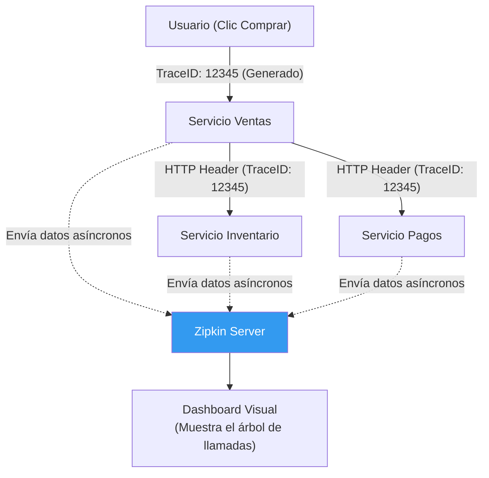

## 35 — Observabilidad Avanzada (Micrometer Tracing y OpenTelemetry)

### Propósito
Aprender a rastrear el ciclo de vida completo de una petición a través de múltiples microservicios (Distributed Tracing) utilizando Micrometer Tracing (el sucesor de Spring Cloud Sleuth) y exportar estos datos a sistemas como Zipkin o Jaeger utilizando el estándar OpenTelemetry (OTLP).

### Problema que resuelve
En un monolito, si algo falla, miras los logs y todo está ahí. En Arquitectura de Microservicios, un usuario hace clic en "Comprar". Esa petición entra al *Gateway*, viaja al *Servicio de Ventas*, este llama al *Servicio de Inventario*, y finalmente al *Servicio de Pagos*.
- Si la compra falla o tarda 5 segundos, ¿en cuál de los 4 servicios ocurrió el problema?
- Buscar manualmente un error en 4 archivos de logs de 4 servidores diferentes es imposible (Agujero negro de observabilidad).

### Cómo lo resuelve
**Distributed Tracing (Trazabilidad Distribuida)** inyecta un ID único (Trace ID) en el momento exacto en que la petición entra al Gateway. Cada vez que un servicio llama a otro por HTTP, adjunta ese mismo `Trace ID` en los Headers de la petición.
Todas las líneas de log en todos los microservicios llevarán el mismo Trace ID. Si buscas ese ID en Kibana o Zipkin, verás la historia completa: *"Ventas tomó 10ms, Inventario tomó 5ms, Pagos tardó 4985ms y lanzó excepción"*.

### Por qué aprenderlo
A partir de Spring Boot 3, el antiguo `Spring Cloud Sleuth` fue eliminado y reemplazado por la abstracción nativa `Micrometer Tracing`. Saber configurar el Distributed Tracing es un requisito absoluto para trabajar en cualquier arquitectura Cloud-Native empresarial.



---

### Glosario Básico

#### `Trace ID` (ID de Traza)
Un identificador único global para el flujo completo de una solicitud, desde que entra al sistema hasta que sale. Se comparte entre todos los microservicios.

#### `Span ID` (ID de Tramo)
Un identificador para una operación específica *dentro* de un Trace. Si Ventas llama a Pagos, el viaje completo tiene 1 Trace ID, pero el trabajo local de Ventas es un Span, y el trabajo local de Pagos es otro Span hijo.

#### `MDC` (Mapped Diagnostic Context)
Una estructura de datos manejada por tu librería de Logs (Logback). Micrometer inyecta automáticamente el TraceID y SpanID en el MDC, lo que permite que cada `log.info()` imprima mágicamente esos IDs sin que tú modifiques el texto del log.

#### `OpenTelemetry (OTel)`
El estándar open-source de la industria para generar y exportar telemetría (Métricas, Logs y Trazas). Zipkin, Jaeger, Datadog y NewRelic entienden el formato OTel.

---

### Conceptos

#### 1. Correlación de Logs Básica
- **Qué es** — El primer paso de la observabilidad. Hacer que cada línea de log en tu consola muestre `[TraceID, SpanID]`.
- **Código** — Añadir dependencias en `pom.xml`:
  ```xml
  <!-- La abstracción de Tracing -->
  <dependency>
      <groupId>io.micrometer</groupId>
      <artifactId>micrometer-tracing-bridge-brave</artifactId>
  </dependency>
  ```
  Al reiniciar tu aplicación y hacer un GET, notarás que los logs cambian de esto:
  `2024-05-10 [http-nio-8080-exec-1] INFO c.e.OrderService - Iniciando orden...`
  a esto:
  `2024-05-10 [http-nio-8080-exec-1] [63af1... , 89f4b...] INFO c.e.OrderService - Iniciando orden...`
  *(El primer número es el Trace ID, el segundo el Span ID).*

#### 2. Propagación de TraceID en llamadas REST (RestTemplate / RestClient)
- **Qué es** — Si usas el cliente HTTP correctamente configurado, Micrometer inyectará los headers (ej: `X-B3-TraceId`) automáticamente cuando llames a otro microservicio.
- **Código** — Inyección de clientes:
  ```java
  @Configuration
  public class RestConfig {
  
      // ¡IMPORTANTE! Debes inyectar el RestClient.Builder que Spring proporciona.
      // Si haces 'RestClient.builder()' desde cero, perderás los interceptores de Tracing.
      @Bean
      public RestClient customRestClient(RestClient.Builder builder) {
          return builder.baseUrl("http://servicio-b").build();
      }
  }
  ```
  Cuando tu `Servicio A` haga un `restClient.get()`, enviará los headers de tracing mágicamente. El `Servicio B` (si también tiene Micrometer) leerá esos headers y adoptará el mismo Trace ID.

#### 3. Exportando a Zipkin (Distributed Tracing Visual)
- **Qué es** — Enviar los Spans (los "tramos" de tiempo) a un servidor Zipkin para visualizarlos en un diagrama de Gantt.
- **Código**:
  ```xml
  <!-- Exportador a Zipkin -->
  <dependency>
      <groupId>io.zipkin.reporter2</groupId>
      <artifactId>zipkin-reporter-brave</artifactId>
  </dependency>
  ```
  ```yaml
  # application.yml
  management:
    tracing:
      sampling:
        probability: 1.0 # 1.0 = Exporta el 100% de las trazas a Zipkin. (En PROD usa 0.1 o 0.01)
    zipkin:
      tracing:
        endpoint: "http://localhost:9411/api/v2/spans" # Dónde está instalado Zipkin
  ```

#### 4. Creando Spans Personalizados (`@NewSpan`)
- **Qué es** — Spring crea Spans automáticamente por cada petición HTTP o método `@Async`. Si tienes un método local muy lento y pesado (procesamiento de imágenes) y quieres que aparezca como un bloque separado en el diagrama visual de Zipkin.
- **Código**:
  ```java
  @Service
  public class ImageService {
      
      // Crea un Span hijo llamado "resize-image"
      @NewSpan("resize-image")
      public void resizeImage() {
          // lógica lenta...
      }
  }
  ```

#### 5. Edge Cases y Errores Comunes

| Error | Causa | Solución |
|-------|-------|----------|
| Se pierde el Trace ID en hilos paralelos | Creas hilos manualmente con `new Thread()` o `CompletableFuture.supplyAsync()` | Micrometer Tracing guarda los IDs en `ThreadLocal`. Al saltar de hilo, se pierden. Debes usar los Wrappers de Spring (`ContextAwareExecutorService`) o la nueva API de Spring 3.2 (`ContextSnapshot`). |
| Logs asíncronos vacíos | Tienes `@Async` y ves un TraceID distinto | Igual que arriba. Si configuras un ThreadPool personalizado (Módulo 21), debes envolverlo con un `TaskDecorator` que copie el MDC del hilo padre al hilo hijo. |
| Overhead (La app se pone lenta) | Tienes `sampling.probability: 1.0` en un sistema de 10,000 requests por segundo | Exportar trazas por HTTP consume CPU. En Producción, el sampling debe ser `0.01` (1% de las peticiones). Si tienes un error, ese 1% te bastará para encontrar patrones estadísticos. |

---

### Ejercicios
1. Añade la dependencia `micrometer-tracing-bridge-brave` a un proyecto REST. Lanza una petición y revisa la consola para verificar que se imprime el TraceID y SpanID en el log.
2. Levanta un servidor de Zipkin en tu máquina local usando Docker:
   `docker run -d -p 9411:9411 openzipkin/zipkin`
3. Añade la dependencia del exportador `zipkin-reporter-brave` y configura el `.yml` (`probability: 1.0`).
4. Haz una llamada a tu API. Abre el navegador en `http://localhost:9411`, dale a "Run Query" y observa el Span (bloque de tiempo) visual de tu método.
5. (Avanzado) Levanta un "Servicio B" en el puerto 8081. Haz que el "Servicio A" (8080) llame al "Servicio B" usando un `RestClient` bien inyectado. Revisa Zipkin para ver el viaje de la petición saltando de un servicio a otro en el mismo gráfico.

### Cómo ejecutar
```bash
cd 35-actuator-micrometer
mvn spring-boot:run

# Levantar Zipkin para ver los gráficos
docker-compose up -d
```

### Archivos del Proyecto
| Archivo | Propósito |
|---------|-----------|
| `pom.xml` | `micrometer-tracing-bridge-brave` y `zipkin-reporter`. |
| `docker-compose.yml` | Servidor openzipkin. |
| `config/RestConfig.java` | Inyección de `RestClient.Builder` para propagación de Headers OTel. |
| `controller/ObservabilityController.java` | Endpoints para generar trazas, demostrando correlación MDC. |
