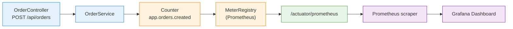

# 35 — Actuator + Micrometer (Prometheus)

## Propósito
Aprender a instrumentar una aplicación Spring Boot con **Actuator** (endpoints de salud/metrics) y **Micrometer** (fachada de métricas), exportando en formato **Prometheus** listo para scrapear.

## Problema que resuelve
Sin observabilidad, una app en producción es una **caja negra**: si algo va lento o se cae, no sabes por qué. Los operadores necesitan métricas continuas (RPS, latencia, errores, contadores de negocio) y health checks estandarizados que un balanceador o un orquestador (Kubernetes) pueda consumir.

## Cómo lo resuelve
- **Actuator** agrega endpoints HTTP estandarizados: `/actuator/health`, `/actuator/metrics`, `/actuator/prometheus`, `/actuator/info`.
- **Micrometer** es la fachada (SLF4J-para-métricas): tú programas contra `MeterRegistry`, `Counter`, `Timer`, `Gauge`, y él exporta al backend que quieras (Prometheus, Datadog, New Relic, JMX, etc.) solo cambiando la dependencia runtime.

## Por qué aprenderlo
Prometheus + Grafana es el estándar de facto en la industria (Kubernetes, CNCF). Todo microservicio Spring Boot moderno expone `/actuator/prometheus` para ser scrapeado por Prometheus y visualizado en Grafana.



## Glosario Básico
| Término | Explicación |
|---|---|
| **Actuator** | Módulo de Spring Boot que expone endpoints operacionales (health, metrics, env, threaddump). |
| **Micrometer** | Fachada de métricas. Escribes una vez, exportas a cualquier backend. |
| **MeterRegistry** | Registro central donde viven todas las métricas de la app. Boot autoconfigura uno según el backend detectado. |
| **Counter** | Métrica que solo sube (o se resetea). Ideal para contar eventos. |
| **Gauge** | Métrica de valor instantáneo (memoria libre, tamaño de cola). |
| **Timer** | Métrica que mide duración + cuenta. |
| **Prometheus** | Base de datos de series temporales que scrapea endpoints HTTP en formato texto. |
| **Scrape** | Prometheus hace GET periódico al endpoint `/actuator/prometheus`. |

## Conceptos

### 1. Actuator endpoints
Se activan agregando `spring-boot-starter-actuator`. Por defecto solo `/actuator/health` se expone por HTTP; los demás hay que habilitarlos con `management.endpoints.web.exposure.include`. Este módulo expone `health, info, metrics, prometheus`.

### 2. Micrometer + Prometheus registry
Agregar `io.micrometer:micrometer-registry-prometheus` en runtime hace que Boot autoconfigure un `PrometheusMeterRegistry` como el `MeterRegistry` principal. Automáticamente aparece el endpoint `/actuator/prometheus` con las métricas en formato texto (`# HELP ... # TYPE ...`).

### 3. Contador custom de negocio
`MetricsConfig` declara un `@Bean Counter ordersCounter(MeterRegistry registry)` con nombre `app.orders.created`. `OrderService` lo inyecta y llama `.increment()` cada vez que crea un pedido. Al exportar, Micrometer transforma el nombre a `app_orders_created_total` (convención Prometheus: puntos → guiones bajos, sufijo `_total` en counters).

### 4. Tags globales
`management.metrics.tags.application: actuator-demo` agrega la etiqueta `application="actuator-demo"` a **todas** las métricas. Fundamental cuando varias apps envían al mismo Prometheus.

## Antes vs Ahora

| Aspecto | ANTES (Java 8 / JMX manual) | AHORA (Java 21 / Micrometer + Actuator) |
|---|---|---|
| Métrica custom | Crear `MBean` + interfaz `MXBean` + registrar en `MBeanServer` | `registry.counter("app.orders.created").increment()` |
| Export a Prometheus | Ejecutar `jmx_exporter` como sidecar java-agent con YAML | Dependencia runtime + endpoint `/actuator/prometheus` |
| Health check | Servlet propio devolviendo 200/500 según lógica manual | `/actuator/health` con `HealthIndicator` beans |
| Inyección del contador | Field injection con `@Autowired` | Constructor injection con campo `final` |
| Sintaxis de respuesta JSON | `new HashMap<String,String>(){{ put("id",id); }}` | `Map.of("id", id, "status", "CREATED")` |

## FAQ del Alumno

- **¿Por qué el nombre `app.orders.created` se ve como `app_orders_created_total` en Prometheus?** Micrometer aplica la convención de Prometheus: puntos → guiones bajos y sufijo `_total` para los counters. Así funciona el ecosistema y no debes preocuparte.
- **¿Puedo exponer todos los endpoints con `*`?** Sí, `include: "*"`, pero es una mala idea en producción: `/actuator/env` filtra propiedades, `/actuator/heapdump` genera GB. Expón solo lo que necesitas.
- **¿Dónde vive el `MeterRegistry`?** Boot lo autoconfigura al detectar `micrometer-registry-prometheus` en classpath. Es un bean singleton y se inyecta como cualquier otro.
- **¿Qué pasa si tengo dos apps enviando `app_orders_created_total`?** Sin tags, se mezclan. Por eso agregamos `metrics.tags.application: actuator-demo` para distinguirlas en Prometheus/Grafana.
- **¿Por qué `TestRestTemplate` no se usa?** Fue eliminado en Spring Boot 4.1.0. Usamos `RestClient` de Spring Framework 7 con `@LocalServerPort`.
- **¿Necesito Prometheus corriendo para probar esto?** No. El endpoint `/actuator/prometheus` funciona solo; Prometheus solo lo lee periódicamente. Puedes hacer `curl` manualmente para verlo.
- **¿Y las métricas automáticas?** Boot registra out-of-the-box: JVM (heap, GC, threads), Tomcat (sesiones, requests), HTTP (`http_server_requests_seconds`), sistema (CPU, disco). Gratis.

## Ejercicios
1. Agrega un `Timer` que mida el tiempo de `createOrder()` y verifica que aparece `app_orders_duration_seconds` en `/actuator/prometheus`.
2. Crea un `Gauge` que exponga el número total de pedidos vivos en un `AtomicInteger`.
3. Configura `management.endpoints.web.base-path: /admin` y observa cómo cambia la URL.
4. Implementa un `HealthIndicator` custom que devuelva `DOWN` si un archivo `maintenance.flag` existe.

## Cómo ejecutar

```powershell
# PowerShell (Windows)
.\build.ps1
java -jar target\actuator-micrometer-1.0.0.jar
```

```bash
# Git Bash / Linux
./build.sh
java -jar target/actuator-micrometer-1.0.0.jar
```

Luego:
```bash
curl http://localhost:8080/actuator/health
curl -X POST http://localhost:8080/api/orders
curl http://localhost:8080/actuator/prometheus | grep app_orders
```

## Archivos del Proyecto
| Archivo | Propósito |
|---|---|
| `pom.xml` | Dependencias: web, actuator, micrometer-registry-prometheus (runtime), test. |
| `application.yml` | Habilita endpoints, health details y tag global `application`. |
| `ActuatorMicrometerApplication.java` | Clase principal con `main()`. |
| `config/MetricsConfig.java` | Declara el `@Bean Counter ordersCounter`. |
| `service/OrderService.java` | Lógica de negocio que incrementa el contador. |
| `controller/OrderController.java` | Endpoint REST `POST /api/orders`. |
| `ActuatorMicrometerApplicationTests.java` | `contextLoads`. |
| `ActuatorEndpointsIT.java` | Tests HTTP con `RestClient`: health, prometheus, POST + verificación de counter=1.0. |
| `build.ps1` / `build.sh` | Scripts con toolchain portable (JDK 21 + Maven 3.9.16). |
