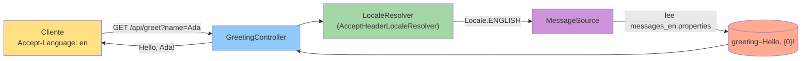

## 37 — Internacionalización (i18n)

### Propósito
Aprender a servir la misma API en varios idiomas usando `MessageSource` +
`LocaleResolver`, sin duplicar controllers ni endpoints.

### Problema que resuelve
Si escribes los textos ("Hola", "Not found", "Producto agotado") como String
literales dentro del código Java, cada nuevo idioma implica reescribir el
código. Peor: los textos quedan mezclados con la lógica de negocio y no los
puede editar un traductor.

### Cómo lo resuelve
Spring propone un patrón simple:
1. Un **`MessageSource`** que carga archivos `.properties` por Locale
   (`messages_es.properties`, `messages_en.properties`, `messages_fr.properties`).
2. Un **`LocaleResolver`** que decide qué idioma usar en cada request. En este
   módulo usamos `AcceptHeaderLocaleResolver` (lee el header HTTP
   `Accept-Language`, que todos los navegadores envían).
3. En el controller se declara un parámetro `Locale locale` y Spring lo
   inyecta automáticamente.

### Por qué aprenderlo
Toda API pública que se despliegue en varios países lo necesita. Ecommerce,
banca, SaaS: los mensajes de error y confirmación deben aparecer en el idioma
del usuario final.



### Glosario Básico
| Término | Explicación |
|---------|-------------|
| **Locale** | Objeto Java que representa un idioma+país (ej: `es`, `en_US`, `fr_CA`). |
| **MessageSource** | Interfaz Spring para resolver una clave (ej. `greeting`) en un texto según el Locale. |
| **ReloadableResourceBundleMessageSource** | Implementación que recarga .properties cambiados sin reiniciar. |
| **LocaleResolver** | Estrategia que decide qué Locale usar en cada request HTTP. |
| **AcceptHeaderLocaleResolver** | LocaleResolver que lee el header HTTP `Accept-Language`. |
| **Accept-Language** | Header que el navegador envía: `Accept-Language: es-CL,es;q=0.9,en;q=0.8`. |
| **`{0}`** | Placeholder tipo `MessageFormat` — se rellena con el 1er argumento pasado a `getMessage`. |

### Conceptos

#### MessageSource
- **Qué es:** un diccionario centralizado que traduce claves a textos según Locale.
- **Por qué importa:** desacopla las traducciones del código Java. Un traductor
  edita `messages_fr.properties` y no toca `.java`.
- **Código:**
  ```java
  @Bean
  public MessageSource messageSource() {
      ReloadableResourceBundleMessageSource ms = new ReloadableResourceBundleMessageSource();
      ms.setBasename("classpath:messages/messages");
      ms.setDefaultEncoding("UTF-8");
      return ms;
  }
  ```
- **Analogía:** una guía de frases turística. La clave "saludo" te devuelve
  "Hola" en la sección española y "Hello" en la inglesa.
- **Casos empresariales:** mensajes de error API, correos transaccionales,
  facturas en PDF, notificaciones push.

#### LocaleResolver
- **Qué es:** la estrategia que decide el Locale por request.
- **Por qué importa:** puedes cambiar la lógica (por header, por sesión, por
  cookie, por query param) sin tocar el controller.
- **Estrategias disponibles:**
  - `AcceptHeaderLocaleResolver` — lee `Accept-Language` (default para APIs).
  - `SessionLocaleResolver` — guarda el Locale en la sesión HTTP.
  - `CookieLocaleResolver` — guarda el Locale en una cookie.
- **Analogía:** el recepcionista de un hotel internacional que decide en qué
  idioma darte la bienvenida (mirando tu pasaporte, tu reserva, o preguntando).

### Antes vs Ahora (Java 8 → Java 21)

| Aspecto | ANTES (Java 8) | AHORA (Java 21) |
|---------|----------------|-----------------|
| Crear Locale | `new Locale("es")` (deprecated) | `Locale.of("es")` |
| Cargar bundles | `ResourceBundle.getBundle("messages", locale)` a mano | `@Bean MessageSource` inyectable |
| Selección de idioma | `if (request.getHeader("Accept-Language").startsWith("es")) ...` | `LocaleResolver` decide y Spring inyecta `Locale` como parámetro |
| Placeholders | `String.format("Hola, %s!", name)` | `MessageFormat` con `{0}` en `.properties` |
| Textos | String literales hardcoded en el código | Externalizados en `messages_*.properties` |

### FAQ del Alumno

- **¿Qué es un `Locale`?** Un objeto que dice "idioma X, país Y". Ej: `es_CL`
  es "español de Chile".
- **¿Por qué el archivo se llama `messages_en.properties` y no `en.properties`?**
  Convención de Java `ResourceBundle`: `<basename>_<idioma>_<pais>.properties`.
  Nuestro `basename` es `messages`.
- **¿Qué pasa si el cliente pide `Accept-Language: zh` (chino) y no lo tengo?**
  Spring cae al `defaultLocale` que definimos en `LocaleResolver` (español en
  este módulo). Si tampoco existe la clave allí, cae al `messages.properties`
  genérico.
- **¿Puedo tener varios idiomas en un mismo request?** No — un request habla
  un solo idioma. El header `Accept-Language` acepta varios con prioridad
  (`q=0.9`), pero Spring elige uno.
- **¿Qué es `{0}` en el `.properties`?** Un placeholder de `MessageFormat`.
  Cuando llamas `getMessage("greeting", new Object[]{"Ada"}, locale)`, `{0}`
  se sustituye por `"Ada"`.
- **¿Por qué UTF-8?** Sin él, caracteres como `ñ`, `é`, `ü` salen corruptos
  (`??`). Siempre UTF-8.
- **¿Por qué el header y no una query `?lang=en`?** Ambos son válidos.
  `Accept-Language` es el estándar HTTP (lo envía el navegador solo). Para
  overrides manuales del usuario, un `?lang=en` + `SessionLocaleResolver` +
  `LocaleChangeInterceptor` es el patrón clásico.

### Ejercicios
1. Agrega `messages_pt.properties` con `greeting=Olá, {0}!` y verifica con
   `Accept-Language: pt`.
2. Añade una segunda clave `farewell` en los 3 idiomas y un endpoint
   `GET /api/bye`.
3. Cambia el `LocaleResolver` a `SessionLocaleResolver` y agrega un
   `LocaleChangeInterceptor` para que `?lang=fr` fuerce el idioma.
4. Escribe un test que valide que un idioma NO soportado (ej. `zh`) cae al
   default (español).

### Cómo ejecutar

**Windows (PowerShell):**
```powershell
.\build.ps1
java -jar target\internacionalizacion-1.0.0.jar
```

**Linux / Git Bash:**
```bash
./build.sh
java -jar target/internacionalizacion-1.0.0.jar
```

**Probar el endpoint:**
```bash
curl -H "Accept-Language: en" "http://localhost:8080/api/greet?name=Ada"
# Hello, Ada!

curl -H "Accept-Language: fr" "http://localhost:8080/api/greet?name=Ada"
# Bonjour, Ada!

curl "http://localhost:8080/api/greet?name=Ada"
# Hola, Ada!   (default español)
```

### Archivos del Proyecto

| Archivo | Propósito |
|---------|-----------|
| `pom.xml` | Coordenadas Maven + dependencias web/test. |
| `build.sh` / `build.ps1` | Scripts que fijan JDK 21 portable y ejecutan `mvn clean verify`. |
| `src/main/java/.../I18nApplication.java` | Clase principal Spring Boot. |
| `src/main/java/.../config/I18nConfig.java` | Beans `MessageSource` y `LocaleResolver`. |
| `src/main/java/.../controller/GreetingController.java` | Endpoint `GET /api/greet`. |
| `src/main/resources/application.yml` | Configuración de la app. |
| `src/main/resources/messages/messages.properties` | Fallback (español). |
| `src/main/resources/messages/messages_es.properties` | Traducciones al español. |
| `src/main/resources/messages/messages_en.properties` | Traducciones al inglés. |
| `src/main/resources/messages/messages_fr.properties` | Traducciones al francés. |
| `src/test/java/.../I18nApplicationTests.java` | `contextLoads`. |
| `src/test/java/.../controller/GreetingControllerTest.java` | MockMvc standalone: en/es/fr + default + test directo del MessageSource. |
