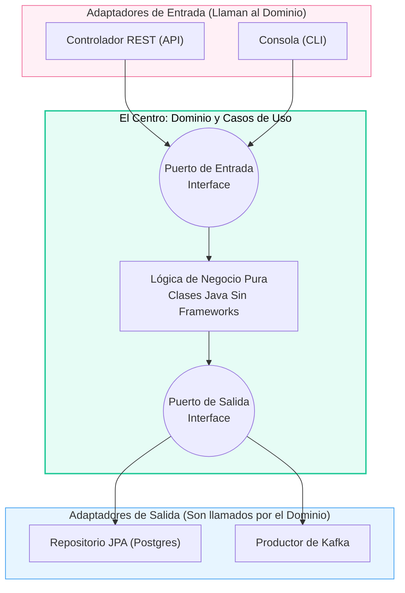

## 38 — Arquitectura Hexagonal (Puertos y Adaptadores)

### Propósito
Aprender a estructurar un proyecto de software empresarial aislando completamente la Lógica de Negocio (El Dominio) de las tecnologías externas (Bases de Datos, Controladores REST, Frameworks) utilizando la **Arquitectura Hexagonal**.

### Problema que resuelve
En la arquitectura tradicional en 3 Capas (Controller -> Service -> Repository), la capa de negocio (Service) depende de la base de datos (Repository). 
- Si quieres cambiar de MySQL a MongoDB, debes modificar el Service.
- Si usas la anotación `@Entity` en tu modelo de negocio, tu negocio "sabe" que está usando JPA. 
- Tu lógica empresarial (ej: "Solo usuarios Premium pueden hacer retiros") está tan enredada con Spring Framework, SQL y anotaciones HTTP, que es imposible de testear sin levantar todo el contexto de Spring (Tests lentos) y es imposible migrar de framework en el futuro sin reescribir todo.

### Cómo lo resuelve
La Arquitectura Hexagonal invierte las dependencias (Principio D de SOLID). El Centro (Dominio) no depende de nada.
- El Centro expone interfaces ("Puertos") diciendo: *"Necesito guardar esto, no me importa cómo lo hagas"*.
- Las capas externas de Infraestructura (Spring Data, Mongo, Kafka) implementan esas interfaces ("Adaptadores").
De esta manera, el Centro no sabe que existe Spring Boot, ni HTTP, ni SQL. Es Java 100% puro y testeable en milisegundos.

### Por qué aprenderlo
Es la arquitectura estándar para sistemas Core Bancarios, Fintechs, y cualquier sistema donde la longevidad del código sea crucial (sistemas diseñados para vivir 10+ años). Conocer Arquitectura Hexagonal, Clean Architecture y DDD te eleva inmediatamente al rango de Arquitecto o Ingeniero de Software Senior.



---

### Glosario Básico

#### `Dominio (Domain)`
El corazón del hexágono. Contiene las reglas estrictas de tu negocio. Son clases Java (POJOs o Records) sin una sola anotación de Spring o JPA. (Ej: `Factura`, `Usuario`).

#### `Casos de Uso (Application Service / Use Cases)`
La lógica de orquestación pura. Aquí ocurre el flujo (Ej: "Recibir petición -> Validar fondos en el Dominio -> Guardar en el Puerto -> Retornar respuesta").

#### `Puerto (Port)`
Una simple **Interfaz de Java** que reside dentro del hexágono.
- **Port de Entrada (Inbound/Primary):** Define lo que el exterior le puede pedir al hexágono.
- **Port de Salida (Outbound/Secondary):** Define lo que el hexágono necesita del exterior (Ej: `interface UserRepository`).

#### `Adaptador (Adapter)`
Las clases que residen **fuera** del hexágono.
- **Inbound Adapter:** Un `@RestController` de Spring que "adapta" una petición HTTP y llama al Puerto de Entrada.
- **Outbound Adapter:** Un archivo que implementa el Puerto de Salida. Usa JPA, Kafka, o `RestClient` para comunicarse con el mundo exterior.

---

### Conceptos

#### 1. Estructura de Paquetes
En lugar de la clásica estructura técnica (`controller/`, `service/`, `repository/`), estructuramos el código separando el interior del exterior:
```text
src/main/java/com/app/
├── domain/                    # EL HEXÁGONO (Sin dependencias de Spring!)
│   ├── model/                 # POJOs del negocio (User, Order)
│   ├── port/
│   │   ├── in/                # Interfaces de Casos de Uso
│   │   └── out/               # Interfaces para la persistencia
│   └── usecase/               # Implementación de los Puertos de Entrada
└── infrastructure/            # EL EXTERIOR (Todo Spring va aquí)
    ├── adapter/
    │   ├── in/
    │   │   └── web/           # Controladores REST (Spring MVC)
    │   └── out/
    │       └── persistence/   # Entidades JPA, JpaRepository y Mappers
    └── config/                # @Configuration y inyección de beans
```

#### 2. El Centro del Hexágono (Puro y Limpio)
- **Qué es** — El código de negocio que nunca cambia aunque migres de PostgreSQL a DynamoDB.
- **Código** — Nótese la AUSENCIA de `@Entity`, `@Id`, o `@Service`.
  ```java
  // 1. EL MODELO (domain/model/User.java)
  public class User {
      private Long id;
      private String name;
      private Double balance;
  
      // Regla de Negocio (Encapsulación)
      public void withdraw(Double amount) {
          if (this.balance < amount) throw new BusinessException("Sin fondos");
          this.balance -= amount;
      }
  }
  
  // 2. EL PUERTO DE SALIDA (domain/port/out/UserRepositoryPort.java)
  // El dominio dicta las reglas, no sabe de JPA
  public interface UserRepositoryPort {
      User findById(Long id);
      void save(User user);
  }
  
  // 3. EL CASO DE USO (domain/usecase/WithdrawUseCase.java)
  // Orquesta la acción. No lleva @Service.
  public class WithdrawUseCase {
      private final UserRepositoryPort userRepositoryPort;
  
      // Inyección por constructor clásica (Java puro)
      public WithdrawUseCase(UserRepositoryPort userRepositoryPort) {
          this.userRepositoryPort = userRepositoryPort;
      }
  
      public void execute(Long userId, Double amount) {
          User user = userRepositoryPort.findById(userId); // Trae el dominio
          user.withdraw(amount);                           // Ejecuta regla
          userRepositoryPort.save(user);                   // Guarda el estado
      }
  }
  ```

#### 3. Los Adaptadores de Salida (Infraestructura)
- **Qué es** — El mundo real. Aquí sí usas `@Entity`, conectas a la Base de Datos, y traduces (mapeas) el objeto de Base de Datos al objeto del Dominio.
- **Código**:
  ```java
  // 1. LA ENTIDAD DE BD (infrastructure/adapter/out/persistence/UserJpaEntity.java)
  @Entity
  @Table(name = "users")
  public class UserJpaEntity {
      @Id @GeneratedValue
      private Long id;
      private String name;
      private Double balance;
      // Getters y Setters...
  }
  
  // 2. EL ADAPTADOR (infrastructure/adapter/out/persistence/UserRepositoryAdapter.java)
  // Esta clase IMPLEMENTA el puerto que el Dominio requiere
  @Component
  public class UserRepositoryAdapter implements UserRepositoryPort {
      
      private final SpringDataUserRepository jpaRepo; // Tu JpaRepository clásico
      
      public UserRepositoryAdapter(SpringDataUserRepository jpaRepo) {
          this.jpaRepo = jpaRepo;
      }
  
      @Override
      public User findById(Long id) {
          UserJpaEntity entity = jpaRepo.findById(id).orElseThrow();
          return UserMapper.toDomain(entity); // TRADUCE BD -> Dominio puro
      }
  
      @Override
      public void save(User user) {
          UserJpaEntity entity = UserMapper.toEntity(user); // TRADUCE Dominio -> BD
          jpaRepo.save(entity);
      }
  }
  ```

#### 4. Los Adaptadores de Entrada y la Inyección de Spring
- **Qué es** — El Controlador recibe el HTTP y se lo pasa al Dominio. Como el Dominio no tiene `@Service`, necesitamos un `@Configuration` manual en la Infraestructura para crear el Bean e inyectarlo.
- **Código**:
  ```java
  // 1. LA INYECCIÓN MANUAL (infrastructure/config/DomainConfig.java)
  @Configuration
  public class DomainConfig {
      
      @Bean
      public WithdrawUseCase withdrawUseCase(UserRepositoryPort port) {
          // Instanciamos el POJO pasándole la implementación real (Adapter)
          return new WithdrawUseCase(port); 
      }
  }
  
  // 2. EL CONTROLADOR (infrastructure/adapter/in/web/UserController.java)
  @RestController
  public class UserController {
      private final WithdrawUseCase withdrawUseCase;
  
      public UserController(WithdrawUseCase withdrawUseCase) {
          this.withdrawUseCase = withdrawUseCase;
      }
  
      @PostMapping("/withdraw")
      public ResponseEntity<Void> withdraw(@RequestBody WithdrawRequest request) {
          withdrawUseCase.execute(request.userId(), request.amount());
          return ResponseEntity.ok().build();
      }
  }
  ```

#### 5. Edge Cases y Errores Comunes

| Error | Causa | Solución |
|-------|-------|----------|
| Poner un Import de Spring en el Dominio | Usar `@Service` o `@Transactional` en las clases de Dominio/Use Cases | ¡Sacrilegio arquitectónico! El dominio debe ser Java 100% puro. El `@Transactional` va en el Use Case? No, va en el Adaptador de Entrada (Controller o un Proxy de aplicación), o se crea un decorador en la Infraestructura. |
| Clases Mappers Inmanejables | Traducir de `JpaEntity` a `Domain` y a `Dto` a mano | Usa librerías de mapeo automáticas (MapStruct, Módulo 09) en la capa de infraestructura para mantener el código de los Adapters limpio. |
| Sobrecoste en Proyectos Pequeños | Crear 3 interfaces, 2 mappers y 3 clases para hacer un simple CRUD de "Marcas de Autos" | La Hexagonal (y el DDD) NO es para todo. Está pensada para **Dominio Complejo** (Ej: Seguros, Banca). Aplicarla a un CRUD simple generará un exceso de archivos (Over-engineering). |

---

### Ejercicios
1. Crea la estructura de carpetas indicada (`domain`, `infrastructure`).
2. En `domain/model`, crea la clase `CuentaBancaria` con métodos de negocio (NO Setters) como `depositar()` y `retirar()`. Que sea Java puro.
3. En `domain/port/out`, crea la interfaz `CuentaPort`. En `domain/port/in`, crea `OperacionCuentaUseCase` (Interfaz) y su implementación `OperacionCuentaService`.
4. Sal del Hexágono. En `infrastructure/adapter/out/persistence`, crea tu Entidad JPA, tu `JpaRepository` y el `CuentaAdapter` que implemente `CuentaPort`. Usa mappers manuales.
5. Escribe un Unit Test para el Dominio. Nota cómo puedes testear TODA la regla de negocio instanciando un `new OperacionCuentaService(...)` inyectándole un MOCK de `CuentaPort`, ejecutándose en 1 milisegundo sin cargar Spring Boot.

### Cómo ejecutar
```bash
cd 38-hexagonal
mvn spring-boot:run

# Probar la arquitectura aislando capas
curl -X POST http://localhost:8080/api/cuentas/1/retiro -H "Content-Type: application/json" -d '{"monto": 50}'
```

### Archivos del Proyecto
| Archivo | Propósito |
|---------|-----------|
| `domain/model/User.java` | Lógica pura y encapsulada. |
| `domain/usecase/WithdrawUseCase.java` | Orquestación libre de dependencias. |
| `infrastructure/adapter/out/persistence/...` | Implementación real hacia Base de Datos con JPA y Mappers. |
| `infrastructure/config/BeanConfig.java` | Inyección de dependencias programática uniendo el Dominio con la Infraestructura. |
