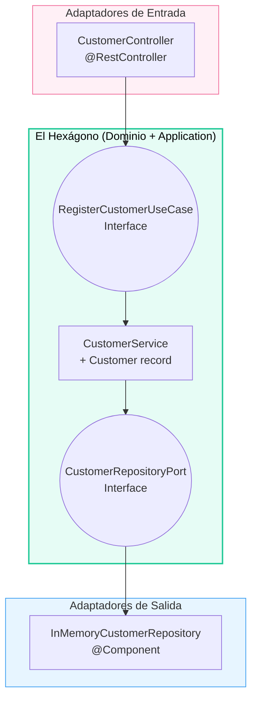

## 38 — Arquitectura Hexagonal (Puertos y Adaptadores)

### Propósito
Aprender a estructurar un proyecto de software empresarial aislando completamente la Lógica de Negocio (El Dominio) de las tecnologías externas (Bases de Datos, Controladores REST, Frameworks) utilizando la **Arquitectura Hexagonal**.

### Problema que resuelve
En la arquitectura tradicional en 3 Capas (Controller -> Service -> Repository), la capa de negocio (Service) depende de la base de datos (Repository).
- Si quieres cambiar de MySQL a MongoDB, debes modificar el Service.
- Si usas la anotación `@Entity` en tu modelo de negocio, tu negocio "sabe" que está usando JPA.
- Tu lógica empresarial (ej: "Solo usuarios Premium pueden hacer retiros") está tan enredada con Spring Framework, SQL y anotaciones HTTP, que es imposible de testear sin levantar todo el contexto de Spring (Tests lentos) y es imposible migrar de framework en el futuro sin reescribir todo.

### Cómo lo resuelve
La Arquitectura Hexagonal invierte las dependencias (Principio D de SOLID). El Centro (Dominio) no depende de nada.
- El Centro expone interfaces ("Puertos") diciendo: *"Necesito guardar esto, no me importa cómo lo hagas"*.
- Las capas externas de Infraestructura (Spring Data, Mongo, Kafka) implementan esas interfaces ("Adaptadores").
De esta manera, el Centro no sabe que existe Spring Boot, ni HTTP, ni SQL. Es Java 100% puro y testeable en milisegundos.

### Por qué aprenderlo
Es la arquitectura estándar para sistemas Core Bancarios, Fintechs, y cualquier sistema donde la longevidad del código sea crucial (sistemas diseñados para vivir 10+ años). Conocer Arquitectura Hexagonal, Clean Architecture y DDD te eleva inmediatamente al rango de Arquitecto o Ingeniero de Software Senior.



---

### Glosario Básico

- **Dominio (Domain)**: corazón del hexágono. Java 100% puro (record `Customer`, interfaces puerto). Sin Spring.
- **Application**: implementación de los casos de uso (`CustomerService`). Un poco menos puro (lleva `@Service`).
- **Puerto de Entrada (Primary/Inbound)**: interfaz que expone lo que el hexágono ofrece al exterior (`RegisterCustomerUseCase`).
- **Puerto de Salida (Secondary/Outbound)**: interfaz que expone lo que el hexágono necesita del exterior (`CustomerRepositoryPort`).
- **Adaptador de Entrada**: quien llama al hexágono desde afuera (`CustomerController` HTTP).
- **Adaptador de Salida**: quien implementa el puerto de salida (`InMemoryCustomerRepository`).

---

### Estructura del proyecto

```
src/main/java/com/springroadmap/hexagonal/
├── HexagonalApplication.java
├── domain/                                          # HEXÁGONO PURO (sin Spring)
│   ├── model/Customer.java                          # record de dominio
│   └── port/
│       ├── in/RegisterCustomerUseCase.java          # Primary Port
│       └── out/CustomerRepositoryPort.java          # Secondary Port
├── application/
│   └── service/CustomerService.java                 # implementa RegisterCustomerUseCase
└── adapter/
    ├── in/web/CustomerController.java               # @RestController
    └── out/persistence/InMemoryCustomerRepository.java  # @Component
```

---

### Antes vs Ahora

**Antes (3 capas clásicas):**

```java
@RestController
class CustomerController {
    private final CustomerService service;   // <-- depende de la clase concreta
    // ...
}

@Service
class CustomerService {
    private final CustomerRepository repo;   // <-- CustomerRepository extends JpaRepository
    // el service SABE que hay JPA. Testear = arrancar contexto Spring.
}
```

Problemas:
- El Controller depende de una clase concreta.
- El Service depende de JPA (imposible testear sin arrancar Spring).
- Migrar de MySQL a Mongo obliga a tocar el Service.

**Ahora (Hexagonal):**

```java
@RestController
class CustomerController {
    private final RegisterCustomerUseCase useCase;   // <-- INTERFAZ
}

@Service
class CustomerService implements RegisterCustomerUseCase {
    private final CustomerRepositoryPort port;       // <-- INTERFAZ
    // el service NO sabe qué hay del otro lado del port.
}

@Component
class InMemoryCustomerRepository implements CustomerRepositoryPort { ... }
```

Ventajas:
- El controlador se testea con un mock manual del `RegisterCustomerUseCase`.
- El service se testea como POJO puro con un mock del `CustomerRepositoryPort` (0 ms, sin Spring).
- Cambiar la persistencia = escribir otra clase que implemente el port. Cero cambios en el dominio.

**Antes vs Ahora en sintaxis Java aplicada al módulo:**

| Tema | Antes (Java 8) | Ahora (Java 21) |
|------|----------------|-----------------|
| Modelo de dominio | `class Customer { ...30 líneas de getters/setters... }` | `public record Customer(Long id, String name, String email) { }` |
| DTO de request | Clase POJO con getters/setters | `public record RegisterCustomerRequest(String name, String email) { }` |
| Ausencia de valor | `Customer findById(Long id)` que devuelve `null` | `Optional<Customer> findById(Long id)` |
| Inyección | `@Autowired` sobre el campo | Constructor injection (recomendado desde Spring 4.3+) |

---

### FAQ del Alumno

**P: ¿Por qué mi record `Customer` no lleva `@Entity`?**
R: Porque `@Entity` es de JPA. Si lo pones, el dominio "sabe" que existe una BD relacional. Rompes hexagonal. La solución real es crear una clase `CustomerJpaEntity` aparte en el adaptador de persistencia y mapear.

**P: ¿Por qué el `CustomerController` depende de la interfaz y no de `CustomerService` directamente?**
R: Para poder mockear el use case en tests. Y para poder cambiar la implementación (por ejemplo, una versión async) sin tocar el controlador.

**P: ¿La interfaz `CustomerRepositoryPort` no debería estar junto a su implementación?**
R: No. Vive en `domain/port/out` porque el DOMINIO es quien dicta el contrato. La implementación vive afuera, en el adaptador. Esta "inversión" es lo que permite que la flecha de dependencia apunte siempre HACIA el dominio, nunca desde el dominio hacia afuera.

**P: ¿Puedo poner `@Service` en el use case dentro de `domain/`?**
R: Puristas dirían que no (rompe la pureza). Aquí lo pusimos en `application/` como pragmatismo: el paquete `domain` queda 100% puro (modelo + puertos), y `application` puede llevar anotaciones Spring. Otra escuela sería tener un `@Configuration` en infraestructura que registra el use case como `@Bean` manual.

**P: ¿No es demasiado archivo para un CRUD simple?**
R: Sí. Hexagonal está pensada para **dominio complejo** (banca, seguros, sistemas core). Aplicarla a un CRUD de "Marcas de Autos" es sobre-ingeniería. La usas cuando el negocio tiene reglas ricas y esperas que el sistema viva 10+ años.

**P: ¿Cómo testeo el `CustomerService` sin Spring?**
R: Ver `CustomerServiceTest`. Es un test JUnit puro que hace `new CustomerService(mockPortManual)` y verifica el comportamiento. Ejecuta en milisegundos.

**P: ¿Por qué el mock del port se hace a mano y no con Mockito?**
R: Puedes usar Mockito perfectamente. Aquí lo hicimos a mano (con una clase anónima) para demostrar que la arquitectura hexagonal NO NECESITA librerías de mocking: si tus dependencias son interfaces puras, cualquier `new CustomerRepositoryPort() { ... }` es un mock válido.

---

### Ejercicios
1. Añade un puerto de entrada nuevo `FindCustomerUseCase` con `Optional<Customer> findById(Long id)` y su implementación en `CustomerService`. Expón `GET /api/customers/{id}` en el controlador.
2. Crea un segundo adaptador de salida `JpaCustomerRepository` (dependencia H2 + JPA) que también implemente `CustomerRepositoryPort`. Usa `@Profile("jpa")` para elegir cuál activar. Ve cómo el dominio no cambia una sola línea.
3. Añade una regla de negocio al `CustomerService`: rechazar emails que no contengan `@`. Escribe el test unitario POJO correspondiente ANTES de escribir el código (TDD).
4. Escribe un adaptador de entrada CLI (`CommandLineRunner`) que registre un cliente al arrancar. Observa que también depende de `RegisterCustomerUseCase`, no de `CustomerService`.

### Cómo ejecutar

```bash
cd 38-hexagonal

# Build (usa toolchain portable de la raíz del roadmap)
./build.sh          # Git Bash / Linux / macOS
./build.ps1         # PowerShell (Windows)

# Ejecutar el fat JAR
java -jar target/hexagonal-1.0.0.jar

# Probar
curl -X POST http://localhost:8080/api/customers \
     -H "Content-Type: application/json" \
     -d '{"name":"Juan","email":"juan@x.com"}'
```

### Archivos del Proyecto

| Archivo | Propósito |
|---------|-----------|
| `pom.xml` | Coordenadas Maven + Spring Boot 4.1.0 + Java 21. Fat JAR `hexagonal-1.0.0.jar`. |
| `HexagonalApplication.java` | Punto de entrada (`@SpringBootApplication`). |
| `domain/model/Customer.java` | Record de dominio 100% puro (sin Spring). |
| `domain/port/in/RegisterCustomerUseCase.java` | Puerto de entrada (interfaz). |
| `domain/port/out/CustomerRepositoryPort.java` | Puerto de salida (interfaz). |
| `application/service/CustomerService.java` | Implementación del use case. `@Service`. |
| `adapter/in/web/CustomerController.java` | Adaptador de entrada HTTP. Depende de la interfaz. |
| `adapter/out/persistence/InMemoryCustomerRepository.java` | Adaptador de salida en memoria. |
| `resources/application.yml` | Configuración + hardening de mensajes de error. |
| `HexagonalApplicationTests.java` | `contextLoads` — valida cableado de todos los beans. |
| `CustomerServiceTest.java` | Test UNITARIO POJO puro. Mock manual del port. Sin Spring. |
| `CustomerControllerTest.java` | Test MockMvc standalone con mock manual del use case. |
| `build.sh` / `build.ps1` | Scripts que fijan JAVA_HOME al JDK 21 portable y llaman a Maven 3.9.16. |
