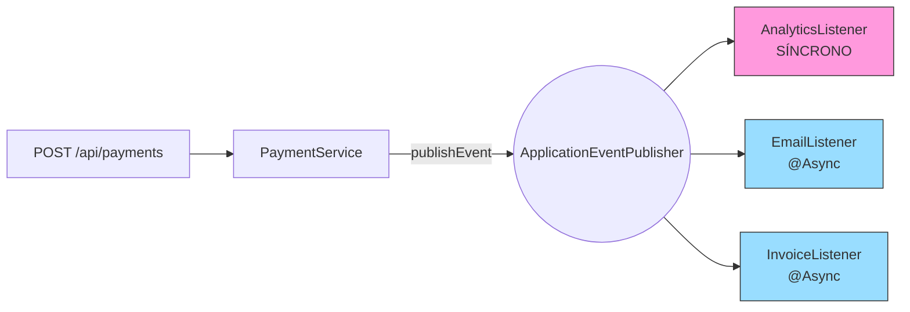

# 40 — Event-Driven con `ApplicationEventPublisher` + `@Async @EventListener`

## Propósito
Aprender a desacoplar componentes publicando **eventos de dominio** en Spring y suscribiendo múltiples listeners (síncronos y asíncronos) sin acoplamiento explícito entre productor y consumidores.

## Problema que resuelve
En un flujo tradicional, `PaymentService.processPayment()` termina llamando en cadena a `EmailService.send()`, `InvoiceService.generate()`, `AnalyticsService.record()`. Cada nuevo requerimiento obliga a **modificar** el servicio de pagos. Alto acoplamiento y difícil de testear.

## Cómo lo resuelve
El servicio de pagos publica **un solo evento** `PaymentSuccessEvent` con `ApplicationEventPublisher`. Cualquier bean marcado con `@EventListener` lo recibe. Si además está anotado con `@Async`, se ejecuta en otro hilo (pool `eventExecutor`), sin bloquear al publicador.

## Por qué aprenderlo
Es la base para SAGA coreográfica, Event Sourcing, integración con colas (Rabbit/Kafka) y arquitecturas hexagonal/DDD. Antes de saltar a mensajería distribuida hay que dominar el bus de eventos **in-process** de Spring.



## Glosario Básico
| Término | Explicación |
|---------|-------------|
| `ApplicationEventPublisher` | Bean de Spring que difunde eventos a los listeners. |
| `@EventListener` | Marca un método como suscriptor a un tipo de evento. |
| `@Async` | Ejecuta el método en otro hilo (requiere `@EnableAsync`). |
| `@EnableAsync` | Habilita el procesamiento async en la aplicación. |
| `ThreadPoolTaskExecutor` | Pool de hilos gestionado por Spring. |
| `record` | Clase Java 16+ inmutable con getters y equals automáticos. |
| `AtomicInteger` | Contador thread-safe. |

## Conceptos

### 1. Publicación de eventos
`publisher.publishEvent(new PaymentSuccessEvent(id, amount))`. Desde Spring 4.2 el evento puede ser cualquier POJO — ya no se extiende `ApplicationEvent`.

### 2. Listeners síncronos
`AnalyticsListener` corre en el hilo que publicó. Termina ANTES de que `processPayment` retorne. Útil cuando necesitas terminar en la misma transacción.

### 3. Listeners asíncronos
`EmailListener` y `InvoiceListener` corren en `eventExecutor`. El publicador retorna inmediatamente. Útil para I/O lenta (email, PDFs, HTTP externo).

**Caso de uso empresarial:** confirmación de compra en e-commerce. El usuario recibe el 200 OK al instante, y el email/factura/analytics se procesan en segundo plano.

### 4. Analogía
Radio broadcast: el locutor grita al micrófono ("PAGO OK") y N radios escuchan en paralelo. El locutor no espera a nadie.

## Antes vs Ahora (Java 8 → Java 21)

| Concepto | Antes (Java 8) | Ahora (Java 21) |
|----------|----------------|-----------------|
| Evento inmutable | `final class` + getters + equals + hashCode | `public record PaymentSuccessEvent(Long id, BigDecimal amount) {}` |
| Publicar | `emailSvc.send(); invoiceSvc.gen(); analyticsSvc.rec();` | `publisher.publishEvent(evt);` |
| Ejecución async | `new Thread(() -> ...).start()` | `@Async("eventExecutor")` |
| Mapa respuesta | `HashMap<>() + put + put` | `Map.of("id", id, "amount", amount)` |

## Antes vs Ahora (Diseño)

| Aspecto | Antes (llamadas directas) | Ahora (eventos) |
|---------|---------------------------|-----------------|
| Agregar un nuevo consumidor | Modificar `PaymentService` | Crear una clase nueva `@EventListener` |
| Testeo | Mockear 3 servicios | Basta con verificar el publisher |
| Fallo en un listener | Rompe la cadena entera | Aislado (Spring lo loguea) |
| Ejecución paralela | Serial | Automática con `@Async` |

## FAQ del Alumno

- **¿Qué es un evento?** Un objeto que representa "algo pasó" (un hecho). Nada más que un POJO.
- **¿El publisher sabe quién escucha?** No. Spring lo resuelve por tipo del argumento del listener.
- **¿Puedo tener varios `@EventListener` para el mismo evento?** Sí, tantos como quieras.
- **¿Por qué `@Async` necesita `@EnableAsync`?** Porque Spring crea un proxy que redirige la llamada al pool; sin habilitarlo, `@Async` se ignora.
- **¿Por qué `Thread.sleep(500)` en el test?** Porque los listeners async corren en otros hilos. En producción usa **Awaitility** en vez de sleep.
- **¿Sync o async por defecto?** Sync. `@EventListener` sin `@Async` corre en el mismo hilo.
- **¿Puedo ordenar los listeners?** Sí, con `@Order(1)`, `@Order(2)`, etc.
- **¿Y si necesito eventos DESPUÉS de commit?** Usa `@TransactionalEventListener(phase = AFTER_COMMIT)`.

## Ejercicios
1. Añade un `@Order` a los listeners y observa el orden en los logs.
2. Cambia `AnalyticsListener` a `@Async` y verifica cómo cambia el timing en el test.
3. Sustituye `Thread.sleep(500)` por `Awaitility.await().atMost(...).until(...)`.
4. Añade un `@TransactionalEventListener` (requiere JPA).
5. Publica el evento desde el controller directamente y discute por qué es peor.

## Cómo ejecutar
```bash
# Build
./build.sh          # Git Bash
./build.ps1         # PowerShell

# Ejecutar
java -jar target/event-driven-1.0.0.jar

# Probar
curl -X POST "http://localhost:8080/api/payments?amount=100"
```

## Archivos del Proyecto

| Archivo | Propósito |
|---------|-----------|
| `pom.xml` | Coordenadas Maven + Spring Boot 4.1.0. |
| `EventDrivenApplication.java` | Bootstrap Spring Boot. |
| `config/AsyncConfig.java` | `@EnableAsync` + bean `eventExecutor`. |
| `event/PaymentSuccessEvent.java` | Record inmutable del evento. |
| `service/PaymentService.java` | Publica el evento. |
| `listener/EmailListener.java` | Async, incrementa contador. |
| `listener/InvoiceListener.java` | Async, incrementa contador. |
| `listener/AnalyticsListener.java` | Síncrono, incrementa contador. |
| `controller/PaymentController.java` | `POST /api/payments`. |
| `application.yml` | Puerto 8080 + logging. |
| `EventDrivenApplicationTests.java` | `contextLoads`. |
| `EventDrivenTest.java` | Verifica sync vs async. |
| `controller/PaymentControllerTest.java` | MockMvc standalone. |
| `build.sh` / `build.ps1` | Build con toolchain portable. |
