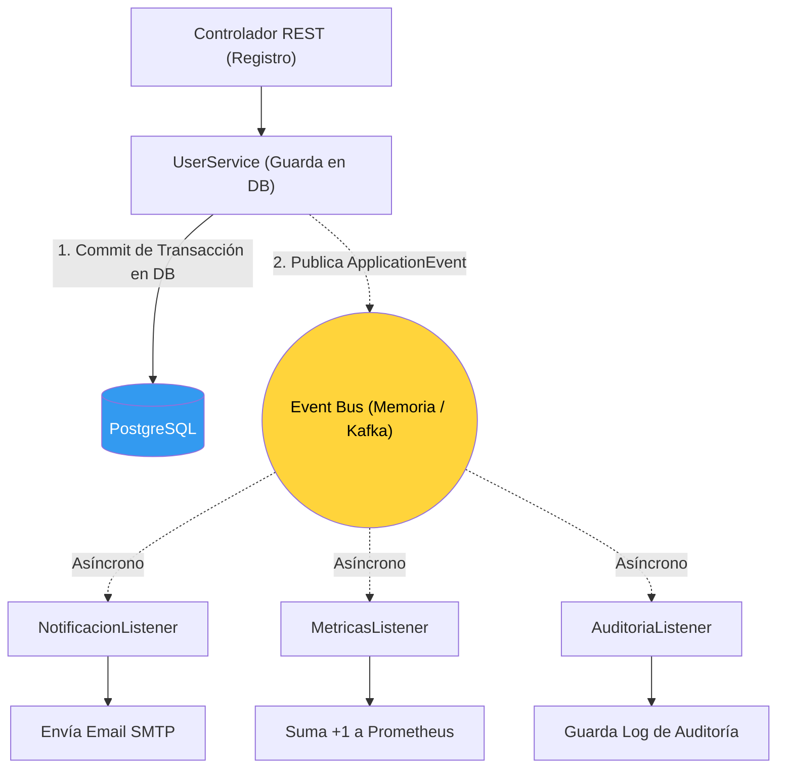

## 40 — Arquitectura Orientada a Eventos (Event-Driven Architecture)

### Propósito
Aprender a diseñar sistemas reativos y altamente desacoplados basando toda la comunicación de negocio en el patrón **Publish-Subscribe (Pub/Sub)**, manejando eventos asíncronos y garantizando la consistencia de datos a través del uso de `@TransactionalEventListener`.

### Problema que resuelve
En un diseño síncrono y acoplado:
1. El usuario se registra.
2. Tu código guarda el usuario en BD.
3. Envía el email de bienvenida (Bloquea 2 segundos).
4. Actualiza el CRM externo (Bloquea 3 segundos).
5. Retorna la respuesta HTTP (Tardó 5 segundos totales).
**Problema Crítico:** Si la API del CRM externo está caída, lanzará excepción, la transacción se revertirá (Rollback), el email ya se envió pero el usuario NO se guardó en la base de datos. El estado del sistema quedó totalmente inconsistente.

### Cómo lo resuelve
En un diseño **Event-Driven**:
1. Tu código guarda el usuario en BD.
2. Publica un evento en memoria: `"UsuarioRegistradoEvent"`.
3. Retorna la respuesta HTTP en 10 milisegundos.
En Hilos Separados (Background):
- Un Listener (EmailService) recibe el evento y envía el correo.
- Otro Listener (CRMService) recibe el evento y actualiza el CRM.
Si el CRM falla, no importa. El usuario ya se registró y la interfaz respondió rápido.

### Por qué aprenderlo
La Arquitectura Orientada a Eventos (EDA) es el pilar de la escalabilidad, la disponibilidad y los microservicios modernos (Coreography vs Orchestration). Es vital para garantizar tiempos de respuesta de milisegundos (Latencia baja) frente al usuario final, delegando el trabajo pesado a procesos en background.



---

### Glosario Básico

#### `Event Bus` / `ApplicationEventPublisher`
El "aire" a través del cual viajan los mensajes. En el entorno local de Spring, es la memoria RAM (el `ApplicationContext`). En sistemas distribuidos, es RabbitMQ o Kafka.

#### `ApplicationEvent` / `Record`
El Objeto (payload) que representa "Algo que ya pasó en el pasado" (Ej: `InvoicePaidEvent`). Nunca debe ser un comando ("PagarFactura"). Siempre es en pasado.

#### `@EventListener`
Anotación básica para escuchar eventos. Por defecto es **síncrono** (corre en el mismo hilo que el publicador).

#### `@TransactionalEventListener`
Una variante avanzada. Se asegura de que el listener SOLO se ejecute si la transacción de la base de datos del publicador hizo un *Commit Exitoso*.

---

### Conceptos

#### 1. El Evento (El Payload)
- **Qué es** — En Java moderno (14+), usamos `Records` para definir eventos inmutables. 
- **Código**:
  ```java
  // Nombrarlo siempre en PASADO
  public record UserRegisteredEvent(Long userId, String email) {}
  ```

#### 2. Publicando el Evento (Publisher)
- **Qué es** — Inyectamos la clase nativa de Spring para disparar el mensaje.
- **Código**:
  ```java
  @Service
  public class UserService {
  
      private final UserRepository repo;
      private final ApplicationEventPublisher eventPublisher;
  
      public UserService(UserRepository repo, ApplicationEventPublisher eventPublisher) {
          this.repo = repo;
          this.eventPublisher = eventPublisher;
      }
  
      @Transactional
      public void registerUser(String name, String email) {
          User user = new User(name, email);
          repo.save(user);
          
          // La regla de oro: Publicar el evento ANTES de retornar
          eventPublisher.publishEvent(new UserRegisteredEvent(user.getId(), email));
      }
  }
  ```

#### 3. Escuchando de forma Segura (`@TransactionalEventListener`)
- **El Peligro:** Si usamos `@EventListener` o `@Async`, el listener podría ejecutarse ¡antes de que la Base de Datos haga el COMMIT! Si el listener de emails busca al usuario `findById(userId)`, la DB dirá "No existe" porque la transacción original aún no se ha volcado al disco.
- **La Solución:** `@TransactionalEventListener` (Fase: `AFTER_COMMIT`).
- **Código**:
  ```java
  @Component
  @Slf4j
  public class EmailNotificationListener {
  
      // Solo se ejecuta si el UserService hizo el COMMIT de BD exitosamente.
      // @Async (Módulo 21) hace que se ejecute en un hilo separado para no bloquear la respuesta HTTP.
      @Async 
      @TransactionalEventListener(phase = TransactionPhase.AFTER_COMMIT)
      public void onUserRegistered(UserRegisteredEvent event) {
          log.info("Enviando email de bienvenida asíncrono a: {}", event.email());
          // lógica pesada SMTP...
      }
  }
  ```

#### 4. Ordenamiento de Listeners (Orquestación Ligera)
- **Qué es** — A veces tienes múltiples Listeners síncronos para el mismo evento y necesitas que se ejecuten en un orden específico (ej: Primero auditar, luego calcular puntos).
- **Código**:
  ```java
  @Component
  public class AuditListener {
      @EventListener
      @Order(1) // Se ejecuta primero
      public void audit(UserRegisteredEvent event) { ... }
  }
  
  @Component
  public class PointsListener {
      @EventListener
      @Order(2) // Se ejecuta después
      public void givePoints(UserRegisteredEvent event) { ... }
  }
  ```

#### 5. Edge Cases y Errores Comunes

| Error | Causa | Solución |
|-------|-------|----------|
| Excepción `LazyInitializationException` en el Listener | Pasaste la Entidad JPA (`User`) dentro del Evento. El Listener intentó acceder a una lista `user.getRoles()` que era Lazy, pero la sesión de Hibernate del publicador ya se cerró. | **Nunca pases Entidades JPA en los Eventos**. Pasa IDs primitivos (Long, String) y deja que el Listener haga su propia consulta a la BD si necesita los datos. |
| El Listener modifica la BD, pero los cambios no se guardan | Un `@TransactionalEventListener(AFTER_COMMIT)` corre fuera de la transacción original. Si intentas hacer `repository.save()`, no hay transacción activa. | Debes añadir la anotación `@Transactional` al método del listener. Esto inicia una **nueva** transacción independiente solo para el trabajo del listener. (El `@TransactionalEventListener` te dice cuándo empezar, pero el `@Transactional` te da la conexión a DB). |
| Falsa Promesa de Garantía de Entrega | Si el hilo principal publica el evento, y el servidor se apaga 1 milisegundo después, el evento en memoria se pierde para siempre. | Los eventos de memoria (Spring ApplicationEvent) son volátiles. Para garantías empresariales estrictas, debes usar **Mensajería Externa (Kafka)** o el patrón **Transactional Outbox** (donde guardas el evento en una tabla de tu base de datos en la misma transacción que el negocio, y un Job en background lee la tabla y los procesa). |

---

### Ejercicios
1. En un proyecto con JPA y `@EnableAsync`, crea la entidad `Pedido` y un servicio para guardar pedidos.
2. Crea un Record `PedidoCreadoEvent(Long id)`.
3. Haz que el servicio publique el evento al guardar un nuevo pedido.
4. Crea dos Listeners en clases distintas: `InventarioListener` y `FacturaListener`.
5. Anota a ambos con `@Async` y `@TransactionalEventListener`. Haz que hagan un `Thread.sleep(3000)` simulando trabajo lento.
6. Consume el Endpoint REST y nota cómo la respuesta HTTP (Postman) es instantánea (< 50ms), y 3 segundos después aparecen los logs en la consola indicando que el trabajo de background terminó con éxito.

### Cómo ejecutar
```bash
cd 40-event-driven
mvn spring-boot:run

# Crear un pedido para disparar los eventos
curl -X POST http://localhost:8080/api/pedidos -H "Content-Type: application/json" -d '{"cliente": "Carlos", "monto": 1500}'
```

### Archivos del Proyecto
| Archivo | Propósito |
|---------|-----------|
| `config/AsyncConfig.java` | Habilitación de `@EnableAsync` y configuración de ThreadPools. |
| `events/UserRegisteredEvent.java` | El Record Inmutable. |
| `service/UserService.java` | Lógica síncrona transaccional y `ApplicationEventPublisher`. |
| `listeners/EmailListener.java` | Consumidor asíncrono con `@TransactionalEventListener`. |
