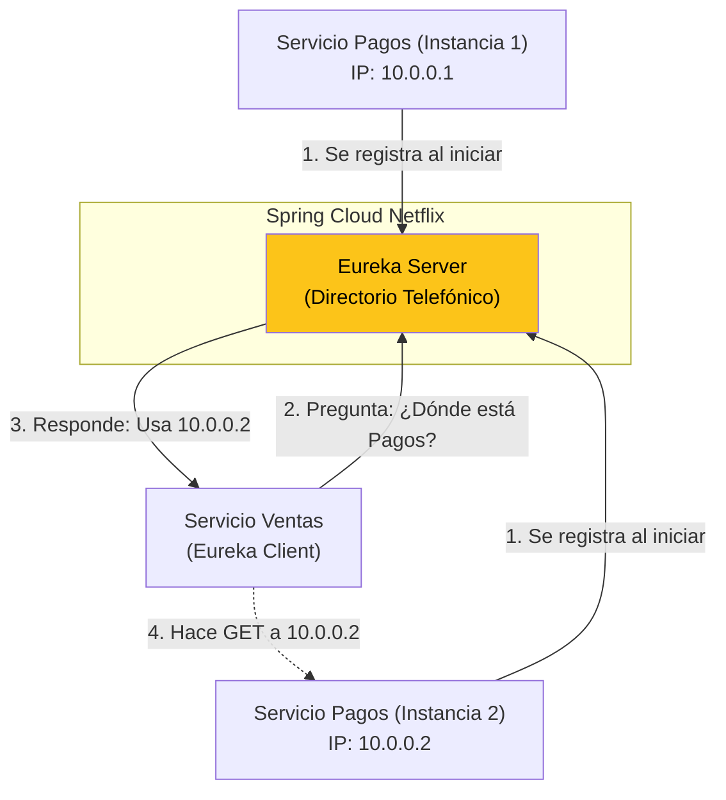

## 41 — Arquitectura de Microservicios (Spring Cloud Netflix Eureka)

### Propósito
Comprender las bases de un ecosistema de Microservicios y aprender a implementar el patrón de **Service Discovery (Descubrimiento de Servicios)** utilizando Netflix Eureka, permitiendo que docenas de microservicios se encuentren y se comuniquen entre sí sin hardcodear direcciones IP.

### Problema que resuelve
En un ecosistema pequeño, si el Servicio A necesita llamar al Servicio B, puedes poner `http://localhost:8081` o `http://192.168.1.5:8080` en tu `application.yml`.
**El infierno comienza en Producción escalable:**
- El Servicio B tiene mucho tráfico y Kubernetes levanta 5 copias (Instancias) del Servicio B, cada una con una IP dinámica y aleatoria distinta.
- ¿A qué IP debería llamar el Servicio A? 
- Si hardcodeas IPs o URLs, tu sistema colapsará cuando las máquinas se reinicien o se escalen dinámicamente. 

### Cómo lo resuelve
Introducimos un **Registro Central (El Service Discovery)**, similar a un directorio telefónico amarillo.
1. Cuando una nueva instancia del Servicio B se enciende (no importa su IP), llama inmediatamente al Directorio Telefónico y dice: *"Hola, soy el Servicio B y estoy en la IP 10.0.0.5"*.
2. Cuando el Servicio A quiere llamar al Servicio B, no usa una IP. Llama al directorio y pregunta: *"Dame una IP válida del Servicio B"*.
3. El directorio (Eureka) le devuelve la IP, y además, si hay 5 instancias, las balancea (Load Balancing) para no sobrecargar a una sola máquina.

### Por qué aprenderlo
A pesar de que infraestructuras como Kubernetes (Módulo 48) ofrecen su propio mecanismo de DNS y Service Discovery, dominar Eureka (Client-Side Load Balancing) es fundamental para entender cómo nacieron los microservicios modernos y es ampliamente utilizado en entornos Legacy y Cloud-Native que no dependen exclusivamente de K8s, como migraciones en AWS puro (EC2) o Spring Cloud.



---

### Glosario Básico

#### `Eureka Server`
La aplicación de Spring Boot (servidor independiente) que funciona única y exclusivamente como el registro/directorio. Tiene un panel de control web.

#### `Eureka Client`
Cualquier microservicio tuyo (Ventas, Pagos, Inventario) que se va a conectar al Server para decir "Estoy vivo" o para preguntar por otro servicio.

#### `Client-Side Load Balancing`
En lugar de tener un NGINX central balanceando el tráfico (Server-Side), cada Microservicio A tiene una pequeña librería inteligente descargada (el Eureka Client) que tiene la lista de todas las IPs del Servicio B. El Servicio A elige la IP usando Round-Robin en su propia memoria antes de hacer la petición HTTP.

#### `Heartbeat` (Latido)
Cada cliente Eureka envía un ping al Servidor cada 30 segundos. Si el Servidor no recibe el ping por 90 segundos, asume que el microservicio murió y lo borra del directorio telefónico.

---

### Conceptos

#### 1. Levantando el Eureka Server
- **Qué es** — Es un microservicio Spring Boot vacío, cuya única labor es ser el Directorio.
- **Código** — (En el proyecto `eureka-server`):
  ```xml
  <dependency>
      <groupId>org.springframework.cloud</groupId>
      <artifactId>spring-cloud-starter-netflix-eureka-server</artifactId>
  </dependency>
  ```
  ```java
  @SpringBootApplication
  @EnableEurekaServer // Convierte tu app vacía en un Servidor Eureka
  public class EurekaServerApplication {
      public static void main(String[] args) {
          SpringApplication.run(EurekaServerApplication.class, args);
      }
  }
  ```
  ```yaml
  # application.yml del Server
  server:
    port: 8761 # Puerto estándar de Eureka
  eureka:
    client:
      # Un servidor Eureka por defecto intenta registrarse a sí mismo buscando OTROS servidores.
      # Como estamos en desarrollo (1 solo servidor), lo apagamos para evitar errores en consola.
      register-with-eureka: false
      fetch-registry: false
  ```

#### 2. Configurando un Microservicio (Eureka Client)
- **Qué es** — Tu microservicio de negocio real. Solo requiere una dependencia y un nombre.
- **Código** — (En tu microservicio de Ventas y Pagos):
  ```xml
  <dependency>
      <groupId>org.springframework.cloud</groupId>
      <artifactId>spring-cloud-starter-netflix-eureka-client</artifactId>
  </dependency>
  ```
  ```yaml
  # application.yml del Cliente
  spring:
    application:
      name: servicio-pagos # EL NOMBRE ES VITAL. Así te buscarán en el directorio.
  server:
    port: 8081 # Cada servicio en un puerto distinto
  eureka:
    client:
      service-url:
        defaultZone: http://localhost:8761/eureka/ # Dónde está el servidor
  ```

#### 3. Llamadas HTTP entre Servicios usando el Nombre
- **Qué es** — Ahora el Servicio A quiere llamar al Servicio B. Ya no usa localhost, usa el `application.name`.
- **Código** — Configuración del RestClient con Balanceador de Carga:
  ```java
  @Configuration
  public class RestConfig {
  
      // La anotación @LoadBalanced inyecta un interceptor al cliente HTTP.
      // Cuando veas un dominio HTTP, buscará ese dominio en Eureka en lugar de ir a Internet.
      @Bean
      @LoadBalanced
      public RestClient.Builder loadBalancedRestClientBuilder() {
          return RestClient.builder();
      }
  }
  ```
  ```java
  @Service
  public class VentasService {
      
      private final RestClient restClient;
      
      public VentasService(RestClient.Builder builder) {
          // NO pones IPs. Pones "http://{nombre-del-servicio}/..."
          this.restClient = builder.baseUrl("http://servicio-pagos").build();
      }
      
      public String verificarPago() {
          return restClient.get()
                  .uri("/api/pagos/estado")
                  .retrieve()
                  .body(String.class);
      }
  }
  ```

#### 4. Edge Cases y Errores Comunes

| Error | Causa | Solución |
|-------|-------|----------|
| Excepción de red al iniciar cliente | El cliente inicia ANTES que el Eureka Server, y no lo encuentra. | Eureka está diseñado para tolerar esto. El cliente lanzará excepciones rojas, pero seguirá intentando conectarse cada 30 segundos de forma resiliente. Para desarrollo, simplemente levanta el Server primero. |
| `java.net.UnknownHostException: servicio-pagos` | Usaste `RestClient` o `RestTemplate` puro, olvidando anotar su `@Bean` con `@LoadBalanced`. | Java nativo intentará buscar "servicio-pagos.com" en los DNS de Google. Sin el interceptor `@LoadBalanced`, Spring no sabe que tiene que traducir el nombre usando el directorio local de Eureka. |
| Lentitud extrema la primera vez | Eureka Client descarga la lista de IPs a su memoria local y la cachea. | El descubrimiento completo puede tardar hasta 3 minutos en ambientes de desarrollo mientras los heartbeats se sincronizan. Sé paciente al arrancar tu cluster de microservicios. |

---

### Ejercicios
1. Crea un proyecto `eureka-server` vacío. Añade `@EnableEurekaServer` y el puerto 8761. Inícialo. Visita `http://localhost:8761` para ver el hermoso dashboard naranja de Eureka.
2. Crea un proyecto `servicio-empleados` en el puerto 8081 (Client). En su controlador, crea un `GET /empleados` que retorne una lista.
3. Crea un proyecto `servicio-recursos-humanos` en el puerto 8082 (Client). Añade el Bean `RestClient.Builder` anotado con `@LoadBalanced`.
4. Haz que RRHH llame al API de empleados usando `http://servicio-empleados/empleados`.
5. Inicia los 3 proyectos. Ve al Dashboard de Eureka (8761) y asegúrate de que ambos servicios aparecen en la tabla de "Instances currently registered". Prueba el endpoint de RRHH y maravíllate de la magia del enrutamiento dinámico.

### Cómo ejecutar
Debes abrir 3 terminales distintas y ejecutarlas en este orden:

```bash
# Terminal 1:
cd 41-microservicios/eureka-server
mvn spring-boot:run

# Terminal 2:
cd 41-microservicios/servicio-pagos
mvn spring-boot:run

# Terminal 3:
cd 41-microservicios/servicio-ventas
mvn spring-boot:run
```

### Archivos del Proyecto
| Archivo | Propósito |
|---------|-----------|
| `eureka-server/pom.xml` | Proyecto servidor Registry. |
| `servicio-pagos/application.yml` | Cliente registrándose bajo el nombre `servicio-pagos`. |
| `servicio-ventas/config/RestClientConfig.java` | Inyección de `@LoadBalanced RestClient.Builder`. |
| `servicio-ventas/service/IntegracionService.java` | Llamada inter-servicio transparente sin hardcodear IPs. |
