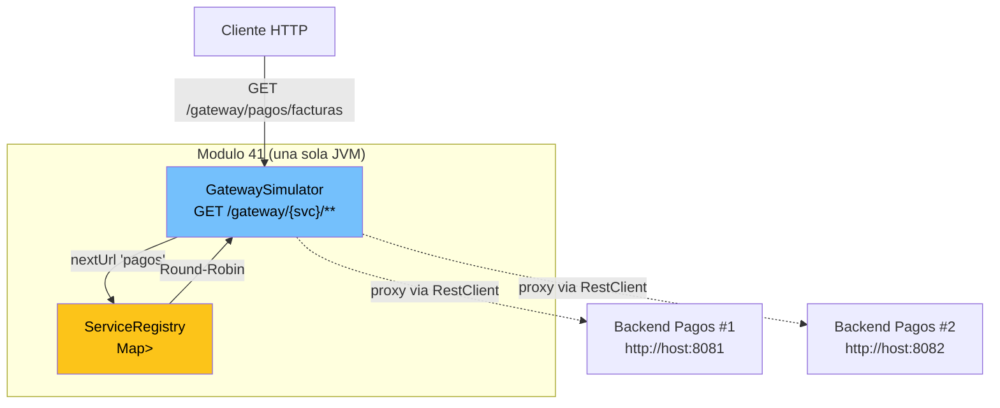

## 41 — Arquitectura de Microservicios (DEMO simplificado)

> ⚠️ **Nota critica de compatibilidad:** Spring Cloud (Eureka + Gateway + Resilience4j)
> **NO es compatible con Spring Boot 4.1.0** al momento de escribir este modulo. Los
> releases de Spring Cloud 2024.x/2025.x siguen basados en Spring Boot 3.x
> (ver `MEMORY.md`, modulos 29 y 30). Por eso este modulo implementa una
> **simulacion pedagogica in-memory** de Service Discovery + API Gateway, para
> que aprendas el patron sin depender de librerias no publicadas todavia. Cuando
> Spring Cloud publique version para Boot 4, este modulo se reescribira con
> Eureka + Spring Cloud Gateway reales.

### Proposito
Comprender los tres pilares de un ecosistema de microservicios:
1. **Service Discovery** (registro central de instancias).
2. **Client-Side Load Balancing** (Round-Robin sobre las URLs registradas).
3. **API Gateway** (punto de entrada unico que enruta por nombre de servicio).

### Problema que resuelve
En un monolito, todo esta en la misma JVM y las llamadas son metodos Java. En
microservicios, cada modulo es un proceso independiente con su propia IP y su
propio ciclo de vida. Necesitas resolver:
- ¿Como encuentra el Servicio A al Servicio B si su IP cambia cada vez que
  Kubernetes lo reinicia?
- ¿Como reparto la carga entre las 3 instancias de B sin sobrecargar una sola?
- ¿Como expongo un unico endpoint al mundo exterior en vez de 20 puertos?

### Como lo resuelve
- **`ServiceRegistry`**: un `Map<nombre, List<URL>>` (in-memory) que actua como
  Eureka. Los servicios se registran via `POST /registry?name=X&url=Y`.
- **Round-Robin**: cada consulta a `nextUrl(name)` rota un `AtomicInteger` para
  devolver una URL distinta y balancear la carga sin sincronizar hilos.
- **`GatewaySimulator`**: expone `GET /gateway/{service}/**` y proxifica la
  peticion usando `RestClient` (API moderna que reemplaza `RestTemplate`).

### Por que aprenderlo
Aunque en produccion usarias Eureka, Consul o el DNS interno de Kubernetes,
**la logica es exactamente la misma**: un directorio + un balanceador +
un proxy. Ver los tres componentes en 3 archivos de Java desmitifica el tema.



---

### Glosario Basico

#### `Service Discovery`
Patron donde los servicios se registran en un directorio central y otros
servicios consultan ese directorio para encontrarlos. Evita hardcodear IPs.

#### `Client-Side Load Balancing`
El cliente (aca el `GatewaySimulator`) tiene la lista de todas las instancias
del servicio destino y elige una localmente (Round-Robin). No hay balanceador
externo (NGINX) en el medio.

#### `API Gateway`
Un unico punto de entrada al ecosistema. En vez de exponer 20 microservicios en
20 puertos, expones el gateway y este enruta por path/nombre.

#### `Round-Robin`
Estrategia de balanceo mas simple: la llamada N va a la instancia `N % total`.
Todos reciben la misma cantidad de trafico.

#### `RestClient`
Cliente HTTP fluido de Spring Framework 6+ que reemplaza a `RestTemplate`. En
Boot 4 es el estandar. Se construye con `RestClient.create()`.

---

### Conceptos

#### 1. Registro de Servicios (Service Discovery)
- **Que es** — Un Map en memoria `nombre -> [urls]` protegido con
  `ConcurrentHashMap` para acceso concurrente.
- **Por que importa** — Es el nucleo de todo microservicio moderno. Kubernetes,
  Eureka, Consul y Zookeeper hacen esto mismo con mas features (heartbeat,
  health checks, TTL).
- **Codigo:**
  ```java
  services.computeIfAbsent(name, k -> new ArrayList<>()).add(url);
  ```
- **Analogia** — El mapa del centro comercial en la entrada.
- **Casos de uso empresariales** — Marketplaces con auto-scaling, arquitecturas
  cloud-native, migracion desde monolito con Strangler Fig.

#### 2. Round-Robin con `AtomicInteger`
- **Que es** — Un contador atomico por servicio que rota el indice de la URL
  elegida en cada llamada.
- **Por que importa** — Sin el `Atomic`, dos hilos podrian devolver la misma
  URL y desbalancear el trafico.
- **Codigo:**
  ```java
  int idx = Math.floorMod(counter.getAndIncrement(), urls.size());
  ```
- **Analogia** — La cola del banco: cada cliente va al cajero que sigue.

#### 3. Gateway con `RestClient`
- **Que es** — Un controller que captura `/gateway/{svc}/**`, pregunta al
  registry por una URL y reenvia la peticion con `RestClient`.
- **Codigo:**
  ```java
  String body = restClient.get().uri(targetUrl).retrieve().body(String.class);
  ```
- **Casos de uso empresariales** — Backend-for-Frontend (BFF), edge services,
  API composition.

---

### Antes vs Ahora

| Concepto              | ANTES (Java 8 / Spring 4)                                      | AHORA (Java 21 / Spring Boot 4.1) |
|-----------------------|----------------------------------------------------------------|-----------------------------------|
| Cliente HTTP          | `new RestTemplate().getForObject(url, String.class)`           | `RestClient.create().get().uri(url).retrieve().body(String.class)` |
| Map put-if-absent     | `if (m.get(k)==null) m.put(k, new ArrayList<>()); m.get(k).add(v);` | `m.computeIfAbsent(k, x -> new ArrayList<>()).add(v);` |
| Lista inmutable vacia | `Collections.<String>emptyList()`                              | `List.of()`                       |
| Mapa literal          | `Map<String,Object> m = new HashMap<>(); m.put("ok", true);`   | `Map.of("ok", true)`              |
| Contador thread-safe  | `synchronized(this) { i++; }`                                  | `atomicInt.getAndIncrement()`     |
| Test de controller    | `@WebMvcTest` + `MockMvc` autoinyectado                        | `MockMvcBuilders.standaloneSetup(new Ctrl(deps)).build()` (obligatorio en Boot 4.1.0) |

---

### FAQ del Alumno

- **¿Por que no usamos Eureka directamente?**
  Porque `spring-cloud-starter-netflix-eureka-server` version 2024.x/2025.x
  sigue exigiendo Spring Boot 3.x. En Boot 4.1.0 no arranca. Cuando salga la
  version compatible, este modulo se migrara.

- **¿Esto sirve en produccion?**
  No. Es una demo pedagogica. Le faltan: heartbeat, health checks, expiracion
  por TTL, persistencia, replicacion multi-nodo, HTTPS, autenticacion, retries,
  circuit breakers. En prod se usa Kubernetes DNS, Consul o Eureka de verdad.

- **¿Por que el gateway solo soporta GET?**
  Por simplicidad. Reenviar POST/PUT con body, headers y multipart requiere
  bastante mas codigo (leer el `HttpServletRequest.getInputStream()`, propagar
  content-type, etc.). Spring Cloud Gateway lo hace por ti con `RouteLocator`.

- **¿Que pasa si registro la misma URL dos veces?**
  Se guarda dos veces y el Round-Robin la elegira mas seguido. Eureka real
  deduplica por `instanceId`.

- **¿Por que `Math.floorMod` y no `%`?**
  Cuando el `AtomicInteger` desborda a negativo, `%` puede devolver un indice
  negativo. `Math.floorMod` siempre devuelve un valor no-negativo.

- **¿Cual es la diferencia entre este gateway y un NGINX?**
  NGINX es un proxy externo (server-side load balancing) configurado con
  ficheros. Este es un proxy interno de la JVM que descubre servicios en
  runtime (client-side).

---

### Ejercicios

1. Agrega un endpoint `DELETE /registry?name=X&url=Y` que desregistre una URL.
2. Cambia el Round-Robin por una estrategia **aleatoria** usando
   `ThreadLocalRandom`.
3. Agrega soporte para POST en el `GatewaySimulator` (lee el body y propagalo).
4. Agrega un `Scheduled` que cada 30s elimine URLs que no hayan enviado un
   "heartbeat" (`POST /registry/heartbeat?url=...`) en los ultimos 90s.
5. Cuando Spring Cloud publique version para Boot 4, migra este modulo a
   Eureka + Spring Cloud Gateway reales.

---

### Como ejecutar

```powershell
# PowerShell (Windows)
./build.ps1
java -jar target/microservicios-1.0.0.jar
```

```bash
# Git Bash / WSL
./build.sh
java -jar target/microservicios-1.0.0.jar
```

Probar de punta a punta:
```bash
# 1) Levantar un backend de prueba en otro puerto (ejemplo: httpbin en 8081).
# 2) Registrarlo:
curl -X POST "http://localhost:8080/registry?name=demo&url=http://localhost:8081"
# 3) Listar:
curl http://localhost:8080/registry
# 4) Proxificar por el gateway:
curl http://localhost:8080/gateway/demo/get
```

---

### Archivos del Proyecto

| Archivo | Rol |
|---------|-----|
| `pom.xml` | Coordenadas Maven, Spring Boot 4.1.0, Java 21, `finalName=microservicios-1.0.0`. |
| `build.ps1` / `build.sh` | Scripts portables con `../jdk-21.0.11+10` + `../apache-maven-3.9.16`. |
| `src/main/resources/application.yml` | Puerto 8080 y nombre logico de la app. |
| `MicroserviciosApplication.java` | Bootstrap Spring Boot. |
| `registry/ServiceRegistry.java` | Directorio in-memory + Round-Robin thread-safe. |
| `registry/ServiceDiscoveryController.java` | Endpoints REST `POST/GET /registry`. |
| `gateway/GatewaySimulator.java` | Proxy `GET /gateway/{service}/**` via `RestClient`. |
| `MicroserviciosApplicationTests.java` | `contextLoads` obligatorio. |
| `registry/ServiceRegistryTest.java` | Test unitario puro: register + Round-Robin + servicio inexistente. |
| `registry/ServiceDiscoveryControllerTest.java` | MockMvc **standalone** (obligatorio en Boot 4.1.0). |
