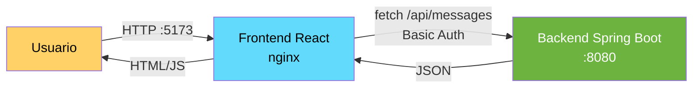

# 43 — Spring Boot 4 + React 19

## Proposito
Aprender el patron **API First**: un backend Spring Boot 4 expone una API REST y un
frontend React 19 (SPA) la consume. Backend y frontend se despliegan por separado
y se orquestan con Docker Compose.

## Problema que resuelve
Antes se mezclaba HTML (JSP) con logica Java en un unico WAR desplegado en Tomcat.
Cualquier cambio de UI obligaba a redeployar el backend, y el equipo frontend
dependia del ciclo del equipo backend. Ademas, no era posible reutilizar la misma
API para movil, otra web o integraciones B2B.

## Como lo resuelve
- **Backend**: JAR Spring Boot expone JSON en `/api/messages`. Sin HTML.
- **Frontend**: React 19 (Vite) — SPA independiente que consume el JSON con `fetch`.
- **CORS**: habilitado en el backend para los orígenes de Vite (5173) y CRA (3000).
- **Seguridad**: GET publico, POST con Basic Auth (`demo/demo123`) para demostrar
  autenticacion cross-origin.
- **Docker Compose**: dos servicios independientes (backend + nginx).

## Por que aprenderlo
Es la arquitectura estandar en la industria hoy. Casi todas las apps modernas
separan API + SPA. Aprenderlo aqui te permite despues cambiar React por Angular,
Vue, Flutter o una app iOS sin tocar el backend.

## Diagrama



## Glosario Basico

| Termino | Definicion |
|---------|-----------|
| **SPA** | Single Page Application. La navegacion no recarga la pagina; JS actualiza el DOM. |
| **CORS** | Cross-Origin Resource Sharing. Permite que un origen (React :5173) pida datos a otro (Spring :8080). |
| **Basic Auth** | Autenticacion HTTP simple: `Authorization: Basic base64(user:pass)`. |
| **Vite** | Build tool moderno para React (rapido, con HMR). |
| **Proxy dev** | Vite redirige `/api` al backend, evitando CORS en desarrollo. |
| **record** | Clase inmutable en Java 21 con constructor/accessors/equals auto-generados. |
| **@RestController** | Combina `@Controller` + `@ResponseBody`: cada metodo devuelve JSON. |

## Conceptos

### 1. Separacion Backend/Frontend
- **Que es**: dos deploys distintos, dos repos (o dos carpetas), dos ciclos de release.
- **Por que importa**: independencia de equipos y de tecnologias.
- **Analogia**: un restaurante donde la cocina (backend) y el salon (frontend) son
  edificios distintos conectados por telefono (HTTP).
- **Caso empresarial**: banco con app web + app iOS + app Android + terminales del cajero,
  todos consumiendo la misma API REST.

### 2. CORS
- **Que es**: mecanismo del navegador que bloquea peticiones cross-origin salvo que
  el servidor devuelva `Access-Control-Allow-Origin`.
- **Por que importa**: sin CORS el frontend en :5173 no puede leer respuestas del
  backend en :8080.
- **Solucion en dev**: proxy de Vite (recomendado, ver `frontend/README.md`).
- **Solucion en prod**: `WebMvcConfigurer` + `@CrossOrigin`, o mejor, un reverse proxy
  (NGINX / API Gateway) que sirve backend y frontend del mismo origen.

### 3. Basic Auth
- **Que es**: `Authorization: Basic <base64(user:pass)>`.
- **Por que importa**: es el mecanismo mas simple para demostrar autenticacion API.
- **Caso empresarial**: se usa poco en produccion (mejor JWT/OAuth2, modulos 14/34).
  Aqui es didactico.

## Antes vs Ahora

| Aspecto | Antes (JSP + Tomcat) | Ahora (React + REST) |
|---------|----------------------|----------------------|
| Rendering | HTML generado en servidor | HTML servido estatico, DOM actualizado por JS |
| Sesion | `HttpSession` con cookie `JSESSIONID` | Stateless (Basic Auth / JWT) |
| Despliegue | 1 WAR con backend + frontend | JAR backend + `dist/` frontend independientes |
| Cambio de UI | Rebuild + redeploy del WAR | `npm run build` y actualizar estaticos |
| Reutilizacion API | No — JSP acoplado a servidor | Si — misma API sirve movil, web, B2B |
| Codigo Java del DTO | POJO con 30 lineas de boilerplate | `record Message(Long id, String text)` |
| Iterar lista | `for (Message m : list) {...}` | `list.stream().map(...).toList()` |

## FAQ del Alumno

- **¿Que es un endpoint?** Una URL + metodo HTTP. Ej: `GET /api/messages`.
- **¿Por que dos puertos (8080 y 5173)?** Porque son dos procesos distintos:
  Spring escucha en 8080, Vite en 5173. En prod se unifican con NGINX.
- **¿Que es CORS en 10 palabras?** El navegador bloquea llamadas entre puertos
  distintos salvo permiso explicito.
- **¿Por que Basic Auth y no JWT?** Aqui aprendemos separacion frontend/backend.
  JWT esta en el modulo 14 y 34 (OAuth2).
- **¿Que es un `record`?** Una clase inmutable con constructor, getters, equals
  auto-generados. Reemplaza al POJO de Java 8.
- **¿Como pruebo el POST con curl?**
  ```bash
  curl -u demo:demo123 -X POST http://localhost:8080/api/messages \
       -H "Content-Type: application/json" \
       -d '{"text":"hola desde curl"}'
  ```
- **¿Por que `@CrossOrigin` Y `CorsConfig`?** Redundancia didactica: la anotacion
  muestra la intencion en el controller; `CorsConfig` muestra la config global
  reusable.

## Ejercicios

1. Agrega un endpoint `DELETE /api/messages/{id}` que borre un mensaje (requiere auth).
2. Cambia Basic Auth por un header `X-API-Key` fijo.
3. Anade un rol `ADMIN` que sea el unico que puede borrar.
4. Migra el frontend a usar JWT (modulo 14) en lugar de Basic Auth.
5. Escribe un test que verifique que POST con auth valida crea el mensaje (201).

## Como ejecutar

### Solo backend (desarrollo)

```powershell
# PowerShell
./build.ps1
$env:JAVA_HOME = "$PWD\..\jdk-21.0.11+10"
& "$env:JAVA_HOME\bin\java.exe" -jar backend/target/spring-react-1.0.0.jar
```

```bash
# Git Bash
./build.sh
java -jar backend/target/spring-react-1.0.0.jar
```

### Frontend (desarrollo)

Sigue las instrucciones en `frontend/README.md`.

### Todo con Docker Compose

```bash
docker compose up --build
# Backend  -> http://localhost:8080/api/messages
# Frontend -> http://localhost:5173
```

Detener:

```bash
docker compose down
```

## Archivos del Proyecto

| Archivo | Proposito |
|---------|-----------|
| `backend/pom.xml` | Coordenadas Maven, dependencias Boot 4.1.0 (web + security + test). |
| `backend/src/main/java/.../SpringReactApplication.java` | Entry point de Spring Boot. |
| `backend/src/main/java/.../domain/Message.java` | Record inmutable del dominio. |
| `backend/src/main/java/.../controller/MessageController.java` | Endpoints GET/POST `/api/messages`. |
| `backend/src/main/java/.../config/SecurityConfig.java` | GET publico, POST con Basic Auth. |
| `backend/src/main/java/.../config/CorsConfig.java` | CORS para orígenes React. |
| `backend/src/main/resources/application.yml` | Puerto 8080, niveles de log. |
| `backend/src/test/java/.../SpringReactApplicationTests.java` | Test `contextLoads`. |
| `backend/src/test/java/.../controller/MessageControllerTest.java` | MockMvc: GET 200 + CORS, POST 401. |
| `backend/Dockerfile` | Multi-stage: build con JDK, runtime con JRE. |
| `frontend/README.md` | Guia para generar el proyecto Vite + React 19. |
| `frontend/Dockerfile` | Multi-stage: build con Node, serve con nginx. |
| `docker-compose.yml` | Orquesta backend + frontend. |
| `build.sh` / `build.ps1` | Compilan SOLO el backend con toolchain portable. |
