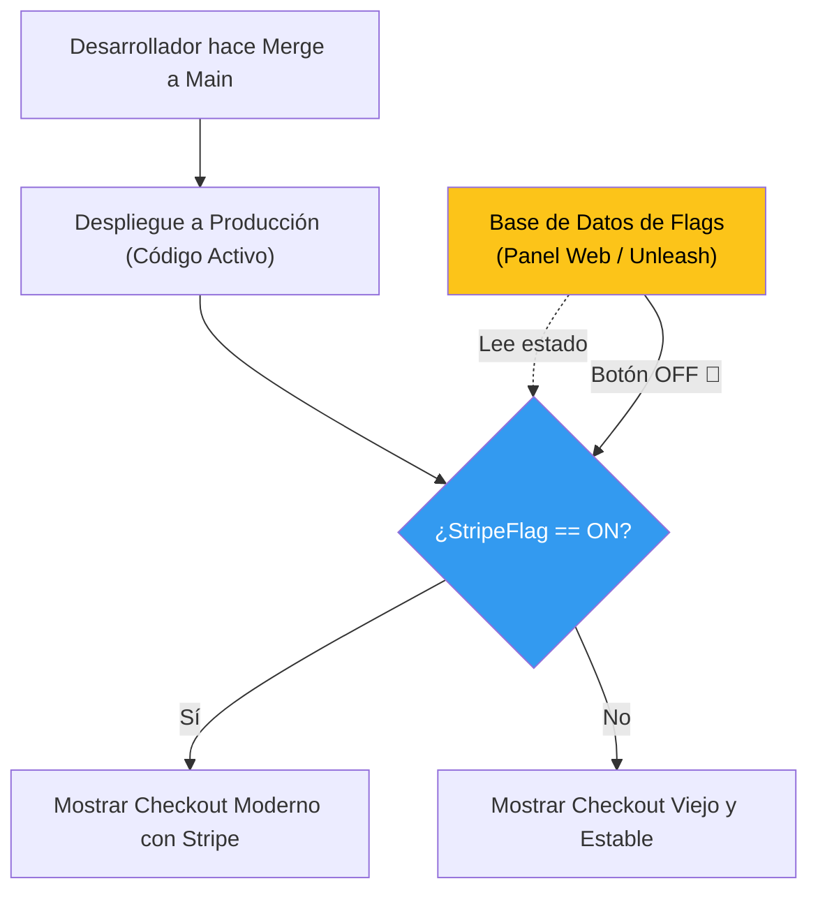

## 46 — Feature Flags (Toggles) y Despliegues Seguros

### Propósito
Aprender a desacoplar el "Despliegue del Código" de la "Liberación del Producto" (Release) utilizando Feature Flags. Cambiar el comportamiento de tu aplicación en Producción en tiempo real sin necesidad de reiniciar servidores o hacer nuevos deploys.

### Problema que resuelve
En un ciclo de desarrollo tradicional:
1. El equipo termina una nueva funcionalidad (Ej: "Nueva pasarela de pago Stripe").
2. Se hace un `merge` a `main` y se despliega a Producción.
3. Se descubre un bug catastrófico. La empresa está perdiendo dinero.
4. El equipo tiene que hacer un "Rollback", lo cual significa volver a compilar el código viejo, hacer un nuevo deploy, y rezar para que no haya conflictos de base de datos. Tardaron 30 minutos. Pérdida masiva.

### Cómo lo resuelve
Con **Feature Flags** (Interruptores de características), el código nuevo sube a Producción envuelto en un condicional `if (banderaEncendida)`.
1. Subes el código a Producción, pero la bandera está `APAGADA` por defecto. Los usuarios no ven nada.
2. El viernes por la tarde, entras a un panel de control (Ej: Unleash, Togglz, LaunchDarkly) y le das click a "Encender".
3. Inmediatamente la funcionalidad está activa. Si hay un bug, le das click a "Apagar". La funcionalidad desaparece en **1 milisegundo**. Cero pánico, cero rollbacks, cero impacto.

### Por qué aprenderlo
Las empresas TOP (Netflix, Amazon, Google) no usan ramas gigantescas (`feature-branches`) que duran meses. Usan **Trunk-Based Development**, donde todo se sube a `main` a diario, protegido por Feature Flags. Conocer esto te permite hacer integraciones continuas reales y seguras, así como **Canary Releases** (activar la pasarela de pagos solo para el 5% de los usuarios).



---

### Glosario Básico

#### `Feature Flag` (Feature Toggle)
Una variable de configuración booleana (o de porcentaje) que puede ser cambiada dinámicamente sin reiniciar la aplicación, usada para activar o desactivar porciones de código.

#### `Trunk-Based Development`
Estrategia de Git donde los desarrolladores integran todo su código directamente a la rama `main` (trunk) varias veces al día, en vez de mantener ramas vivas por semanas. Todo el código sin terminar se esconde tras un Feature Flag.

#### `Canary Release` / `A-B Testing`
Estrategias avanzadas. Un Canary (Canario en la mina de carbón) implica encender el flag solo para un grupo de usuarios selectos (Ej: los del país Chile, o el 5% aleatorio del tráfico). Si algo sale mal, el 95% restante no fue afectado.

#### `Unleash` / `Togglz` / `FF4J`
Frameworks y productos dedicados a la gestión de Feature Flags. Spring Boot se integra maravillosamente con ellos.

---

### Conceptos

#### 1. Implementación Nativa de Spring (Uso de Togglz)
- **Qué es** — Togglz es una librería Java open-source diseñada exactamente para este propósito.
- **Código** — (Añadir dependencias en `pom.xml`):
  ```xml
  <dependency>
      <groupId>org.togglz</groupId>
      <artifactId>togglz-spring-boot-starter</artifactId>
      <version>3.3.3</version>
  </dependency>
  <dependency>
      <groupId>org.togglz</groupId>
      <artifactId>togglz-console</artifactId> <!-- Para tener un panel web local -->
  </dependency>
  ```
  **Declarar los Toggles como un Enum:**
  ```java
  public enum MyFeatures implements Feature {
  
      @Label("Nueva Interfaz de Pagos Stripe")
      NEW_PAYMENT_GATEWAY,
  
      @EnabledByDefault
      @Label("Notificaciones por SMS")
      SMS_NOTIFICATIONS;
  
      public boolean isActive() {
          return FeatureContext.getFeatureManager().isActive(this);
      }
  }
  ```

#### 2. Uso en el Código (Lógica de Negocio)
- **Qué es** — Simplemente envolvemos las reglas de negocio en un if/else basado en el Enum.
- **Código**:
  ```java
  @Service
  public class PaymentService {
  
      public void processPayment(Order order) {
          if (MyFeatures.NEW_PAYMENT_GATEWAY.isActive()) {
              log.info("Procesando con la nueva pasarela (Stripe)");
              // Lógica arriesgada y nueva...
          } else {
              log.info("Procesando con la pasarela vieja y confiable (Paypal)");
              // Lógica de siempre...
          }
      }
  }
  ```

#### 3. Uso en Controladores (Endpoint Toggles)
- **Qué es** — Quieres bloquear completamente un Endpoint para que nadie lo pueda usar a menos que el Flag esté activo.
- **Código**:
  ```java
  @RestController
  @RequestMapping("/api/beta")
  public class BetaFeaturesController {
  
      @GetMapping("/reports")
      public ResponseEntity<String> getReports() {
          if (!MyFeatures.NEW_PAYMENT_GATEWAY.isActive()) {
              // Devuelve 404 (Para el mundo, el endpoint simplemente no existe)
              return ResponseEntity.notFound().build();
          }
          
          return ResponseEntity.ok("Estos son los nuevos reportes!");
      }
  }
  ```

#### 4. Panel de Administración (Togglz Console)
Togglz provee automáticamente una consola web en `http://localhost:8080/togglz-console`. Desde allí, cualquier persona de Producto (no un programador) puede entrar, ver los interruptores y encender o apagar funcionalidades en caliente. 

*Nota Corporativa:* Por defecto, Togglz almacena el estado en memoria. En producción, debes conectarlo a una base de datos (Ej: Tabla `togglz` en PostgreSQL) a través de un `StateRepository` para que si tienes 5 microservicios idénticos, todos compartan el mismo estado de la bandera.

#### 5. Edge Cases y Errores Comunes

| Error | Causa | Solución |
|-------|-------|----------|
| Deuda Técnica Acumulada | Han pasado 2 años y el código está lleno de `if (MyFeatures.NUEVO)`. Ya nadie usa el código viejo. | Los Feature Flags son **efímeros**. Una vez que el flag lleva 2 meses en producción 100% estable y activo, debes crear un Ticket técnico (Issue) para **eliminar el Flag**, borrar el código viejo (else) y dejar el código nuevo de forma permanente. |
| Inconsistencia de Estado (Flaky Features) | Tienes 3 servidores (Nodos) corriendo la aplicación. Enciendes el flag y algunos usuarios lo ven y otros no. | Almacenaste el estado en memoria o en un archivo properties estático. Asegúrate de usar un repositorio centralizado de estado para los flags (Ej: Redis State Repository o JDBC State Repository). |
| Flags de Base de Datos | Cambiaste el código con un Flag, pero ese código requería agregar una columna `NUEVA_COL` a la tabla. Si apagas el Flag, ¿qué pasa con la columna? | Los Flags **NO deshacen migraciones de base de datos** (Flyway). El código viejo debe ser capaz de ignorar columnas nuevas pacíficamente. Separa los cambios destructivos de DB (borrar tablas) de las migraciones de Features. |

---

### Ejercicios
1. Crea un proyecto web y añade las dependencias de `togglz-spring-boot-starter` y `togglz-console`.
2. Define un Enum `AppFlags` que implemente la interfaz `Feature`. Agrega un flag `PROMO_NAVIDAD`.
3. Crea un `@RestController` que devuelva un saludo normal si el flag está inactivo, y un mensaje festivo si el flag está activo.
4. Levanta la aplicación. Visita la consola en `/togglz-console`. Desactiva la seguridad de la consola temporalmente en tu `application.yml` (`togglz.console.secured=false`).
5. Haz GET al endpoint y verifica el saludo normal. Luego en la consola, enciende `PROMO_NAVIDAD`, vuelve a hacer GET, y maravíllate viendo cómo cambió la lógica en tiempo real sin reiniciar Spring Boot.

### Cómo ejecutar
```bash
cd 46-feature-flags
mvn spring-boot:run

# Probar estado apagado
curl http://localhost:8080/api/saludo

# Abre tu navegador en http://localhost:8080/togglz-console y enciende el flag.
# Vuelve a correr el comando curl.
```

### Archivos del Proyecto
| Archivo | Propósito |
|---------|-----------|
| `pom.xml` | Dependencias de Togglz Framework. |
| `config/MyFeatures.java` | Definición centralizada del catálogo de Feature Flags. |
| `controller/PromoController.java` | Lógica de bifurcación basada en el estado de la bandera. |
| `application.yml` | Desactivar protección nativa del dashboard de Togglz para pruebas locales. |
