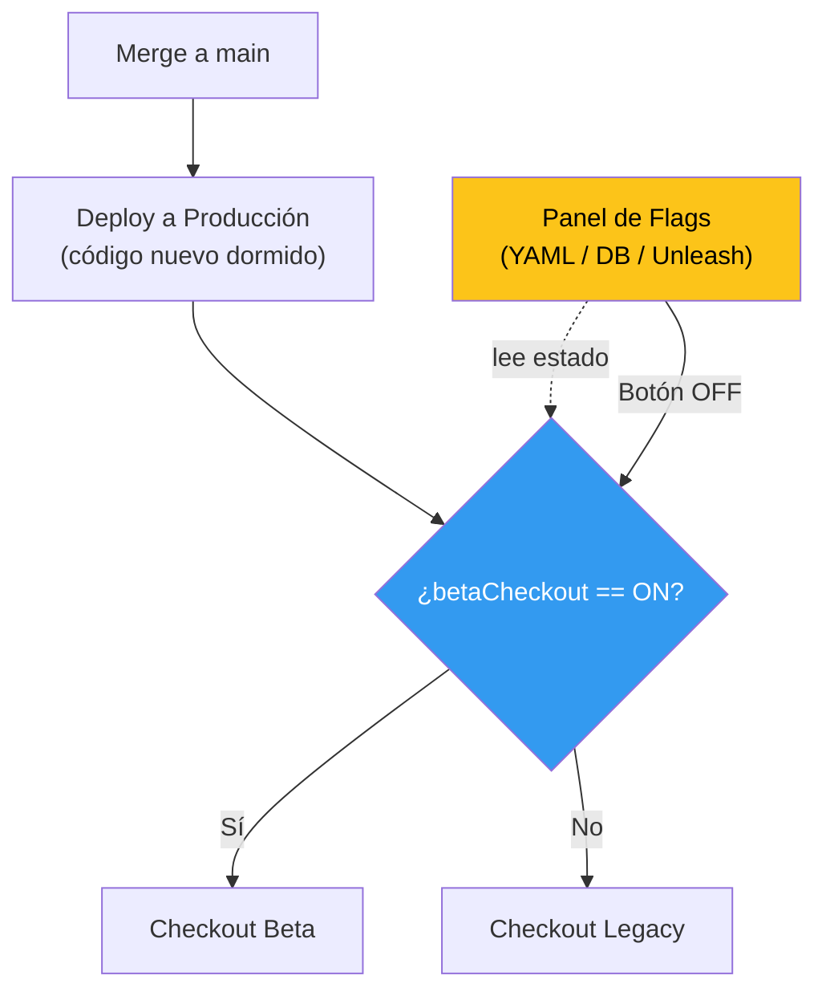

## 46 — Feature Flags (Toggles) y Despliegues Seguros

### Propósito
Aprender a desacoplar el "Despliegue del Código" de la "Liberación del Producto" (Release) utilizando Feature Flags. Cambiar el comportamiento de tu aplicación en Producción en tiempo real sin necesidad de reiniciar servidores o hacer nuevos deploys.

### Problema que resuelve
En un ciclo de desarrollo tradicional:
1. El equipo termina una nueva funcionalidad (Ej: "Nueva pasarela de pago Stripe").
2. Se hace un `merge` a `main` y se despliega a Producción.
3. Se descubre un bug catastrófico. La empresa está perdiendo dinero.
4. El equipo tiene que hacer un "Rollback": recompilar el código viejo, redeploy, rezar por conflictos de BD. 30 minutos. Pérdida masiva.

### Cómo lo resuelve
El código nuevo sube a Producción envuelto en `if (banderaEncendida)`. La bandera arranca **APAGADA**. Se enciende desde un panel en 1 milisegundo, y se apaga igual de rápido si algo sale mal.

### Por qué aprenderlo
Netflix, Amazon y Google usan **Trunk-Based Development**: todo el código va a `main` a diario, protegido por Feature Flags. Habilita **Canary Releases** (5% de usuarios) y A/B testing sin cambiar código.



---

### Decisión de este módulo — Custom, sin Togglz
Togglz 3.3.x tiene su starter compilado contra Spring Boot 3.x y **no está homologado para Boot 4.1.0** al momento de escribir este módulo (misma situación que Spring Cloud). Solución pragmática para aprender el concepto sin quedarnos bloqueados:

- Implementación **custom** con `@ConfigurationProperties(prefix="features")`.
- `FeatureFlagsService` centraliza `isEnabled(String flag)` y `setEnabled(String flag, boolean)`.
- Endpoint `POST /admin/flags/{flag}?enabled=true` simula el panel de administración.
- Actuator (`/actuator/env`, `/actuator/configprops`) expone el estado actual.

En producción real usarías **Togglz** (cuando publiquen su versión para Boot 4), **Unleash** (open source, panel web + SDK) o **LaunchDarkly** (SaaS). Los conceptos que aprendes aquí se transfieren idénticos.

---

### Glosario Básico

| Término | Explicación |
|---|---|
| **Feature Flag / Toggle** | Booleano que activa/desactiva código en runtime sin redeploy. |
| **@ConfigurationProperties** | Anotación Spring que mapea un prefijo YAML a un POJO type-safe. |
| **@RefreshScope** | Bean Cloud Context que se reconstruye al invocar `/actuator/refresh`. Aquí lo simulamos con `setEnabled` en memoria. |
| **Trunk-Based Development** | Todo el equipo integra a `main` a diario; el WIP se esconde tras flags. |
| **Canary Release** | Enciendes el flag para un porcentaje bajo de usuarios primero. |
| **Kill Switch** | Un flag que apaga instantáneamente una feature con bug crítico. |

---

### Conceptos

#### 1. `@ConfigurationProperties` type-safe vs `@Value`
- **Qué es** — Mapear el bloque YAML `features:` a un POJO `FeatureFlags`.
- **Por qué importa** — Autocompletado, refactor seguro, IDE lo detecta. `@Value("${features.beta-checkout}")` disperso por 20 clases es una pesadilla.
- **Casos empresariales** — Cualquier configuración con más de 2 propiedades relacionadas.

#### 2. Servicio centralizado `FeatureFlagsService`
- **Qué es** — Fachada que oculta la fuente de verdad de los flags.
- **Por qué importa** — Cambiar YAML → Postgres → Unleash sin tocar controllers.
- **Analogía** — El conserje del edificio que consulta el tablero eléctrico por ti.

#### 3. Toggle en runtime sin redeploy
- **Qué es** — `POST /admin/flags/betaCheckout?enabled=true` cambia el bean en memoria.
- **Casos empresariales** — Panel de operaciones para desactivar la pasarela de pago Stripe si un partner cae.

#### 4. Perfiles Spring (`application-experiment.yml`)
- Arrancar con `--spring.profiles.active=experiment` alza el flag betaCheckout en ON. Útil para entornos UAT.

#### 5. Edge Cases y Errores Comunes

| Error | Causa | Solución |
|-------|-------|----------|
| Deuda técnica: código lleno de `if (flag)` viejos | Los flags son **efímeros**. Al cabo de meses ya nadie usa el `else`. | Ticket técnico obligatorio: "eliminar flag X y su rama muerta" a los 2 meses de estar 100% activo. |
| Inconsistencia entre nodos | Cambiaste el flag en un nodo con `POST /admin/flags`, pero los otros 2 réplicas siguen en OFF. | Usa un **repositorio centralizado** (Redis, JDBC, Unleash). En este módulo simulamos con memoria — solo para demo local. |
| Flags acoplados a migraciones de BD | El código nuevo lee una columna que no existe si el flag está OFF en un nodo viejo. | Los flags **no deshacen migraciones**. Diseña el código para tolerar columnas nuevas ausentes. |
| Endpoint admin sin auth | `POST /admin/flags/...` público → cualquiera desactiva pagos. | Proteger con Spring Security + rol ADMIN en producción. |

---

### Antes vs Ahora (Java 8 → Java 21)

| Tema | Antes (Java 8) | Ahora (Java 21) |
|---|---|---|
| Config typed | `@Value("${features.beta}") boolean beta;` disperso | POJO con `@ConfigurationProperties(prefix="features")` |
| Rama sobre string | `if ("betaCheckout".equals(f)) { ... } else if (...)` | `switch (f) { case "betaCheckout" -> ...; default -> ...; }` |
| Mapas literales | `Map<String,Boolean> m = new HashMap<String,Boolean>();` | `Map.of("promo-navidad", true)` (inmutable) o `new HashMap<>()` |
| DTO respuesta | Clase POJO con getters/setters | `record CheckoutResponse(String mode) {}` |

---

### FAQ del Alumno

- **¿Qué diferencia hay entre un Feature Flag y una variable de entorno?** Una env var suele requerir reiniciar el proceso para reflejarse. Un Feature Flag cambia en runtime sin reiniciar.
- **¿Un `if (flag)` no es simplemente un `if`?** Sí, técnicamente. La magia está en que puedes cambiar el valor del flag desde fuera de la JVM, sin recompilar.
- **¿Puedo tener flags no booleanos?** Sí: strings (`variant: "A" | "B" | "C"`) para A/B testing, ints (`rolloutPercent: 5`) para canarios.
- **¿Qué es `@ConfigurationProperties`?** Una anotación que dice: "toma todas las claves YAML bajo este prefijo y ponlas en los campos de este POJO".
- **¿Y `@RefreshScope`?** Un scope de Spring Cloud que reconstruye el bean cuando llamas `POST /actuator/refresh`. Aquí no dependemos de Spring Cloud, así que simulamos el mismo efecto con `setEnabled()`.
- **¿Por qué el endpoint admin está sin autenticación?** Solo por simplicidad didáctica. En producción va detrás de Spring Security con rol ADMIN o incluso IP allowlist.
- **¿Cuándo pasar de esto a Togglz/Unleash?** Cuando (a) necesitas panel web para gente no-dev, (b) tienes múltiples instancias que deben compartir estado, o (c) quieres targeting (por país, por usuario, por %).

---

### Ejercicios
1. Añade un flag `newPricing` en `FeatureFlags` y otro endpoint `/api/pricing` que devuelva "old pricing" u "new pricing".
2. Extiende `FeatureFlagsService.isEnabled` para aceptar targeting por header `X-User-Country` (solo Chile ve la beta).
3. Escribe un test que active un flag del mapa `custom` (ej: `promo-navidad`) y verifique el comportamiento.
4. Protege `/admin/flags/**` con un filtro que exija header `X-Admin-Token: secret`.
5. Investiga Unleash: ¿cómo funciona su SDK Java y qué añadiría a este módulo?

---

### Cómo ejecutar
```bash
# Compilar y empaquetar
./build.sh          # Git Bash
./build.ps1         # PowerShell

# Correr el JAR
java -jar target/feature-flags-1.0.0.jar

# O con Maven (dev)
../apache-maven-3.9.16/bin/mvn spring-boot:run

# Perfil experiment (beta activa desde el arranque)
java -jar target/feature-flags-1.0.0.jar --spring.profiles.active=experiment

# Probar (perfil default)
curl http://localhost:8080/api/checkout
# -> "legacy checkout"

curl -X POST "http://localhost:8080/admin/flags/betaCheckout?enabled=true"
curl http://localhost:8080/api/checkout
# -> "beta checkout"

# Inspeccionar el estado actual con Actuator
curl http://localhost:8080/actuator/configprops | jq
```

---

### Archivos del Proyecto

| Archivo | Propósito |
|---|---|
| `pom.xml` | Dependencias (web + actuator + test). Boot 4.1.0 + Java 21. |
| `src/main/java/.../FeatureFlagsApplication.java` | Entry point Spring Boot. |
| `src/main/java/.../config/FeatureFlags.java` | POJO `@ConfigurationProperties(prefix="features")`. |
| `src/main/java/.../service/FeatureFlagsService.java` | API central: `isEnabled` / `setEnabled`. |
| `src/main/java/.../controller/CheckoutController.java` | `GET /api/checkout` + `POST /admin/flags/{flag}`. |
| `src/main/resources/application.yml` | Defaults con todos los flags OFF + Actuator. |
| `src/main/resources/application-experiment.yml` | Perfil con betaCheckout=true. |
| `src/test/java/.../FeatureFlagsApplicationTests.java` | `contextLoads`. |
| `src/test/java/.../controller/CheckoutControllerTest.java` | MockMvc standalone: OFF → legacy; después del POST → beta. |
| `build.sh` / `build.ps1` | Scripts portables con JDK 21 + Maven 3.9.16 en la raíz del roadmap. |
