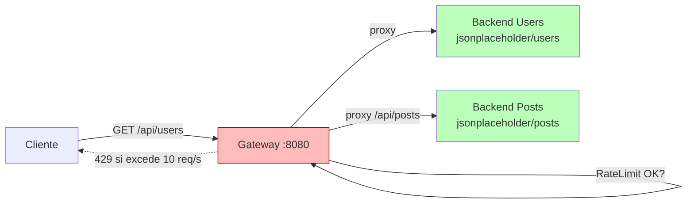

## 47 — Spring Cloud Gateway (simulado con Spring MVC)

### Propósito
Implementar el patrón **API Gateway** (punto único de entrada, routing, rate limit) usando Spring MVC puro, porque **Spring Cloud Gateway real todavía no es compatible con Spring Boot 4.1.0** (Spring Cloud sigue anclado a Boot 3.x — ver `MEMORY.md`, módulo 29).

### Problema que resuelve
Cuando tienes múltiples backends (users, posts, orders...), exponerlos directamente al cliente genera:
- **Acoplamiento de URLs**: si mueves un backend, todos los clientes rompen.
- **Sin control centralizado**: cada backend implementa su propio rate limit / auth / logging.
- **CORS y seguridad duplicados** en cada servicio.

### Cómo lo resuelve
Un **gateway** intercepta todas las requests, decide a qué backend enviarlas (routing por prefijo) y aplica cross-cutting concerns (rate limit, logging, auth) UNA sola vez.

En este módulo simulamos ese patrón con:
- `RouteConfig` (`@ConfigurationProperties`) que mapea `pathPrefix → targetUrl`.
- `GatewayFilter` (`OncePerRequestFilter`) que hace proxy con `RestClient`.
- `RateLimitFilter` (`OncePerRequestFilter`) con Token Bucket 10 req/s por IP.

### Por qué aprenderlo
Casi toda arquitectura de microservicios usa un gateway (Cloud Gateway, Kong, Nginx, AWS API Gateway). Entender el patrón te permite:
- Debuggear problemas de latencia/routing en producción.
- Implementar rate limit / autenticación en el borde.
- Migrar sin dolor cuando Cloud Gateway real esté disponible en Boot 4.x.



### Glosario Básico
| Término | Explicación |
|---|---|
| **API Gateway** | Servicio que recibe todas las requests y las enruta a backends internos. |
| **Reverse Proxy** | Servidor que hace requests HTTP en nombre del cliente al backend. |
| **Token Bucket** | Algoritmo de rate limit: cubo con N tokens que se recarga cada segundo. |
| **`@ConfigurationProperties`** | Anotación que mapea propiedades YAML a un objeto Java type-safe. |
| **`OncePerRequestFilter`** | Filtro base de Spring que se ejecuta 1 vez por request HTTP. |
| **`RestClient`** | Cliente HTTP moderno (Spring 6.1+), sucesor de `RestTemplate`. |
| **429 Too Many Requests** | Código HTTP estándar para "excediste el rate limit". |

### Conceptos

#### 1. Routing por prefijo (`RouteConfig`)
- **Qué es**: un `Map<String, String>` donde la clave es el path-prefix y el valor es la URL destino.
- **Por qué importa**: separas la política de routing del código. Cambias `application.yml` sin recompilar.
- **Analogía**: la libreta de direcciones de la recepción de un edificio.
- **Caso empresarial**: exponer `/api/*` a los clientes sin revelar los hosts internos de cada microservicio.

#### 2. Filtro de proxy (`GatewayFilter`)
- **Qué es**: un `OncePerRequestFilter` que hace `RestClient.get().uri(target).retrieve()`.
- **Por qué importa**: centraliza el forwarding. Un solo lugar para loguear, timeouts, retries.
- **Analogía**: la recepcionista que va al piso 5 en tu lugar.

#### 3. Rate limit por IP (`RateLimitFilter`)
- **Qué es**: Token Bucket con capacidad 10 y refill cada 1000 ms.
- **Por qué importa**: protege backends de sobrecarga y abusos.
- **Analogía**: parquímetro que acepta 10 monedas por segundo.

### Antes vs Ahora (backend expuesto vs API Gateway)
| Aspecto | ANTES (backends expuestos) | AHORA (API Gateway) |
|---|---|---|
| URL del cliente | `http://users-svc:8081/users`, `http://posts-svc:8082/posts` | `http://gateway/api/users`, `/api/posts` |
| Rate limit | Cada backend lo implementa (o no) | Centralizado en el gateway |
| Auth | Duplicado por servicio | En el borde, una sola vez |
| Cambio de host backend | Rompe todos los clientes | Cambio 1 línea en `application.yml` |
| CORS | Config por servicio | Config única |

### Antes vs Ahora (Java 8 → Java 21)
| Concepto | ANTES (Java 8) | AHORA (Java 21) |
|---|---|---|
| Mapa inmutable | `Collections.unmodifiableMap(new HashMap<>())` | `Map.of("status","UP")` |
| Cliente HTTP | `RestTemplate` (deprecado) | `RestClient.builder().build()` |
| Config | `@Value("${gateway.route.users}")` disperso | `@ConfigurationProperties(prefix="gateway")` type-safe |
| Concurrencia mapa | `synchronized(map){ map.put(...) }` | `ConcurrentHashMap.computeIfAbsent(...)` |
| DTO respuesta | POJO con getters/setters | `record HealthDto(String status)` |

### FAQ del Alumno
- **¿Por qué no usan Spring Cloud Gateway "real"?**
  Porque Spring Cloud aún está en Spring Boot 3.x (verificado 2026-07). No hay release de Cloud para Boot 4.1.0 al momento de escribir. Este módulo enseña el PATRÓN; cuando Cloud Gateway 5.x salga, la migración será cambiar dependencias.
- **¿Un gateway es un load balancer?**
  Parcialmente. Un load balancer solo distribuye tráfico entre réplicas. Un gateway hace eso + routing por path + auth + rate limit + logging.
- **¿Puedo poner el rate limit en el backend?**
  Sí, pero cada backend duplicaría la lógica. En el gateway lo haces UNA vez.
- **¿429 vs 503?** 429 = "excediste tu cuota" (culpa del cliente). 503 = "estoy sobrecargado" (culpa del servidor).
- **¿Qué pasa si el backend está caído?**
  El `RestClient` lanza `RestClientException`; nuestro filtro responde 502 Bad Gateway. Un gateway real haría circuit breaker (módulo 30).
- **¿Por qué `OncePerRequestFilter` y no `Filter`?**
  Garantiza ejecución única por request. Sin él, un forward interno (`RequestDispatcher`) podría dispararlo dos veces.

### Ejercicios
1. Agregar soporte para reenviar el método HTTP original (POST/PUT/DELETE, no solo GET).
2. Reenviar las cabeceras `Authorization` del cliente al backend.
3. Agregar un contador Prometheus (módulo 35) con `gateway.requests.total{route="/api/users"}`.
4. Reemplazar el Token Bucket casero por **Bucket4j** o **Resilience4j RateLimiter** (módulo 30).
5. Configurar rutas por path Y por header (`X-Api-Version: v2`).

### Cómo ejecutar
```bash
# Compilar y empaquetar
./build.sh          # Git Bash
./build.ps1         # PowerShell

# Ejecutar el JAR
java -jar target/spring-cloud-gateway-1.0.0.jar

# Probar
curl http://localhost:8080/gateway/health
curl http://localhost:8080/api/users
curl http://localhost:8080/api/posts
```

### Archivos del Proyecto
| Archivo | Propósito |
|---|---|
| `pom.xml` | Dependencias (web + test). Boot 4.1.0. |
| `build.sh` / `build.ps1` | Scripts portables usando JDK + Maven de la raíz. |
| `application.yml` | Rutas del gateway + config de rate limit. |
| `GatewayApplication.java` | Main de Spring Boot. |
| `config/RouteConfig.java` | `@ConfigurationProperties` con las rutas. |
| `config/WebConfig.java` | Registra `RestClient` y los filtros con orden. |
| `filter/GatewayFilter.java` | Hace proxy con `RestClient`. |
| `filter/RateLimitFilter.java` | Token Bucket por IP (10 req/s). |
| `controller/HealthController.java` | `/gateway/health` (no se proxea). |
| `GatewayApplicationTests.java` | `contextLoads` + test de `/gateway/health`. |
| `RateLimitFilterTest.java` | Unit test: 10 pasan, la 11 → 429. |

### Nota importante — Spring Cloud Gateway real
Cuando **Spring Cloud Gateway 5.x** salga compatible con Boot 4.x, este módulo se refactorizará a la API oficial:
```java
@Bean
public RouteLocator routes(RouteLocatorBuilder b) {
    return b.routes()
        .route("users", r -> r.path("/api/users/**")
            .uri("https://jsonplaceholder.typicode.com"))
        .build();
}
```
Mientras tanto, el patrón que aprendes aquí es el MISMO que usan todos los gateways del mercado.
